Αρχή Αποχαρακτηρισμού RF 74365


\rightline{\small 1}



# Η ΙΣΤΟΡΙΑ ΤΟΥ NLP

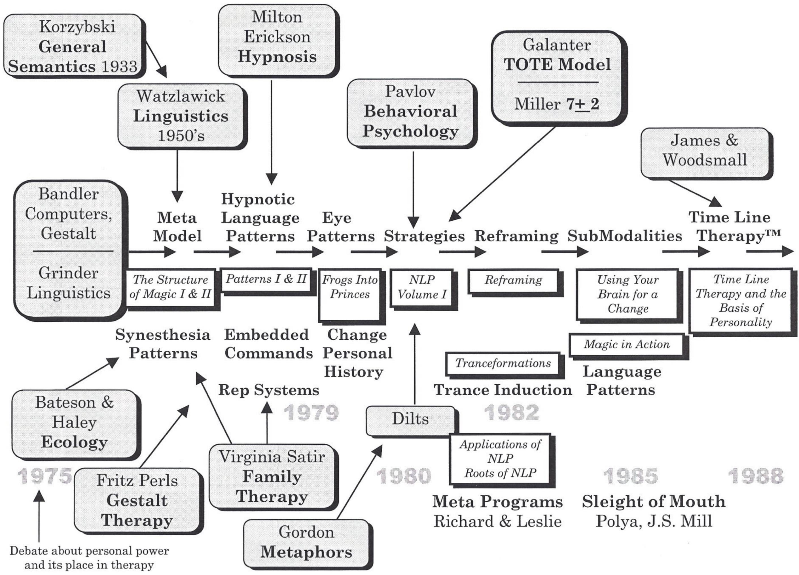


\rightline{\small 2}

# ΠΕΡΙΕΧΟΜΕΝΑ

Καλωσόρισμα... 1
Περιεχόμενα... 2
Εκπαιδεύσεις... 5
Ορισμός του NLP... 6
Μοντέλο Επικοινωνίας NLP... 7
Πέντε Αρχές για την Επιτυχία... 8
Κατάσταση -Έναντι- Στόχου... 9
Κλειδιά για ένα Επιτεύξιμο Επιθυμητό Αποτέλεσμα... 10
Συνθήκες Καλής Διατύπωσης... 11
Οι Προϋποθέσεις του NLP... 12
Πρωταρχικές Εντολές του Υποσυνείδητου Νου... 13
Παρατηρώντας τους Άλλους Ανθρώπους... 15
Rapport... 16
Τεστ Προτίμησης Αναπαραστατικών Συστημάτων... 17
Κατηγορήματα (Predicates)... 19
Λίστα Φράσεων Κατηγορημάτων... 20
Προτιμώμενα Αναπαραστατικά Συστήματα... 20
Μοτίβα Επιτονισμού... 22
Πίνακας Μοτίβων Ματιών... 23
Ερωτήσεις Μοτίβων Ματιών... 24
Σημεία Υπομορφοτροπιών... 25
Παραδείγματα Εναυσμάτων σε Πλαίσια NLP... 26
Σενάριο Υπομορφοτροπιών από «Μου Αρέσει» σε «Δεν Μου Αρέσει»... 27
Σενάριο Αλλαγής Πεποιθήσεων με Υπομορφοτροπίες... 28
Μοτίβα Swish... 32
Σενάριο Μοτίβου Swish Υπομορφοτροπιών... 33
Η Συνειδητή Χρήση της Γλώσσας... 34


THE FASTRAK NLP PRACTITIONER CERTIFICATION TRAINING

# ΠΕΡΙΕΧΟΜΕΝΑ

Προϋποθέσεις ... 35
"Thimk" ... 38
Ιεραρχία των Ιδεών ... 39
Μοντέλο Milton ... 39
Περίγραμμα Μεταφοράς ... 43
Το Μετα-Μοντέλο (Meta Model) ... 45
Αγκύρωση (Anchoring) ... 46
Σενάριο Πρόκλησης Καταστάσεων ... 47
Καταστάσεις για Συσσώρευση Αγκυρών ... 47
Σύμπτυξη Αγκυρών ... 48
Αλυσίδωση Αγκυρών ... 49
Άσκηση Ευελιξίας Νέας Ορλεάνης ... 50
Αλλαγή Προσωπικής Ιστορίας NLP ... 51
Φυσιολογία της Αριστείας ... 52
Στρατηγικές ... 53
Στρατηγικές ... 54
Μοντέλο T.O.T.E. των Στρατηγικών ... 55
Στρατηγικές ... 56
Στρατηγικές ... 57
Αναπαραστατικά Συστήματα ... 58
Στρατηγικές Παρακίνησης ... 59
Στρατηγικές ... 60
Στρατηγικές Μάθησης ... 61
Στρατηγικές Ορθογραφίας ... 62
Στρατηγικές Ορθογραφίας ... 63
Σημειογραφία NLP ... 64
Πρόκληση Στρατηγικών ... 65
Πρόκληση Στρατηγικών ... 66
Επαναπλαισίωση (Reframing) ... 67
Επαναπλαισίωση Έξι Βημάτων ... 68
Μετα-Μοντέλο III ... 71


\rightline{\small 4}

# ΠΕΡΙΕΧΟΜΕΝΑ

Μοντέλο Θεραπείας NLP ... 72
Ενοποίηση Μερών (Parts Integration) ... 73
Τεχνική Αποσύνδεσης (Dissociative Technique) ... 74
Πρόκληση της Γραμμής Χρόνου #1 ... 74
Πρώτη Δοκιμή Πρόκλησης ... 75
Ανακάλυψη της Ρίζας του Προβλήματος ... 77
Αρνητικά Συναισθήματα #1 ... 78
Τα 3 Πράγματα που Πρέπει να Ελέγξετε στη Θέση #3 ... 79
Γενικές Επαναπλαισιώσεις ... 80
Βήματα για την Τοποθέτηση Ενός Μοναδικού Στόχου στο Μέλλον σας ... 81
Μοντέλο Γρήγορης Φοβίας (Fast Phobia Model) ... 82
Προτεινόμενο Μοντέλο Οικογενειακής Θεραπείας ... 83
Η Διαδικασία Πωλήσεων 5 Βημάτων ... 85
Διαπραγμάτευση—Άσκηση Επιρροής ... 88
Η Μορφή Συναντήσεων ... 92
Πρότυπα Πιστοποίησης ... 95
Τι είναι το NLP ... 99
Μία Εισαγωγή στο NLP ... 102
Λίστα Κατηγορημάτων (Predicates) ... 106
Λίστα Φράσεων Κατηγορημάτων ... 107
Στρατηγικές ... 114


\rightline{\small 5}

# ΕΠΙΠΕΔΑ ΠΡΟΣΩΠΙΚΗΣ ΑΝΑΠΤΥΞΗΣ


\rightline{\small 6}

# ΟΡΙΣΜΟΣ ΤΟΥ NLP

## Neuro (Νευρο):
Το νευρικό σύστημα (ο νους), μέσω του οποίου η εμπειρία μας επεξεργάζεται μέσω των πέντε αισθήσεων:

- Οπτική
- Ακουστική
- Κιναισθητική
- Οσφρητική
- Γευστική

## Linguistic (Γλωσσικό):
Η γλώσσα και άλλα μη λεκτικά συστήματα επικοινωνίας μέσω των οποίων οι νευρωνικές μας αναπαραστάσεις κωδικοποιούνται, οργανώνονται και αποκτούν νόημα. Περιλαμβάνει:

- Εικόνες
- Ήχους
- Συναισθήματα
- Γεύσεις
- Οσμές
- Λέξεις (Εσωτερικός Διάλογος)

## Programming (Προγραμματισμός):
Η ικανότητα να ανακαλύπτουμε και να αξιοποιούμε τα προγράμματα που εκτελούμε (η επικοινωνία μας με τον εαυτό μας και με τους άλλους) στα νευρολογικά μας συστήματα προκειμένου να επιτύχουμε τα συγκεκριμένα και επιθυμητά αποτελέσματά μας.

Με άλλα λόγια, το NLP είναι ο τρόπος να χρησιμοποιήσουμε τη γλώσσα του νου για να επιτυγχάνουμε σταθερά τα συγκεκριμένα και επιθυμητά αποτελέσματά μας.


\rightline{\small 7}

# ΜΟΝΤΕΛΟ ΕΠΙΚΟΙΝΩΝΙΑΣ NLP

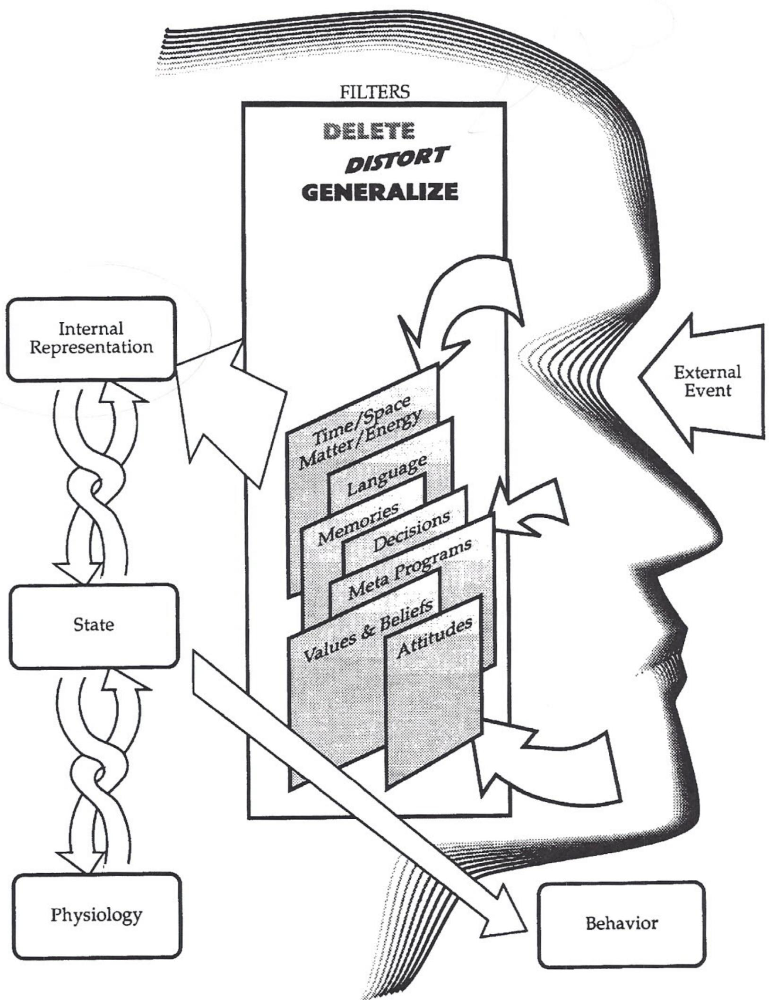


\rightline{\small 8}

# ΠΕΝΤΕ ΑΡΧΕΣ ΓΙΑ ΤΗΝ ΕΠΙΤΥΧΙΑ

1. Γνώριζε το επιθυμητό σου αποτέλεσμα.
2. Ανάλαβε δράση*.
3. Έχε αισθητηριακή οξύτητα (sensory acuity).
4. Έχε συμπεριφορική ευελιξία (behavioral flexibility).
5. Λειτούργησε από μια φυσιολογία και ψυχολογία αριστείας*.

* ΣΗΜΕΙΩΣΗ: Οι αρχές που συνοδεύονται από αστερίσκο δεν αποτελούν "παραδοσιακό" NLP.


\rightline{\small 9}

# ΚΑΤΑΣΤΑΣΗ-ΕΝΑΝΤΙ-ΣΤΟΧΟΥ

<table><tr><th>ΑΞΙΑ Ή ΚΑΤΑΣΤΑΣΗ</th><th>ΣΤΟΧΟΣ Ή ΕΠΙΘΥΜΗΤΟ ΑΠΟΤΕΛΕΣΜΑ</th></tr><tr><td>Διατυπώνεται αμφίσημα</td><td>Διατυπώνεται συγκεκριμένα</td></tr><tr><td>Γράφεις θετικές δηλώσεις (affirmations)</td><td>Γράφεις στόχους/επιθυμητά αποτελέσματα</td></tr><tr><td>Μπορείς να το έχεις τώρα</td><td>Εμπλέκεται ο χρόνος</td></tr><tr><td>Δεν υπάρχουν βήματα</td><td>Απαιτούνται βήματα για να φτάσεις εκεί<br/>(Βρες το τελικό βήμα και δούλεψε αντίστροφα)</td></tr><tr><td>Άπειρη</td><td>Μετρήσιμος</td></tr><tr><td>Διατυπώνεται για τον εαυτό σου ή/και για άλλους</td><td>Διατυπώνεται μόνο για τον εαυτό σου</td></tr></table>


\rightline{\small 10}

# ΚΛΕΙΔΙΑ ΓΙΑ ΕΝΑ ΕΠΙΤΕΥΞΙΜΟ ΕΠΙΘΥΜΗΤΟ ΑΠΟΤΕΛΕΣΜΑ

Ξεκίνα ρωτώντας τον εαυτό σου: «Πώς γίνεται να μην το έχουν ήδη;»

1. Διατυπωμένο θετικά.
«Τι ακριβώς θέλεις;»

2. Προσδιόρισε την παρούσα κατάσταση.
«Πού βρίσκεσαι τώρα;» (Συνδεδεμένος)

3. Προσδιόρισε το επιθυμητό αποτέλεσμα.
«Τι θα δεις, θα ακούσεις, θα νιώσεις κ.λπ. όταν το έχεις;»
- Σαν να συμβαίνει τώρα.
- Κάνε το ελκυστικό
- Τοποθέτησέ το στο μέλλον. Φρόντισε η μελλοντική εικόνα να είναι αποσυνδεδεμένη.»

4. Προσδιόρισε τη διαδικασία απόδειξης.
«Πώς θα ξέρεις ότι το έχεις;»

5. Είναι σύμμορφα επιθυμητό;
«Τι θα σου προσφέρει αυτό το αποτέλεσμα ή τι θα σου επιτρέψει να κάνεις;»

6. Είναι αυτοεκκινούμενο και αυτοσυντηρούμενο;
«Είναι μόνο για σένα;»

7. Είναι κατάλληλα τοποθετημένο στο πλαίσιό του;
«Πού, πότε, πώς και με ποιον το θέλεις;»

8. Ποιοι πόροι χρειάζονται;
«Τι έχεις τώρα και τι χρειάζεσαι για να φτάσεις στο επιθυμητό αποτέλεσμα;»
- «Το έχεις βιώσει ή κάνει ξανά στο παρελθόν;»
- «Γνωρίζεις κάποιον που το έχει κάνει;»
- «Μπορείς να ενεργήσεις σαν να το έχεις ήδη;»

9. Είναι οικολογικό;
- «Για ποιον σκοπό το θέλεις αυτό;»
- «Τι θα κερδίσεις ή τι θα χάσεις αν το αποκτήσεις;»
- Τι θα συμβεί αν το αποκτήσεις;
- Τι δεν θα συμβεί αν το αποκτήσεις;
- Τι θα συμβεί αν δεν το αποκτήσεις;
- Τι δεν θα συμβεί αν δεν το αποκτήσεις;


\rightline{\small 11}

# ΣΥΝΘΗΚΕΣ ΚΑΛΗΣ ΔΙΑΤΥΠΩΣΗΣ

για Επιθυμητά Αποτελέσματα/Στόχους

1. Διατυπωμένα με θετικούς όρους.

2. Εκκινούμενα και διατηρούμενα από τον πελάτη.

3. Συγκεκριμένη αισθητηριακή περιγραφή του επιθυμητού αποτελέσματος και των βημάτων που απαιτούνται για να φτάσεις εκεί.

4. Οικολογικά.

5. Παραπάνω από έναν τρόπο για να επιτευχθεί το επιθυμητό αποτέλεσμα.

6. Το πρώτο βήμα είναι συγκεκριμένο και επιτεύξιμο.

7. Αυξάνει τις επιλογές;


\rightline{\small 12}

# ΟΙ ΠΡΟΫΠΟΘΕΣΕΙΣ ΤΟΥ NLP

ΒΟΛΙΚΕΣ ΠΑΡΑΔΟΧΕΣ

1. Σεβασμός για το μοντέλο του κόσμου του άλλου ανθρώπου.
2. Η συμπεριφορά και η αλλαγή αξιολογούνται με βάση το πλαίσιο και την Οικολογία
3. Η αντίσταση από έναν πελάτη είναι ένδειξη έλλειψης rapport. (Δεν υπάρχουν πελάτες που αντιστέκονται, μόνο άκαμπτοι επικοινωνιακοί. Οι αποτελεσματικοί επικοινωνιακοί αποδέχονται και αξιοποιούν όλη την επικοινωνία που τους παρουσιάζεται.)
4. Οι άνθρωποι δεν ταυτίζονται με τις συμπεριφορές τους. (Δέξου το άτομο· άλλαξε τη συμπεριφορά.)
5. Όλοι κάνουν ό,τι καλύτερο μπορούν με τους πόρους που έχουν στη διάθεσή τους. (Η συμπεριφορά είναι προσαρμοστική και η παρούσα συμπεριφορά είναι η καλύτερη διαθέσιμη επιλογή. Κάθε συμπεριφορά υποκινείται από μια θετική πρόθεση.)
6. Βαθμονόμηση στη Συμπεριφορά: Η πιο σημαντική πληροφορία για ένα άτομο είναι η συμπεριφορά αυτού του ατόμου.
7. Ο χάρτης δεν είναι η Επικράτεια. (Οι λέξεις που χρησιμοποιούμε ΔΕΝ είναι το γεγονός ή το αντικείμενο που αναπαριστούν.)
8. (U) Εσύ είσαι υπεύθυνος για τον νου σου και επομένως για τα αποτελέσματά σου (κι εγώ είμαι επίσης υπεύθυνος για τον νου μου και επομένως για τα αποτελέσματά μου).
9. Οι άνθρωποι διαθέτουν όλους τους Πόρους που χρειάζονται για να πετύχουν και να επιτύχουν τα επιθυμητά αποτελέσματά τους. (Δεν υπάρχουν άνθρωποι χωρίς πόρους, μόνο καταστάσεις χωρίς πόρους.)
10. Όλες οι διαδικασίες θα πρέπει να αυξάνουν την Ολότητα
11. Υπάρχει ΜΟΝΟ ανατροφοδότηση! (Δεν υπάρχει αποτυχία, μόνο ανατροφοδότηση.)
12. Η σημασία της επικοινωνίας είναι η Αντίδραση που λαμβάνεις.
13. Ο Νόμος της Απαιτούμενης Ποικιλίας: (Το σύστημα/άτομο με τη μεγαλύτερη ευελιξία συμπεριφοράς θα ελέγξει το σύστημα.)
14. Όλες οι διαδικασίες θα πρέπει να Σχεδιάζονται ώστε να αυξάνουν τις επιλογές.

Μνημονικός Κανόνας
RESPECT
UR-WORLD


\rightline{\small 13}

# ΠΡΩΤΑΡΧΙΚΕΣ ΕΝΤΟΛΕΣ ΤΟΥ ΥΠΟΣΥΝΕΙΔΗΤΟΥ ΝΟΥ

1. Αποθηκεύει αναμνήσεις
- Χρονικές (σε σχέση με τον χρόνο)
- Άχρονες (χωρίς σχέση με τον χρόνο)

2. Είναι η περιοχή των συναισθημάτων

3. Οργανώνει όλες τις αναμνήσεις σου
- (Χρησιμοποιεί τη Γραμμή Χρόνου. Ο μηχανισμός είναι το Gestalt)

4. Απωθεί αναμνήσεις με **ανεπίλυτο** αρνητικό συναίσθημα

5. Παρουσιάζει απωθημένες αναμνήσεις προς επίλυση.
- (για να γίνουν λογικές και για να απελευθερωθούν τα συναισθήματα)

6. Μπορεί να διατηρεί τα απωθημένα συναισθήματα απωθημένα ως μέσο προστασίας

7. Διοικεί το σώμα
- Διαθέτει σχέδιο:
- του σώματος όπως είναι τώρα
- της τέλειας υγείας (στον Ανώτερο Εαυτό)

8. Διαφυλάσσει το σώμα
- Διατηρεί την ακεραιότητα του σώματος

9. Είναι ένα έντονα ηθικό ον (η ηθική που σου διδάχθηκε και αποδέχτηκες)

10. Απολαμβάνει την υπηρεσία, χρειάζεται σαφείς εντολές για να ακολουθήσει


\rightline{\small 14}

# ΠΡΩΤΑΡΧΙΚΕΣ ΕΝΤΟΛΕΣ ΤΟΥ ΥΠΟΣΥΝΕΙΔΗΤΟΥ ΝΟΥ

11. Ελέγχει και διατηρεί όλες τις αντιλήψεις
- Συνηθισμένες
- Τηλεπαθητικές
- Λαμβάνει και μεταδίδει αντιλήψεις στον συνειδητό νου

12. Δημιουργεί, αποθηκεύει, διανέμει και μεταδίδει «ενέργεια»

13. Διατηρεί τα ένστικτα και δημιουργεί συνήθειες

14. Χρειάζεται επανάληψη μέχρι να εγκατασταθεί μια συνήθεια

15. Είναι προγραμματισμένος να αναζητά συνεχώς περισσότερα και περισσότερα
- Υπάρχει πάντα κάτι περισσότερο να ανακαλύψεις

16. Λειτουργεί καλύτερα ως μια ολοκληρωμένη, ενιαία μονάδα
- Δεν χρειάζεται μέρη για να λειτουργήσει

17. Είναι συμβολικός
- Χρησιμοποιεί σύμβολα και ανταποκρίνεται σε αυτά

18. Παίρνει τα πάντα προσωπικά. (Η βάση της Αντίληψης είναι η Προβολή)

19. Λειτουργεί με βάση την αρχή της ελάχιστης προσπάθειας
- Μονοπάτι της μικρότερης αντίστασης

20. Δεν επεξεργάζεται αρνήσεις


\rightline{\small 15}

# ΠΑΡΑΤΗΡΩΝΤΑΣ ΤΟΥΣ ΑΛΛΟΥΣ ΑΝΘΡΩΠΟΥΣ

## ΑΙΣΘΗΤΗΡΙΑΚΗ ΟΞΥΤΗΤΑ

Βάση: Μοντελοποιώντας τον Milton Erickson, οι δημιουργοί του NLP παρατήρησαν ότι οι άνθρωποι κάνουν λεπτότατες αλλαγές από στιγμή σε στιγμή και ότι αυτές οι αλλαγές έχουν νόημα αν διαθέτεις επαρκή Αισθητηριακή Οξύτητα.

1.  Χρώμα Δέρματος
Ανοιχτό --- Σκούρο

2.  Τόνος Δέρματος (Ο Τόνος των Μυών – Παρατήρησε τη Λάμψη)
Συμμετρικός --- Μη Συμμετρικός

3.  Αναπνοή
Ρυθμός
Γρήγορος --- Αργός
Θέση
Ψηλά --- Χαμηλά

4.  Μέγεθος Κάτω Χείλους
Γραμμές --- Χωρίς Γραμμές

5.  Μάτια
Εστίαση
Εστιασμένα --- Αφεστιασμένα
Διεσταλμένα --- Διαστολή Κόρης --- Μη Διεσταλμένα


\rightline{\small 16}

# RAPPORT

## Επιθυμητό αποτέλεσμα:
Να μπορείς να εδραιώνεις rapport με οποιοδήποτε άτομο, οποιαδήποτε στιγμή.

## Θεωρία:
A. Η επικοινωνία είναι:
7% ΛΕΞΕΙΣ
38% ΕΠΙΤΟΝΙΣΜΟΣ
55% ΦΥΣΙΟΛΟΓΙΑ

B. Όταν οι άνθρωποι μοιάζουν μεταξύ τους, συμπαθούν ο ένας τον άλλον. Το rapport είναι μια διαδικασία ανταπόκρισης, όχι κατ' ανάγκη "συμπάθειας".

## Διαδικασία:
A. Το rapport εδραιώνεται με ταίριασμα (matching) &amp; αντικατοπτρισμό (mirroring)

B. Τα κύρια στοιχεία του rapport: (Τα βασικά στοιχεία σημειώνονται με "●")
- Αντικατοπτρισμός (Mirroring)
- Ταίριασμα (Matching)

### ΦΥΣΙΟΛΟΓΙΑ (55%)
- Στάση σώματος
- Χειρονομία
- Έκφραση προσώπου &amp; ανοιγοκλείσιμο ματιών
- Αναπνοή

### ΕΠΙΤΟΝΙΣΜΟΣ (38%)
- Φωνή
- Τόνος (πιτς)
- Ρυθμός (ταχύτητα)
- Χροιά (ποιότητα)
- Ένταση (φωνητικό ύψος)

### ΛΕΞΕΙΣ (7%)
- Κατηγορήματα (Predicates)
- Λέξεις-κλειδιά
- Κοινές εμπειρίες &amp; συσχετίσεις
- Τμήματα περιεχομένου (content chunks)


\rightline{\small 17}

# ΤΕΣΤ ΠΡΟΤΙΜΗΣΗΣ ΑΝΑΠΑΡΑΣΤΑΤΙΚΟΥ ΣΥΣΤΗΜΑΤΟΣ

Για κάθε μία από τις παρακάτω δηλώσεις, παρακαλώ τοποθέτησε έναν αριθμό δίπλα σε κάθε φράση. Χρησιμοποίησε το ακόλουθο σύστημα για να δηλώσεις τις προτιμήσεις σου:

4 = Πιο κοντά στο να σε περιγράφει
3 = Επόμενη καλύτερη περιγραφή
2 = Επόμενη καλύτερη
1 = Λιγότερο περιγραφική για σένα

1. Παίρνω σημαντικές αποφάσεις με βάση:
☐ διαισθητικά συναισθήματα
☐ ποια εκδοχή ακούγεται καλύτερη
☐ τι μου φαίνεται καλύτερο
☐ ακριβή εξέταση και μελέτη των ζητημάτων

2. Σε έναν καβγά, είναι πιο πιθανό να επηρεαστώ από:
☐ τον τόνο της φωνής του άλλου ατόμου
☐ αν μπορώ ή όχι να δω την οπτική γωνία του άλλου ατόμου
☐ τη λογική του επιχειρήματος του άλλου ατόμου
☐ αν είμαι ή όχι σε επαφή με τα αληθινά συναισθήματα του άλλου ατόμου

3. Επικοινωνώ ευκολότερα αυτό που μου συμβαίνει μέσω:
☐ του τρόπου που ντύνομαι και της εμφάνισής μου
☐ των συναισθημάτων που μοιράζομαι
☐ των λέξεων που επιλέγω
☐ του τόνου της φωνής μου

4. Είναι πιο εύκολο για μένα να:
☐ βρίσκω την ιδανική ένταση και ρύθμιση σε ένα στερεοφωνικό σύστημα
☐ επιλέγω το πιο διανοητικά σχετικό σημείο σε ένα ενδιαφέρον θέμα
☐ επιλέγω τα πιο άνετα έπιπλα
☐ επιλέγω πλούσιους, ελκυστικούς συνδυασμούς χρωμάτων

5.
☐ Είμαι πολύ συντονισμένος με τους ήχους του περιβάλλοντός μου
☐ Είμαι πολύ ικανός στο να βγάζω νόημα από νέα δεδομένα και πληροφορίες
☐ Είμαι πολύ ευαίσθητος στον τρόπο που νιώθουν τα ρούχα πάνω στο σώμα μου
☐ Έχω έντονη αντίδραση στα χρώματα και στον τρόπο που φαίνεται ένα δωμάτιο


\rightline{\small 18}

# ΤΕΣΤ ΑΝΑΠΑΡΑΣΤΑΤΙΚΟΥ ΣΥΣΤΗΜΑΤΟΣ ΣΕΛΙΔΑ 2

Βήμα Πρώτο: Αντέγραψε τις απαντήσεις σου από την προηγούμενη σελίδα εδώ:

1.  K
A
V
Ad

2.  A
V
Ad
K

3.  V
K
Ad
A

4.  A
Ad
K
V

5.  A
Ad
K
V

Βήμα Δεύτερο: Πρόσθεσε τους αριθμούς που αντιστοιχούν σε κάθε γράμμα. Υπάρχουν 5 καταχωρήσεις για κάθε γράμμα.

<table><tr><th></th><th>V</th><th>A</th><th>K</th><th>Ad</th></tr><tr><td>1</td><td></td><td></td><td></td><td></td></tr><tr><td>2</td><td></td><td></td><td></td><td></td></tr><tr><td>3</td><td></td><td></td><td></td><td></td></tr><tr><td>4</td><td></td><td></td><td></td><td></td></tr><tr><td>5</td><td></td><td></td><td></td><td></td></tr><tr><td>Σύνολα:</td><td></td><td></td><td></td><td></td></tr></table>

Βήμα Τρίτο: Η σύγκριση των συνολικών βαθμολογιών σε κάθε στήλη θα δώσει τη σχετική προτίμηση για καθένα από τα 4 βασικά Αναπαραστατικά Συστήματα (Representational Systems).


\rightline{\small 19}

# ΚΑΤΗΓΟΡΗΜΑΤΑ (PREDICATES)

<table><tr><th>ΟΠΤΙΚΟ</th><th>ΑΚΟΥΣΤΙΚΟ</th><th>ΚΙΝΑΙΣΘΗΤΙΚΟ</th><th>ΜΗ ΠΡΟΣΔΙΟΡΙΣΜΕΝΟ</th></tr><tr><td>Απομνημονεύουν βλέποντας εικόνες και αποσπώνται λιγότερο από τον θόρυβο. Συχνά δυσκολεύονται να θυμηθούν και βαριούνται με μεγάλες προφορικές οδηγίες γιατί ο νους τους μπορεί να περιπλανηθεί. Τους ενδιαφέρει το πώς φαίνεται το πρόγραμμα.</td><td>Συνήθως αποσπώνται εύκολα από τον θόρυβο. Μπορούν να σου επαναλάβουν πράγματα εύκολα &amp; μαθαίνουν ακούγοντας. Τους αρέσει η μουσική και τους αρέσει να μιλούν στο τηλέφωνο. Ο τόνος της φωνής και οι λέξεις που χρησιμοποιούνται μπορεί να είναι σημαντικά.</td><td>Συχνά μιλούν αργά και με αναπνοή. Ανταποκρίνονται σε φυσικές ανταμοιβές &amp; στην αφή. Απομνημονεύουν κάνοντας ή βιώνοντας κάτι βήμα-βήμα. Θα τους ενδιαφέρει ένα πρόγραμμα που τους νιώθει σωστό ή τους δίνει μια διαισθητική αίσθηση.</td><td>Περνούν αρκετό χρόνο μιλώντας στον εαυτό τους. Απομνημονεύουν με βήματα, διαδικασίες, ακολουθίες. Θα θέλουν να μάθουν ότι το πρόγραμμα βγάζει νόημα. Μπορούν επίσης μερικές φορές να εμφανίζουν χαρακτηριστικά άλλων αναπαραστατικών συστημάτων.</td></tr><tr><td>βλέπω</td><td>ακούω</td><td>νιώθω</td><td>αισθάνομαι</td></tr><tr><td>κοιτάζω</td><td>ακούω</td><td>αγγίζω</td><td>βιώνω</td></tr><tr><td>θεωρώ</td><td>ήχος/ήχοι</td><td>συλλαμβάνω</td><td>καταλαβαίνω</td></tr><tr><td>φαίνομαι</td><td>κάνω μουσική</td><td>πιάνω</td><td>σκέφτομαι</td></tr><tr><td>δείχνω</td><td>εναρμονίζω</td><td>γλιστράω</td><td>μαθαίνω</td></tr><tr><td>χαράζω</td><td>συντονίζω/αποσυντονίζω</td><td>πιάνω το νόημα</td><td>επεξεργάζομαι</td></tr><tr><td>αποκαλύπτω</td><td>έρχομαι σε επαφή</td><td>συνδέομαι</td><td>αποφασίζω</td></tr><tr><td>οραματίζομαι</td><td>χτυπάει καμπανάκι</td><td>έρχομαι σε επαφή</td><td>παρακινώ</td></tr><tr><td>φωτίζω</td><td>σιωπή</td><td>απορρίπτω</td><td>εξετάζω</td></tr><tr><td>φαντάζομαι</td><td>ακούγομαι</td><td>στρίβω</td><td>αλλάζω</td></tr><tr><td>καθαρός</td><td>αντηχώ</td><td>σκληρός</td><td>αντιλαμβάνομαι</td></tr><tr><td>θολός</td><td>κουφός</td><td>αναίσθητος</td><td>αδιάφορος</td></tr><tr><td>εστιασμένος</td><td>μελωδικός</td><td>συγκεκριμένος</td><td>ευδιάκριτος</td></tr><tr><td>θολός</td><td>παραφωνία</td><td>ξύνω</td><td>συλλαμβάνω</td></tr><tr><td>κρυστάλλινος</td><td>ερώτηση</td><td>πιάνω λαβή</td><td>γνωρίζω</td></tr><tr><td>εικόνα</td><td>χωρίς ν' ακούω</td><td>στέρεος</td><td></td></tr></table>

<table><tr><th colspan="2">Μοτίβα Ομιλίας</th></tr><tr><td>1) Λέξεις σε γρήγορες ομάδες</td><td>1) Προσεκτική διατύπωση</td></tr><tr><td>2) Πολλές διακοπές με "εμ" ή "ααα"</td><td>2) Μακριές πολύπλοκες προτάσεις</td></tr></table>

<table><tr><th colspan="2">Μοτίβα Επεξεργασίας</th></tr><tr><td>1) Γρήγορα με ελάχιστες λεπτομέρειες</td><td>1) Εκτενείς λεπτομέρειες</td></tr><tr><td>2) Θα σε ενημερώσουν υποσυνείδητα όταν καταλάβουν αλλάζοντας θέμα</td><td>2) Δεν θα δώσουν ένδειξη κατανόησης εκτός αν ρωτήσεις</td></tr></table>

<table><tr><th colspan="2">Ώθηση Λήψης Αποφάσεων</th></tr><tr><td>1) Από το αφηρημένο στο σφαιρικό</td><td>1) Από τα θεμελιώδη στα συγκεκριμένα</td></tr><tr><td>2) Κερδοσκόπος, παίκτης</td><td>2) Επενδυτής, κερδοσκόπος</td></tr></table>

<table><tr><th colspan="2">Κλείσιμο Με</th></tr><tr><td colspan="2">"Να είσαι έτοιμος να εκμεταλλευτείς μια ευκαιρία..." "Ας μελετήσουμε τις αγορές &amp; ας σχεδιάσουμε κάποιες στρατηγικές"</td></tr></table>

<table><tr><th colspan="2">Τόνος Φωνής για το Κλείσιμο</th></tr><tr><td>Ελαφρώς γρήγορος και ενθουσιώδης</td><td>Στοχαστικός, προσεκτικός &amp; μόλις πάνω από μονότονο</td></tr></table>


\rightline{\small 20}

# ΛΙΣΤΑ ΦΡΑΣΕΩΝ ΚΑΤΗΓΟΡΗΜΑΤΩΝ

<table><tr><th>ΟΠΤΙΚΟ</th><th>ΑΚΟΥΣΤΙΚΟ</th><th>ΚΙΝΑΙΣΘΗΤΙΚΟ</th></tr><tr><td>Γέμισμα ματιού</td><td>Δεύτερη σκέψη</td><td>Όλα ξεπλυμένα</td></tr><tr><td>Μου φαίνεται</td><td>Φλύαρος</td><td>Καταλήγει σε</td></tr><tr><td>Πέρα από κάθε σκιά αμφιβολίας</td><td>Καθαρό σαν καμπάνα</td><td>Σχιστούλι από το παλιό κούτσουρο</td></tr><tr><td>Πανοραμική θέα</td><td>Καθαρά εκφρασμένο</td><td>Έρχομαι αντιμέτωπος</td></tr><tr><td>Παίρνω μια ματιά</td><td>Καλώ</td><td>Έλεγξε τον εαυτό σου</td></tr><tr><td>Σαφές</td><td>Περιγράφω λεπτομερώς</td><td>Ψύχραιμος/ήρεμος/συγκεντρωμένος</td></tr><tr><td>Αμυδρή άποψη</td><td>Γέμισμα αυτιού</td><td>Στέρεα θεμέλια</td></tr><tr><td>Άστραψε</td><td>Δίνω αναφορά</td><td>Πιάνω λαβή</td></tr><tr><td>Αποκτώ μια οπτική</td><td>Δώσε μου το αυτί σου</td><td>Δες αυτό</td></tr><tr><td>Έχω εποπτεία</td><td>Δίνω ακρόαση</td><td>Έρχομαι σε επαφή</td></tr><tr><td>Θολή ιδέα</td><td>Άκουσα φωνές</td><td>Πιάνω το νόημα</td></tr><tr><td>Άλογο διαφορετικού χρώματος</td><td>Κρυφό μήνυμα</td><td>Με εκνευρίζει</td></tr><tr><td>Υπό το φως του</td><td>Κράτα τη γλώσσα σου</td><td>Χέρι-χέρι</td></tr><tr><td>Αυτοπροσώπως</td><td>Άσκοπη κουβέντα</td><td>Κρατήσου</td></tr><tr><td>Έχοντας υπόψη</td><td>Ζητώ πληροφορίες</td><td>Έντονη διαμάχη</td></tr><tr><td>Φαίνεται σαν</td><td>Κύριος ομιλητής</td><td>Σταμάτα!</td></tr><tr><td>Κάνω σκηνή</td><td>Δυνατά και καθαρά</td><td>Κρατήσου!</td></tr><tr><td>Νοητική εικόνα</td><td>Τρόπος του λέγειν</td><td>Παρορμητικός</td></tr><tr><td>Νοητικό στιγμιότυπο</td><td>Πρόσεξε</td><td>Κράτα την ψυχραιμία σου</td></tr><tr><td>Το μάτι του μυαλού</td><td>Δύναμη του λόγου</td><td>Τεχνογνωσία</td></tr><tr><td>Γυμνό μάτι</td><td>Γουργουρίζει σαν γατάκι</td><td>Βάζω τα χαρτιά στο τραπέζι</td></tr><tr><td>Ζωγραφίζω μια εικόνα</td><td>Δήλωσε τον σκοπό σου</td><td>Πονοκέφαλος</td></tr><tr><td>Φρόντισέ το</td><td>Σπιούνος</td><td>Τραβώ κάποια νήματα</td></tr><tr><td>Κοντόφθαλμος</td><td>Για να πω την αλήθεια</td><td>Κοφτερός σαν βελόνα</td></tr><tr><td>Επιδεικτικός</td><td>Δεμένη γλώσσα</td><td>Μου ξέφυγε από το μυαλό</td></tr><tr><td>Δροσιά για τα πονεμένα μάτια</td><td>Συντονισμένος/αποσυντονισμένος</td><td>Επιτήδειος χειριστής</td></tr><tr><td>Χαζεύω στο κενό</td><td>Ανήκουστο</td><td>Έτσι κι έτσι</td></tr><tr><td>Ρίχνω μια ματιά</td><td>Εντελώς</td><td>Ξεκινώ από το μηδέν</td></tr><tr><td>Μυωπία (tunnel vision)</td><td>Εξέφρασε γνώμη</td><td>Σφιγμένο χείλος</td></tr><tr><td>Κάτω από τη μύτη σου</td><td>Καλά ενημερωμένος</td><td>Φουσκωμένο πουκάμισο</td></tr><tr><td>Μπροστά</td><td>Σε ακουστική απόσταση</td><td>Πολύ μεγάλος μπελάς</td></tr><tr><td>Καλά καθορισμένο</td><td>Λέξη προς λέξη</td><td>Άνω-κάτω</td></tr></table>

Εάν μπορούσα να σας ΔΕΙΞΩ έναν ΕΛΚΥΣΤΙΚΟ τρόπο με τον οποίο θα μπορούσατε να (πιθανό όφελος ή αξίες τους), δεν θα θέλατε τουλάχιστον να το ΔΕΙΤΕ, έτσι δεν είναι;

Αν αυτό σας ΦΑΙΝΕΤΑΙ ΚΑΛΟ, θα προχωρήσουμε και θα ΕΣΤΙΑΣΟΥΜΕ στο να ολοκληρώσουμε τα χαρτιά.

Εάν μπορούσα να σας ΠΩ έναν τρόπο με τον οποίο θα μπορούσατε να (πιθανό όφελος ή αξίες τους), δεν θα θέλατε τουλάχιστον να το ΑΚΟΥΣΕΤΕ, έτσι δεν είναι;

Αν αυτό σας ΑΚΟΥΓΕΤΑΙ ΚΑΛΟ, θα προχωρήσουμε και θα ΣΥΖΗΤΗΣΟΥΜΕ πώς να ανοίξουμε έναν λογαριασμό.

Εάν μπορούσα να σας βοηθήσω να ΠΙΑΣΕΤΕ έναν ΑΠΤΟ τρόπο με τον οποίο θα μπορούσατε να (πιθανό όφελος ή αξίες τους), δεν θα θέλατε τουλάχιστον να ΑΠΟΚΤΗΣΕΤΕ ΜΙΑ ΑΙΣΘΗΣΗ ΤΟΥ, έτσι δεν είναι;

Αν αυτό σας ΝΙΩΘΕΙ ΚΑΛΟ, θα προχωρήσουμε &amp; θα ανοίξουμε έναν λογαριασμό ΧΕΙΡΙΖΟΜΕΝΟΙ ΤΑ ΧΑΡΤΙΑ.


\rightline{\small 21}

# ΠΡΟΤΙΜΩΜΕΝΑ ΑΝΑΠΑΡΑΣΤΑΤΙΚΑ ΣΥΣΤΗΜΑΤΑ

## V: Οπτικό

Οι άνθρωποι που είναι οπτικοί συχνά στέκονται ή κάθονται με το κεφάλι ή/και το σώμα τους όρθιο, με τα μάτια τους ψηλά. Θα αναπνέουν από την κορυφή των πνευμόνων τους. Συχνά κάθονται μπροστά στην καρέκλα τους και τείνουν να είναι οργανωμένοι, τακτικοί, καλοντυμένοι και με τάξη. Συχνά είναι λεπτοί και ισχνοί. Απομνημονεύουν βλέποντας εικόνες και αποσπώνται λιγότερο από τον θόρυβο. Συχνά δυσκολεύονται να θυμηθούν προφορικές οδηγίες επειδή ο νους τους τείνει να περιπλανιέται. Έναν οπτικό άνθρωπο θα τον ενδιαφέρει το πώς ΦΑΙΝΕΤΑΙ το πρόγραμμά σας. Οι εμφανίσεις είναι σημαντικές γι' αυτούς.

## A: Ακουστικό

Οι άνθρωποι που είναι ακουστικοί συχνά κινούν τα μάτια τους πλάγια. Αναπνέουν από το μέσο του στήθους τους. Τυπικά μιλούν στον εαυτό τους και μπορούν εύκολα να αποσπαστούν από τον θόρυβο. (Μερικοί μάλιστα κινούν τα χείλη τους όταν μιλούν στον εαυτό τους.) Μπορούν να σας επαναλαμβάνουν πράγματα εύκολα, μαθαίνουν ακούγοντας και συνήθως τους αρέσει η μουσική και η συνομιλία στο τηλέφωνο. Απομνημονεύουν με βήματα, διαδικασίες και ακολουθίες (σειριακά). Στον ακουστικό άνθρωπο αρέσει να του ΛΕΝΕ πώς τα πάει και ανταποκρίνεται σε έναν συγκεκριμένο τόνο φωνής ή σύνολο λέξεων. Θα τους ενδιαφέρει αυτό που έχετε να πείτε για το πρόγραμμά σας.

## K: Κιναισθητικό

Οι άνθρωποι που είναι κιναισθητικοί τυπικά αναπνέουν από το κάτω μέρος των πνευμόνων τους, οπότε θα δείτε το στομάχι τους να ανεβοκατεβαίνει όταν αναπνέουν. Συχνά κινούνται και μιλούν πο-ο-ολύ αρ-γ-ά. Ανταποκρίνονται σε φυσικές ανταμοιβές και στην αφή. Επίσης στέκονται πιο κοντά στους ανθρώπους από ό,τι ένα οπτικό άτομο. Απομνημονεύουν κάνοντας ή βιώνοντας κάτι. Θα τους ενδιαφέρει το πρόγραμμά σας αν "νιώθεται σωστό" ή αν μπορείτε να τους δώσετε κάτι που μπορούν να πιάσουν.

## A_d: Ακουστικό Ψηφιακό (Auditory Digital)

Αυτό το άτομο θα ξοδέψει αρκετό χρόνο μιλώντας στον εαυτό του. Θα θέλει να μάθει αν το πρόγραμμά σας "βγάζει νόημα". Το ακουστικό ψηφιακό άτομο μπορεί να εμφανίσει χαρακτηριστικά των άλλων κύριων αναπαραστατικών συστημάτων.


\rightline{\small 22}

# ΜΟΤΙΒΑ ΕΠΙΤΟΝΙΣΜΟΥ
## ΣΤΗΝ ΑΓΓΛΙΚΗ ΓΛΩΣΣΑ

Τα βέλη δείχνουν τον τόνο της φωνής που χρησιμοποιείται στην πρόταση.

W⇒W⇒W. = Ερώτηση

W⇒W⇒W. = Δήλωση

W⇒W⇒W. = Εντολή

Μπορείς επίσης να σχηματίσεις μια πρόταση σε ένα συντακτικό μοτίβο στη μορφή Ερώτησης, Δήλωσης και Εντολής, ενώ χρησιμοποιείς οποιαδήποτε από τις παραπάνω τονικότητες.

Μακράν, η πιο ισχυρή σύνταξη στην Αγγλική Γλώσσα είναι μια Ερωτηματική Σύνταξη με Επιτονισμό Εντολής


\rightline{\small 23}

# ΠΙΝΑΚΑΣ ΜΟΤΙΒΩΝ ΜΑΤΙΩΝ
ΟΠΩΣ ΚΟΙΤΑΣ ΤΟ ΑΤΟΜΟ

## Κατασκευασμένο

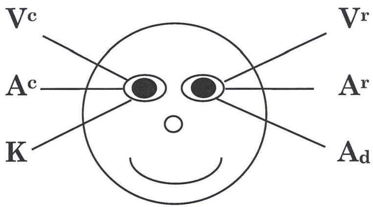

- Vc = Οπτικό Κατασκευασμένο (Visual Constructed)
- Vr = Οπτικό Ανακαλούμενο (Visual Remembered)
- Ac = Ακουστικό Κατασκευασμένο (Auditory Constructed)
- Ar = Ακουστικό Ανακαλούμενο (Auditory Remembered)
- K = Κιναισθητικό (Συναισθήματα)
- Ad = Ακουστικό Ψηφιακό (Εσωτερικός Διάλογος)


\rightline{\small 24}

# ΕΡΩΤΗΣΕΙΣ ΜΟΤΙΒΩΝ ΜΑΤΙΩΝ

(Να θυμάσαι, μερικοί άνθρωποι αποκτούν πρόσβαση στα Vᵀ, Aᵀ, Ad ή K αφεστιάζοντας.)

Vᵀ: **Οπτικό Ανακαλούμενο**: Βλέποντας εικόνες από τη μνήμη, ανακαλώντας πράγματα που έχουν δει στο παρελθόν.

ΕΡΩΤΗΣΗ: «Τι χρώμα ήταν το δωμάτιο στο οποίο μεγάλωσες;» «Τι χρώμα ήταν το πρώτο αυτοκίνητο που είχες ποτέ;»

Vᵃ: **Οπτικό Κατασκευασμένο**: Εικόνες πραγμάτων που οι άνθρωποι δεν έχουν δει ποτέ πριν. Όταν οι άνθρωποι φαντάζονται κάτι στο μυαλό τους, χρησιμοποιούν το οπτικό κατασκευασμένο.

ΕΡΩΤΗΣΗ: «Πώς θα φαινόταν το δωμάτιό σου (αυτοκίνητο) αν ήταν μπλε;»

Aᵀ: **Ακουστικό Ανακαλούμενο**: Όταν θυμάσαι ήχους ή φωνές που έχεις ακούσει στο παρελθόν, ή πράγματα που έχεις πει στον εαυτό σου στο παρελθόν.

ΕΡΩΤΗΣΗ: «Όταν μεγάλωνες, είχες ένα αγαπημένο κατοικίδιο; Πώς ήταν ο ήχος της φωνής του κατοικιδίου σου;» «Ποιο ήταν το τελευταίο πράγμα που είπα;» «Μπορείς να θυμηθείς τον ήχο της φωνής της μητέρας σου;»

Aᵃ: **Ακουστικό Κατασκευασμένο**: Δημιουργία ήχων που δεν έχεις ακούσει ποτέ πριν.

ΕΡΩΤΗΣΗ: «Πώς θα ακουγόμουν αν είχα τη φωνή του Donald Duck;»

Ad: **Ακουστικό Ψηφιακό**: Εδώ πηγαίνουν τα μάτια σου όταν μιλάς στον εαυτό σου — εσωτερικός διάλογος.

ΕΡΩΤΗΣΕΙΣ: «Μπορείς να απαγγείλεις τον Όρκο Πίστης (Pledge of Allegiance) στον εαυτό σου;» «Υπάρχει ένα ποίημα από το δημοτικό που θυμάσαι;» «Μπορείς να πεις την προπαίδεια του 7 στον εαυτό σου;»

K: **Κιναισθητικό**: (Συναισθήματα, αίσθηση της αφής.) Γενικά κοιτάς προς αυτή την κατεύθυνση όταν αποκτάς πρόσβαση στα συναισθήματά σου.

ΕΡΩΤΗΣΗ: «Έχεις μια αγαπημένη παραλία ή τόπο για περπάτημα στη φύση; Πώς αισθάνεται να περπατάς εκεί χωρίς παπούτσια;» «Πώς αισθάνεται να αγγίζεις ένα βρεγμένο χαλί;»


\rightline{\small 25}

# ΥΠΟΜΟΡΦΟΤΡΟΠΙΕΣ (SUBMODALITIES)

## Επιθυμητό Αποτέλεσμα:
Να μπορείς να κάνεις εύκολα αλλαγές στις εσωτερικές αναπαραστάσεις ενός πελάτη χρησιμοποιώντας Υπομορφοτροπίες.

## Θεωρία:
Οι Υπομορφοτροπίες είναι ο τρόπος με τον οποίο κωδικοποιούμε και δίνουμε νόημα στις Εσωτερικές μας Αναπαραστάσεις. Η αλλαγή των Υπομορφοτροπιών μπορεί να αλλάξει τη σημασία μιας Εσωτερικής Αναπαράστασης.

## Οι Τεχνικές Περιλαμβάνουν:
1. Συγκριτική Ανάλυση (Contrastive Analysis): Περιλαμβάνει τον εντοπισμό των Οδηγών (Drivers) (ή των κρίσιμων Υπομορφοτροπιών) συγκρίνοντας δύο Εσωτερικές Αναπαραστάσεις ως προς τις διαφορές στις Υπομορφοτροπίες. Π.χ.: Σύγκριση Παγωτού και Γιαουρτιού.
2. Χαρτογράφηση Διασταυρωμένα (Mapping Across): Περιλαμβάνει την ανακάλυψη των Οδηγών (μέσω Συγκριτικής Ανάλυσης) και στη συνέχεια την αλλαγή των Υπομορφοτροπιών της μιας Εσωτερικής Αναπαράστασης σε εκείνες της άλλης. Π.χ.: Η αλλαγή των Υπομορφοτροπιών του Παγωτού (που αρέσει) και του Γιαουρτιού (που δεν αρέσει) θα έπρεπε να κάνει τον πελάτη να μη συμπαθεί πια το Παγωτό.
3. Μοτίβα Swish: Αυτά περιλαμβάνουν την αντικατάσταση μιας Εσωτερικής Αναπαράστασης ή εικόνας από μια άλλη. Αυτό προσανατολίζει τη σειρά των Εσωτερικών Αναπαραστάσεων έτσι ώστε η Επιθυμητή Κατάσταση να είναι πιο συχνή.
4. Τεχνικές Αποσύνδεσης (Dissociative Techniques): Περιλαμβάνουν τη μετατόπιση της οπτικής γωνίας και την παρατήρηση μιας συγκεκριμένης Εσωτερικής Αναπαράστασης από μια αποσυνδεδεμένη θέση. Χρησιμοποιείται συχνά για να "αφαιρεθεί η ένταση" από ένα αρνητικό συναίσθημα, όπως στο Μοντέλο Φοβίας.
5. Αντιληπτικές Θέσεις (Perceptual Positions): Περιλαμβάνει τη μετατόπιση της οπτικής γωνίας και την παρατήρηση μιας συγκεκριμένης Εσωτερικής Αναπαράστασης από μία από τρεις διαφορετικές θέσεις. Η Πρώτη Θέση είναι το να κοιτάς μέσα από τα δικά σου μάτια. Η Δεύτερη Θέση είναι το να κοιτάς μέσα από τα μάτια ενός άλλου ανθρώπου (συνήθως ενός σημαντικού ατόμου στο γεγονός). Η Τρίτη Θέση είναι το να παρατηρείς ολόκληρη τη σκηνή από μια αποσυνδεδεμένη θέση (ας πούμε, πάνω από ολόκληρο το γεγονός). Αυτό είναι χρήσιμο ως Τεχνική Αποσύνδεσης και για την ενσωμάτωση μαθήσεων.


\rightline{\small 26}

# ΠΑΡΑΔΕΙΓΜΑΤΑ ΕΝΑΥΣΜΑΤΩΝ ΣΕ ΠΛΑΙΣΙΑ NLP

Από Συμπάθεια σε Αντιπάθεια (Like to Dislike): «Όταν το σκέφτεσαι αυτό, έχεις μια εικόνα;»

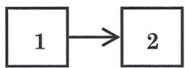

Swish: «Πώς ξέρεις ότι είναι ώρα να...»

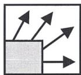

Αγκύρωση (Anchor): «Μπορείς να θυμηθείς μια φορά που ήσουν τελείως ______; Μπορείς να θυμηθείς μια συγκεκριμένη στιγμή;»

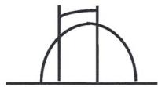

Στρατηγική: «Μπορείς να θυμηθείς μια φορά που ήσουν τελείως ______; Μπορείς να θυμηθείς μια συγκεκριμένη στιγμή; Καθώς θυμάσαι εκείνη τη στιγμή, ποιο ήταν το πρώτο πράγμα που συνέβη...;»


Αξίες (από την Εκπαίδευση Master Practitioner): «Στο πλαίσιο του ______, τι είναι σημαντικό για σένα; Όταν σκέφτεσαι αυτή την αξία, έχεις μια εικόνα;»



\rightline{\small 27}

# ΣΕΝΑΡΙΟ ΥΠΟΜΟΡΦΟΤΡΟΠΙΩΝ ΑΠΟ «ΜΟΥ ΑΡΕΣΕΙ» ΣΕ «ΔΕΝ ΜΟΥ ΑΡΕΣΕΙ»

(Όποτε κάνεις οποιαδήποτε εργασία με Υπομορφοτροπίες, θα πρέπει να χρησιμοποιείς τη Λίστα Ελέγχου Υπομορφοτροπιών, Σελίδα 29. Αυτό προσθέτει στην ακρίβεια και την προσοχή σου)

(Γενικά, είναι καλή ιδέα να ρωτάς, «Είναι εντάξει για τον Υποσυνείδητο Νου σου να κάνει αυτή την αλλαγή σήμερα και για σένα να την αντιληφθείς συνειδητά;»)

1. «Μπορείς να σκεφτείς κάτι που σου αρέσει αλλά εύχεσαι να μη σου άρεσε; Ωραία, τι είναι; Καθώς σκέφτεσαι πόσο πολύ σου αρέσει, έχεις μια εικόνα;» (Πρόκαλεσε τις Υπομορφοτροπίες.)
Καθάρισε την Οθόνη

2. «Μπορείς να σκεφτείς κάτι παρόμοιο, αλλά που το αντιπαθείς απόλυτα. Για παράδειγμα, παγωτό και γιαούρτι.» «Ωραία, τι είναι; Καθώς σκέφτεσαι πόσο πολύ το αντιπαθείς, έχεις μια εικόνα;» (Πρόκαλεσε τις Υπομορφοτροπίες. Η τοποθεσία θα πρέπει να είναι διαφορετική!)
Καθάρισε την Οθόνη

3. Άλλαξε τις Υπομορφοτροπίες του #1 στις Υπομορφοτροπίες του #2.

4. Κλείδωσέ το στη θέση του. «Ξέρεις τον ήχο που κάνει το tupperware όταν σφραγίζεται, ακριβώς έτσι, κλείδωσέ το ακριβώς εκεί.»
Σπάσε την Κατάσταση

5. Δοκιμή «Τώρα, τι γίνεται με εκείνο το πράγμα που σου άρεσε; Πώς είναι διαφορετικό;»

6. Μελλοντικός Βηματισμός (Future Pace). «Φαντάσου μια στιγμή στο μέλλον που μπορεί να μπεις στον πειρασμό να το φας. Τι συμβαίνει;»


\rightline{\small 28}

# ΣΕΝΑΡΙΟ ΑΛΛΑΓΗΣ ΠΕΠΟΙΘΗΣΕΩΝ ΜΕ ΥΠΟΜΟΡΦΟΤΡΟΠΙΕΣ

(Όποτε κάνεις οποιαδήποτε εργασία με Υπομορφοτροπίες, θα πρέπει να χρησιμοποιείς τη Λίστα Ελέγχου Υπομορφοτροπιών, Σελίδα 29. Αυτό προσθέτει στην ακρίβεια και την προσοχή σου)

Είναι εντάξει με τον υποσυνείδητο νου σου...;

1. «Μπορείς να σκεφτείς μια περιοριστική πεποίθηση για τον εαυτό σου που εύχεσαι να μην είχες; Ωραία, ποια είναι; Καθώς σκέφτεσαι αυτή την πεποίθηση, έχεις μια εικόνα;» (Πρόκαλεσε τις Υπομορφοτροπίες.)

2. «Μπορείς να σκεφτείς μια πεποίθηση που δεν είναι πλέον αληθινή. Για παράδειγμα, ίσως ήσουν καπνιστής. Κάποιος που ήταν καπνιστής, πίστευε ότι ήταν καπνιστής, αλλά τώρα δεν το πιστεύει πια αυτό. Ή κάποιος που είχε ένα καινούργιο αυτοκίνητο μοντέλου 1985, πίστευε ότι ήταν ιδιοκτήτης καινούργιου αυτοκινήτου, αλλά τώρα δεν το πιστεύει πια. Ή ίσως η πεποίθηση ότι δεν είσαι πια 18. Έχεις κάτι παρόμοιο που κάποτε ίσχυε για σένα, αλλά πλέον δεν ισχύει; Ωραία, ποια είναι; Καθώς σκέφτεσαι αυτή την παλιά πεποίθηση, έχεις μια εικόνα — Πού βρίσκεται αυτή η παλιά πεποίθηση τώρα;» (Πρόκαλεσε τις Υπομορφοτροπίες. Για τα καλύτερα αποτελέσματα, η τοποθεσία θα πρέπει να είναι διαφορετική!)

3. Άλλαξε τις Υπομορφοτροπίες του #1 στις Υπομορφοτροπίες του #2.

ΔΟΚΙΜΗ: Τώρα, τι σκέφτεσαι γι' αυτή την παλιά πεποίθηση;

4. «Μπορείς να σκεφτείς μια πεποίθηση που για σένα είναι απολύτως αληθινή; Όπως, για παράδειγμα, η πεποίθηση ότι ο ήλιος θα ανατείλει αύριο. Το πιστεύεις αυτό; (Ή, η πεποίθηση ότι είναι καλό να αναπνέεις.) Ωραία, ποια είναι; Καθώς σκέφτεσαι αυτή την πεποίθηση, έχεις μια εικόνα;» (Πρόκαλεσε τις Υπομορφοτροπίες.)

5. Μπορείς να σκεφτείς μια πεποίθηση που θες να έχεις, η οποία είναι το αντίθετο της πεποίθησης του #1; Ωραία, ποια είναι; Καθώς σκέφτεσαι αυτή την πεποίθηση, έχεις μια εικόνα;»

6. Άλλαξε τις Υπομορφοτροπίες του #5 στις Υπομορφοτροπίες του #4.

ΔΟΚΙΜΗ: Τώρα, τι πιστεύεις; Γιατί πιστεύεις ότι έχεις αυτή τη νέα πεποίθηση;


\rightline{\small 29}

# ΛΙΣΤΑ ΕΛΕΓΧΟΥ ΥΠΟΜΟΡΦΟΤΡΟΠΙΩΝ (SUBMODALITIES)

<table><tr><th>Οπτικό</th><th>1</th><th>2</th><th>3</th><th>4</th></tr><tr><td>Ασπρόμαυρο ή Έγχρωμο;</td><td></td><td></td><td></td><td></td></tr><tr><td>Κοντινό ή Μακρινό;</td><td></td><td></td><td></td><td></td></tr><tr><td>Φωτεινό ή Θαμπό;</td><td></td><td></td><td></td><td></td></tr><tr><td>♦ Θέση;</td><td></td><td></td><td></td><td></td></tr><tr><td>Μέγεθος Εικόνας;</td><td></td><td></td><td></td><td></td></tr><tr><td>♦ Συσχετισμένο / Αποσυσχετισμένο;</td><td></td><td></td><td></td><td></td></tr><tr><td>Εστιασμένο ή Μη Εστιασμένο;</td><td></td><td></td><td></td><td></td></tr><tr><td>Εστίαση<br/>(Μεταβλητή/Σταθερή)</td><td></td><td></td><td></td><td></td></tr><tr><td>Πλαισιωμένο ή Πανοραμικό;</td><td></td><td></td><td></td><td></td></tr><tr><td>Ταινία ή Στατική Εικόνα;</td><td></td><td></td><td></td><td></td></tr><tr><td>Ταινία-Γρήγορη/Κανονική/Αργή</td><td></td><td></td><td></td><td></td></tr><tr><td>Βαθμός Αντίθεσης</td><td></td><td></td><td></td><td></td></tr><tr><td>3D ή Επίπεδο;</td><td></td><td></td><td></td><td></td></tr><tr><td>Γωνία Θέασης<br/>Αρ. Εικόνων (Μεταβολή;)</td><td></td><td></td><td></td><td></td></tr><tr><td><strong>Ακουστικό</strong></td><td></td><td></td><td></td><td></td></tr><tr><td>Θέση</td><td></td><td></td><td></td><td></td></tr><tr><td>Κατεύθυνση</td><td></td><td></td><td></td><td></td></tr><tr><td>Εσωτερικό ή Εξωτερικό;</td><td></td><td></td><td></td><td></td></tr><tr><td>Δυνατό ή Απαλό;</td><td></td><td></td><td></td><td></td></tr><tr><td>Γρήγορο ή Αργό;</td><td></td><td></td><td></td><td></td></tr><tr><td>Υψηλό ή Χαμηλό; (Τονικότητα)</td><td></td><td></td><td></td><td></td></tr><tr><td>Τονικότητα</td><td></td><td></td><td></td><td></td></tr><tr><td>Χροιά</td><td></td><td></td><td></td><td></td></tr><tr><td>Παύσεις</td><td></td><td></td><td></td><td></td></tr><tr><td>Ρυθμός</td><td></td><td></td><td></td><td></td></tr><tr><td>Διάρκεια</td><td></td><td></td><td></td><td></td></tr><tr><td>Μοναδικότητα Ήχου</td><td></td><td></td><td></td><td></td></tr><tr><td><strong>Κιναισθητικό</strong></td><td></td><td></td><td></td><td></td></tr><tr><td>Θέση</td><td></td><td></td><td></td><td></td></tr><tr><td>Μέγεθος</td><td></td><td></td><td></td><td></td></tr><tr><td>Σχήμα</td><td></td><td></td><td></td><td></td></tr><tr><td>Ένταση</td><td></td><td></td><td></td><td></td></tr><tr><td>Σταθερό</td><td></td><td></td><td></td><td></td></tr><tr><td>Κίνηση/Διάρκεια</td><td></td><td></td><td></td><td></td></tr><tr><td>Δόνηση</td><td></td><td></td><td></td><td></td></tr><tr><td>Πίεση/Θερμότητα;</td><td></td><td></td><td></td><td></td></tr><tr><td>Βάρος</td><td></td><td></td><td></td><td></td></tr></table>


\rightline{\small 30}


\rightline{\small 31}


\rightline{\small 32}

# ΜΟΤΙΒΑ SWISH (SWISH PATTERNS)

## ΚΛΕΙΔΙΑ ΓΙΑ ΕΠΙΤΥΧΗΜΕΝΑ ΜΟΤΙΒΑ SWISH

- Τα μοτίβα Swish έχουν σκοπό τη δημιουργία ορμής προς ένα ελκυστικό μέλλον.
- Το Μοτίβο Swish *εγκαθιστά επιλογές* για έναν νέο τρόπο ζωής αντί να αλλάζει ή να αφαιρεί παλιές συνήθειες.

## ΕΚΤΕΛΕΣΗ ΕΝΟΣ ΜΟΤΙΒΟΥ SWISH

1. Πάρε την εικόνα που αντιπροσωπεύει τη συνήθεια ή την κατάσταση που θέλεις να αλλάξεις. («Όταν σκέφτεσαι το __________, έχεις μια εικόνα;») (*φ Δημιούργησε*)

2. Πάρε μια εικόνα του τύπου ανθρώπου που θα ήθελες να γίνεις. («Πώς θα ήθελες να είσαι αντί γι' αυτό; Όταν το σκέφτεσαι αυτό, έχεις μια εικόνα;»)

3. Άλλαξε την οπτική ένταση της επιθυμητής κατάστασης (φωτεινότητα, μέγεθος, απόσταση κ.λπ.) για το πιο «πραγματικό» ή πιο θετικό κιναισθητικό αίσθημα.

4. Επανέφερε την παλιά εικόνα (#1), ΤΩΡΑ ΜΠΕΣ ΜΕΣΑ ΣΤΗΝ ΕΙΚΟΝΑ, πλήρως συσχετισμένος.

5. Τώρα τοποθέτησε στην κάτω αριστερή γωνία μια μικρή, σκοτεινή εικόνα της επιθυμητής κατάστασης.

6. Ταυτόχρονα, κάνε την εικόνα της παρούσας κατάστασης να συρρικνωθεί γρήγορα και να απομακρυνθεί σε ένα μακρινό σημείο, ενώ η σκοτεινή εικόνα εκρήγνυται σε πλήρη θέαση. (Αυτό *μπορεί* να συνοδεύεται είτε από έναν εσωτερικό είτε εξωτερικό ήχο SWIIIISSH, αλλά *δεν είναι απαραίτητο*—η ταχύτητα είναι!)

7. Επανάλαβε το #6 *τουλάχιστον πέντε φορές*. Απόλαυσε τα αποτελέσματα!

## ΣΗΜΕΙΩΣΕΙΣ ΝΑ ΘΥΜΑΣΑΙ

α. Να είσαι πλήρως συσχετισμένος στο παλιό μοτίβο.
β. Να έχεις λεπτομερείς αναπαραστάσεις ειδικές για τις αισθήσεις στην επιθυμητή κατάσταση.
γ. Αν ο πελάτης είναι συσχετισμένος στην τελική εικόνα = ΕΠΙΘΥΜΗΤΟ ΑΠΟΤΕΛΕΣΜΑ (OUTCOME)
δ. Αν ο πελάτης είναι αποσυσχετισμένος στην τελική εικόνα = ΚΑΤΕΥΘΥΝΣΗ (Αυτό συνήθως προτιμάται για να δημιουργηθεί ένα ελκυστικό μέλλον.)
ε. Φρόντισε να υπάρχει διακοπή κατάστασης (break state) μεταξύ κάθε Μοτίβου Swish ώστε να μην δημιουργηθεί βρόχος. Κλείσε τα μάτια σε κάθε βήμα της διαδικασίας και άνοιξέ τα μεταξύ των βημάτων.


\rightline{\small 33}

# ΣΕΝΑΡΙΟ ΜΟΤΙΒΟΥ SWISH ΥΠΟΜΟΡΦΟΤΡΟΠΙΩΝ

1. Επαγωγή Παρούσας Κατάστασης ή Συμπεριφοράς: «Πώς ξέρεις ότι είναι ώρα να ______; (Π.χ.: Να νιώσεις άσχημα.) Όταν το σκέφτεσαι αυτό ______ (Κατάσταση ή Συμπεριφορά), έχεις μια εικόνα;» (Διακοπή Κατάστασης) [Αν ο πελάτης σου δώσει μια κιναισθητική (K) απάντηση, τότε πες: «Πώς ξέρεις ότι είναι ώρα να νιώσεις...»]
2. Επαγωγή Επιθυμητής Κατάστασης: «Πώς θα ήθελες να (νιώσεις/συμπεριφερθείς) αντί γι' αυτό; Όταν το σκέφτεσαι αυτό ______ (Κατάσταση ή Συμπεριφορά), έχεις μια εικόνα;»
3. Αν χρειάζεται, βοήθησε τον πελάτη να ρυθμίσει την οπτική ένταση της Επιθυμητής Κατάστασης για το πιο θετικό κιναισθητικό αίσθημα. Πες στον Πελάτη: «Μπες μέσα στο σώμα σου.» (Τώρα, ρύθμισε τις Υπομορφοτροπίες.)
4. «Ωραία, τώρα βγες έξω από την εικόνα, ώστε να βλέπεις το σώμα σου μέσα στην εικόνα. Πάρε την εικόνα και κάνε την μικρή και σκοτεινή στην κάτω αριστερή γωνία.» (Διακοπή Κατάστασης)

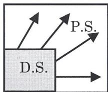

5. «Τώρα, μπορείς να πάρεις την παλιά εικόνα και να τη φέρεις πάνω στην οθόνη; Βεβαιώσου ότι κοιτάς μέσα από τα δικά σου μάτια.»
6. «Ωραία, καθώς έχεις την παλιά εικόνα στην οθόνη, μπορείς να δεις τη νέα εικόνα στην κάτω αριστερή γωνία, μικρή και σκοτεινή; Βεβαιώσου ότι βλέπεις το σώμα σου μέσα στην εικόνα.»
7. «Ωραία, τώρα κάνε την εικόνα να εκραγεί μεγάλη και φωτεινή, και να εκραγεί προς τα πάνω ώστε να καλύψει την παλιά εικόνα, ενώ η παλιά εικόνα συρρικνώνεται και γίνεται μικρή και σκοτεινή στην κάτω αριστερή γωνία, και κάνε το αυτό όσο γρήγορα γίνεται sssswishhhhh.»
8. «Εντάξει, sssswishhhhh.»
9. «Τώρα, καθάρισε την οθόνη.»
10. Επανάλαβε τα βήματα 5, 6, 8 και 9 μέχρι η ανεπιθύμητη κατάσταση ή συμπεριφορά να μην είναι προσβάσιμη.
11. Έλεγξε και κάνε μελλοντικό βηματισμό (future pace).


\rightline{\small 34}

# Η ΣΥΝΕΙΔΗΤΗ ΧΡΗΣΗ ΤΗΣ ΓΛΩΣΣΑΣ

## Επιθυμητό αποτέλεσμα (Outcome):

Το επιθυμητό αποτέλεσμα της Ενότητας Γλώσσας είναι όλοι οι συμμετέχοντες να μπορούν να χρησιμοποιήσουν με επιτυχία τη γλώσσα για να παράγουν τα επιθυμητά τους αποτελέσματα, μέσω της ανόδου ή της καθόδου (Chunking up/Down) σε επίπεδα μεγαλύτερης ασάφειας ή ειδίκευσης.

## Διαδικασία:

1. Χρήση Ειδίκευσης ή Ασάφειας στη Γλώσσα
2. Υπνωτικά Μοτίβα Γλώσσας
Α. Αξιοποίηση (Utilization)
Β. Μη προσδιορισμένη γλώσσα
3. Το Πλαίσιο Συμφωνίας (Agreement Frame)
Α. Εκτιμώ, και...
Β. Σέβομαι, και...
Γ. Συμφωνώ, και...
Δ. Απόφυγε τη χρήση του «αλλά» ή του «καταλαβαίνω»
4. Το Πλαίσιο Σκοπού (Purpose Frame)
«Για ποιον σκοπό...;»
5. Το Πλαίσιο "Τι θα συνέβαινε αν" (What If Frame)
«Τι θα συνέβαινε αν...;»
6. Χρήση Λέξεων που Δημιουργούν Θετικές Εσωτερικές Αναπαραστάσεις (I/R's) – Πες το όπως το θέλεις:
Τουλάχιστον 5 θετικές εσωτερικές αναπαραστάσεις (I/R's) εμπλοκής.
7. Κλείσιμο υπό Όρους:
«Άρα αν κάναμε αυτό, εσύ θα έκανες αυτό;»
8. Ερωτήσεις-Ετικέτες (Tag Questions):
«Αυτό είναι κάτι που σε ενδιαφέρει, έτσι δεν είναι;»


\rightline{\small 35}

# ΠΡΟΫΠΟΘΕΣΕΙΣ (PRESUPPOSITIONS)

Ορισμός: Οι Προϋποθέσεις (Presuppositions) είναι Γλωσσικές Παραδοχές και είναι χρήσιμες για:
- Την αναγνώριση του τι θεωρείται δεδομένο στον λόγο του πελάτη και την παροχή βοήθειας στη
- Δημιουργία νέων Εσωτερικών Αναπαραστάσεων (I/R's) για τον πελάτη.

1. Ύπαρξη – (Ένδειξη: Ουσιαστικά)
2. Δυνατότητα/Αναγκαιότητα – (Ένδειξη: Modal Operators)
3. Αιτία – Αποτέλεσμα – (Ένδειξη: «Κάνει», «Αν ... τότε»)
4. Σύνθετη Ισοδυναμία – (Ένδειξη: «Είναι», «Σημαίνει»)
5. Επίγνωση – (Ένδειξη: Ρήματα με V, A, K O, G)
6. Χρόνος – (Ένδειξη: Χρόνος Ρήματος, «Σταμάτα», «Τώρα», «Ακόμα»)
7. Επίρρημα/Επίθετο – (Ένδειξη: Ένα επίρρημα ή επίθετο)
8. Αποκλειστικό/Συμπεριληπτικό Ή – (Ένδειξη: «Ή»)
9. Τακτικό – (Ένδειξη: Μια Λίστα)


\rightline{\small 36}

# ΠΡΟΫΠΟΘΕΣΕΙΣ (PRESUPPOSITIONS)

Στις παρακάτω προτάσεις, παρακαλώ διάκρινε μεταξύ της προϋπόθεσης και της ανάγνωσης σκέψης (mind read). Βάλε ένα 'P' ή ένα 'MR' δίπλα σε κάθε μία:

1. «Δεν είμαι σίγουρος αν πρέπει ή όχι να σταματήσω να χτυπάω τη γυναίκα μου.»
Α. Έχει γυναίκα
Β. Αγαπάει τη γυναίκα του
Γ. Αυτή τη στιγμή χτυπάει τη γυναίκα του
Δ. Είναι ένας κατώτερος τύπος που θα έπρεπε να τουφεκιστεί!

2. «Δεν βλέπω γιατί δεν μπορώ να το κάνω. Όλοι οι φίλοι μου το κάνουν!»
Α. Νιώθει ότι του φέρονται άδικα
Β. Θέλει να τον συμπαθούν οι φίλοι του
Γ. Οι φίλοι αυτού του ατόμου κάνουν κάτι που εκείνος δεν κάνει
Δ. Όλοι οι φίλοι του είναι αλήτες που θα έπρεπε να τουφεκιστούν!

3. «Αν δεν μάθω πώς να επικοινωνώ με το αφεντικό μου, δεν θα πάρω αύξηση.»
Α. Νιώθει ότι του φέρονται άδικα
Β. Δεν ξέρει πώς να επικοινωνεί με το αφεντικό του
Γ. Θέλει να μάθει νέες συμπεριφορές
Δ. Ο μισθός του συνδέεται με τις επικοινωνιακές του δεξιότητες

4. «Πρέπει να θέτω μη ρεαλιστικές προσδοκίες.»
Α. Δεν μπορεί να σταματήσει να κάνει μη ρεαλιστικές προσδοκίες
Β. Νιώθει παγιδευμένος
Γ. Έχει προσδοκίες
Δ. Ξέρει πότε είναι μη ρεαλιστικός

5. «Νιώθω πολύ καλύτερα τώρα! Μπορώ να δω πώς μερικά από τα πράγματα που έκανα απλά με έκαναν δυστυχισμένο.»
Α. Κάποια συμπεριφορά που υιοθέτησε σχετιζόταν με κάποια εσωτερική κατάσταση
Β. Έχει συναισθήματα
Γ. Έχει πολύ μεγαλύτερο έλεγχο της ζωής του τώρα
Δ. Διόρθωσε τον εαυτό του οπότε δεν θα έπρεπε να τουφεκιστεί


\rightline{\small 37}

# ΠΡΟΫΠΟΘΕΣΕΙΣ (PRESUPPOSITIONS)

Στις παρακάτω προτάσεις, παρακαλώ ανέφερε τι θεωρείται δεδομένο και επίσης αναγνώρισε την κύρια δομή προϋπόθεσης.

1. «Αν η γάτα νιαουρίσει ξανά, θα πρέπει να τη βγάλω έξω.»
2. «Ήταν το φιλικό της χαμόγελο που με έκανε να πάω και να της πω «Γεια».»
3. «Αν μόνο είχε έρθει σπίτι στην ώρα του, το πάρτι δεν θα είχε ξεφύγει από έλεγχο.»
4. «Οι άνθρωποι πάντα μου έδιναν περισσότερα να κάνω από όσα μπορούσα να αντέξω.»
5. «Η ευχάριστη προσωπικότητά του είναι καλή δημόσια σχέση (P.R.) για την εταιρεία μας.»
6. «Σταμάτα να κοιτάς πάνω από τον ώμο σου.»
7. «Μόνο εσύ μπορείς να το μάθεις αυτό.»
8. «Είτε εκείνη πάει στο μαγαζί είτε εγώ.»
9. «Πρώτα ήρθαν οι άνεμοι, μετά η βροχή.»
10. «Η όπερα με κάνει να θέλω να κλάψω.»


\rightline{\small 38}

# "THIMK"

«Ποια είναι **η** ερώτηση που μπορώ να κάνω, η οποία από την ίδια τη φύση των προϋποθέσεων μέσα στην ερώτηση θα κάνει τον πελάτη να επιφέρει τη μεγαλύτερη αλλαγή αναγκάζοντάς τον να αποδεχθεί τις προϋποθέσεις που ενυπάρχουν στην ερώτηση;» — Tad James, 1992


\rightline{\small 39}

# ΙΕΡΑΡΧΙΑ ΤΩΝ ΙΔΕΩΝ (HIERARCHY OF IDEAS)
## ΤΟ ΜΟΝΤΕΛΟ

Μετα K-Τύπος

### Άνοδος (Chunking Up)
Συμφωνία

**«Για τι είδους πράγμα αποτελεί παράδειγμα αυτό;»**
**«Για ποιον σκοπό...;»**
**«Ποια είναι η πρόθεσή σας...;»**

Στη Διαμεσολάβηση, ανέβα για να επιτύχεις συμφωνία. Ανέβα μέχρι να φτάσεις σε μια Ονοματοποίηση.

**Η Δομή της Διαίσθησης**: Η ικανότητα να ανεβαίνεις (chunk-up) για να βρίσκεις συνδέσεις και σχέσεις, και μετά να κατεβαίνεις πάλι (chunk back down) και να συσχετίζεις με την παρούσα κατάσταση. Είναι σπάνιο να βρει κανείς έναν άνθρωπο που σκέφτεται σε μεγάλα τμήματα (large chunker) και που ψάχνει για πληροφορίες -- συνήθως είναι άνθρωποι που σκέφτονται σε μικρά τμήματα.

**«Ποια είναι τα παραδείγματα αυτού;»**
**«Τι συγκεκριμένα...;»**
-- οποιαδήποτε Ερώτηση του Μετα-Μοντέλου (Meta Model)



### Σε Έκσταση (In Trance)
Διαισθητικός (Intuitor)

### Μεγάλη Εικόνα
Αφηρημένο—Μοντέλο Milton

Η Δομή της Συντριβής: Πολύ Μεγάλα Τμήματα

Ύπαρξη
Κίνηση
Μεταφορά

Λεωφορεία -- Πλοία -- Αυτοκίνητα -- Αεροπλάνα -- Τρένα

Κλάσεις & Κατηγορίες
- BMW -- Pontiac
- Fiero
- GT

Μέρη
- Τροχοί -- Πόρτες
- Τάσια
- Παξιμάδια

Η Δομή της Ψυλλίασης: Κάθοδος και Ασυμφωνία

Συγκεκριμένο — Μετα-Μοντέλο

Λεπτομέρειες
- Αισθητήρας

**Εκτός Έκστασης**

Λεπτομέρειες & Διακρίσεις
Κάθοδος (Chunking Down)


\rightline{\small 40}

# ΜΟΝΤΕΛΟ MILTON (MILTON MODEL)

## ΥΠΝΩΤΙΚΑ ΓΛΩΣΣΙΚΑ ΜΟΤΙΒΑ

1. **ΑΝΑΓΝΩΣΗ ΣΚΕΨΗΣ (MIND READ)**: Το να ισχυρίζεσαι ότι γνωρίζεις τις σκέψεις ή τα συναισθήματα κάποιου άλλου χωρίς να προσδιορίζεις τη διαδικασία με την οποία απέκτησες αυτή την πληροφορία.
«Ξέρω ότι αναρωτιέσαι...»

2. **ΧΑΜΕΝΟΣ ΕΠΙΤΕΛΕΣΤΗΣ (LOST PERFORMATIVE)**: Αξιολογικές κρίσεις (που μπορεί να περιλαμβάνουν μια μη προσδιορισμένη σύγκριση) όπου ο επιτελεστής της κρίσης παραλείπεται.
«Και είναι καλό πράγμα να αναρωτιέσαι...»

3. **ΑΙΤΙΑ & ΑΠΟΤΕΛΕΣΜΑ**: Όπου υπονοείται ότι ένα πράγμα προκαλεί ένα άλλο. (Συμπεριλαμβανομένης της απόδοσης της αιτίας έξω από τον εαυτό.) Τα Υπονοούμενα Αιτιατά περιλαμβάνουν:
α. C>E «κάνει» (το ρήμα κάνω)
β. Αν... τότε...
γ. Καθώς εσύ... τότε εσύ...

«Επειδή...»

4. **ΣΥΝΘΕΤΗ ΙΣΟΔΥΝΑΜΙΑ (COMPLEX EQUIVALENCE)**: Όπου δύο πράγματα εξισώνονται – ως προς το ότι τα νοήματά τους είναι ισοδύναμα.
«Αυτό σημαίνει...»

5. **ΠΡΟΫΠΟΘΕΣΗ (PRESUPPOSITION)**: Το γλωσσικό ισοδύναμο των παραδοχών.
«Μαθαίνεις πολλά πράγματα...»

6. **ΚΑΘΟΛΙΚΟΣ ΠΟΣΟΔΕΙΚΤΗΣ (UNIVERSAL QUANTIFIER)**: Ένα σύνολο λέξεων που έχει:
α. μια καθολική γενίκευση και
β. καμία αναφορική ένδειξη.
«Και όλα τα πράγματα, όλα τα πράγματα...»

7. **MODAL OPERATOR**: Λέξεις που υπονοούν δυνατότητα ή αναγκαιότητα, οι οποίες συχνά διαμορφώνουν τους κανόνες μας στη ζωή.
«Που μπορείς να μάθεις...»

8. **ΟΝΟΜΑΤΟΠΟΙΗΣΗ (NOMINALIZATION)**: Λέξεις διαδικασίας (συμπεριλαμβανομένων των ρημάτων) που έχουν παγώσει στον χρόνο μετατρεπόμενες σε ουσιαστικά.
«Σου παρέχουν νέες γνώσεις και νέες κατανοήσεις.»

9. **ΜΗ ΠΡΟΣΔΙΟΡΙΣΜΕΝΟ ΡΗΜΑ (UNSPECIFIED VERB)**: Όπου ένας επιθετικός ή επιρρηματικός προσδιορισμός δεν προσδιορίζει το ρήμα.
«Και μπορείς,»

10. **ΕΡΩΤΗΣΗ-ΕΤΙΚΕΤΑ (TAG QUESTION)**: Μια ερώτηση που προστίθεται μετά από μια δήλωση, σχεδιασμένη να εκτοπίζει την αντίσταση.
«Δεν μπορείς;»


\rightline{\small 41}

# ΜΟΝΤΕΛΟ MILTON

11. ΕΛΛΕΙΨΗ ΑΝΑΦΟΡΙΚΗΣ ΕΝΔΕΙΞΗΣ: Μια φράση που δεν εντοπίζει ένα συγκεκριμένο τμήμα της εμπειρίας του ακροατή.
«Μπορεί κανείς, ξέρεις...»

12. ΣΥΓΚΡΙΤΙΚΗ ΠΑΡΑΛΕΙΨΗ (Μη Προσδιορισμένη Σύγκριση): Όπου γίνεται η σύγκριση και δεν προσδιορίζεται με τι ή με ποιον έγινε.
«Και είναι λίγο πολύ το σωστό πράγμα.»

13. ΒΗΜΑΤΙΣΜΟΣ ΤΗΣ ΤΡΕΧΟΥΣΑΣ ΕΜΠΕΙΡΙΑΣ (PACE CURRENT EXPERIENCE): Όπου η επαληθεύσιμη, εξωτερική εμπειρία του πελάτη περιγράφεται με αναμφισβήτητο τρόπο.
«Κάθεσαι εδώ, με ακούς, με κοιτάς, (κ.λπ.)...»

14. ΔΙΠΛΟΣ ΔΕΣΜΟΣ (DOUBLE BIND): Όπου ο πελάτης δίνεται δύο επιλογές (και οι δύο προτιμητέες ή επιθυμητές) που χωρίζονται από ένα «ή».
«Και αυτό σημαίνει ότι το ασυνείδητο μυαλό σου είναι επίσης εδώ και μπορεί να ακούσει (φωνολογική ασάφεια) αυτά που λέω. Και εφόσον αυτό συμβαίνει, πιθανότατα μαθαίνεις για αυτό και ήδη γνωρίζεις περισσότερα σε ασυνείδητο επίπεδο από όσα νομίζεις. Έτσι, δεν είναι σωστό για μένα να σου πω, μάθε αυτό ή μάθε εκείνο, μάθε με όποιο τρόπο θέλεις, με όποια σειρά.»

15. ΣΥΝΟΜΙΛΙΑΚΗ ΑΞΙΩΣΗ (CONVERSATIONAL POSTULATE): Η επικοινωνία έχει τη μορφή ερώτησης – μιας ερώτησης στην οποία η απάντηση είναι είτε «ναι» είτε «όχι». Αν θέλω να κάνεις κάτι, τι άλλο πρέπει να υπάρχει ώστε να το κάνεις, και χωρίς να το συνειδητοποιείς; Σου επιτρέπει να επιλέξεις να ανταποκριθείς ή όχι και αποφεύγει τον αυταρχισμό.
«Αισθάνεσαι ότι αυτό... (ασάφεια στίξης) είναι κάτι που καταλαβαίνεις;»

16. ΕΚΤΕΤΑΜΕΝΑ ΑΠΟΣΠΑΣΜΑΤΑ (EXTENDED QUOTES): Αποσπάσματα που εκτείνονται πέρα από αυτό που χρησιμοποιείται κανονικά για να εκτοπίσουν την αντίσταση.
«Την περασμένη εβδομάδα ήμουν με τον Richard που μου είπε για την εκπαίδευσή του το 1983 στο Denver όταν μίλησε με κάποιον που είπε...»

17. ΠΑΡΑΒΙΑΣΗ ΕΠΙΛΕΚΤΙΚΟΥ ΠΕΡΙΟΡΙΣΜΟΥ (SELECTIONAL RESTRICTION VIOLATION): Μια πρόταση που δεν είναι καλά διαμορφωμένη καθώς μόνο άνθρωποι και ζώα μπορούν να έχουν συναισθήματα.
«Μια καρέκλα μπορεί να έχει συναισθήματα...»
«Θυμήσου, οι τοίχοι έχουν αυτιά.»


\rightline{\small 42}

# ΜΟΝΤΕΛΟ MILTON

## 18. ΑΣΑΦΕΙΑ:

α. Φωνολογική: Όπου δύο λέξεις με διαφορετικά νοήματα ακούγονται το ίδιο. Π.χ.: «Hear», «Here»

β. Συντακτική: Όπου η λειτουργία (συντακτική) μιας λέξης δεν μπορεί να προσδιοριστεί άμεσα από το άμεσο πλαίσιο.

«They are visiting relatives» (Επισκέπτονται συγγενείς / Είναι συγγενείς που επισκέπτονται)

«Selling salesmen can be tricky!»

«I am really over managing managers.»

γ. Εύρους: Όπου δεν μπορεί να προσδιοριστεί από το γλωσσικό πλαίσιο πόσο εφαρμόζεται σε εκείνη την πρόταση από κάποιο άλλο τμήμα της πρότασης.

«Μιλώντας σε σένα ως παιδί...»

«Οι ηλικιωμένοι άντρες & γυναίκες...»

«Οι ενοχλητικοί θόρυβοι & σκέψεις...»

«Το βάρος των χεριών & των ποδιών σου...»

δ. Στίξης: Είτε η στίξη εξαλείφεται όπως σε μια εκτενή πρόταση χωρίς στίξη, είτε οι παύσεις γίνονται σε λάθος σημείο.

«Θέλω να παρατηρήσεις το χέρι σου δώσε μου το ποτήρι.»

## 19. ΑΞΙΟΠΟΙΗΣΗ (UTILIZATION): Θυμήσου να αξιοποιείς όλα όσα συμβαίνουν ή λέγονται.

Ο πελάτης λέει: «Δεν με έπεισες.»

Απάντηση: «Σωστά, δεν σε έπεισα, ακόμα, επειδή δεν έχεις ρωτήσει τη μία ερώτηση που θα σε πείσει εντελώς και ολοκληρωτικά.»

## Συνθέτοντάς τα όλα μαζί:

«Ξέρω ότι αναρωτιέσαι... και είναι καλό πράγμα να αναρωτιέσαι... επειδή... αυτό σημαίνει... μαθαίνεις πολλά πράγματα... και όλα τα πράγματα, όλα τα πράγματα... που μπορείς να μάθεις... σου παρέχουν νέες γνώσεις και νέες κατανοήσεις. Και μπορείς, δεν μπορείς; Μπορεί κανείς, ξέρεις. Και είναι λίγο πολύ το σωστό πράγμα. Κάθεσαι εδώ, με ακούς, με κοιτάς, και αυτό σημαίνει ότι το ασυνείδητο μυαλό σου είναι επίσης εδώ και μπορεί να ακούσει αυτά που λέω. Και εφόσον αυτό συμβαίνει, πιθανότατα μαθαίνεις για αυτό και ήδη γνωρίζεις περισσότερα σε ασυνείδητο επίπεδο από όσα νομίζεις, και δεν είναι σωστό για μένα να του πω, μάθε αυτό ή μάθε εκείνο, άσε τον να μάθει με όποιο τρόπο θέλει, με όποια σειρά. Αισθάνεσαι ότι αυτό... είναι κάτι που καταλαβαίνεις; Επειδή, την περασμένη εβδομάδα ήμουν με τον Milton που μου είπε για την εκπαίδευσή του το 1979 στο Miami όταν μίλησε με κάποιον που είπε: «Μια καρέκλα μπορεί να έχει συναισθήματα...»


\rightline{\small 43}

# ΠΕΡΙΓΡΑΜΜΑ ΜΕΤΑΦΟΡΑΣ

Ο κύριος σκοπός μιας μεταφοράς (Metaphor) είναι να βηματίσει (pace) και να καθοδηγήσει (lead) τη συμπεριφορά ενός πελάτη μέσα από μια ιστορία. Τα κύρια σημεία κατασκευής αποτελούνται από:

1. Τη μετατόπιση της αναφορικής ένδειξης από τον πελάτη σε έναν χαρακτήρα της ιστορίας,
2. Τον βηματισμό του προβλήματος του πελάτη καθιερώνοντας συμπεριφορές και γεγονότα μεταξύ των χαρακτήρων της ιστορίας που είναι παρόμοιες με εκείνες της κατάστασης του πελάτη,
3. Την πρόσβαση σε πόρους για τον πελάτη μέσα στο πλαίσιο της ιστορίας,
4. Την ολοκλήρωση της ιστορίας έτσι ώστε να συμβεί μια ακολουθία γεγονότων στην οποία οι χαρακτήρες της ιστορίας επιλύουν τη σύγκρουση και επιτυγχάνουν το επιθυμητό αποτέλεσμα.

Τα βασικά βήματα για τη δημιουργία μιας μεταφοράς είναι τα εξής:

## ΠΡΟΧΑΡΤΟΓΡΑΦΗΣΗ:

1. Προσδιόρισε την ακολουθία συμπεριφοράς και/ή γεγονότων: αυτό μπορεί να κυμαίνεται από μια σύγκρουση μεταξύ εσωτερικών μερών, μέχρι μια σωματική ασθένεια, έως προβληματικές διαπροσωπικές σχέσεις μεταξύ του πελάτη και των γονιών, ενός αφεντικού ή του/της συζύγου.

2. Ανάλυση στρατηγικής: Υπάρχει κάποια συνεπής ακολουθία αναπαραστάσεων που συμβάλλει στο τρέχον συμπεριφορικό αποτέλεσμα;

3. Προσδιόρισε τα επιθυμητά νέα αποτελέσματα και επιλογές: Αυτό μπορεί να γίνει σε οποιοδήποτε επίπεδο λεπτομέρειας, και είναι σημαντικό να έχεις ένα επιθυμητό αποτέλεσμα για το οποίο να εργαστείς.

4. Καθιέρωσε αγκυρώσεις για στρατηγικά στοιχεία που εμπλέκονται σε αυτή την τρέχουσα συμπεριφορά και στο επιθυμητό αποτέλεσμα. Για παράδειγμα, σε ένα γόνατο μπορείς να αγκυρώσεις όλες τις στρατηγικές και αναπαραστάσεις που εμποδίζουν τον πελάτη από το να έχει τις απαραίτητες επιλογές· και στο άλλο γόνατο μπορείς να αγκυρώσεις τυχόν προσωπικούς πόρους (ανεξάρτητα από συγκεκριμένα πλαίσια) που μπορεί να έχει ο πελάτης.


\rightline{\small 44}

# ΣΤΡΑΤΗΓΙΚΕΣ ΧΑΡΤΟΓΡΑΦΗΣΗΣ:

5. Μετατόπισε τις αναφορικές ενδείξεις: αντιστοίχισε όλα τα ουσιαστικά (αντικείμενα και στοιχεία) για να καθιερώσεις τους χαρακτήρες της ιστορίας. Οι χαρακτήρες μπορεί να είναι οτιδήποτε, έμψυχο ή άψυχο, από πέτρες έως πλάσματα του δάσους έως καουμπόηδες έως βιβλία κ.λπ. Αυτό που επιλέγεις ως χαρακτήρες δεν είναι σημαντικό, αρκεί να διατηρείς τη σχέση των χαρακτήρων. Πολύ συχνά μπορεί να θες να χρησιμοποιήσεις χαρακτήρες από γνωστά παραμύθια και μύθους.

6. Καθιέρωσε έναν ισομορφισμό μεταξύ της κατάστασης και της συμπεριφοράς του πελάτη και της κατάστασης και των συμπεριφορών των χαρακτήρων της ιστορίας - αντιστοίχισε όλα τα ρήματα (σχέσεις και αλληλεπιδράσεις): Απόδωσε συμπεριφορικά χαρακτηριστικά, όπως στρατηγικές και χαρακτηριστικά αναπαράστασης, που είναι παράλληλα με αυτά στην παρούσα κατάσταση του πελάτη (δηλ. βημάτισε την κατάσταση του πελάτη με την ιστορία). Χρησιμοποίησε όποιες αγκυρώσεις έχεις καθιερώσει προηγουμένως για να εξασφαλίσεις τη σχέση.

7. Πρόσβασε και καθιέρωσε νέους πόρους με όρους των χαρακτήρων και των γεγονότων της ιστορίας: Αυτό μπορεί να γίνει μέσα στο πλαίσιο μιας Επαναπλαισίωσης (Reframing) ή επαναπρόσβασης ενός ξεχασμένου πόρου· και πάλι, χρησιμοποιώντας τυχόν κατάλληλες προ-καθιερωμένες αγκυρώσεις. Μπορείς να επιλέξεις να διατηρήσεις το πραγματικό περιεχόμενο του πόρου ασαφές, επιτρέποντας στις ασυνείδητες διαδικασίες του πελάτη να επιλέξουν την κατάλληλη.

8. Χρησιμοποίησε ασυνέπειες, ασάφειες και άμεσα αποσπάσματα για να διασπάσεις ακολουθίες στην ιστορία και να κατευθύνεις τη συνειδητή αντίσταση, αν τέτοια αντίσταση υπάρχει και εμποδίζει την επίδραση της μεταφοράς. Η συνειδητή κατανόηση δεν παρεμβαίνει βέβαια απαραίτητα στη μεταφορική διαδικασία.

9. Διατήρησε την επίλυσή σου τόσο ασαφή όσο είναι απαραίτητο για να επιτρέψεις στις ασυνείδητες διαδικασίες του πελάτη να κάνουν τις κατάλληλες αλλαγές. Κάνε Κατάρρευση των προ-καθιερωμένων αγκυρώσεων και δώσε έναν μελλοντικό βηματισμό (future pace), αν είναι δυνατόν, για να ελέγξεις τη δουλειά σου.


\rightline{\small 45}

# ΤΟ ΜΕΤΑ-ΜΟΝΤΕΛΟ (META MODEL)

<table><tr><th>ΜΟΤΙΒΟ</th><th>ΑΠΟΚΡΙΣΗ</th><th>ΠΡΟΒΛΕΨΗ</th></tr><tr><td colspan="3"><strong>ΠΑΡΑΜΟΡΦΩΣΕΙΣ</strong></td></tr><tr><td>1) Ανάγνωση Σκέψης (Mind Reading): Ισχυρίζεσαι ότι γνωρίζεις την εσωτερική κατάσταση κάποιου. Π.χ.: «Δεν με συμπαθείς.»</td><td>«Πώς ξέρεις ότι δεν σε συμπαθώ;»</td><td>Ανακτά την Πηγή της Πληροφορίας.</td></tr><tr><td>2) Χαμένος Επιτελεστής (Lost Performative): Αξιολογικές κρίσεις όπου ο άνθρωπος που κρίνει παραλείπεται. Π.χ. «Είναι κακό να είσαι ασυνεπής.»</td><td>«Ποιος λέει ότι είναι κακό;» «Σύμφωνα με ποιον;» «Πώς ξέρεις ότι είναι κακό;»</td><td>Συγκεντρώνει αποδείξεις. Ανακτά την πηγή της πεποίθησης, τον Επιτελεστή, τη στρατηγική για την πεποίθηση.</td></tr><tr><td>3) Αιτία—Αποτέλεσμα: Όπου η αιτία τοποθετείται λανθασμένα έξω από τον εαυτό. Π.χ.: «Με κάνεις λυπημένο.»</td><td>«Πώς αυτό που κάνω σε κάνει να επιλέγεις να νιώθεις λυπημένος;» (Επίσης, Αντίθετο Παράδειγμα, ή «Πώς συγκεκριμένα;»)</td><td>Ανακτά την επιλογή.</td></tr><tr><td>4) Σύνθετη Ισοδυναμία: Όπου δύο εμπειρίες ερμηνεύονται ως συνώνυμες. Π.χ.: «Πάντα μου φωνάζει, δεν με συμπαθεί.»</td><td>«Πώς το να σου φωνάζει σημαίνει ότι..;» «Έχεις ποτέ φωνάξει σε κάποιον που συμπαθούσες;»</td><td>Ανακτά τη Σύνθετη Ισοδυναμία. Αντίθετο Παράδειγμα.</td></tr><tr><td>5) Προϋποθέσεις: Π.χ.: «Αν ο σύζυγός μου ήξερε πόσο υπέφερα, δεν θα το έκανε αυτό.»<br/>Υπάρχουν 3 Προϋποθέσεις σε αυτή την πρόταση: (1) Υποφέρω, (2) Ο σύζυγός μου ενεργεί με κάποιον τρόπο, και (3) Ο σύζυγός μου δεν ξέρει ότι υποφέρω.</td><td>(1) «Πώς επιλέγεις να υποφέρεις;» (2) «Πώς (αντ)ιδρά;» (3) «Πώς ξέρεις ότι δεν ξέρει;»</td><td>Προσδιορίζει την επιλογή & το ρήμα, & τι κάνει.<br/>Ανακτά την Εσωτερική Αναπαράσταση και τη Σύνθετη Ισοδυναμία</td></tr><tr><td colspan="3"><strong>ΓΕΝΙΚΕΥΣΕΙΣ</strong></td></tr><tr><td>6) Καθολικοί Ποσοδείκτες: Καθολικές Γενικεύσεις όπως όλα, κάθε, ποτέ, όλοι, κανείς, κ.λπ. Π.χ.: «Δεν με ακούει ποτέ.»</td><td>Βρες Αντίθετα Παραδείγματα.<br/>«Ποτέ;» «Τι θα γινόταν αν σε άκουγε;»</td><td>Ανακτά Αντίθετα Παραδείγματα, Επιδράσεις, Επιθυμητά Αποτελέσματα.</td></tr><tr><td>7) Modal Operators: α. Modal Operators Αναγκαιότητας: Όπως πρέπει, δεν πρέπει, οφείλω, δεν οφείλω, έχω να, χρειάζεται, είναι απαραίτητο. Π.χ.: «Πρέπει να τη φροντίζω.»<br/>β. Modal Operators Δυνατότητας: (Ή Αδυνατότητας.) Όπως μπορώ/δεν μπορώ, θα/δεν θα, ίσως/ίσως όχι, πιθανό/απίθανο. Π.χ.: «Δεν μπορώ να του πω την αλήθεια.»</td><td>α. «Τι θα γινόταν αν την φρόντιζες;» («Τι θα γινόταν αν δεν τη φρόντιζες;» Επίσης, «Ή;»<br/>β. «Τι σε εμποδίζει;» («Τι θα γινόταν αν του έλεγες;»)</td><td>Ανακτά Επιδράσεις, Επιθυμητό Αποτέλεσμα.<br/>Ανακτά Αιτίες</td></tr><tr><td colspan="3"><strong>ΠΑΡΑΛΕΙΨΕΙΣ</strong></td></tr><tr><td>8) Ονοματοποιήσεις: Λέξεις διαδικασίας που έχουν παγώσει στον χρόνο, μετατρεπόμενες σε ουσιαστικά. Π.χ.: «Δεν υπάρχει επικοινωνία εδώ.»</td><td>«Ποιος δεν επικοινωνεί τι σε ποιον;» «Πώς θα ήθελες να επικοινωνείς;»</td><td>Τη μετατρέπει ξανά σε διαδικασία, ανακτά την παράλειψη και την Αναφορική Ένδειξη.</td></tr><tr><td>9) Μη Προσδιορισμένα Ρήματα: Π.χ.: «Με απέρριψε.»</td><td>«Πώς, συγκεκριμένα;»</td><td>Προσδιορίζει το ρήμα.</td></tr><tr><td>10) Απλές Παραλείψεις: α. Απλές Παραλείψεις: Π.χ.: «Είμαι άβολα.»<br/>β. Έλλειψη Αναφορικής Ένδειξης: Δεν προσδιορίζει ένα πρόσωπο ή πράγμα. Π.χ.: «Δεν με ακούνε.»<br/>γ. Συγκριτικές Παραλείψεις: Όπως καλός, καλύτερος, ο καλύτερος, ο χειρότερος, περισσότερος, λιγότερος, ο περισσότερος, ο λιγότερος. Π.χ.: «Είναι καλύτερος άνθρωπος.»</td><td>α. «Για τι/ποιον;»<br/>β. «Ποιος, συγκεκριμένα, δεν σε ακούει;»<br/>γ. «Καλύτερος από ποιον;» «Καλύτερος σε τι;» «Σε σύγκριση με ποιον, τι;</td><td>Ανακτά την Παράλειψη.<br/>Ανακτά την Αναφορική Ένδειξη.<br/>Ανακτά τη Συγκριτική Παράλειψη.</td></tr></table>


\rightline{\small 46}

# ΑΓΚΥΡΩΣΗ (ANCHORING)

## ΕΠΙΘΥΜΗΤΟ ΑΠΟΤΕΛΕΣΜΑ:
Να μπορείς να αγκυρώσεις μια κατάσταση σε ένα άτομο, οποιαδήποτε στιγμή σε οποιαδήποτε αναπαραστατική μορφή.

## ΘΕΩΡΙΑ:
Α. **Ορισμός**: Όποτε ένα άτομο βρίσκεται σε μια συσχετισμένη, έντονη κατάσταση, αν στην κορύφωση αυτής της εμπειρίας εφαρμοστεί ένα συγκεκριμένο ερέθισμα, τότε τα δύο θα συνδεθούν νευρολογικά
Β. Η Αγκύρωση μπορεί να σε βοηθήσει να αποκτήσεις πρόσβαση σε παρελθόντες καταστάσεις και να συνδέσεις την παρελθούσα κατάσταση με το παρόν και το μέλλον.

## ΔΙΑΔΙΚΑΣΙΑ:

### Τα Τέσσερα Βήματα της Αγκύρωσης:
1. Ζήτα από το άτομο να **Ανακαλέσει** μια ζωντανή εμπειρία του παρελθόντος.
2. **Αγκύρωσε** (Δώσε) ένα συγκεκριμένο ερέθισμα στην κορύφωση (δες πίνακα παρακάτω)
3. **Άλλαξε** την κατάσταση του ατόμου
4. **Επαγωγή** της Κατάστασης — Ενεργοποίησε την αγκύρωση για να την ελέγξεις.

Μνημονικός Κανόνας
RACE

### Τα Πέντε Κλειδιά της Αγκύρωσης:
1. Η **Ένταση** της Εμπειρίας
2. Ο **Χρονισμός** της Αγκύρωσης
3. Η **Μοναδικότητα** της Αγκύρωσης
4. Η **Επανάληψη** του Ερεθίσματος
5. **Αριθμός** των Φορών)

Μνημονικός Κανόνας
I-TURN

## ΕΦΑΡΜΟΓΗ ΜΙΑΣ ΑΓΚΥΡΩΣΗΣ:

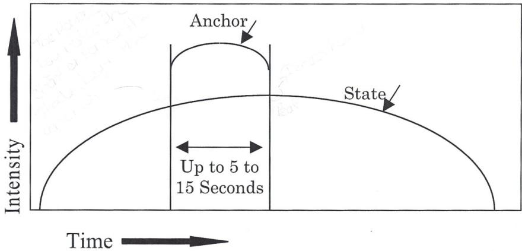


\rightline{\small 47}

# ΣΕΝΑΡΙΟ ΕΠΑΓΩΓΗΣ ΚΑΤΑΣΤΑΣΗΣ (STATE ELICITATION)

Οι καλύτερες καταστάσεις προς αγκύρωση είναι οι φυσικά εμφανιζόμενες καταστάσεις. Οι επόμενες καλύτερες είναι παρελθούσες, ζωντανές, έντονα συσχετισμένες καταστάσεις. Οι λιγότερο προτιμητέες είναι οι κατασκευασμένες καταστάσεις.

Μπορείς να θυμηθείς μια στιγμή που ήσουν εντελώς ______ Χ______;

Μπορείς να θυμηθείς μια συγκεκριμένη στιγμή;

Καθώς γυρίζεις πίσω σε εκείνη τη στιγμή τώρα ... πήγαινε ακριβώς πίσω σε εκείνη τη στιγμή, βούτα μέσα στο σώμα σου και δες αυτά που είδες, άκου αυτά που άκουσες, και αισθάνσου πραγματικά τα συναισθήματα του να είσαι εντελώς ______ Χ______.

# ΚΑΤΑΣΤΑΣΕΙΣ ΓΙΑ ΣΤΟΙΒΑΓΜΑ ΑΓΚΥΡΩΣΕΩΝ

Για να στοιβάξεις αγκυρώσεις, προκάλεσε αρκετές περιπτώσεις καταστάσεων και αγκύρωσέ τες στο ίδιο σημείο. Η κατάσταση που επιλέγεται για μια συγκεκριμένη στοιβαγμένη αγκύρωση μπορεί να είναι η ίδια ή διαφορετική. (Σε μια Αγκύρωση Πόρου και σε Κατάρρευση Αγκυρώσεων, οι καταστάσεις που στοιβάζονται θα πρέπει να είναι διαφορετικές. Στην Αλυσιδωτή Αγκύρωση οι καταστάσεις που χρησιμοποιούνται για κάθε στοιβαγμένη αγκύρωση θα πρέπει να είναι ίδιες.)

- Μια στιγμή που ένιωσες εντελώς δυνατός.
- Μια στιγμή που ένιωσες εντελώς αγαπημένος.
- Μια στιγμή που ένιωσες πραγματικά ότι μπορούσες να έχεις ό,τι ήθελες, μια στιγμή που μπορούσες να τα έχεις όλα.
- Μια στιγμή που ένιωσες πραγματικά γεμάτος ενέργεια, που είχες έναν τόνο ενέργειας.
- Μια στιγμή που λύθηκες στα γέλια.
- Μια στιγμή που ένιωσες εντελώς αυτοπεποίθηση.


\rightline{\small 48}

# ΚΑΤΑΡΡΕΥΣΗ ΑΓΚΥΡΩΝ (COLLAPSE ANCHORS)

1. Δημιούργησε rapport με τον πελάτη.

2. Πες στον πελάτη τι πρόκειται να κάνεις: «Σε λίγο πρόκειται να κάνω μια διαδικασία που λέγεται «Κατάρρευση Αγκυρών» (εξήγησε), και αυτή θα απαιτήσει να σε αγγίξω. Είναι εντάξει;»

3. Αποφάσισε ποιες Θετικές/Καταστάσεις Πόρων χρειάζονται και αποφάσισε ποια είναι η Αρνητική Κατάσταση που πρόκειται να καταρρεύσει. Κάνε σαφές ποιες καταστάσεις συγκεκριμένα εμπλέκονται.

4. Καθώς προκαλείς τις Θετικές Καταστάσεις, μπες σε καθεμία πριν την προκαλέσεις στον πελάτη.

5. Βεβαιώσου ότι ο πελάτης βρίσκεται σε μια πλήρως συσχετισμένη, έντονη, συνεπή κατάσταση για κάθε μία από τις καταστάσεις που αγκυρώνεις

6. Αγκύρωσε όλες τις θετικές καταστάσεις στο ίδιο σημείο, Π.Χ. μια άρθρωση των δαχτύλων ή άλλο εύκολα αναγνωρίσιμο σημείο.

7. Αγκύρωσε την αρνητική κατάσταση μία φορά.

8. Ενεργοποίησε τις αγκυρώσεις ταυτόχρονα μέχρι να κορυφωθούν και η ολοκλήρωση να ολοκληρωθεί. (Παρακολούθησε τον πελάτη, συνήθως θα παρουσιάσει σημάδια ασυμμετρίας μέχρι να ολοκληρωθεί η ολοκλήρωση.)

9. Ελευθέρωσε την αρνητική αγκύρωση

10. Κράτα τη θετική αγκύρωση για 5 δευτερόλεπτα και μετά ελευθέρωσε

11. Έλεγξε: «Πώς νιώθεις τώρα γι' αυτή την παλιά κατάσταση;»

12. Μελλοντικός Βηματισμός (Future Pace): «Μπορείς να φανταστείς μια στιγμή στο μέλλον που μπορεί να βρεθείς σε παρόμοια κατάσταση και τι συμβαίνει;»


\rightline{\small 49}

# ΑΛΥΣΙΔΩΤΗ ΑΓΚΥΡΩΣΗ (CHAINING ANCHORS)

Η Αλυσιδωτή Αγκύρωση (Chaining) είναι μια τεχνική που χρησιμοποιείται όταν η επιθυμητή κατάσταση/κατάσταση πόρων είναι σημαντικά διαφορετική από την παρούσα κατάσταση και η παρούσα κατάσταση είναι μια κολλημένη κατάσταση.

1. Δημιούργησε rapport.
2. Πες στον πελάτη τι πρόκειται να κάνεις: «Σε λίγο πρόκειται να κάνω μια διαδικασία που λέγεται «Αλυσιδωτή Αγκύρωση» (εξήγησε), και αυτή θα απαιτήσει να σε αγγίξω. Είναι εντάξει;»
3. Προσδιόρισε την ανεπιθύμητη παρούσα κατάσταση (Π.Χ.: Αναβλητικότητα), και αποφάσισε για τη θετική/κατάσταση πόρων ως τελική κατάσταση (Π.Χ.: Κίνητρο).
4. Σχεδίασε την αλυσίδα: Αποφάσισε ποιες ενδιάμεσες καταστάσεις χρειάζονται για να οδηγήσουν στην τελική κατάσταση. (Π.Χ.: «Είσαι αναβλητικός, τι σε βγάζει από αυτή την κατάσταση;»)

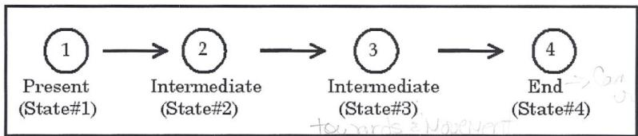

5. Μπες σε κάθε κατάσταση καθώς προκαλείς και αγκυρώνεις κάθε κατάσταση χωριστά, ξεκινώντας από την παρούσα κατάσταση μέχρι την τελική κατάσταση. (Θα πρέπει να στοιβάξεις όλες τις καταστάσεις για να επιτύχεις υψηλή ένταση.) Βεβαιώσου ότι το υποκείμενο βγαίνει από την προηγούμενη κατάσταση πριν αγκυρώσεις την επόμενη. (Διακοπή Κατάστασης μεταξύ καταστάσεων, ειδικά μεταξύ της τελευταίας και της πρώτης.)
6. Έλεγξε κάθε κατάσταση. Βεβαιώσου ότι ο πελάτης μπαίνει σε καθεμία.
7. Σύνδεσε όλες τις καταστάσεις μαζί ενεργοποιώντας την #1 και όταν η #1 κορυφωθεί, πρόσθεσε την #2, και μετά ελευθέρωσε την #1. Όταν η #2 φτάσει στην κορύφωση, πρόσθεσε την #3, μετά ελευθέρωσε την #2. Πρόσθεσε την #4, κ.λπ. με τον ίδιο τρόπο. (Αυτό ΔΕΝ είναι κατάρρευση επειδή οι δύο καταστάσεις δεν κορυφώνονται την ίδια στιγμή.)
8. Έλεγξε: Ενεργοποίησε την αγκύρωση της παρούσας κατάστασης. Ο πελάτης θα πρέπει να καταλήξει στην τελική κατάσταση.
9. Ρώτα τον πελάτη: «Τώρα πώς νιώθεις για ______.» Π.Χ.: Πώς νιώθεις για την αναβλητικότητα.
10. Μελλοντικός Βηματισμός: «Μπορείς να σκεφτείς μια στιγμή στο μέλλον που, αν είχε συμβεί στο παρελθόν, θα είχες ______ (Π.Χ.: Αναβάλει) και πες μου τι συμβαίνει αντί γι' αυτό;»


\rightline{\small 50}

# ΑΣΚΗΣΗ ΕΥΕΛΙΞΙΑΣ NEW ORLEANS

Αυτή η τεχνική σπάνια χρησιμοποιείται, και η τεχνική περιλαμβάνεται για ιστορικούς λόγους. Η διαδικασία έχει αντικατασταθεί από τις τεχνικές Θεραπείας Γραμμής Χρόνου (Time Line Therapy™).

Αυτή είναι μια άσκηση 3 ατόμων:

1. Ο Πελάτης προσδιορίζει ένα εξωτερικό ερέθισμα (ένα άτομο, τόπο, πράγμα ή μια συγκεκριμένη σύνταξη εξωτερικών και εσωτερικών διαδικασιών που εμπλέκει οποιαδήποτε ή όλα αυτά) που σταθερά πυροδοτεί μια κατάσταση χωρίς πόρους στον πελάτη.

2. Ο Practitioner αγκυρώνει τον πελάτη σε αρκετές καταστάσεις πόρων, αποκτώντας πρόσβαση στους κατάλληλους πόρους για να χειριστεί επιτυχώς την κατάσταση που προσδιορίστηκε στο Βήμα #1. Χρησιμοποιώντας την ίδια αγκύρωση για κάθε μία από αυτές τις καταστάσεις πόρων, ο Practitioner δημιουργεί για τον Πελάτη μια ισχυρή «στοιβαγμένη αγκύρωση». Ο Practitioner ελέγχει την αγκύρωση.

3. Ο Πελάτης παρέχει μια λεπτομερή περιγραφή του σεναρίου που προσδιορίστηκε στο Βήμα #1 και καθοδηγεί τον Παρατηρητή στις συγκεκριμένες συμπεριφορές που είναι απαραίτητες για να υποδυθεί ρόλο ώστε να αναπαράγει εντελώς και με ακρίβεια το εξωτερικό ερέθισμα. (Αυτό σημαίνει, χρησιμοποιώντας λεκτικά και μη λεκτικά γλωσσικά μοτίβα για να αναδημιουργήσει το εξωτερικό ερέθισμα, και μπορεί να περιλαμβάνει την αναδημιουργία καταστάσεων χωρίς ανθρώπινη αλληλεπίδραση.)

4. Ο Practitioner ενεργοποιεί τη στοιβαγμένη αγκύρωση πόρων του Πελάτη καθώς ο Παρατηρητής αρχίζει να υποδύεται το εξωτερικό ερέθισμα. Καθώς ο Παρατηρητής συνεχίζει να υποδύεται, ο Practitioner κατά διαστήματα ελευθερώνει την αγκύρωση του Πελάτη, βαθμονομώντας τον Πελάτη. Αν ο Πελάτης αρχίσει να επιστρέφει σε κατάσταση χωρίς πόρους, ο Practitioner ενεργοποιεί ξανά την αγκύρωση.

Συνέχισε μέχρι να μην υπάρχει πλέον ανάγκη ο Practitioner να αγκυρώνει εξωτερικά τον Πελάτη. Δηλ.: Ο Πελάτης παραμένει εντελώς με πόρους.

Αυτό που έχει συμβεί τώρα είναι ότι το εξωτερικό ερέθισμα που προηγουμένως πυροδοτούσε μια απόκριση χωρίς πόρους στον Πελάτη τώρα πυροδοτεί μια απόκριση με πόρους (σχετική με τους πόρους που παρασχέθηκαν από τη στοιβαγμένη αγκύρωση στο Βήμα #2).


\rightline{\small 51}

# ΑΛΛΑΓΗ ΠΡΟΣΩΠΙΚΗΣ ΙΣΤΟΡΙΑΣ NLP

Η Αλλαγή Προσωπικής Ιστορίας έχει σκοπό την αλλαγή μιας σειράς αναμνήσεων στο παρελθόν και την προσθήκη πόρων. Έχει αντικατασταθεί από τις τεχνικές Θεραπείας Γραμμής Χρόνου (Time Line Therapy™).

## Διαδικασία:

1. Σχεδίασε και εγκατέστησε μια θετική αγκύρωση πόρων.
2. Προσδιόρισε με τον πελάτη μια επίμονη επαναλαμβανόμενη ανεπιθύμητη κατάσταση και αγκύρωσε την κατάσταση.
3. Ενεργοποίησε την αγκύρωση της ανεπιθύμητης κατάστασης ενώ προσδιορίζεις και μετά αγκυρώνεις ένα γεγονός στο παρελθόν του πελάτη όπου ο πελάτης βίωσε την κατάσταση.
4. Επανάλαβέ το, αγκυρώνοντας τουλάχιστον δύο ακόμη γεγονότα. (Αγκύρωσε όσα είναι απαραίτητα.)
5. Βεβαιώσου ότι η κατάσταση που συσχετίζεται με τη θετική αγκύρωση πόρων είναι μεγαλύτερη από την αρνητική κατάσταση.
6. Ενεργοποίησε την αγκύρωση του πρώτου γεγονότος ενώ κρατάς την αγκύρωση πόρων και κάνε τον πελάτη να ξαναζήσει το γεγονός με τους νέους πόρους.
7. Επανάλαβέ το για κάθε γεγονός που αγκυρώθηκε.
8. Έλεγξε.
9. Μελλοντικός Βηματισμός.


\rightline{\small 52}

# ΦΥΣΙΟΛΟΓΙΑ ΤΗΣ ΑΡΙΣΤΕΙΑΣ

Επιθυμητό αποτέλεσμα: Να μπορείς να ανακαλύπτεις, να εκμαιεύεις τα μοτίβα του και να αξιοποιείς την άριστη συμπεριφορά στον εαυτό σου και στους άλλους

## Θεωρία:

Η βάση του NLP είναι η Διαδικασία της Μοντελοποίησης (Modeling), η οποία έχει τρία στοιχεία

1. Συστήματα Πεποιθήσεων & Αξιών
2. Φυσιολογία
3. Στρατηγικές

Η θεωρία είναι ότι, «Οτιδήποτε μπορείς να κάνεις, μπορώ να το προκαλέσω και να το κάνω κι εγώ.» Μέσω της διαδικασίας της Μοντελοποίησης, μπορείς να βρεις και να μοντελοποιήσεις την άριστη συμπεριφορά και να την εγκαταστήσεις σε κάποιον άλλο.

Στους επιτυχημένους ανθρώπους συχνά παρατηρούμε ότι είναι γενικά σε έλεγχο της κατάστασής τους ανεξάρτητα από τις εξωτερικές συνθήκες, και ότι έχουν έναν εξαιρετικό τρόπο να παραμένουν σε μια θετική και ανεβασμένη κατάσταση

## Ο ΔΑΚΤΥΛΙΟΣ ΤΗΣ ΔΥΝΑΜΗΣ (RING OF POWER)

## Διαδικασία:

Μια αγκύρωση πόρων μπορεί να είναι οτιδήποτε αποτελεί αγκύρωση και σε βοηθά να ανακαλέσεις την κατάσταση. Ο Δακτύλιος της Δύναμης είναι μια αγκύρωση πόρων που είναι χρήσιμη σε πολλές περιστάσεις ως αγκύρωση πόρων.

1. Αγκύρωσε έναν αριθμό θετικών ισχυρών καταστάσεων σε έναν φανταστικό κύκλο στο πάτωμα: «Φαντάσου έναν Δακτύλιο Δύναμης μπροστά σου ως έναν κύκλο διαμέτρου περίπου 2 ποδιών.»
2. Τώρα θυμήσου μια στιγμή που είχες πλήρη κίνητρο και όταν είσαι εντελώς γεμάτος κίνητρο, τότε μπες μέσα στον Δακτύλιο.
3. Όταν η κατάσταση αρχίζει να υποχωρεί, τότε βγες έξω από τον δακτύλιο.
4. Πρόσθεσε επιπλέον επιθυμητές καταστάσεις με τον ίδιο τρόπο. (Για άλλες καταστάσεις, βλ. Σελίδα 47.)
5. Όταν τελειώσεις την προσθήκη όλων των καταστάσεων, μπες μέσα στον Δακτύλιο της Δύναμης και έλεγξέ τον.


\rightline{\small 53}

# ΣΤΡΑΤΗΓΙΚΕΣ (STRATEGIES)
## ΘΕΩΡΙΑ

### Ορισμός:
Μια συγκεκριμένη σύνταξη εξωτερικής και εσωτερικής εμπειρίας που σταθερά παράγει ένα συγκεκριμένο αποτέλεσμα. Η ανθρώπινη εμπειρία είναι μια ατελείωτη σειρά αναπαραστάσεων. Για να αντιμετωπίσουμε αυτή την ατελείωτη ακολουθία είναι χρήσιμο να αναστείλουμε τη διαδικασία και να την τοποθετήσουμε στο πλαίσιο των επιθυμητών αποτελεσμάτων.

### Τα Συστατικά:
- Ανακάλυψη: Το πρώτο βήμα είναι να ανακαλύψεις τη στρατηγική του ατόμου μέσω της διαδικασίας της επαγωγής.
- Αξιοποίηση: Το επόμενο βήμα είναι να αξιοποιήσεις τη στρατηγική, τροφοδοτώντας ανάποδα στο άτομο πληροφορίες με τη σειρά και την ακολουθία με την οποία προκλήθηκαν.
- Αλλαγή & Σχεδιασμός: Το επόμενο βήμα είναι να μπορέσεις να αλλάξεις τη στρατηγική –να κάνεις αλλαγές σε αυτή ώστε να παράγει το επιθυμητό αποτέλεσμα. Αυτό το συστατικό περιλαμβάνει τον σχεδιασμό στρατηγικών.
- Εγκατάσταση: Στη συνέχεια μπορεί να θέλουμε να εγκαταστήσουμε μια νέα στρατηγική αν χρειάζεται.

### ΤΥΠΟΙ ΣΤΡΑΤΗΓΙΚΩΝ

**Όλα όσα Κάνουμε:** Οι στρατηγικές εμπλέκουν όλα όσα κάνουμε. Όλη η καθημερινή μας δραστηριότητα παράγεται & διατηρείται από στρατηγικές. Το αν θα ολοκληρώσουμε ή όχι αυτό που κάνουμε διέπεται από μια στρατηγική. Έχουμε στρατηγικές για...

<table><tr><td>Αγάπη</td><td>Απόφαση</td><td>Χαλάρωση</td></tr><tr><td>Μίσος</td><td>Κίνητρο</td><td>Ένταση</td></tr><tr><td>Μάθηση</td><td>Ευτυχία</td><td>Διασκέδαση</td></tr><tr><td>Λήθη</td><td>Σεξ</td><td>Πλήξη</td></tr><tr><td>Γονεϊκότητα</td><td>Φαγητό</td><td>Marketing</td></tr><tr><td>Αθλητισμό</td><td>Υγεία</td><td>Πλούτο</td></tr><tr><td>Επικοινωνία</td><td>Ασθένεια</td><td>Κατάθλιψη</td></tr><tr><td>Πωλήσεις</td><td>Δημιουργικότητα</td><td>Φτώχεια</td></tr></table>

... και, πράγματι, οτιδήποτε άλλο κάνουμε.

**Συντομογραφικός Συμβολισμός:**
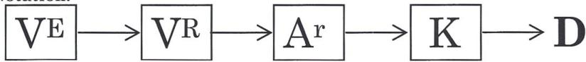


\rightline{\small 54}

# ΣΤΡΑΤΗΓΙΚΕΣ

## Συστατικά:
- Στοιχεία
- Ακολουθία

## Στοιχεία:
- Οπτικό
- Εξωτερικό
- Εσωτερικό
- Κατασκευασμένο
- Ανακαλούμενο
- Ακουστικό
- Εξωτερικό
- Εσωτερικό
- Κατασκευασμένο
- Ανακαλούμενο
- Ακουστικό Ψηφιακό
- Κιναισθητικό
- Εξωτερικό
- Εσωτερικό
- Κατασκευασμένο
- Ανακαλούμενο
- Ιδιοδεκτικό
- Απτικό
- Μετα
- Οσφρητικό
- Εξωτερικό
- Εσωτερικό
- Κατασκευασμένο
- Ανακαλούμενο
- Γευστικό
- Εξωτερικό
- Εσωτερικό
- Κατασκευασμένο
- Ανακαλούμενο


\rightline{\small 55}

# ΜΟΝΤΕΛΟ T.O.T.E. ΤΩΝ ΣΤΡΑΤΗΓΙΚΩΝ

Διατυπώθηκε για πρώτη φορά στο *Plans and the Structure of Behavior* που δημοσιεύτηκε το 1960 από τους George Miller, Eugene Galanter και Karl H Pribram. Το T.O.T.E. σημαίνει **Test** (Δοκιμή), **Operate** (Λειτουργία), **Test** (Δοκιμή), **Exit** (Έξοδος), μια ακολουθία βασισμένη στη μοντελοποίηση υπολογιστών.

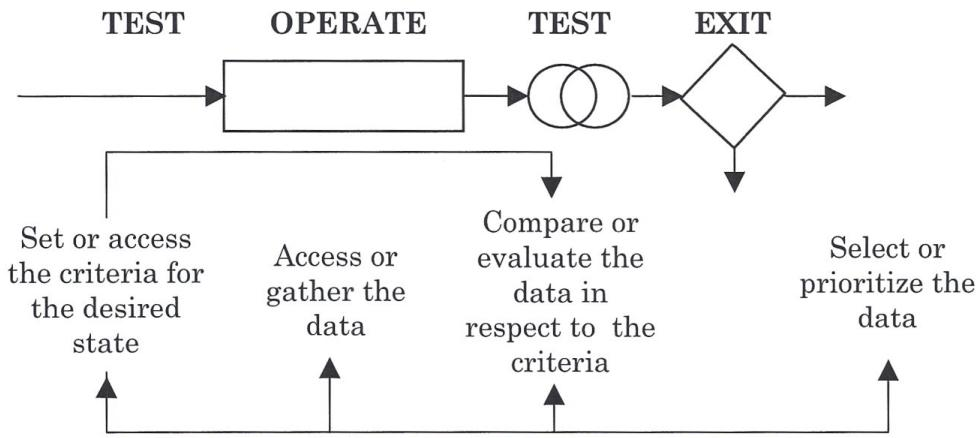

1. Η πρώτη **Δοκιμή (Test)** είναι ένα σήμα ή **έναυσμα (trigger)** που ξεκινά τη στρατηγική. Καθιερώνει τα κριτήρια «τροφοδοτούμενα προς τα εμπρός» που χρησιμοποιούνται ως πρότυπο για τη δεύτερη δοκιμή.

2. Η **Λειτουργία (Operation)** έχει πρόσβαση σε δεδομένα μέσω της ανάμνησης, της δημιουργίας ή της συλλογής των πληροφοριών που απαιτούνται από τη στρατηγική από τον εσωτερικό ή εξωτερικό κόσμο.

3. Η δεύτερη **Δοκιμή (Test)** είναι μια σύγκριση κάποιας πτυχής των δεδομένων που αποκτήθηκαν με τα κριτήρια που καθορίστηκαν από την πρώτη δοκιμή. Τα δύο πράγματα που συγκρίνονται πρέπει να αναπαρίστανται στο ίδιο αναπαραστατικό σύστημα.

4. Η **Έξοδος (Exit)**, ή Σημείο Απόφασης, ή Σημείο Επιλογής είναι μια αναπαράσταση των αποτελεσμάτων της δοκιμής. Αν υπάρχει αντιστοιχία, η στρατηγική εξέρχεται. Αν υπάρχει αναντιστοιχία, η στρατηγική ανακυκλώνεται.

5. Η στρατηγική μπορεί να ανακυκλωθεί:
- Αλλάζοντας το επιθυμητό αποτέλεσμα ή ανακατευθύνοντας τη στρατηγική.
- Ρυθμίζοντας τα κριτήρια, κάνοντας πλευρική κάθοδο ή αναπροσανατολισμό.
- Βελτιώνοντας ή περαιτέρω εξειδικεύοντας το επιθυμητό αποτέλεσμα.
- Έχοντας πρόσβαση σε περισσότερα δεδομένα.


\rightline{\small 56}

# ΣΤΡΑΤΗΓΙΚΕΣ

## ΣΥΝΘΗΚΕΣ ΔΟΜΙΚΗΣ ΚΑΛΗΣ ΔΙΑΜΟΡΦΩΣΗΣ

- Έχει μια καλά καθορισμένη αναπαράσταση του επιθυμητού αποτελέσματος.
- Χρησιμοποιεί και τα τρία (3) Κύρια αναπαραστατικά συστήματα.
- Τουλάχιστον τρία σημεία σε κάθε βρόχο.
- Κάθε βρόχος περιλαμβάνει ένα σημείο εξόδου.
- Πηγαίνει εξωτερικά μετά από «N» βήματα ή «X» χρόνο.
- Χρησιμοποιεί τον λιγότερο αριθμό βημάτων για να επιτύχει το επιθυμητό αποτέλεσμα.
- Λογική ακολουθία χωρίς λείπει βήματα.
- Έχει τις εσωτερικές & εξωτερικές αισθητηριακές μορφές για να επιτύχει το επιθυμητό αποτέλεσμα.
- Διατηρεί τα θετικά παραπροϊόντα και εξαλείφει τις αρνητικές συνέπειες.
- Ακολουθεί το μοντέλο T.O.T.E.
- Ελαχιστοποιεί τα κακά συναισθήματα.

## ΣΥΝΘΗΚΕΣ ΛΕΙΤΟΥΡΓΙΚΗΣ ΚΑΛΗΣ ΔΙΑΜΟΡΦΩΣΗΣ

- Έναυσμα που ξεκινά τη διαδικασία και φέρει μαζί του τα τελικά κριτήρια.
- Λειτουργίες για την τροποποίηση της παρούσας κατάστασης ώστε να τη φέρουν πιο κοντά στην επιθυμητή κατάσταση.
- Δοκιμή που συγκρίνει την παρούσα κατάσταση με την επιθυμητή κατάσταση βάσει προ-ταξινομημένων ή προσωρινών κριτηρίων.
- Σημείο απόφασης που καθορίζει το επόμενο βήμα βάσει της συνέπειας ή της έλλειψης συνέπειας της σύγκρισης δοκιμής.

Η γνώση των συνθηκών λειτουργικής καλής διαμόρφωσης σου επιτρέπει να κάνεις πολύ συγκεκριμένες και κατευθυνόμενες ερωτήσεις. Η γνώση των λειτουργικών ιδιοτήτων των στρατηγικών επιτρέπει σε κάποιον να αναγνωρίσει πότε λαμβάνει απάντηση σε διαφορετική ερώτηση από αυτή που έγινε.

## ΕΡΩΤΗΣΕΙΣ ΓΙΑ ΤΗΝ ΕΠΑΓΩΓΗ ΣΤΡΑΤΗΓΙΚΩΝ

**Δοκιμή (Test):** Τι σε άφησε να ξέρεις ότι ήταν ώρα να αποφασίσεις;
Πότε άρχισες να αποφασίζεις;
Πώς ήξερες ότι ήταν ώρα να αποφασίσεις;

**Λειτουργία (Operate):** Πώς ήξερες ότι υπήρχαν εναλλακτικές;
Πώς δημιουργείς εναλλακτικές;

**Δοκιμή (Test):** Πώς αξιολογείς τις εναλλακτικές;
Τι πρέπει να ικανοποιηθεί για να αποφασίσεις;

**Έξοδος (Exit):** Πώς επιλέγεις ποια εναλλακτική να ακολουθήσεις;
Πώς ξέρεις (ή τι σε αφήνει να ξέρεις) ότι έχεις αποφασίσει;


\rightline{\small 57}

# ΣΤΡΑΤΗΓΙΚΕΣ

## ΕΓΚΑΤΑΣΤΑΣΗ Ή ΑΛΛΑΓΗ ΣΤΡΑΤΗΓΙΚΩΝ

- Πρόβα
- Επαναπλαισίωση (Reframing)
- Μεταφορά
- Αγκύρωση
- Πρόβα αποσυσχετισμένης κατάστασης

## ΑΡΧΕΣ ΣΧΕΔΙΑΣΜΟΥ

### ΣΧΕΔΙΑΣΜΟΣ

- Διατήρησε τη λειτουργία.
- Παρενέβαινε πριν η στρατηγική ξεφύγει από έλεγχο.
- Βαθμονόμησε.
- Επαναπλαισίωσε ή χρησιμοποίησε Υπομορφοτροπίες σε δυσάρεστα συναισθήματα ή φωνές.
- Διέγραψε περιττά βήματα.
- Βεβαιώσου ότι τα κριτήρια προσπελάζονται διαδοχικά και όχι ταυτόχρονα.
- Κάνε τη λιγότερη δυνατή αλλαγή για να επιτύχεις τα αποτελέσματα που θέλεις.

### ΕΠΑΝΑΣΧΕΔΙΑΣΜΟΣ

- Φτιάξε αυτό που νομίζεις ότι θα μπορούσε να λειτουργήσει.
- Έλεγξε τη δική σου στρατηγική για εφαρμοσιμότητα.
- Μοντελοποίησε κάποιον άλλο που έχει μια καλή στρατηγική.


\rightline{\small 58}

# ΣΥΣΤΗΜΑΤΑ ΑΝΑΠΑΡΑΣΤΑΣΗΣ
## ΧΑΡΑΚΤΗΡΙΣΤΙΚΑ

1. Κάθε σύστημα αναπαράστασης μπορεί να αναπαραστήσει καλύτερα την πτυχή του κόσμου στην οποία ανταποκρίνεται άμεσα. Πολλοί άνθρωποι αντιμετωπίζουν προβλήματα επειδή αναπαριστούν την εμπειρία με το λάθος σύστημα αναπαράστασης.

2. Οι ψηφιακές περιγραφές είναι πάντα δευτερογενής εμπειρία και έτσι περιέχουν λιγότερες πληροφορίες από την πρωτογενή εμπειρία που περιγράφουν.

3. Το ακουστικό ψηφιακό είναι πολύτιμο ως σύστημα αρχειοθέτησης:
- Για την παρακολούθηση της εμπειρίας.
- Για την κατηγοριοποίηση της εμπειρίας.
- Για τον σχεδιασμό και τον καθορισμό κατεύθυνσης.
- Για συνόψεις.
- Για να γίνεται τρέχων σχολιασμός των ακατέργαστων δεδομένων.
- Για την εξαγωγή συμπερασμάτων.
- Για να βγάζουμε νόημα από τα πράγματα.

4. Το ακουστικό τονικό μπορεί να προσθέσει έμφαση και να βοηθήσει στον εμπλουτισμό των ακατέργαστων δεδομένων.

5. Το οπτικό μπορεί να αναπαραστήσει τεράστιο όγκο δεδομένων ταυτόχρονα και ακαριαία.

6. Η ακουστική επεξεργασία είναι διαδοχική και διαρκεί περισσότερο από την οπτική επεξεργασία, η οποία είναι ταυτόχρονη.

7. Το κιναισθητικό σύστημα έχει μεγαλύτερη αδράνεια και διάρκεια από τα οπτικά και ακουστικά συστήματα.

8. Όταν λαμβάνουμε αποφάσεις είναι δύσκολο να αναπαραστήσουμε πλήρως τις δυνατότητες χρησιμοποιώντας μόνο ήχους, λέξεις ή συναισθήματα. Το οπτικό σύστημα είναι χρήσιμο, διότι επιτρέπει σε κάποιον να απεικονίσει ταυτόχρονα διαφορετικές επιλογές και να κάνει συγκρίσεις μεταξύ τους.

9. Οι κιναισθητικές απτικές και ιδιοδεκτικές αισθήσεις βοηθούν στην παροχή ακατέργαστων δεδομένων.

10. Το κιναισθητικό Μετα είναι ο κύριος τρόπος με τον οποίο οι άνθρωποι αξιολογούν την εμπειρία.

11. Τα σύμφωνα συναισθήματα (Congruent feelings) είναι αντιληπτικά συναισθήματα γεγονότων, που περιλαμβάνουν άμεσες απτικές και ιδιοδεκτικές αισθήσεις. Είναι αμιγώς αντιληπτικές ή αισθητηριακές εμπειρίες χωρίς αξιολογήσεις.

12. Τα Μετα-συναισθήματα είναι αξιολογικά συναισθήματα για γεγονότα ως απάντηση σε κριτήρια, και συνήθως έχουν θετική ή αρνητική αξία. Είναι αυτό που συνήθως αποκαλούμε συγκινήσεις ή συναισθηματικές καταστάσεις. Τα Μετα-συναισθήματα μπορεί να δημιουργηθούν μέσω παρελθούσας αγκύρωσης (Anchoring) εμπειριών και/ή πεποιθήσεων.


\rightline{\small 59}

# ΣΤΡΑΤΗΓΙΚΕΣ ΠΑΡΑΚΙΝΗΣΗΣ

Οι άνθρωποι είτε κινούνται προς είτε μακριά. Όσοι κινούνται προς πολύ έντονα μπορεί να μη βρουν ποτέ τον χρόνο να κάνουν δυσάρεστα πράγματα που είναι αναγκαία. Όσοι κινούνται μακριά μπορεί να μην κινηθούν ποτέ έως ότου τα πράγματα γίνουν αρκετά άσχημα. Το κλειδί για την παρακίνηση είναι να μπορεί κανείς εύκολα και χωρίς κόπο να κάνει πράγματα που είναι δυσάρεστα. Οι περισσότεροι άνθρωποι δεν χρειάζονται βοήθεια για να κάνουν πράγματα που είναι ευχάριστα.

## ΤΥΠΙΚΕΣ ΣΤΡΑΤΗΓΙΚΕΣ ΠΑΡΑΚΙΝΗΣΗΣ

- Οπτική κατασκευή (Visual construct) της ολοκληρωμένης εργασίας που οδηγεί σε θετικό K.
- Vc αρνητικής συνέπειας της μη εκτέλεσης της εργασίας που οδηγεί σε αρνητικό K. Οι στρατηγικές παρακίνησης σχετίζονται με τις στρατηγικές αναβλητικότητας. Είναι οι δύο όψεις του ίδιου φαινομένου.

## ΣΤΟΙΧΕΙΑ ΜΙΑΣ ΑΠΟΤΕΛΕΣΜΑΤΙΚΗΣ ΣΤΡΑΤΗΓΙΚΗΣ ΠΑΡΑΚΙΝΗΣΗΣ

1. Η φωνή (αν υπάρχει) έχει καλή τονικότητα.
2. Η φωνή χρησιμοποιεί τροπικούς τελεστές δυνατότητας αντί ανάγκης.
3. Περιλαμβάνει μια αναπαράσταση του τι είναι επιθυμητό σχετικά με την εργασία (η ολοκλήρωση ή οι συνέπειες) αντί για αναπαράσταση της διαδικασίας εκτέλεσης της εργασίας.
4. Η εργασία τεμαχίζεται κατάλληλα.
5. Οι στρατηγικές προς είναι πιο ευχάριστες και προκαλούν λιγότερο άγχος από τις στρατηγικές μακριά.
6. Οι στρατηγικές προς, μακριά και μικτές λειτουργούν· η μικτή είναι η πιο γενική.
7. Αν είναι μικτή, σκεφτείτε πρώτα το αρνητικό και μετά το θετικό.
8. Προσπαθήστε να αντικαταστήσετε τη στρατηγική μακριά με στρατηγική προς. Θέστε το πλαίσιο ότι "αν δεν μάθεις μια νέα στρατηγική θα πρέπει να αισθάνεσαι άσχημα ξανά και ξανά στο μέλλον", το οποίο χρησιμοποιεί την τρέχουσα στρατηγική τους κίνησης μακριά.
9. Η συσχέτιση (association) και η αποσυσχέτιση (dissociation) είναι κρίσιμα στοιχεία.
10. Οι καλές στρατηγικές λειτουργούν σε διάφορα πλαίσια.
11. Πάντοτε ελέγχετε την οικολογία πριν αφαιρέσετε αρνητικά συναισθήματα ή άγχος.
12. Μπορεί να είναι απαραίτητο να προσαρμόσετε τις Υπομορφοτροπίες (SubModalities) της αναπαράστασης της εργασίας που εκτελείται προκειμένου να επιτύχετε μια έντονα παρακινημένη απόκριση.
13. Αν η αναπαράσταση της εργασίας ως ολοκληρωμένης δεν παράγει έντονη παρακίνηση, τότε εστιάστε στις συνέπειες.
14. Οι αναβλητικοί άνθρωποι συχνά είναι καλοί σχεδιαστές.

## Παράδειγμα μιας Καλής Στρατηγικής Παρακίνησης:

Ad με ευχάριστη φωνή «Θα είναι τόσο ωραία όταν τελειώσει.» που οδηγεί σε οπτική κατασκευή της ολοκληρωμένης εργασίας με θετικές συνέπειες που οδηγεί σε θετικό K που οδηγεί στην έναρξη της εργασίας ή σε κατάλληλο μελλοντικό συγχρονισμό (future pacing).


\rightline{\small 60}

# ΣΤΡΑΤΗΓΙΚΕΣ

## ΤΥΠΙΚΑ ΠΡΟΒΛΗΜΑΤΑ ΣΤΙΣ ΣΤΡΑΤΗΓΙΚΕΣ ΠΑΡΑΚΙΝΗΣΗΣ

1. Ξεκινά με Κατάκλυση: Το άτομο ξεκινά με ένα αίσθημα κατάκλυσης και χρειάζεται να τεμαχίσει προς τα κάτω.

2. Το άτομο κινείται μόνο μακριά. Είτε αυτό δεν είναι αρκετό για να το παρακινήσει, είτε το άτομο βιώνει υπερβολικό άγχος και δυσαρέσκεια.

3. Χρησιμοποιεί τροπικούς τελεστές (MOP) Ανάγκης: Το άτομο χρησιμοποιεί τροπικούς τελεστές ανάγκης με σκληρή τονικότητα που έχει ως αποτέλεσμα άσχημα συναισθήματα.

4. Προσοχή: Υπάρχουν κάποια πράγματα από τα οποία πρέπει κανείς να κινηθεί μακριά. Να είστε προσεκτικοί όταν αφαιρείτε εντελώς τις στρατηγικές μακριά. Είναι καλύτερο να σχεδιάσετε μια στρατηγική με αμφότερα τα στοιχεία.

## ΤΥΠΙΚΑ ΠΡΟΒΛΗΜΑΤΑ ΜΕ ΤΙΣ ΣΤΡΑΤΗΓΙΚΕΣ ΑΠΟΦΑΣΗΣ

1. Προβλήματα με τη δημιουργία επιλογών.
α) Καμία οπτική κατασκευή.
β) Όχι αρκετές επιλογές.
- Μόνο μία επιλογή.
- Είτε/Είτε.
γ) Το άτομο συνεχίζει να παράγει επιλογές χωρίς τρόπο εξόδου.

2. Προβλήματα με την αναπαράσταση των επιλογών.
α) Οι επιλογές δεν αναπαρίστανται σε όλα τα συστήματα αναπαράστασης, γεγονός που δυσχεραίνει την αξιολόγησή τους.
β) Το άτομο χρειάζεται να πάει εξωτερικά για να λάβει τα απαραίτητα δεδομένα.
γ) Οι επιλογές και τα κριτήρια δεν αναθεωρούνται σύμφωνα με τις περιστάσεις.

3. Προβλήματα με την αξιολόγηση των επιλογών.
α) Τα κριτήρια για την επιλογή είναι ακατάλληλα.
β) Τα κριτήρια δεν έχουν ιεραρχηθεί.
γ) Τα κριτήρια εξετάζονται διαδοχικά και ξεχωριστά αντί ταυτόχρονα. Η απόκριση πολικότητας είναι ένα παράδειγμα.
δ) Το άτομο δεν λαμβάνει συνολική αξιολόγηση κάθε κριτηρίου.


\rightline{\small 61}

# ΣΤΡΑΤΗΓΙΚΕΣ ΜΑΘΗΣΗΣ

## ΠΡΟΫΠΟΘΕΣΕΙΣ ΚΑΛΗΣ ΔΙΑΜΟΡΦΩΣΗΣ

1. Ξεκινήστε σε μια θετική κατάσταση. Σκεφτείτε μια στιγμή που πετύχατε &amp; νιώσατε καλά αντί να αποτύχετε &amp; να νιώσετε άσχημα. Προσπελάστε &amp; αγκυρώστε κατάλληλους πόρους.
2. Τεμαχίστε κατάλληλα. Τεμαχίστε προς τα κάτω την εργασία για να αποφύγετε την κατάκλυση. Ανακυκλώστε ή πηγαίνετε εξωτερικά μέχρι να μπορείτε να αναπαραστήσετε τα μικρότερα τμήματα, ώστε να τα ταξινομήσετε και να τους δώσετε προτεραιότητα.
3. Λάβετε κατάλληλη ανατροφοδότηση σχετικά με την εργασία που μαθαίνετε.
4. Κάντε κατάλληλες συγκρίσεις που σας δίνουν μια αίσθηση επίτευξης. Μην κάνετε συγκρίσεις με τον ειδικό ή με έναν ιδανικό εαυτό, αλλά με την ικανότητά σας στο παρελθόν.
5. Έξοδος. Αποφύγετε τους κινδύνους να βγείτε πολύ νωρίς ή να μη βγείτε ποτέ. Βγείτε όταν έχετε μάθει αρκετά για τώρα, και όταν έχετε μάθει κάτι αρκετά καλά για το αποτέλεσμά σας. Αποφύγετε την παγίδα του κυνηγιού της σαφήνειας. Όλες οι σημαντικές αποφάσεις λαμβάνονται με βάση ανεπαρκείς πληροφορίες.
6. Περιμένετε να μην κατανοήσετε κάποια πράγματα. Αφήστε τα στην άκρη και επιστρέψτε αργότερα. Μην παγιδευτείτε σε άσχημα συναισθήματα σχετικά με τη μη κατανόηση. Θυμηθείτε ότι η κατανόηση είναι ένα συναίσθημα.
7. Γνωρίστε τα Υπομορφοτροπικά σας ισοδύναμα κατανόησης και χρησιμοποιήστε τα για να λάβετε πληροφορίες στην απαραίτητη μορφή.
8. Μελλοντικός συγχρονισμός της μάθησης στον χρόνο και τον τόπο όπου θα χρειαστεί.

## ΕΡΩΤΗΣΕΙΣ ΕΛΕΓΧΟΥ ΕΞΟΡΥΞΗΣ

### ΠΛΑΙΣΙΟ:
- Σκεφτείτε μια στιγμή που μπορέσατε να μάθετε κάτι εύκολα και γρήγορα.

### ΑΡΧΙΚΟΣ ΕΛΕΓΧΟΣ:
- Πώς γνωρίζετε ότι είναι ώρα να ξεκινήσετε τη μάθηση;

### ΛΕΙΤΟΥΡΓΙΑ:
- Τι κάνετε προκειμένου να μάθετε;

### ΔΕΥΤΕΡΟΣ ΕΛΕΓΧΟΣ:
- Πώς γνωρίζετε εάν έχετε μάθει κάτι;

### ΕΞΟΔΟΣ:
- Τι σας ενημερώνει ότι έχετε μάθει κάτι πλήρως;


\rightline{\small 62}

# ΣΤΡΑΤΗΓΙΚΕΣ ΟΡΘΟΓΡΑΦΙΑΣ

## ΒΗΜΑΤΑ

1. ΑΝΑΚΑΛΥΨΗ: Διαπίστωση του τι στρατηγική χρησιμοποιεί ήδη κάποιος.
2. ΧΡΗΣΗ: Χρήση της στρατηγικής για να βοηθηθεί ο μαθητής στη μάθηση.
3. ΑΛΛΑΓΗ &amp; ΣΧΕΔΙΑΣΜΟΣ: Αυτοματοποίηση της νέας ακολουθίας ώστε να γίνει μέρος της ασυνείδητης διαδικασίας του ατόμου. Η αλλαγή περιλαμβάνει επίσης τη διαδικασία σχεδιασμού: Εκλέπτυνση όσων υπάρχουν για να γίνουν πιο αποτελεσματικά ή σχεδιασμός μιας νέας στρατηγικής από την αρχή.
4. ΕΓΚΑΤΑΣΤΑΣΗ: Εγκατάσταση μιας νέας στρατηγικής εάν είναι απαραίτητο.

## ΕΞΟΡΥΞΗ ΟΡΘΟΓΡΑΦΙΑΣ

1. Ξεκινήστε από την αρχή. «Όταν σας δίνω τη λέξη ... ποιο είναι το πρώτο πράγμα που κάνετε από μέσα σας;»
2. Επιστρέψτε και προχωρήστε. «Λοιπόν, πρώτα ... και μετά τι;» Βεβαιωθείτε ότι σας ακολουθούν συμπεριφορικά σε κάθε βήμα.
3. Βεβαιωθείτε ότι έχετε ένα βήμα(τα) που σχετίζεται με το πώς να γράψει τη λέξη. (Μερικοί κακοί ορθογράφοι δεν έχουν κανένα.) «Πώς γνωρίζετε πώς να γράψετε ...;»
4. «Όταν βλέπετε, ακούτε ή αισθάνεστε αυτό, πώς γνωρίζετε ότι είναι σωστό;»
5. Πάρτε μόνο όση λεπτομέρεια χρειάζεστε.

Οι κακοί ορθογράφοι δημιουργούνται και δεν γεννιούνται. Οι κακοί ορθογράφοι δεν έχουν μαθησιακή δυσκολία. Είχαν δυσκολία διδασκαλίας.

## ΑΚΑΤΑΛΛΗΛΕΣ ΣΤΡΑΤΗΓΙΚΕΣ ΟΡΘΟΓΡΑΦΙΑΣ:

- Αρνητικό K - Ξεκινήστε με ένα άσχημο συναίσθημα
- Φωνητικό - προφέρετέ το - μόνο 50% ακρίβεια
- Οπτική κατασκευή - δημιουργική ορθογραφία - κομμάτι κομμάτι

## ΕΞΑΙΡΕΤΙΚΗ ΣΤΡΑΤΗΓΙΚΗ ΟΡΘΟΓΡΑΦΙΑΣ

- Ζητείται να συλλαβίσετε τη λέξη - μπορεί να την επαναλάβετε εσωτερικά.
- Δείτε τη λέξη - οπτικά ανακαλεσμένη - μπορεί να αποεστιάσετε γρήγορα - ζητήστε να συλλαβίσει ανάποδα - γρήγορα.
- Αίσθημα εξοικείωσης ή όχι - αναζητήστε αλλαγή στην αναπνοή ή τις χειρονομίες.
- Το πόσο καλός ορθογράφος είναι εξαρτάται από το τι διαβάζει.
- Αν δεν υπάρχει αίσθημα εξοικείωσης κάντε μια οπτική κατασκευή μέχρι να αποκτήσετε το συναίσθημα.
- Δευτερεύουσα στρατηγική για λέξεις για τις οποίες δεν υπάρχει μνημονική εικόνα.
- Το τελικό K είναι κίνητρο για συνεχή βελτίωση.


\rightline{\small 63}

# ΣΤΡΑΤΗΓΙΚΕΣ ΟΡΘΟΓΡΑΦΙΑΣ

## ΕΓΚΑΤΑΣΤΑΣΗ

- «Έχετε αντιρρήσεις στο να γίνετε καλός ορθογράφος;»
- Η νέα στρατηγική είναι μόνο για το πλαίσιο της ορθογραφίας.
- Η νέα στρατηγική δεν θα έχει ως αποτέλεσμα να γίνετε αμέσως ειδικός ορθογράφος, αλλά θα έχει ως αποτέλεσμα γρήγορη βελτίωση.
- Ελέγξτε για αντίστροφη συνδεσμολογία.
- «Μπορείτε να σκεφτείτε έναν καλό φίλο;»
- Η απλούστερη μέθοδος είναι η πρόβα.
- Επαναπλαισιώστε (Reframe) μόνο εάν είναι απαραίτητο.
- «Θα σας δώσω μια λέξη. Μόλις το κάνω, κοιτάξτε εδώ πάνω (κρατήστε το χέρι στην οπτική ανάκλησή τους), επιτρέψτε σε μια εικόνα της λέξης να εμφανιστεί, και μόλις εμφανιστεί, κοιτάξτε εδώ κάτω (κρατήστε το χέρι στο K τους) για να αποκτήσετε αίσθημα εξοικείωσης ή όχι.»
- Χρησιμοποιήστε αρχικά απλές λέξεις.
- Ζητήστε τους να συλλαβίσουν λέξεις ανάποδα.

## ΣΥΝΗΘΗ ΠΡΟΒΛΗΜΑΤΑ

1. Οι άνθρωποι προσπαθούν να δημιουργήσουν τη λέξη ενώ κοιτάζουν στην οπτική ανάκληση. «Κοιτάξτε εδώ πάνω και περιμένετε μέχρι να δείτε τη λέξη όπως την έχετε δει πριν. Αφήστε την εικόνα να εμφανιστεί.»
2. Εάν το άτομο μένει με κενό, γράψτε τη λέξη και κρατήστε την στην οπτική ανάκληση. Ζητήστε τους να την κοιτάξουν και έπειτα να κλείσουν τα μάτια και να τη δουν εσωτερικά ως μνημονική εικόνα.
3. Κρατήστε τη λέξη για ένα σύντομο χρονικό διάστημα. Εάν είναι πολύ μεγάλο μερικοί άνθρωποι θα προσπαθήσουν να την περιγράψουν αντί να τη δουν.
4. Ζητήστε τους να οπτικοποιήσουν τη λέξη σε κάτι που μπορούν να θυμηθούν εύκολα.
5. Κάποιος συνεχίζει να επιστρέφει στην παλιά του στρατηγική αντί να χρησιμοποιεί τη νέα. Επαναπλαισιώστε τη επίμονη φωνή. Εάν το πρώτο βήμα είναι ένα αρνητικό K, τότε δημιουργήστε μια αγκύρωση πόρων (ή χρησιμοποιήστε μια πρόβα αποσυσχετισμένης κατάστασης εάν είναι απαραίτητο).


\rightline{\small 64}

# ΣΗΜΕΙΟΓΡΑΦΙΑ NLP

## Συστήματα Αναπαράστασης

V = Οπτικό (Εικόνες)
A = Ακουστικό (Ήχοι)
K = Κιναισθητικό (Συναισθήματα)
O = Οσφρητικό (Οσμές)
G = Γευστικό (Γεύσεις)

## Εκθέτες

r = ανακαλεσμένο
c = κατασκευασμένο

## Δείκτες

t = τονικό
d = ψηφιακό

i = εσωτερικό
e = εξωτερικό

## Παραδείγματα:

Aᵉ = Ακουστικό Εξωτερικό
Aᵗ = Ακουστικό Εσωτερικό
Aᵣ = Ακουστικό Ανακαλεσμένο
Aᶜ = Ακουστικό Κατασκευασμένο
Aʳₜ = Ακουστικό Ανακαλεσμένο Τονικό
Aᵗʤ = Ακουστικός Εσωτερικός Διάλογος
Vᵛ = Οπτικό Κατασκευασμένο
Kʳ = Ανακαλεσμένα Συναισθήματα
Vᵗ = Οπτικό Εσωτερικό
Kᵉ = Απτικά Συναισθήματα/Αισθήσεις
Vᵣ = Οπτικό Ανακαλεσμένο

## Συντακτικά Σύμβολα:

→ = Οδηγεί σε

✔ = Σύγκριση
✗ = Συναισθησία
→ m → Μετα-Απόκριση
→ p → Απόκριση Πολικότητας
✘ = Ταυτόχρονα αλλά χωρίς παρεμβολή

## Παραδείγματα:

Ακολουθία: Aᵣ → Vᵛ → Kᵗ
Έλεγχος: Vᵉ / Vᵣ
Ταυτόχρονη Εικόνα + Συναίσθημα: Vᵛ ✗ K

Λέει κάτι &amp; νιώθει κάτι άλλο: Aᵗ → p → Kᵗ

Μιλώντας για μια εικόνα: Vᵗ → m → Aᵗʤ

## Εισαγωγή Ακουστικού &amp; Οπτικού Ταυτόχρονα

Aᵉ
Vᵉ


\rightline{\small 65}

# ΕΞΟΡΥΞΗ ΣΤΡΑΤΗΓΙΚΗΣ

## ΣΤΡΑΤΗΓΙΚΕΣ ΑΓΟΡΑΣ

1. Παρακίνηση
2. Απόφαση (αγοράς)
- Στρατηγική Πειστή (Convincer Strategy) (Δείτε Convincer Meta Program)
3. Διαβεβαίωση

## ΣΤΡΑΤΗΓΙΚΕΣ ΑΓΑΠΗΣ

1. Έλξη
2. Αναγνώριση Έλξης
3. Βαθιά Αγάπη

## ΚΕΙΜΕΝΟ ΓΙΑ ΕΠΙΣΗΜΗ ΕΞΟΡΥΞΗ ΣΤΡΑΤΗΓΙΚΗΣ

Μπορείτε να ανακαλέσετε μια στιγμή που ήσασταν εντελώς X;

Μπορείτε να ανακαλέσετε μια συγκεκριμένη στιγμή;

Καθώς επιστρέφετε σε εκείνη τη στιγμή τώρα ...

Ποιο ήταν το πρώτο πράγμα που σας έκανε να είστε εντελώς X;

Ήταν κάτι που είδατε (ή ο τρόπος που σας κοίταξε κάποιος;),

Ήταν κάτι που ακούσατε (ή ο τόνος της φωνής κάποιου;), ή

Ήταν το άγγιγμα κάποιου ή κάτι;

Ποιο ήταν το πρώτο πράγμα που σας έκανε να είστε εντελώς X;

Αφού (είδατε, ακούσατε, νιώσατε) αυτό, ποιο ήταν το αμέσως επόμενο πράγμα που συνέβη καθώς ήσασταν εντελώς X;

→ Φαντασιωθήκατε κάτι στο μυαλό σας;

Είπατε κάτι στον εαυτό σας, ή

Είχατε μια συγκεκριμένη αίσθηση ή συγκίνηση;

Ποιο ήταν το επόμενο πράγμα που συνέβη καθώς ήσασταν εντελώς X.

Αφού (απαριθμήστε προηγούμενα), ξέρατε ότι ήσασταν εντελώς X, ή...

(Συνεχίστε μέχρι να ολοκληρωθεί.)


\rightline{\small 66}

# ΕΞΟΡΥΞΗ ΣΤΡΑΤΗΓΙΚΗΣ

ΒΑΘΙΑ ΑΓΑΠΗ

## ΣΤΡΑΤΗΓΙΚΗ ΒΑΘΙΑΣ ΑΓΑΠΗΣ

1. Πώς γνωρίζετε ότι σας αγαπά κάποιος άλλος;
2. Μπορείτε να θυμηθείτε μια στιγμή που σας αγαπούσαν εντελώς;

Μια συγκεκριμένη στιγμή;

3. Για να γνωρίζετε ότι σας αγαπούν εντελώς, είναι απαραίτητο για εσάς:

α. Να σας πηγαίνουν σε μέρη και να σας αγοράζουν πράγματα ή να σας κοιτάζουν με αυτό το ιδιαίτερο βλέμμα;
β. Ή να ακούτε αυτόν τον ιδιαίτερο τόνο φωνής ή αυτές τις ιδιαίτερες λέξεις;
γ. Ή είναι απαραίτητο να σας αγγίζουν με έναν συγκεκριμένο τρόπο ή σε ένα συγκεκριμένο σημείο;


\rightline{\small 67}

# ΕΠΑΝΑΠΛΑΙΣΙΩΣΗ (REFRAMING)

(... αν αλλάξετε το πλαίσιο, το νόημα ή το περιεχόμενο μπορείτε να αλλάξετε το νόημα!)

Τα δύο κύρια είδη επαναπλαισίωσης που μαθαίνουμε στο επίπεδο Practitioner είναι η Επαναπλαισίωση Πλαισίου (Context Reframe) και η Επαναπλαισίωση Νοήματος (Meaning Reframe).

## Η ΒΑΣΗ ΤΗΣ ΕΠΑΝΑΠΛΑΙΣΙΩΣΗΣ ΕΙΝΑΙ ΝΑ ΔΙΑΧΩΡΙΣΟΥΜΕ ΤΗΝ ΠΡΟΘΕΣΗ ΑΠΟ ΤΗ ΣΥΜΠΕΡΙΦΟΡΑ

**ΕΠΑΝΑΠΛΑΙΣΙΩΣΗ ΠΛΑΙΣΙΟΥ:** «Είμαι υπερβολικά ...» -ή- «Είναι υπερβολικά ... »

Σκεφτείτε ένα διαφορετικό πλαίσιο στο οποίο το άτομο θα αντιδρούσε διαφορετικά στην ίδια συμπεριφορά.

**ΕΠΑΝΑΠΛΑΙΣΙΩΣΗ ΝΟΗΜΑΤΟΣ:** «Όποτε συμβαίνει το 'X', αντιδρώ με 'Y'.»

Ρωτήστε τον εαυτό σας, «Τι άλλο θα μπορούσε να σημαίνει αυτή η συμπεριφορά;» ή εσωτερικά σκεφτείτε ένα αντίθετο πλαίσιο ή ένα διαφορετικό νόημα. «Τι είναι αυτό που αυτό το άτομο δεν έχει παρατηρήσει (σε αυτό το πλαίσιο) που θα φέρει διαφορετικό νόημα και θα αλλάξει την αντίδρασή του;»

«Πώς αυτό είναι πρόβλημα;» Λαμβάνω την ερώτηση με τρόπο που το άτομο προσδιορίζει το πρόβλημα.


\rightline{\small 68}

# ΕΞΑΒΗΜΑΤΗ ΕΠΑΝΑΠΛΑΙΣΙΩΣΗ

Η Εξαβήματη Επαναπλαισίωση δεν χρησιμοποιείται πλέον, καθώς έχει αντικατασταθεί από την Ενσωμάτωση Μερών (Parts Integration). Περιλαμβάνεται μόνο για ιστορικούς λόγους. Ο σκοπός μιας 6-βήματης Επαναπλαισίωσης είναι να βρει τα οφέλη πίσω από οποιαδήποτε συμπεριφορά και να εγκαταστήσει νέους τρόπους για να επιτευχθούν αυτά τα οφέλη πιο κομψά.

- Rapport
- Αναγνώριση Συμπεριφοράς
- Στοιβάξτε Αγκύρωση Διαφυγής

1. Πρόσβαση στη Συμπεριφορά: __________, θα ήθελα να ρωτήσεις το μέρος του εαυτού σου που είναι υπεύθυνο για __________ αν είναι πρόθυμο να επικοινωνήσει μαζί μου τώρα με μια ορατή κίνηση του σώματος. (περιμένετε σήμα)

2. Δημιουργία Σήματος: Ας αναφερόμαστε σε εσένα ως μέρος X και θέλω να σε ευχαριστήσω που μου δίνεις σήμα τώρα.

3. Ανακάλυψη και Αναγνώριση Οφελών: Μέρος X, θέλω να σε αναγνωρίσω που πάντα ενεργούσες προς το συμφέρον του __________ και που του/της παρείχες οφέλη στο παρελθόν. Είμαστε εδώ για να βοηθήσουμε τον/την __________ να δημιουργήσει επιπλέον επιλογές για τη ζωή του/της τώρα.

4. Δημιουργία Επιλογών: __________, μπορείς να πάρεις το μέρος X σε αυτό το δημιουργικό μέρος του εαυτού σου τώρα και να βάλεις το μέρος X και το δημιουργικό μέρος να βρουν τουλάχιστον 3 επιπλέον επιλογές συμπεριφοράς που θα παρέχουν στον/στην __________ ίσο ή μεγαλύτερο όφελος. Όταν έχεις αυτές τις 3 επιπλέον επιλογές, δώσε μου σήμα με μια ορατή κίνηση του σώματος. Ευχαριστώ.

5. Έλεγχος Συμφωνίας: Τώρα, __________, πήγαινε μέσα σου και έλεγξε για τυχόν άλλα μέρη που θα μπορούσαν να αντιταχθούν στην υιοθέτηση αυτών των επιπλέον επιλογών. Αν ναι, θα δώσουν αυτά τα μέρη σήμα με μια ορατή κίνηση του σώματος τώρα. Ευχαριστώ. (Εάν δοθεί σήμα, επαναλάβετε το βήμα 4 δημιουργώντας επιπλέον επιλογές αποδεκτές στο δημιουργικό μέρος, το μέρος X και οποιαδήποτε μέρη αντιδρούν.)

6. Μελλοντικός Συγχρονισμός &amp; Δοκιμή: Τώρα, __________, μπορείς να πατήσεις στο εγγύς μέλλον, και να βάλεις τον εαυτό σου σε μια κατάσταση όπου θα είχες λόγο να χρησιμοποιήσεις αυτές τις επιπλέον επιλογές, βιώνοντάς το πλήρως τώρα; (παύση) Καθώς μετράω μέχρι το τρία, θα ανοίξεις τα μάτια σου, γνωρίζοντας ότι έχεις ενσωματώσει πλήρως όλες αυτές τις επιλογές. 1-2-3.


\rightline{\small 69}

# ΕΞΑΒΗΜΑΤΗ ΕΠΑΝΑΠΛΑΙΣΙΩΣΗ

Η Εξαβήματη Επαναπλαισίωση δεν χρησιμοποιείται πλέον, καθώς έχει αντικατασταθεί από την Ενσωμάτωση Μερών. Περιλαμβάνεται μόνο για ιστορικούς λόγους.

Καθοδηγήστε τον πελάτη σχετικά με τους τύπους σημάτων — σε εικόνες, ήχους/λέξεις, αισθήσεις — αυτά είναι τα είδη επικοινωνίας που στήνουμε. Η επαναπλαισίωση μπορεί να χρησιμοποιηθεί με οποιαδήποτε συμπεριφορά, εσωτερική ή εξωτερική, ή οποιοδήποτε σύμπτωμα.

1. Προσδιορίστε τη συμπεριφορά για την οποία ο πελάτης θέλει περισσότερες επιλογές.

2. Ο πελάτης ρωτά το μέρος που είναι υπεύθυνο για τη συμπεριφορά X εάν είναι πρόθυμο να επικοινωνήσει. Λάβετε ένα σήμα Ναι/Όχι. (Ποια εικόνα, ήχος/λέξη, αίσθηση γνώριζε ο πελάτης όταν έκανε αυτή την ερώτηση. Ζητήστε από το μέρος να αυξήσει αυτή την εικόνα, τον ήχο, την αίσθηση αν η απάντηση είναι ναι· να μειώσει αν η απάντηση είναι όχι.) Εάν ναι, ευχαριστήστε το μέρος και προχωρήστε. Εάν όχι, ευχαριστήστε το μέρος που επικοινώνησε και διαβεβαιώστε το μέρος ότι είναι απολύτως κατανοητό που δεν θέλει να επικοινωνήσει σε συνειδητό επίπεδο. Διαβεβαιώστε το μέρος ότι είναι υπεύθυνο για τη συμπεριφορά X και σε καμία περίπτωση δεν προσπαθείτε να την εξαλείψετε ούτε θα επιτρέψετε στον πελάτη να προσπαθήσει να το κάνει — προσπαθούμε μόνο να λάβουμε κάποιες πληροφορίες και ευθυγράμμιση.

3. Ρωτήστε το μέρος ποιον σκοπό ή λειτουργία έχει — ποια είναι η θετική του πρόθεση. (Το μέρος μπορεί να απαντήσει συνειδητά ή ασυνείδητα. Ο πελάτης πρέπει να αποδεχτεί ότι το μέρος έχει κάποια θετική πρόθεση.) Για να βοηθήσετε το άτομο να εξορύξει αυτό, ζητήστε του να φανταστεί ποια μπορεί να είναι — ο σκοπός εδώ είναι να διαχωρίσει τη συμπεριφορά από την πρόθεση ή τη λειτουργία και να βάλει τον συνειδητό νου του πελάτη να αρχίσει να εκτιμά αυτό το μέρος ως φίλο και/ή δάσκαλο.

Ευχαριστήστε το μέρος για τη θετική πρόθεση και βεβαιωθείτε ότι ο πελάτης αρχίζει να εκτιμά ειλικρινά το μέρος.

4. Ζητήστε από τον πελάτη να πάει στο δημιουργικό ασυνείδητο μέρος, και να ζητήσει να δημιουργήσει τουλάχιστον 3 εναλλακτικές της συμπεριφοράς X που θα ικανοποιούσαν την πρόθεση — θα εκπλήρωναν τον σκοπό της συμπεριφοράς X (μπορείτε επίσης να βάλετε το μέρος που είναι υπεύθυνο για τη συμπεριφορά X να πάει απευθείας στο δημιουργικό μέρος για να πληροφορήσει εκείνο το μέρος ποιος είναι ο σκοπός του — αυτό είναι χρήσιμο ειδικά όταν ο σκοπός παραμένει ασυνείδητος). Αυτές οι νέες επιλογές μπορούν να είναι σε συνειδητό επίπεδο — ζητήστε από το δημιουργικό μέρος να δώσει σήμα στον πελάτη όταν έχει δημιουργήσει αυτές τις νέες εναλλακτικές.

Ευχαριστήστε το δημιουργικό μέρος. (συνεχίζεται, επόμενη σελίδα)


\rightline{\small 70}

# ΕΞΑΒΗΜΑΤΗ ΕΠΑΝΑΠΛΑΙΣΙΩΣΗ

5. Ρωτήστε το μέρος που είναι υπεύθυνο για τη συμπεριφορά X εάν είναι πρόθυμο να χρησιμοποιήσει αυτές τις εναλλακτικές επιλογές αντί για τη συμπεριφορά X. Σήμα Ναι/Όχι. Εάν ναι, ευχαριστήστε το μέρος και προχωρήστε. Εάν όχι, βάλτε χρονικό όριο στο αίτημα (π.χ., 2 εβδομάδες, κλπ.) για να δοκιμάσει κάποιες εναλλακτικές για να διαπιστώσει αν είναι αποτελεσματικές και διαθέσιμες. Εάν είναι ακόμα όχι, ζητήστε από το μέρος να επιστρέψει στο δημιουργικό μέρος και να βοηθήσει να δημιουργηθούν εναλλακτικές που θα ήταν πρόθυμο να δοκιμάσει για τουλάχιστον περιορισμένο χρόνο.

Ευχαριστήστε το μέρος.

6. Οικολογικός έλεγχος. Ζητήστε από τον πελάτη να ελέγξει με όλα τα μέρη του για να βεβαιωθεί ότι όλα είναι άνετα και αποδέχονται όλη τη διαδικασία και τις εναλλακτικές. Εάν ναι, ευχαριστήστε όλα τα μέρη και εκπλήξτε και ευχαριστήστε τον εαυτό σας στο μέλλον. Εάν όχι, ελέγξτε πώς το γνωρίζει ο πελάτης αυτό, πώς αυτό αντιπροσωπεύει μια ένσταση — μετά ζητήστε την εικόνα, τον ήχο, την αίσθηση και αυξήστε εάν χρειάζεται. Διαβεβαιώστε τον πελάτη ότι κάθε ένσταση είναι σημαντική πληροφορία και είναι ευπρόσδεκτη. Εάν υπάρχει ένσταση, επιστρέψτε στο βήμα #3 και περάστε από τη διαδικασία με το μέρος που αντιδρά - φροντίζοντας ώστε το μέρος που αντιδρά και το μέρος που εκτελεί τη συμπεριφορά X να συμφωνούν σε όλες τις εναλλακτικές και να μπορούν να συνεργαστούν. Αντιμετωπίστε τα μέρη ενός ατόμου σαν να ήταν όλα μέρη μιας ομάδας διαπραγμάτευσης. Είναι σημαντικό η λειτουργία και ο σκοπός του κάθε μέλους να γίνονται σεβαστά και να λαμβάνονται υπόψη. Επαναλάβετε τη διαδικασία μέχρι να λάβετε πλήρη αποδοχή για οποιαδήποτε εναλλακτική συμπεριφορά από όλα τα εμπλεκόμενα μέρη.

Ευχαριστήστε όλα τα μέρη.

ΣΗΜΕΙΩΣΗ: Ο κύριος σκοπός μιας 6-βήματης Επαναπλαισίωσης είναι να εδραιώσει — να στήσει — γέφυρες (κανάλια επικοινωνίας) μεταξύ του ασυνείδητου και συνειδητού νου του πελάτη, ακόμη και μεταξύ μερών του ασυνείδητου του ατόμου, και να εγκαταστήσει στο άτομο την πεποίθηση ότι όλα τα μέρη είναι σύμμαχοι — δυνητικοί δάσκαλοι και φίλοι.


\rightline{\small 71}

# ΜΕΤΑ-ΜΟΝΤΕΛΟ III

*ΛΕΠΤΟΜΕΡΗΣ ΕΡΩΤΗΣΗ ΓΙΑ ΣΥΓΚΕΚΡΙΜΕΝΟ ΑΠΟΤΕΛΕΣΜΑ*

## ΕΝΑΡΞΗ

1. «Τι έχει πάει στραβά;»
2. «Τι προκάλεσε αυτό το πρόβλημα;»
3. «Πώς απέτυχες να το επιλύσεις;»
4. «Πώς μπορείς να ξεπεράσεις τη λύση στο πρόβλημά σου;»

## ΑΝΑΣΤΡΟΦΗ

5. «Τι θα ήθελες να αλλάξεις;»
6. «Πότε θα ΣΤΑΜΑΤΗΣΕΙΣ να είναι περιορισμός;»
7. «Με πόσους τρόπους ξέρεις ότι το έχεις λύσει;»
8. «Ξέρω ότι αλλάζεις και βλέπεις τα πράγματα διαφορετικά.»

## ΕΠΙΒΕΒΑΙΩΣΗ


\rightline{\small 72}

# ΜΟΝΤΕΛΟ NLP ΘΕΡΑΠΕΙΑΣ

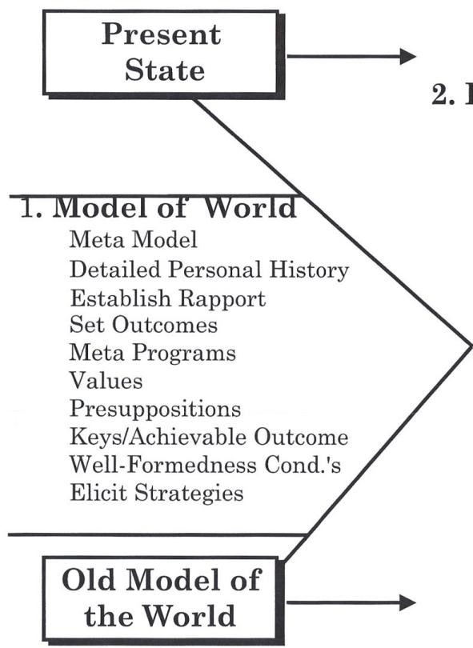

## 2. Χαλάρωση του Μοντέλου
- Μοντέλο Milton
- Μετα-Μοντέλο III
- Γλωσσικά Μοτίβα
- Λογικά Επίπεδα της Θεραπείας
- Μεταφορές
- Μετα-Μοντέλο

## 3. Έργο Αλλαγής
- Αγκύρωση (Anchoring)
- Επαναπλαισίωση (Reframing)
- Θεραπεία Γραμμής Χρόνου (Time Line Therapy®)
- Αξίες
- Υπομορφοτροπίες (SubModalities)
- Ύπνωση
- Στρατηγικές
- Ενσωμάτωση Μερών

## Επιθυμητή Κατάσταση

## 4. Καθαρισμός
- Οικολογία
- Ενσωμάτωση Μερών
- Ευθυγράμμιση

## 5. Μελλοντικός Συγχρονισμός
- Νέες Συμπεριφορές
- Γέμισμα Πειστή

## Νέο Μοντέλο του Κόσμου


\rightline{\small 73}

# ΕΝΣΩΜΑΤΩΣΗ ΜΕΡΩΝ

ΑΥΤΟ ΤΟ ΣΕΝΑΡΙΟ ΕΧΕΙ ΑΝΑΘΕΩΡΗΘΕΙ

1. Προσδιορίστε τη σύγκρουση και τα εμπλεκόμενα μέρη: Βεβαιωθείτε ότι προσδιορίζετε με σαφήνεια τα μέρη και κατανοείτε τη φύση της σύγκρουσης.

2. Βάλτε το Μέρος που αντιπροσωπεύει την ανεπιθύμητη κατάσταση ή συμπεριφορά να βγει πρώτο στο χέρι: «Αναρωτιέμαι αν μπορώ να μιλήσω σε αυτό το μέρος. Σε ποιο χέρι θα ήθελε να βγει και να σταθεί;» (Δείξτε στον πελάτη πώς να κρατήσει το χέρι.)

3. Βεβαιωθείτε ότι ο Πελάτης έχει μια εικόνα V-A-K του μέρους καθώς βγαίνει στο χέρι: «Σε ποιον μοιάζει αυτό το μέρος· μοιάζει/ακούγεται/νιώθει σαν κάποιον που γνωρίζεις;»

4. Εξορύξτε τον «Αντίθετο Αριθμό» να βγει στο άλλο χέρι: «Θα ήθελα να μιλήσω στο Μέρος με το οποίο αυτό το Μέρος είναι περισσότερο σε σύγκρουση, την άλλη όψη του νομίσματος, τον αντίθετο αριθμό, και ας βγει και να σταθεί στο άλλο χέρι.» (Δείξτε στον πελάτη πώς να κρατήσει το χέρι.)

5. Βεβαιωθείτε ότι ο Πελάτης έχει μια εικόνα V-A-K του μέρους καθώς βγαίνει στο χέρι: «Σε ποιον μοιάζει αυτό το μέρος· μοιάζει/ακούγεται/νιώθει σαν κάποιον που γνωρίζεις;»

6. Διαχωρίστε την πρόθεση από τη συμπεριφορά: Επαναπλαισιώστε κάθε μέρος ώστε να συνειδητοποιήσουν ότι έχουν στην πραγματικότητα την ίδια πρόθεση τεμαχίζοντας προς τα πάνω — ρωτήστε, «Ποια είναι η πρόθεση ...» ή «Για ποιο σκοπό ...» (Ξεκινήστε τον τεμαχισμό προς τα πάνω πρώτα με το μέρος που έχει την ανεπιθύμητη κατάσταση ή συμπεριφορά. Καθώς το κάνετε, βεβαιωθείτε ότι η πρόθεση του πελάτη παραμένει συνδεδεμένη.) Βεβαιωθείτε ότι και τα δύο μέρη φτάνουν στην ίδια λέξη ως υψηλότερη πρόθεση.

α) Τώρα, βάλτε τα μέρη να παρατηρήσουν ότι κάποτε ήταν μέρος ενός μεγαλύτερου συνόλου.

β) Ζητήστε άλλα μέρη που ήταν επίσης κάποτε μέρος του μεγαλύτερου συνόλου. Βάλτε τα να συμμετάσχουν στην ενσωμάτωση.

γ) Τι πόρους ή χαρακτηριστικά έχει κάθε μέρος που το άλλο μέρος θα ήθελε να έχει;

7. Καθώς τα χέρια έρχονται μαζί δώστε επιπλέον προτάσεις για την ενσωμάτωση.

8. Πάρτε το ενσωματωμένο μέρος μέσα και βάλτε το να συγχωνευτεί στην ολότητα μέσα σας.

9. Δοκιμάστε &amp; κάντε μελλοντικό συγχρονισμό.


\rightline{\small 74}

# ΑΠΟΣΥΣΧΕΤΙΣΤΙΚΗ ΤΕΧΝΙΚΗ
## V-K ΑΠΟΣΥΣΧΕΤΙΣΗ

1. Εγκαταστήστε μια αγκύρωση για την κατάσταση «Εδώ και Τώρα». Εάν το άτομο κολλήσει σε ένα συσχετισμένο σημείο με το αρχικό γεγονός, η αγκύρωση «Εδώ και Τώρα» μπορεί να χρησιμοποιηθεί για να επαναφέρει το άτομο στο παρόν. Επίσης αγκυρώστε μια κατάσταση «ηρεμίας, χαλάρωσης».

2. Ζητήστε από το άτομο να θυμηθεί την τελευταία φορά που συνέβη η αντίδραση. (Σε ορισμένες περιπτώσεις, μπορεί να χρειαστούν τεχνικές Θεραπείας Γραμμής Χρόνου (Time Line Therapy™) για να αντιμετωπιστεί η ριζική αιτία.)

3. Αγκυρώστε αυτή την κατάσταση, διακόψτε την κατάσταση, και έπειτα δοκιμάστε την αγκύρωση.

4. Δώστε εντολή στο άτομο να τοποθετήσει αυτή τη σκηνή σε μια φανταστική τηλεόραση ή οθόνη κινηματογράφου με όλα τα συνοδά συναισθήματα.

5. Πείτε στο άτομο να τρέξει την ταινία στο πιο τραυματικό σημείο και να παγώσει εκείνο το καρέ. Πείτε στο άτομο να φανταστεί ότι επιπλέει έξω από το σώμα του/της και παρακολουθεί από πίσω από την καρέκλα ή από μια θέση πίσω.

6. Αγκυρώστε αυτή την αποσυσχετισμένη κατάσταση.

7. Πείτε στο άτομο να τρέξει τη σκηνή μέχρι να μάθει κάτι νέο ή κάτι που δεν θυμόταν προηγουμένως από αυτή την οπτική. Όταν το άτομο το αναγνωρίσει, συνεχίστε στο Βήμα 9.

8. Πείτε στο άτομο να μιλήσει στον νεότερο εαυτό στην οθόνη, δηλώνοντας «Είμαι από το αύριό σου και να τι έχω μάθει...» Στη συνέχεια λέγεται στο άτομο να φροντίσει και να παρηγορήσει τον νεότερο εαυτό. Το άτομο πρέπει να αποδεχτεί τον νεότερο εαυτό ως μέρος της παρούσας ύπαρξης και να φέρει τη νέα μάθηση στο παρόν. (Πυροδοτήστε την αγκύρωση της ήρεμης, χαλαρής κατάστασης καθώς το άτομο παρηγορεί τον νεότερο εαυτό.)

9. Για να εδραιώσετε περαιτέρω την αποσυσχετισμένη κατάσταση, βάλτε το άτομο να τρέξει την κινηματογραφική σκηνή ανάποδα, κάνοντας τη σκηνή όλο και μικρότερη. Σβήστε την αντίθεση μέχρι η σκηνή να γίνει μια μικρή κουκίδα, και έπειτα βάλτε τη μικρή κουκίδα να περιστραφεί έξω στο διάστημα.

10. Δοκιμάστε και κάντε μελλοντικό συγχρονισμό.

ΠΡΟΣΟΧΗ: Όταν αφαιρείτε μια φοβία, πρέπει να δοθεί προσοχή για να διασφαλιστεί ότι ο φόβος δεν εξυπηρετούσε προστατευτική λειτουργία. Εάν ο φόβος όντως εξυπηρετεί προστατευτική λειτουργία, πρέπει να εγκατασταθούν κατάλληλες νέες στρατηγικές μάθησης.


\rightline{\small 75}

# ΕΞΟΡΥΞΗ ΤΗΣ ΓΡΑΜΜΗΣ ΧΡΟΝΟΥ #1

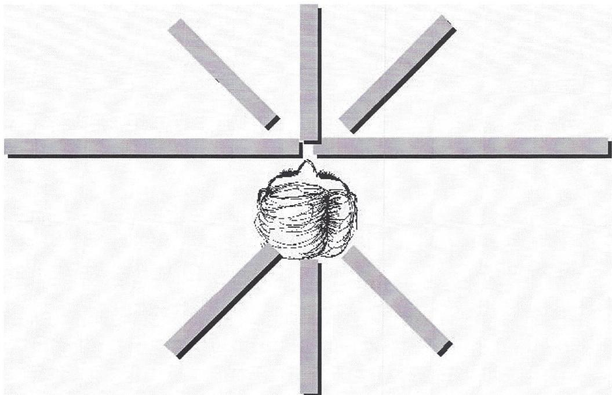

Το κάνουμε αυτό με τον πελάτη ξύπνιο—όχι σε έκσταση—αυξάνοντας την ασυνείδητη εμπιστοσύνη &amp; συνεργασία.

«Αν ρωτούσα τον ασυνείδητο νου σας, πού είναι το παρελθόν σας, και πού είναι το μέλλον σας, έχω μια ιδέα ότι θα μπορούσατε να πείτε, «Είναι από δεξιά προς τα αριστερά, ή από εμπρός προς τα πίσω, ή από πάνω προς τα κάτω, ή προς κάποια κατεύθυνση από εσάς σε σχέση με το σώμα σας. Και δεν με ενδιαφέρει η συνειδητή σας αντίληψη, αλλά η ασυνείδητη. Έτσι, αν ρωτούσα τον ασυνείδητο νου σας πού είναι το παρελθόν σας, προς ποια κατεύθυνση θα δείχνατε;»

(Παρατηρείτε πάντα όλη την αναλογική συμπεριφορά κατά την εξόρυξη)

«Και το μέλλον σας, προς ποια κατεύθυνση θα δείχνατε αν ρωτούσα τον ασυνείδητο νου σας, πού είναι το μέλλον σας;»

ΣΗΜΕΙΩΣΗ: Καθώς εξορύσσετε τη Γραμμή Χρόνου, βεβαιωθείτε ότι κατανοείτε ότι όπως κι αν το κάνει ο πελάτης σας (πώς οργανώνει το παρελθόν και το μέλλον) είναι τέλειο για τον πελάτη σας. Μην κάνετε καμία αξιολογική κρίση για την οργάνωση της Γραμμής Χρόνου του πελάτη σας μέχρι να διαπιστώσετε εάν λειτουργεί για τον πελάτη σας.


\rightline{\small 76}

# ΠΡΩΤΗ ΔΟΚΙΜΗ ΕΞΟΡΥΞΗΣ

«Τώρα, θα μπορούσατε να φέρετε στο μυαλό σας τις κατευθύνσεις που δείξατε (ή τις αναμνήσεις του παρελθόντος και του μέλλοντος που παρατηρήσατε). Παρατηρείτε ότι υπονοούν μια γραμμή;»

Αν όχι: «Λοιπόν, θα μπορούσατε να το παρατηρήσετε αυτό;»

Αν ακόμα όχι: «Είναι το παρελθόν σας οργανωμένο κατά τοποθεσία, για παράδειγμα, πού ζούσατε;»

Αν ναι: «Πώς θα έμοιαζε αν, για τους σκοπούς αυτής της διαδικασίας, ξεδιπλωνόταν σε μια γραμμή;»

(Θυμηθείτε ότι η Time Line Therapy™ δεν είναι μόνο μια οπτική διαδικασία, μπορεί να γίνει οπτικά ή ακουστικά ή κιναισθητικά.)

«Ωραία, τώρα όταν λέω γραμμή, δεν εννοώ να υπονοήσω μόνο οπτικά, γιατί σε μια στιγμή θα σας ζητήσω να επιπλεύσετε πάνω από αυτή τη γραμμή, και με το επιπλέετε, εννοώ επίσης σαν ήχοι που επιπλέουν στον άνεμο, ή να επιπλέετε στην μπανιέρα, ή οπτικά. Όπως κι αν επιπλέετε πάνω από τη Γραμμή Χρόνου σας είναι τέλειο. Έτσι, μπορείτε απλώς να επιπλεύσετε πάνω από τη Γραμμή Χρόνου σας και παραμένοντας πάνω από τη Γραμμή Χρόνου σας να επιπλεύσετε πίσω στο παρελθόν (παύση). Είστε εκεί;»

«Και τώρα, επιπλεύστε έξω στο μέλλον σας (παύση). Είστε εκεί;»

«Τώρα, επιπλεύστε ψηλότερα. Επιπλεύστε τόσο ψηλά ώστε η γραμμή χρόνου σας να φαίνεται σαν μια ίντσα μακριά.» (παύση)

«Ωραία, επιπλεύστε πίσω στο τώρα, και επιπλεύστε κάτω στο τώρα και επιστρέψτε στο δωμάτιο.» (παύση)

«Πώς ήταν αυτό;»


\rightline{\small 77}

# ΑΝΑΚΑΛΥΨΗ ΤΗΣ ΡΙΖΙΚΗΣ ΑΙΤΙΑΣ

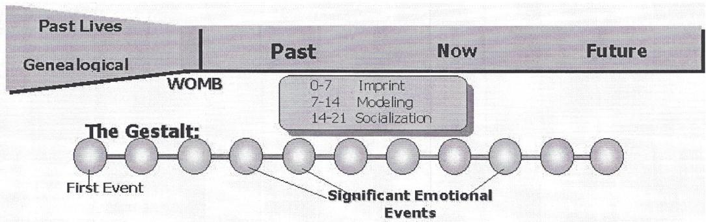

ΣΗΜΕΙΩΣΗ: Αυτή η ενότητα γίνεται πριν ο πελάτης είναι πάνω από τη Γραμμή Χρόνου. Αυξάνει την ασυνείδητη εμπιστοσύνη και συνεργασία.

1. Ρωτήστε: «Είναι εντάξει για τον Ασυνείδητο Νου σας να απελευθερώσετε αυτό (συναίσθημα ή περιοριστική απόφαση) σήμερα και να το συνειδητοποιήσετε;»

2. Βρείτε το Πρώτο Γεγονός:

«Ποια είναι η ριζική αιτία αυτού του προβλήματος, το πρώτο γεγονός που, όταν αποσυνδεθεί, θα κάνει το πρόβλημα να εξαφανιστεί;

Αν επρόκειτο να γνωρίζετε, ήταν πριν, κατά τη διάρκεια, ή μετά τη γέννησή σας;

--&gt;ΠΡΙΝ: «Στη μήτρα ή πριν;»

ΜΗΤΡΑ: «Ποιον μήνα;»

ΠΡΙΝ: «Ήταν μια προηγούμενη ζωή ή μεταβιβάστηκε σε εσάς γενεαλογικά;»

ΠΡΟΗΓΟΥΜΕΝΗ ΖΩΗ: «Πόσες ζωές πριν;»

ΓΕΝΕΑΛΟΓΙΚΑ: «Πόσες γενιές πριν;»

--&gt;ΜΕΤΑ: «Αν επρόκειτο να γνωρίζετε, τι ηλικία ήσασταν;»

Πηγαίνετε στην επόμενη σελίδα

ΣΗΜΕΙΩΣΕΙΣ:

Εάν ο πελάτης πει «Δεν ξέρω ποια είναι η ριζική αιτία» τότε απαντήστε με «Ξέρω ότι δεν ξέρετε, αλλά αν ξέρατε... πάρτε ό,τι έρθει... εμπιστευτείτε τον ασυνείδητο νου σας.»

Εάν ο πελάτης πει και γενεαλογικά και προηγούμενη ζωή, εργαστείτε πρώτα με το παλαιότερο, και μετά με το νεότερο.

Επικυρώστε την αλλαγή: Επαληθεύστε τη συνειδητή αναγνώριση της μετατόπισης. Όταν συμβαίνει μια σημαντική φυσιολογική μετατόπιση στον πελάτη, φροντίστε να την αναφέρετε: «Αυτό ήταν μεγάλο, έτσι δεν είναι;»


\rightline{\small 78}

# ΑΡΝΗΤΙΚΑ ΣΥΝΑΙΣΘΗΜΑΤΑ #1

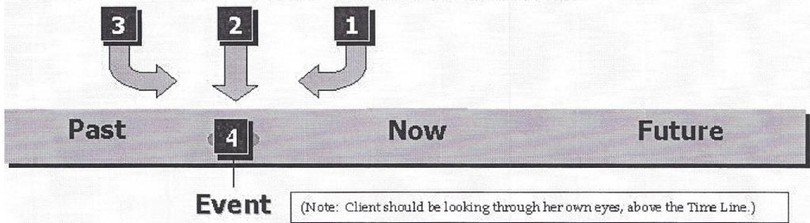

## Διαδικασία:

1. «Απλώς επιπλεύστε πάνω από τη Γραμμή Χρόνου σας, και πάνω από το παρελθόν στη Θέση #1, αντικρίζοντας το παρελθόν, και όταν φτάσετε εκεί παρατηρήστε το γεγονός. Πείτε μου όταν είστε εκεί»

2. «Τώρα, επιπλεύστε στη Θέση #2 ακριβώς πάνω από το γεγονός ώστε να κοιτάτε προς τα κάτω στο γεγονός. Ρωτήστε τον Ασυνείδητο Νου σας τι χρειάζεται να μάθει από το γεγονός, η εκμάθηση του οποίου θα σας επιτρέψει να αφήσετε τα συναισθήματα εύκολα και χωρίς κόπο. Ο Ασυνείδητος Νους σας μπορεί να διατηρήσει τα μαθήματα ώστε αν τα χρειαστείτε στο μέλλον, να είναι εκεί.»

3. «Τώρα, επιπλεύστε στη Θέση #3 ώστε να είστε πάνω από το γεγονός και πριν από το γεγονός, και να κοιτάτε προς το τώρα. (Βεβαιωθείτε ότι είστε αρκετά πριν από οποιαδήποτε αλυσίδα γεγονότων που οδήγησαν σε εκείνο το γεγονός.) Και ρωτήστε τον εαυτό σας, 'Τώρα, πού είναι τα συναισθήματα;'»*

4. (Προαιρετική Δοκιμή:) «Επιπλεύστε κάτω μέσα στο γεγονός, στη Θέση #4, κοιτάζοντας μέσα από τα δικά σας μάτια, και ελέγξτε τα συναισθήματα. Είναι εκεί; Ή έχουν εξαφανιστεί! Τώρα!! Ωραία, επιστρέψτε στη Θέση #3.»

5. **«Τώρα, επιστρέψτε στο τώρα πάνω από τη Γραμμή Χρόνου σας μόνο τόσο γρήγορα όσο μπορείτε να αφήσετε όλο το (ονομάστε το συναίσθημα) στα γεγονότα μέχρι το τώρα, λάβετε τη θέση 3 με κάθε επόμενο γεγονός, διατηρήστε τα μαθήματα, και αφήστε το (ονομάστε το συναίσθημα) μέχρι το τώρα. (Όταν ο Πελάτης τελειώσει) Επιπλεύστε κάτω στο τώρα, και επιστρέψτε στο δωμάτιο.» (Διακοπή Κατάστασης)

6. Δοκιμή: (Ο Πελάτης πίσω στο τώρα.) «Μπορείτε να θυμηθείτε κάποιο γεγονός στο παρελθόν όπου συνηθίζατε να μπορείτε να νιώθετε εκείνο το παλιό συναίσθημα, και να πάτε πίσω και να παρατηρήσετε αν μπορείτε να το νιώσετε, ή μπορεί να διαπιστώσετε ότι δεν μπορείτε. Ωραία, επιστρέψτε στο τώρα.»

7. Μελλοντικός συγχρονισμός: (Ο Πελάτης πίσω στο τώρα.) «Θέλω να πάτε έξω στο μέλλον σε μια απροσδιόριστη χρονική στιγμή στο μέλλον που αν είχε συμβεί στο παρελθόν, θα είχατε νιώσει ακατάλληλο ή αδικαιολόγητο (ονομάστε το συναίσθημα), και παρατηρήστε αν μπορείτε να βρείτε εκείνο το παλιό συναίσθημα, ή μπορεί να διαπιστώσετε ότι δεν μπορείτε. Εντάξει;» Ωραία επιστρέψτε στο τώρα.

*Σημείωση: Εάν το συναίσθημα δεν εξαφανιστεί, τότε επαναπλαισιώστε. Δείτε την επόμενη σελίδα.


\rightline{\small 79}

# ΤΑ 3 ΠΡΑΓΜΑΤΑ ΓΙΑ ΕΛΕΓΧΟ ΣΤΗ ΘΕΣΗ #3

1. Βεβαιωθείτε ότι ο πελάτης είναι στη θέση #3.
(Δείκτης: Ο πελάτης νιώθει πραγματικά τα συναισθήματα)

Πείτε στον πελάτη:
«Ανεβείτε ψηλότερα, και επιπλεύστε πιο πίσω.»
«Φτάστε αρκετά ψηλά και αρκετά πίσω μέχρι να εξαφανιστεί το συναίσθημα,»

2. Βεβαιωθείτε ότι ο πελάτης είναι πριν από το πρώτο γεγονός.
(Δείκτης: 90% των συναισθημάτων απελευθερώνεται.)

Ρωτήστε τον πελάτη:
«Είστε πριν από το πρώτο γεγονός;»
«Υπάρχει κάποιο γεγονός νωρίτερα από αυτό; Πηγαίνετε πίσω πριν από το ΠΡΩΤΟ.»

3. Πρέπει να συμφωνεί πλήρως να αφήσει το συναίσθημα.
(Δείκτης: Ο πελάτης λέει, «Τα συναισθήματα δεν απελευθερώνονται.»)

Ρωτήστε τον πελάτη:
«Τι υπάρχει να μάθετε από αυτό το γεγονός; Αν το μάθετε αυτό, δεν θα είναι καλύτερο από το να έχετε τα παλιά συναισθήματα; Πώς μπορείτε να αποκτήσετε το ίδιο όφελος που παρείχαν τα συναισθήματα όταν τα αφήσετε;»

(Χρησιμοποιήστε αυτή την επαναπλαισίωση ή οποιαδήποτε επαναπλαισίωση από τη σελίδα ΓΕΝΙΚΕΣ ΕΠΑΝΑΠΛΑΙΣΙΩΣΕΙΣ 80.)


\rightline{\small 80}

# ΓΕΝΙΚΕΣ ΕΠΑΝΑΠΛΑΙΣΙΩΣΕΙΣ
ΧΡΗΣΙΜΟΠΟΙΗΣΤΕ ΕΑΝ ΤΑ ΑΡΝΗΤΙΚΑ ΣΥΝΑΙΣΘΗΜΑΤΑ ΔΕΝ ΑΠΕΛΕΥΘΕΡΩΘΟΥΝ

## ΒΑΣΕΙ:

1.  Μάθησης:
«Τι υπάρχει να έχετε μάθει από αυτό το γεγονός, η εκμάθηση του οποίου θα σας επιτρέψει να αφήσετε εύκολα τα συναισθήματα; Δεν θα ήταν καλύτερο να διατηρήσετε τα μαθήματα παρά τα συναισθήματα; Εάν αφήσετε τα συναισθήματα και διατηρήσετε τα μαθήματα, θα έχετε μάθει αυτό που χρειαζόσασταν.»

2.  Προστασίας/Ασφάλειας:
«Το αρνητικό συναίσθημα του ___________ δεν σας προστατεύει.»
(Εάν δουλεύετε με φόβο ή θυμό, αναφέρετε φυγή ή πάλη)
«Στην πραγματικότητα τα αρνητικά συναισθήματα δεν είναι ασφαλή για το σώμα. Κάθε αρνητικό συναίσθημα μπορεί να συμβάλλει στους ακόλουθους τύπους προβλημάτων υγείας:

Θυμός Καρδιακή προσβολή, Αυξημένη Χοληστερόλη (JAMA, 6/96)
Λύπη Εξασθενημένο Ανοσοποιητικό Σύστημα, Κατάθλιψη
Φόβος Υπερβολικό άγχος, PTSD, Φοβία
Ενοχή Μειωμένη θεραπευτική ενέργεια
Σύγκρουση Καρκίνος

«Δεν θα είστε πολύ πιο ασφαλείς αν αφήσετε τα συναισθήματα και διατηρήσετε τα μαθήματα για το πώς να φροντίζετε τον εαυτό σας;»

3.  Πρωταρχικές Οδηγίες:
«Το να μην αφήνετε αυτό το συναίσθημα είναι σε άμεση σύγκρουση με την υψηλότερη Πρωταρχική Οδηγία του ασυνείδητου νου, η οποία είναι, 'Η διατήρηση του σώματος.' Αυτό το συναίσθημα, αν και φέρνει αποτελέσματα, δεν διατηρεί το σώμα· βλάπτει το σώμα. Δεν θα ήταν καλύτερο να αφήσετε το καταπιεσμένο συναίσθημα και να επιτύχετε τα ίδια αποτελέσματα με κάποιον άλλο τρόπο;»


\rightline{\small 81}

# ΒΗΜΑΤΑ ΓΙΑ ΝΑ ΒΑΛΕΤΕ ΕΝΑ ΜΕΜΟΝΩΜΕΝΟ ΣΤΟΧΟ ΣΤΟ ΜΕΛΛΟΝ ΣΑΣ

1. Βεβαιωθείτε ότι ο στόχος είναι διατυπωμένος έτσι ώστε να είναι S.M.A.R.T.
2. Λάβετε το τελευταίο βήμα:
«Ποιο είναι το τελευταίο πράγμα που πρέπει να συμβεί ώστε να γνωρίζετε ότι το πετύχατε;»
3. Φτιάξτε μια Εσωτερική Αναπαράσταση:
Μια Οπτική αναπαράσταση,
ή Ακουστική αναπαράσταση,
ή Κιναισθητική αναπαράσταση.

Το να έχετε όλα –V, A, K, O, G, Ad είναι το καλύτερο.

4. Βήτε στην Εσωτερική Αναπαράσταση — συσχετίστε τον Πελάτη
5. Προσαρμόστε τις Υπομορφοτροπίες—Προσαρμόστε τις για το πιο θετικό Κιναισθητικό ή για το πιο «πραγματικό» αίσθημα.
6. Βγείτε από την Εσωτερική Αναπαράσταση — αποσυσχετίστε τον Πελάτη.
7. Πάρτε την Εσωτερική Αναπαράσταση και επιπλεύστε πάνω από το τώρα.
8. Ενεργοποιήστε την Εσωτερική Αναπαράσταση με τέσσερις βαθιές αναπνοές: Βάλτε τον Πελάτη να εισπνεύσει από τη μύτη, να εκπνεύσει από το στόμα, και να φυσήξει όλη την ενέργεια μέσα στην Εσωτερική Αναπαράσταση.
9. Επιπλεύστε έξω στο Μέλλον: Πάρτε την Εσωτερική Αναπαράσταση και επιπλεύστε πάνω από τη Γραμμή Χρόνου έξω στο μέλλον.
10. Εισάγετε την Εσωτερική Αναπαράσταση στη Γραμμή Χρόνου: «Αφήστε την Εσωτερική Αναπαράσταση και αφήστε την να επιπλεύσει κατευθείαν κάτω στη Γραμμή Χρόνου.
11. Παρατηρήστε ότι τα γεγονότα μεταξύ τότε και τώρα επανεκτιμώνται για να υποστηρίξουν τον στόχο: Ο Πελάτης μπορεί ή όχι να έχει εμπειρία της επανεκτίμησης, οπότε την επιστήσουμε στην προσοχή του.
12. Επιπλεύστε πίσω στο τώρα.


\rightline{\small 82}

# ΜΟΝΤΕΛΟ ΓΡΗΓΟΡΗΣ ΦΟΒΙΑΣ

Το Μοντέλο Γρήγορης Φοβίας είναι πιο χρήσιμο όταν χρησιμοποιείται σε συνδυασμό με τις τεχνικές Θεραπείας Γραμμής Χρόνου (Time Line Therapy™). Δείτε το εγχειρίδιο εκπαίδευσης Time Line Therapy® Practitioner για περισσότερες πληροφορίες.

1. (Προαιρετικό) Εγκαταστήστε μια αγκύρωση πόρου.
2. Αναγνωρίστε τη μάθηση μιας δοκιμής και την ικανότητα του πελάτη να μαθαίνει.
3. Ανακαλύψτε τη στρατηγική που χρησιμοποιείται για την ύπαρξη της φοβίας. (Χρησιμοποιήστε τα Λογικά Επίπεδα της Θεραπείας)
4. Χρησιμοποιώντας τις τεχνικές Time Line Therapy™, βάλτε τους να πάνε πίσω πριν από το πρώτο γεγονός.
5. Φτιάξτε μια οθόνη κινηματογράφου πάνω από τη Γραμμή Χρόνου, και βάλτε τους να παρακολουθήσουν από τον θάλαμο προβολής.
6. Τρέξτε την ταινία προς τα εμπρός σε ασπρόμαυρο μέχρι το τέλος.
7. Παγώστε το καρέ στο τέλος, και κάντε λευκό (ή μαύρο).
8. Βάλτε τον πελάτη να συσχετιστεί με την ανάμνηση και να την τρέξει ανάποδα με χρώμα μέχρι την αρχή.
9. Επαναλάβετε τα βήματα 6 - 8 μέχρι ο πελάτης να μην μπορεί να επαναφέρει το συναίσθημα (K), ή μέχρι η ανάμνηση να μην είναι προσβάσιμη. (Εάν διαγράφετε μια ανάμνηση, τότε δώστε τις κατάλληλες οδηγίες.)
10. Ελέγξτε την οικολογία. Εάν είναι απαραίτητο, χρησιμοποιήστε ένα swish. Δοκιμάστε και κάντε μελλοντικό συγχρονισμό.


\rightline{\small 83}

# ΠΡΟΤΕΙΝΟΜΕΝΟ ΜΟΝΤΕΛΟ ΟΙΚΟΓΕΝΕΙΑΚΗΣ ΘΕΡΑΠΕΙΑΣ

Αυτό το μοντέλο διαρκεί περίπου 8-10 ώρες για δύο άτομα. Αναμένουμε ότι κάθε επιπλέον άτομο θα διαρκέσει 2-3 ώρες.

## Οι Προϋποθέσεις:

Υποθέτουμε ότι από την οπτική του NLP υπάρχουν κυρίως δύο λόγοι για τους οποίους τερματίζονται οι σχέσεις —

- αρνητική αγκύρωση, και
- ανεκπλήρωτες στρατηγικές.

Έτσι αυτή η διαδικασία είναι σχεδιασμένη ώστε να:

1.  Καθαρίζει την Αρνητική Αγκύρωση
α.  Διαγραφή αρνητικών αγκυρώσεων και εμπειριών με χρήση Time Line Therapy. Καθαρισμός αρνητικών γεγονότων. Αυτό είναι δυνατό λόγω γκεστάλτ
β.  Ο Practitioner μπορεί επίσης να κάνει θετική αγκύρωση — Βάλτε τους να θυμηθούν θετικές καταστάσεις.
γ.  Μπορείτε επίσης να τους δείξετε πώς να βάζουν τις δικές τους αγκυρώσεις.

2.  Διδάξτε τους τις απαραίτητες στρατηγικές για να εκπληρώνουν στη σχέση, και εξαλείψτε τις Ανεκπλήρωτες Στρατηγικές.
α.  Μετα-Προγράμματα
- Myers Briggs
- I/E
- S/N
- T/F
- J/P
- Κατεύθυνση
- Πλαίσιο
- Πειστής
- Σχέση
- Δομή Κανόνων (Κανόνες Διοίκησης)
- Γραμμή Χρόνου (Μέσα ή Δια Μέσου του Χρόνου)
- α. Αξίες και Επίπεδα Αξιών (National Values Center)
γ.  Στρατηγικές Αγάπης
- Έλξη
- Αναγνώριση Έλξης
- Βαθιά Αγάπη
δ.  Πρωταρχικό Σύστημα Αναπαράστασης


\rightline{\small 84}

# ΠΡΟΤΕΙΝΟΜΕΝΟ ΜΟΝΤΕΛΟ ΟΙΚΟΓΕΝΕΙΑΚΗΣ ΘΕΡΑΠΕΙΑΣ

## Τα Βήματα:

1. **Ρωτήστε:** «Αξίζει να σωθεί αυτός ο γάμος; Αξίζει να είστε παντρεμένος/η με τον/τη σύζυγό σας;» (Ρωτήστε το αυτό κάθε φορά που ξεκινάτε μια συνεδρία· θα σας γλιτώσει πολύ χρόνο.)

2. Ανακαλύψτε τα Μετα-Προγράμματα και τις Αξίες τους

3. Συναντηθείτε μαζί τους ατομικά και κάντε ατομική θεραπεία
α. Αποσυνδέστε αρνητικές αγκυρώσεις
β. Διαγράψτε ενοχή, θυμό, απογοήτευση, φόβο, κλπ.
γ. Κάντε ενσωμάτωση μερών και διαπραγμάτευση:
- Πατέρας
- Μητέρα
- Σημαντικοί άλλοι, κλπ.
δ. Ελέγξτε τα πρότυπα ρόλων

4. Θεραπεία Ζευγαριού — Διασκεδάστε
α. Περάστε μέσα από τα Μετα-Προγράμματα, τη Γραμμή Χρόνου, τις Αξίες, τις Στρατηγικές Αγάπης
β. Στήστε και κάντε συμφωνίες
1. Όχι Διπλά Δεσμά
2. Επικοινωνία για την επίλυση προβλημάτων
3. Παραγωγικά, Υποστηρικτικά συστήματα

5. Αγκύρωση
α. Χειριστείτε τις Αρνητικές Αγκυρώσεις
β. Δώστε Παράδειγμα του πώς λειτουργεί
γ. Θετική Αγκύρωση
δ. Επαναγκύρωση των Θετικών στην Αρχή της σχέσης
ε. Διδάξτε τους πώς να χρησιμοποιούν τις αγκυρώσεις

6. Δοκιμή και Μελλοντικός Συγχρονισμός


\rightline{\small 85}

# Η ΔΙΑΔΙΚΑΣΙΑ ΠΩΛΗΣΕΩΝ 5 ΒΗΜΑΤΩΝ

1. **Εγκαταστήστε Rapport**: Θυμηθείτε, οι άνθρωποι που μοιάζουν μεταξύ τους τείνουν να συμπαθούν ο ένας τον άλλον. Ταίριασμα &amp; Καθρέφτισμα:
- Φυσιολογία
- Τόνος φωνής
- Συστήματα αναπαράστασης
- Αναπνοή
- Λέξεις-κλειδιά

2. **Κάντε Ερωτήσεις**: Οι ερωτήσεις που κάνετε σχετίζονται άμεσα με την επιχείρηση του ατόμου που παίρνετε συνέντευξη. Μιλήστε τη γλώσσα τους. Κάντε ερωτήσεις στη γλώσσα του κύριου ενδιαφέροντός τους. (Στις επιχειρήσεις, μιλήστε τη γλώσσα της επιχείρησής τους.)
- Τι κάνετε; Με τι ασχολείστε;
- «Για ποιο σκοπό...» το θέλετε αυτό;
- Επίσης ανακαλύψτε την I/R του πελάτη για την επιτυχία
- Βρείτε το πρωταρχικό σύστημα αναπαράστασης του πελάτη και την επιθυμητή κατάσταση
- Ανακαλύψτε τις Στρατηγικές Παρακίνησης, Απόφασης, Διαβεβαίωσης του πελάτη
- Εξορύξτε τις Αξίες

3. **Βρείτε μια Ανάγκη**: Καθιερώστε την ανάγκη — καθιερώστε την αξία. Προτείνετε μια λύση στο πρόβλημα του πελάτη, και έπειτα ρωτήστε, «Βλέπετε αξία σε αυτό;» (Εάν δεν υπάρχει ανάγκη, τότε σταματήστε εδώ. Βρείτε άλλο πελάτη. Υπάρχουν πολλοί εκεί έξω.)

Η δουλειά σας σε αυτό το σημείο είναι να βρείτε γρήγορα όσο το δυνατόν περισσότερα όχι. Αυτό σημαίνει ότι πρέπει να πιέσετε αρκετά πάνω στον πελάτη έτσι ώστε να λάβει μια απόφαση αυτή τη στιγμή. Τα όχι είναι απείρως καλύτερα από το «Πρέπει να το σκεφτώ. Μπορείτε να με ξανακαλέσετε αύριο;» (Θυμηθείτε την αναλογία με τα περιστρεφόμενα πιάτα.) Οι περισσότεροι πωλητές χάνουν το 80% του χρόνου τους με ανθρώπους που δεν αγοράζουν τίποτα. Εάν περάσετε το 80% του χρόνου σας με ανθρώπους που πρόκειται να αγοράσουν, τότε θα ξοδέψουν περισσότερα μαζί σας. Θέλετε «Υψηλής Πιθανότητας» πελάτες.

Ενώ είστε σε αυτό το βήμα, μπορείτε επίσης να χρησιμοποιήσετε:


\rightline{\small 86}

- Υπό όρους κλείσιμο -- «Βλέπετε αξία σε αυτό...» ή «Είναι δίκαιο να πούμε ότι αν λύναμε αυτό το πρόβλημα τότε αυτό θα ήταν πολύτιμο για εσάς.»
- Ερωτήσεις-ετικέτες – «Τότε θα ήταν πολύτιμο για εσάς να λύσετε αυτό, έτσι δεν είναι;»

4. Συνδέστε την Ανάγκη ή την Αξία με το Προϊόν ή την Υπηρεσία σας
Σε αυτό το σημείο προτείνετε πώς το προϊόν ή η υπηρεσία σας θα λύσει το πρόβλημα που αποκαλύψατε νωρίτερα. Κάντε μια σαφή πρόταση για το πώς, αλλά με όσο το δυνατόν λιγότερες λεπτομέρειες. Πείτε στον πελάτη μόνο όσα χρειάζεται για να μπορέσει να αγοράσει.
- «Τι θα γινόταν αν...»
- «Σε σύγκριση με...» (Πλαίσιο Αντίθεσης)
- Επειδή
- Πλαίσιο Συμφωνίας
- Χρησιμοποιήστε στρατηγικές εάν τις εξορύξατε
- Επίσης επαναλάβετε τις αξίες &amp; τις λέξεις-κλειδιά του πελάτη καθώς κλείνετε

5. Κλείσιμο: Ζητήστε την παραγγελία!
- Εάν ναι: Μελλοντικός συγχρονισμός. Πυροδοτήστε την αγκύρωση διαβεβαίωσης. Λάβετε παραπομπές.

Χειριστείτε τις Ενστάσεις είτε:
- Αγνοώντας τις και πηγαίνοντας στο #3
-ή-
- Χειριζόμενοι τις Ενστάσεις και πηγαίνοντας στο #3

Αυτό το μέρος αφορά τη μετακίνηση του αγοραστή από την αντίσταση σε ένσταση ή στην αγορά.

Κλείσιμο: Υπάρχουν αρκετοί τρόποι να ζητήσετε την παραγγελία, που τεχνικά ονομάζεται «Κλείσιμο». Υπάρχουν αρκετά βιβλία με πολλές ιδέες που έχουν λειτουργήσει με τα χρόνια για το κλείσιμο. Εδώ είναι μερικές που είναι πολύτιμες:
- Υποθέτοντας την Πώληση
- Το Κλείσιμο του Εντύπου Παραγγελίας
- Ερώτηση Εναλλακτικής Επιλογής
- Κλείσιμο Οξείας Γωνίας


THE FASTRAK NLP PRACTITIONER CERTIFICATION TRAINING 87

## ΑΠΑΝΤΩΝΤΑΣ ΣΤΗΝ ΕΝΣΤΑΣΗ

Μπορείτε να επιλέξετε να απαντήσετε στην ένσταση εάν θεωρείτε ότι η ένσταση είναι σημαντική. Εδώ είναι μόνο 4 ενστάσεις:

1. «Δεν έχω αρκετό χρόνο»,
2. «Δεν έχω αρκετά χρήματα»,
3. «Δεν θα λειτουργήσει για εμένα (λειτουργεί για όλους τους άλλους αλλά δεν θα λειτουργήσει για εμένα)»,
4. «Δεν σας πιστεύω».

## ΧΕΙΡΙΣΜΟΣ ΜΙΑΣ ΕΝΣΤΑΣΗΣ: (ΤΟ ΤΕΛΙΚΟ ΚΛΕΙΣΙΜΟ ΕΝΣΤΑΣΗΣ)

1. Ακούστε πλήρως την ένσταση του πελάτη!
2. Δείξτε λίγο ξαφνιασμένος.
3. Πείτε, «Α, καταλαβαίνω, εννοείτε ότι αυτός είναι ο μόνος λόγος που δεν αγοράζετε;»
4. «Αν μπορούσα να σας δείξω πώς να έχετε τον χρόνο, θα αγοράζατε;»
5. Το τελευταίο βήμα είναι να απαντήσετε στην ένσταση όπως παραπάνω και να επιστρέψετε αμέσως στην εδραίωση της αξίας.

## ΕΠΑΝΕΓΚΑΘΙΔΡΥΣΗ ΤΗΣ ΑΞΙΑΣ ΜΕΤΑΒΑΙΝΟΝΤΑΣ ΣΤΟ #3

Η αντίσταση στο μήνυμά σας υποδηλώνει έλλειψη rapport. Εάν αυτό συμβεί σε οποιοδήποτε σημείο, χτίστε περισσότερο rapport.


\rightline{\small 88}

# ΔΙΑΠΡΑΓΜΑΤΕΥΣΗ—ΑΣΚΗΣΗ ΕΠΙΡΡΟΗΣ

## ΣΧΕΔΙΑΣΜΟΣ

1. Καθορίστε το επιθυμητό σας αποτέλεσμα.
2. Αναπτύξτε όσο το δυνατόν περισσότερες επιλογές για να το επιτύχετε.
a) Αποφύγετε τη σταθερή θέση.
b) Ορίστε τα ανώτερα και κατώτερα όρια του εύρους.
3. Εντοπίστε πιθανές περιοχές συμφωνίας.
4. Εντοπίστε τα ζητήματα που πρέπει να επιλυθούν και σχεδιάστε πώς θα τα συζητήσετε.
5. Καθορίστε την καλύτερη εναλλακτική σας σε περίπτωση μη συμφωνίας.

## Η ΔΙΑΔΙΚΑΣΙΑ

### A. Έναρξη

1. Εδραιώστε σχέση εμπιστοσύνης (rapport).
2. Επιτύχετε συναίνεση ότι υπάρχει βάση για διαπραγμάτευση.
3. Αξιολογήστε τον άλλο διαπραγματευτή μέσω του «ως εάν» (as if).
4. Διαπιστώστε το επιθυμητό αποτέλεσμα του άλλου διαπραγματευτή μέσω του «ως εάν».

### B. Ανταλλαγή

1. Δηλώστε τις περιοχές συμφωνίας.
2. Αγκυρώστε (anchor) κάθε κατάσταση που μπορείτε να χρησιμοποιήσετε αργότερα.
3. Δηλώστε τα ζητήματα που πρέπει να επιλυθούν.
4. Διερευνήστε τα αποτελέσματα που επιδιώκει ο άλλος σε περιοχές διαφωνίας.
5. Αναπτύξτε επιλογές που περιλαμβάνουν τα αποτελέσματα και των δύο μερών.
- Υπενθυμίστε στον άλλο τα κοινά συμφέροντα.
- Ζητήστε βοήθεια στην ανάπτυξη επιλογών.
- Ζητήστε προτίμηση μεταξύ διαφόρων επιλογών.
- Δώστε έμφαση σε αντικειμενικά κριτήρια για την επιλογή.
6. Επιτύχετε συμφωνία στην καλύτερη επιλογή και προχωρήστε στο κλείσιμο.

### C. Κλείσιμο

Συνοψίστε τη συμφωνία και το σχέδιο δράσης δίνοντας έμφαση στο επόμενο βήμα.


\rightline{\small 89}

# ΔΙΑΠΡΑΓΜΑΤΕΥΣΗ – ΑΣΚΗΣΗ ΕΠΙΡΡΟΗΣ

## ΤΑΚΤΙΚΕΣ

1. Μην απαντάτε σε μια πρόταση με αντιπρόταση.
Επαναδιατυπώστε, επικυρώστε, διευκρινίστε και διερευνήστε.

2. Επινοήστε επιλογές για αμοιβαίο όφελος - win/win - εναρμονίστε τα αποτελέσματα.

3. Αποφύγετε τις ανταλλαγές επίθεσης/άμυνας. Χρησιμοποιήστε «Αϊκίντο διαπραγμάτευσης».
- Αντιμετωπίστε την πρότασή τους ως μία επιλογή. Διερευνήστε το αποτέλεσμα που κρύβεται πίσω της.
- Αντιμετωπίστε τη δική σας πρόταση με τον ίδιο τρόπο. Εάν δεχτείτε επίθεση, διερευνήστε το αποτέλεσμα πίσω από την επίθεση.

4. Αγκυρώστε κάθε κατάσταση που μπορείτε να χρησιμοποιήσετε αργότερα.

5. Αποφύγετε τα «ερεθίσματα» - αξιολογικές κρίσεις και δηλώσεις που εξυμνούν τις επιλογές που προτιμάτε. Π.χ.: «Δεν μπορώ να πιστέψω ότι θα κάνατε μια τόσο γελοία προσφορά.»

6. Διαχωρίστε την πρόθεση από τη συμπεριφορά.

7. Χαρακτηρίστε τις προτάσεις και τις ερωτήσεις σας.
«Επιτρέψτε μου να σας κάνω μια πρόταση.»
«Θα ήθελα να σας κάνω μια ερώτηση.»

8. Χρησιμοποιήστε γλώσσα σε πρώτο πρόσωπο αντί κατηγορίας.
«Δυσκολεύομαι να το κατανοήσω αυτό», αντί για «Δεν εκφράζεστε με σαφήνεια.»

9. Δηλώστε τους λόγους σας πρώτα πριν κάνετε μια πρόταση.
1) Λόγος
2) Επεξήγηση
3) Πρόταση
Όχι το αντίστροφο


\rightline{\small 90}

# ΔΙΑΠΡΑΓΜΑΤΕΥΣΗ – ΑΣΚΗΣΗ ΕΠΙΡΡΟΗΣ

ΤΑΚΤΙΚΕΣ (ΣΥΝΕΧΕΙΑ)

10. Προβλέψτε τις αντιρρήσεις - Αντιμετωπίστε τις εκ των προτέρων.

11. Συμπεριφορική ευελιξία - Νόμος της απαιτούμενης ποικιλίας (Law of requisite variety).

12. Ελαχιστοποιήστε τους λόγους που δίνετε όταν διατυπώνετε μια επιλογή.
Πολλαπλοί λόγοι δίνουν στον άλλο την ευκαιρία να επιλέξει τον αδύναμο και να τον χρησιμοποιήσει ως βάση για να απορρίψει την επιλογή.
ΟΧΙ: «Πρέπει να εφαρμόσουμε ευέλικτο ωράριο γιατί:
θα αυξήσει τις επιλογές μας στις προσλήψεις
θα μειώσει το ποσοστό αποχωρήσεων
οι εργαζόμενοί μας θα είναι πιο ευτυχισμένοι
θα φανούμε προοδευτική εταιρεία.»

13. Ελέγξτε την κατανόηση και συνοψίστε.
«Άρα πιστεύετε ότι ...»
«Η κύρια ανησυχία σας είναι...»
«Φαίνεται λοιπόν ότι και οι δύο πιστεύουμε ότι η ιδέα αξίζει μιας δοκιμαστικής περιόδου.»
«Επιτρέψτε μου να βεβαιωθώ ότι κατανοώ πού βρισκόμαστε τώρα.»

14. Πείτε στον άλλο τι αισθάνεστε.
«Δυσκολεύομαι με την πρότασή σας για περισσότερο ελεύθερο χρόνο. Έχουμε συμφωνήσει ότι και οι δύο θέλουμε χαμηλότερο κόστος μονάδας. Κι όμως αισθάνομαι ότι αυτό θα αυξήσει μόνο...»
«Έχω την αίσθηση ότι πηδάμε από θέμα σε θέμα. Ποιο θα θέλατε να συζητήσουμε πρώτο;»

15. Μη διαπραγματεύεστε με την ομάδα σας μπροστά στην άλλη ομάδα. Εάν προκύψει μια επιλογή και χρειάζεστε περισσότερο χρόνο ή πληροφορίες, ζητήστε ένα διάλειμμα ή προγραμματίστε άλλη συνεδρία.

16. Αν κολλήσετε:
a) Σταματήστε αυτό που κάνετε.
b) Δημιουργήστε τουλάχιστον τρεις επιλογές για να κάνετε κάτι άλλο.
c) Επιλέξτε την καλύτερη και προχωρήστε.


\rightline{\small 91}

# ΔΙΑΠΡΑΓΜΑΤΕΥΣΗ – ΑΣΚΗΣΗ ΕΠΙΡΡΟΗΣ
## ΧΕΙΡΙΣΜΟΣ ΑΝΤΙΡΡΗΣΕΩΝ

1. Αγνοήστε τες. Ένας από τους απλούστερους και ισχυρότερους τρόπους να χειριστείτε μια αντίρρηση είναι να ενεργήσετε σαν να μην προέκυψε ποτέ.

2. Επαναδιατυπώστε και επικυρώστε. Χρησιμοποιήστε το πλαίσιο συμφωνίας (agreement frame).

3. Διευκρινίστε χρησιμοποιώντας τους δείκτες (pointers). Οι δείκτες θα αποκαλύψουν σύνθετες ισοδυναμίες (complex equivalents) που μπορεί να ανοίξουν νέες επιλογές. Μήλα ή φρούτα;

4. Μερικές επιλογές για επίλυση:
- Υπερβολή
- Υποθετικό κλείσιμο μέσω του «Ως εάν». «Τι θα συνέβαινε αν μπορούσα να λύσω αυτή την ανησυχία;»
- Σχεδιάστε μια αποδεκτή επιλογή που χειρίζεται την αντίρρηση.
- Επαναπλαισιώστε εξωτερικά (outframe).

5. Επιλογές όταν η αντίρρηση δεν έχει επιλυθεί μετά από πέντε λεπτά.
- Προχωρήστε σε άλλα ζητήματα.
- «Ας ενεργήσουμε σαν να βρισκόμαστε σε δεσμευτική διαιτησία.»
- «Ενεργήστε σαν να ήσασταν εγώ.»


\rightline{\small 92}

# Η ΜΟΡΦΗ ΤΗΣ ΣΥΝΑΝΤΗΣΗΣ
## ΠΡΙΝ ΤΗ ΣΥΝΑΝΤΗΣΗ

1. Έχετε όσο το δυνατόν λιγότερες τακτικά προγραμματισμένες συναντήσεις.

2. Ρωτήστε: Θα μπορούσα να το χειριστώ αυτό με υπόμνημα ή τηλεφωνικά; Υπάρχει ανάγκη αλληλεπίδρασης;

3. Καθορίστε το επιθυμητό αποτέλεσμα: Τι θέλετε ως αποτέλεσμα;
a. Διατυπωμένο θετικά
b. Αισθητηριακά συγκεκριμένο
c. Έχει διαδικασία τεκμηρίωσης (evidence procedure)
d. Είναι οικολογικό
e. Έχει βραχυπρόθεσμα και μακροπρόθεσμα αποτελέσματα

4. Αναπτύξτε τη διαδικασία τεκμηρίωσης: Πώς θα ξέρετε ότι το έχετε επιτύχει;
«Τι θα δεχτείτε ως τεκμήριο;», μπορεί να χρησιμοποιηθεί για να κατευθύνετε την προσοχή σε μια αναπαράσταση μιας επιθυμητής κατάστασης.

5. Αναπτύξτε επιλογές: Τι θα συμβεί αν...; (Πλαίσιο «ως εάν»)

6. Καθορίστε τους συμμετέχοντες και την ημερήσια διάταξη.
a. Κάθε άτομο που προσκαλείται στη συνάντηση πρέπει να έχει πληροφορίες απαραίτητες για απόφαση σε δύο από τα τρία θέματα της ημερήσιας διάταξης.
b. Ο κανόνας των δύο τρίτων: Εάν τα 2/3 των σχετικών ατόμων δεν είναι παρόντα, μην πραγματοποιήσετε τη συνάντηση.

7. Τόπος συνάντησης. Επιλέξτε έναν τόπο συνάντησης όπου διεξάγονται μόνο επαγγελματικές δραστηριότητες.

8. Αισθητηριακός έλεγχος.
a. Καθώς εισέρχονται οι άνθρωποι, κάντε έναν αισθητηριακό έλεγχο. Ελέγξτε τη φυσιολογία τους.
b. «Έχω εδώ άτομα που ανταποκρίνονται και είναι σε εγρήγορση;»


\rightline{\small 93}

# Η ΜΟΡΦΗ ΤΗΣ ΣΥΝΑΝΤΗΣΗΣ

## ΕΝΑΡΞΗ ΤΗΣ ΣΥΝΑΝΤΗΣΗΣ

1. Εδραιώστε σχέση εμπιστοσύνης (rapport). Διατηρήστε αμοιβαίο σεβασμό.
2. Δηλώστε το αποτέλεσμα και τη διαδικασία τεκμηρίωσης.
3. Λάβετε συμφωνία στο #2 παραπάνω. Ξεσκεπάστε κρυφές ατζέντες.
4. Εκτός κι αν αναθέσετε στους ανθρώπους κάτι να κάνουν, θα βρουν οι ίδιοι κάτι.

## ΣΥΖΗΤΗΣΗ

1. Πρόκληση συνάφειας (Relevancy Challenge)
a. Η ερώτηση «Πώς (δήλωση) σχετίζεται με το αποτέλεσμα που έχει συμφωνηθεί για αυτή τη συνάντηση;» αποτελεί πρόκληση για κάθε δήλωση η οποία, στην αντίληψη του επεξεργαστή πληροφοριών, δεν είναι σχετική με το αποτέλεσμα. Αυτή η διαδικασία απαιτεί από την πηγή πληροφοριών να αιτιολογήσει τη δήλωσή της σε σχέση με το πλαίσιο.
b. Χρησιμοποιήστε την πρόκληση συνάφειας για να υπερασπιστείτε την ανάγκη να γνωρίζετε/να μη γνωρίζετε.
c. Καταστήστε την ημερήσια διάταξη φανερή ώστε οι συμμετέχοντες να αυτορρυθμίζονται.
d. Καταγράψτε την ημερήσια διάταξη και απλώς ρίξτε μια ματιά κατά διαστήματα.
e. Μια μη αντιμετωπιζόμενη άσχετη παρέμβαση χρειάζεται τουλάχιστον 20 λεπτά για να επιστρέψετε στη σωστή πορεία.

2. Το Μετα-Μοντέλο (Meta Model)
3. «Ως εάν»/Τι θα συνέβαινε αν;
Παρέχει ένα πλαίσιο για πρόσβαση σε πληροφορίες οι οποίες διαφορετικά θα ήταν μη διαθέσιμες λόγω κάποιων περιορισμών της παρούσας κατάστασης.


\rightline{\small 94}

# Η ΜΟΡΦΗ ΤΗΣ ΣΥΝΑΝΤΗΣΗΣ

4. Χρησιμοποιήστε υποθετικό κλείσιμο:
«Αν εγώ Χ τότε θα κάνετε Υ;», Ή «Αν μπορούσα, θα μπορούσατε;»
Λάβετε υποθετικό κλείσιμο ή θα σας φθείρουν με συνεχείς μικρές απαιτήσεις.

5. Αν το μυαλό κάποιου φαίνεται να περιπλανιέται, ειδοποιήστε τον:
«Σε λίγα λεπτά θα ήθελα να σας ζητήσω να ανασκοπήσετε.»

6. Δώστε στο άτομο της πολικότητας (polarity person) μια εργασία να κάνει! Άνθρωποι πολικότητας με τη φυσική τους τάση να βλέπουν την αντίθετη πλευρά ενός ζητήματος συχνά μπορούν να αποθαρρύνουν άλλους εκτροχιάζοντας τη συνέργεια που δημιουργείται από ομοϊδεάτες. Το πρόβλημα δεν είναι οι αντιρρήσεις τους, είναι ο χρόνος των αντιρρήσεών τους. Δώστε τους έναν ρόλο να παίξουν σε συγκεκριμένη στιγμή. Ζητήστε τους να παίξουν τον δικηγόρο του διαβόλου και να περιμένουν μέχρι το τέλος ώστε να δώσουν στους άλλους αρκετό σχοινί για να κρεμαστούν.

7. Συντηρητικοί: Συντηρητικοί είναι οι άνθρωποι που λένε ότι πάντα το κάναμε έτσι. Μια απάντηση είναι: «Θα ήμουν διατεθειμένος να εξετάσω το να το κάνουμε όπως στο παρελθόν αν εσείς σκεφτείτε να γυρίσετε σπίτι απόψε κοιτάζοντας μόνο τον καθρέπτη οπισθοπορείας σας».

## ΚΛΕΙΣΙΜΟ ΤΗΣ ΣΥΝΑΝΤΗΣΗΣ

1. Συνοψίστε το/τα αποτέλεσμα/αποτελέσματα.
Το πλαίσιο ανασκόπησης (backtrack frame) παρέχει έναν μηχανισμό για να ανασκοπήσετε ή να ιχνηλατήσετε την ανάπτυξη των χαρτών πληροφοριών, που είναι σχετικός με τα αποτελέσματα που έχουν τεθεί.

2. Δηλώστε το/τα επόμενο/α βήμα/τα. ΠΡΟΧΩΡΗΣΤΕ.


\rightline{\small 95}

# ΤΟ ΑΜΕΡΙΚΑΝΙΚΟ ΣΥΜΒΟΥΛΙΟ ΝΕΥΡΟΓΛΩΣΣΙΚΟΥ ΠΡΟΓΡΑΜΜΑΤΙΣΜΟΥ

# ΠΡΟΤΥΠΑ ΠΙΣΤΟΠΟΙΗΣΗΣ

## ΕΠΙΠΕΔΟ ΣΥΝΕΡΓΑΤΗ NLP (NLP ASSOCIATE LEVEL)

Το Επίπεδο Συνεργάτη προσφέρεται σε όσους δεν διαθέτουν ακόμη πιστοποίηση από αναγνωρισμένο ινστιτούτο NLP αλλά θα ήθελαν να ενημερώνονται για τις τελευταίες πληροφορίες και εκπαιδεύσεις.

## ΕΠΙΠΕΔΟ ΕΞΑΣΚΗΣΗ NLP (NLP PRACTITIONER LEVEL)

A. Διάρκεια Εκπαίδευσης: Ελάχιστο 120 ώρες εκπαίδευσης στις βασικές αρχές των μοτίβων NLP που διδάσκονται από Πιστοποιημένο Εκπαιδευτή ή πιστοποιημένο Master Practitioner υπό την εποπτεία εκπαιδευτή.

B. Επίδειξη ικανότητας στην αναγνώριση των ακόλουθων βασικών δεξιοτήτων, τεχνικών, μοτίβων και εννοιών του NLP και χρήση τους με επάρκεια στον εαυτό και σε άλλους.

1. Συμπεριφορική ενσωμάτωση των βασικών προϋποθέσεων του NLP, συμπεριλαμβανομένων:
a. Προσανατολισμού στο αποτέλεσμα με σεβασμό για τα μοντέλα του κόσμου των άλλων και την οικολογία του συστήματος.
b. Διάκρισης μεταξύ χάρτη και επικράτειας.
c. Δεν υπάρχει αποτυχία. Υπάρχει μόνο ανατροφοδότηση (κυβερνητική).
d. Το νόημα της επικοινωνίας σας είναι η απόκριση που λαμβάνετε.
e. Προσαρμοστικής πρόθεσης κάθε συμπεριφοράς.
f. Καθένας διαθέτει τους απαραίτητους πόρους για να επιτύχει.
g. Η αντίσταση είναι σημάδι ανεπαρκούς συγχρονισμού.
h. Νόμος της απαιτούμενης ποικιλίας.

2. Σχέση εμπιστοσύνης (rapport), εδραίωση και διατήρηση.

3. Συγχρονισμός και Καθοδήγηση (Pacing and Leading) (λεκτικά και μη λεκτικά).

4. Βαθμονόμηση (Calibration) (αισθητηριακά βασισμένη εμπειρία).

5. Αναπαραστατικά συστήματα (κατηγορήματα και ενδείξεις πρόσβασης).

6. Μετα-Μοντέλο.

7. Μοντέλο Milton.


\rightline{\small 96}

8. Εκμαίευση καλώς διαμορφωμένων, οικολογικών αποτελεσμάτων και δομών της παρούσας κατάστασης.
9. Επικάλυψη και Μετάφραση.
10. Δημιουργία μεταφορών.
11. Πλαίσια· αντίθεσης, συνάφειας, Ως Εάν, Ανασκόπησης.
12. Αγκύρωση (Anchoring) (VAK).
13. Τεχνικές Αγκύρωσης (στο πλαίσιο του πεδίου εφαρμογής).
14. Ικανότητα μετατόπισης της συνείδησης σε εξωτερικό ή εσωτερικό, όπως απαιτείται από το έργο της στιγμής.
15. Αποσύνδεση και Σύνδεση (Dissociation and Association).
16. Τμηματοποίηση (Chunking).
17. Υπομορφοτροπίες (SubModalities).
18. Λεκτική και μη λεκτική εκμαίευση αποκρίσεων.
19. Πρόσβαση και κατασκευή πόρων.
20. Επαναπλαισίωση (Reframing).
21. Στρατηγικές· ανίχνευση, εκμαίευση, χρήση και εγκατάσταση.
22. Επίδειξη συμπεριφορικής ευελιξίας.

## ΕΠΙΠΕΔΟ MASTER PRACTITIONER NLP

A. Διάρκεια Εκπαίδευσης: Ελάχιστο 120 ώρες προχωρημένης εκπαίδευσης που διδάσκονται από πιστοποιημένο εκπαιδευτή. Ελάχιστο 15 ώρες άμεσης εποπτείας εκπαιδευτή.

B. Επίδειξη ικανότητας στην αναγνώριση των ακόλουθων βασικών δεξιοτήτων, τεχνικών, μοτίβων και εννοιών του NLP και χρήση τους με επάρκεια στον εαυτό και σε άλλους.

1. Όλες οι δεξιότητες επιπέδου practitioner, μεμονωμένα και σε συνδυασμό.
2. Σχεδιασμός εξατομικευμένων παρεμβάσεων (γενετικών και διορθωτικών).
3. Οικολογική εργασία αλλαγής.
4. Εύκολη εναλλαγή μεταξύ περιεχομένου και μορφής, εμπειρίας και ετικέτας.
5. Συγκεκριμένες δεξιότητες Master Practitioner:


\rightline{\small 97}

a. Μετα-Προγράμματα (Meta Programs).
b. Κριτήρια (Αξίες).
i. αναγνώριση και αξιοποίηση.
ii. κλίμακα κριτηρίων.
iii. εκμαίευση σύνθετης ισοδυναμίας και προσαρμογή κριτηρίων.
iv. ευστροφία στόματος (sleight of mouth).
c. Εγκατάσταση και αξιοποίηση στρατηγικών.
d. Εκλεπτυσμένη χρήση Υπομορφοτροπιών.
e. Σκόπιμη πολυεπίπεδη επικοινωνία.
f. Διαπραγματεύσεις.
g. Δεξιότητες παρουσίασης.
h. Μοντελοποίηση.
i. Αξιοποίηση και μετασχηματισμός πεποιθήσεων και προϋποθέσεων.

## ΕΠΙΠΕΔΟ ΕΚΠΑΙΔΕΥΤΗ NLP (NLP TRAINER LEVEL)

A. Διάρκεια Εκπαίδευσης: Ελάχιστο 120 ώρες προχωρημένης εκπαίδευσης που διδάσκονται από πιστοποιημένο Master Trainer. Ελάχιστο 15 ώρες άμεσης εποπτείας εκπαιδευτή.

B. Ικανοποιητική επίδειξη των ακόλουθων συμπεριφορικών δεξιοτήτων:

1. Πλήρης συμπεριφορική επάρκεια σε όλες τις δεξιότητες επιπέδου Practitioner και Master Practitioner, ικανότητα εκτέλεσης κάθε τεχνικής practitioner και master practitioner ταυτόχρονα, τόσο φανερά όσο και καλυμμένα.

2. Επίδειξη ευχέρειας στην εναλλαγή μεταξύ περιεχομένου και μορφής (Δηλ.: μεταξύ εμπειρίας και χαρακτηρισμού).

3. Ικανότητα να κάνει κανείς (να επιδείξει τη συμπεριφορά) αυτό που διδάσκει και να διδάσκει αυτό που κάνει — και να το χαρακτηρίζει γλωσσικά (Δηλ.: να μοντελοποιεί τον εαυτό του).

4. Επίδειξη Δεξιοτήτων Παρουσίασης και Διδασκαλίας:
a. Συγχρονισμός και καθοδήγηση.
b. Σεβασμός στο ακροατήριο (δηλαδή τουλάχιστον διατήρηση του δικού σας και των άλλων μοντέλου του κόσμου ως ξεχωριστών, και ανταπόκριση σε αυτά με συνέπεια· λαμβάνοντας υπόψη


\rightline{\small 98}

και ανταποκρινόμενοι οικολογικά στους άλλους· συνειδητές και ασυνείδητες διεργασίες.

c. Ικανότητα απάντησης σε ερωτήσεις, (συμπεριλαμβανομένης της διάκρισης του επιπέδου και της πρόθεσης των ερωτήσεων και της παραγωγής απαντήσεων κατάλληλων για το επίπεδο).

d. Σχεδιασμός παρουσίασης: Τουλάχιστον, καθορισμός πλαισίων ανοίγματος και κλεισίματος, καθορισμός αποτελεσμάτων, τμηματοποίηση και αλληλουχία πληροφοριών και εμπειρίας, εξισορρόπηση παροχής πληροφοριών και ευκαιριών ανακάλυψης, διευκόλυνση γενίκευσης πληροφοριών και δεξιοτήτων σε όλα τα πλαίσια και τον χρόνο.

e. Σχεδιασμός ασκήσεων: Τουλάχιστον, παροχή τόσο φανερής όσο και καλυμμένης μάθησης σε κάθε άσκηση, ένταξη υλικού που έχει διδαχθεί παλαιότερα για σωρευτική μάθηση, προσδιορισμός αποτελεσμάτων των ασκήσεων, παροχή έργου για όλα τα εμπλεκόμενα άτομα διασφαλίζοντας τη συμπεριφορική μάθηση, συμπεριλαμβανομένου μελλοντικού συγχρονισμού (future pace).

f. Επεξήγηση ασκήσεων συμπεριλαμβανομένης της ικανότητας επεξήγησης μιας άσκησης συμπεριφορικά χωρίς τη χρήση σημειώσεων ή έντυπων βοηθημάτων.

g. Χρήση βαθιάς και επιφανειακής μεταφοράς.

h. Αξιοποίηση πολυεπίπεδης ανατροφοδότησης: συνεχής επανεκτίμηση και ενσωμάτωση φανερών και καλυμμένων πληροφοριών από άτομα και ομάδα.

i. Κομψή παρέμβαση στις ομάδες: τουλάχιστον διατήρηση σχέσης εμπιστοσύνης και παροχή συγκεκριμένης αισθητηριακά θεμελιωμένης ανατροφοδότησης, μέσω ερωτήσεων που κατευθύνουν την κατάλληλη αναζήτηση ώστε να διευκολυνθεί η ανακάλυψη των ανθρώπων για τους εαυτούς τους, μέσω επίδειξης ή, εάν χρειαστεί, λέγοντάς τους φανερά τι να κάνουν.

j. «Ανάθεση έργων (Tasking)»: δημιουργία ενός έργου που προϋποθέτει ότι ένα άτομο θα συμπεριφερθεί με διαφορετικό τρόπο, διευρύνοντας το μοντέλο του κόσμου του/της.

k. Ικανότητα πραγματοποίησης επιδείξεων.

5. Επίδειξη προσωπικού στιλ και τεχνικής δεξιοτεχνίας (που υποδηλώνει ότι ο νέος εκπαιδευτής ενσωματώνει τις δεξιότητες στη δική του/της συμπεριφορά).

6. Επίδειξη κατανόησης της διαδικασίας εκπαίδευσης NLP Practitioner και Master Practitioner.


\rightline{\small 99}

# ΤΙ ΕΙΝΑΙ ΤΟ NLP;

## ΕΝΑ ΜΟΝΤΕΛΟ ΕΠΙΚΟΙΝΩΝΙΑΣ ΚΑΙ ΠΡΟΣΩΠΙΚΟΤΗΤΑΣ

Ο Νευρογλωσσικός Προγραμματισμός (Neuro Linguistic Programming - NLP) ξεκίνησε ως μοντέλο του πώς επικοινωνούμε με τον εαυτό μας και τους άλλους. Αναπτύχθηκε αρχικά από τους Richard Bandler, John Grinder και άλλους. Αυτό το μοντέλο εξηγεί πώς επεξεργαζόμαστε τις πληροφορίες που μας έρχονται από τον έξω κόσμο. Η πεποίθηση είναι ότι «Ο χάρτης δεν είναι η επικράτεια». Έτσι, οι εσωτερικές αναπαραστάσεις που σχηματίζουμε για ένα εξωτερικό γεγονός δεν είναι κατ’ ανάγκη το ίδιο το γεγονός.

Τυπικά, αυτό που συμβαίνει είναι ότι υπάρχει ένα εξωτερικό γεγονός και το περνάμε μέσα από την εσωτερική μας επεξεργασία. Κάνουμε μια Εσωτερική Αναπαράσταση (I/R) αυτού του γεγονότος. Αυτή η I/R του γεγονότος συνδυάζεται με μια φυσιολογία και δημιουργεί μια κατάσταση. «Κατάσταση» αναφέρεται στην εσωτερική συναισθηματική κατάσταση του ατόμου – μια χαρούμενη κατάσταση, μια θλιμμένη κατάσταση, μια παρακινημένη κατάσταση, κ.ο.κ. Η I/R μας περιλαμβάνει τις εσωτερικές μας εικόνες, ήχους και διάλογο, καθώς και τα συναισθήματά μας (για παράδειγμα, αν αισθανόμαστε παρακινημένοι, προκαλούμενοι, ευχαριστημένοι, ενθουσιασμένοι, κ.ο.κ.). Μια δεδομένη κατάσταση είναι το αποτέλεσμα του συνδυασμού μιας εσωτερικής αναπαράστασης και μιας φυσιολογίας. Έτσι λοιπόν, αυτό που συμβαίνει είναι ότι ένα γεγονός εισέρχεται μέσω των αισθητηριακών μας διαύλων εισόδου, οι οποίοι είναι:

- **Οπτικός (Visual)**
Περιλαμβάνει τις εικόνες που βλέπουμε ή τον τρόπο που μας κοιτάζει κάποιος·

- **Ακουστικός (Auditory)**
Περιλαμβάνει τους ήχους, τις λέξεις που ακούμε και τον τρόπο με τον οποίο οι άνθρωποι μας λένε αυτές τις λέξεις (εκτός εάν θέλετε συγκεκριμένα ποικιλία στη μορφή)·

- **Κιναισθητικός (Kinesthetic)**
Ή εξωτερικά συναισθήματα που περιλαμβάνουν το άγγιγμα κάποιου ή κάτι, την πίεση και την υφή·

- **Οσφρητικός (Olfactory)**
Που είναι η όσφρηση· και

- **Γευστικός (Gustatory)**
Που είναι η γεύση.

Το εξωτερικό γεγονός εισέρχεται μέσω των αισθητηριακών μας διαύλων και φιλτράρεται και επεξεργαζόμαστε το γεγονός. Καθώς επεξεργαζόμαστε το γεγονός, διαγράφουμε, παραμορφώνουμε και γενικεύουμε τις πληροφορίες που εισέρχονται, σύμφωνα με οποιαδήποτε από τα διάφορα στοιχεία που φιλτράρουν την αντίληψή μας.

## ΔΙΑΓΡΑΦΗ (DELETION):

Η διαγραφή συμβαίνει όταν επιλεκτικά δίνουμε προσοχή σε ορισμένες πτυχές της εμπειρίας μας και όχι σε άλλες. Στη συνέχεια παραβλέπουμε ή παραλείπουμε τις άλλες. Χωρίς τη διαγραφή, θα ερχόμασταν αντιμέτωποι με πολύ περισσότερες πληροφορίες απ’ όσες θα μπορούσε να διαχειριστεί ο συνειδητός νους μας.

## ΠΑΡΑΜΟΡΦΩΣΗ (DISTORTION):

Η παραμόρφωση συμβαίνει όταν κάνουμε μετατοπίσεις στην εμπειρία των αισθητηριακών δεδομένων κάνοντας λανθασμένες αναπαραστάσεις της πραγματικότητας. Στην ανατολική φιλοσοφία υπάρχει μια γνωστή ιστορία παραμόρφωσης στην αναλογία του σχοινιού έναντι του φιδιού. Ένας άνδρας που περπατάει στο δρόμο βλέπει αυτό που πιστεύει ότι είναι φίδι και φωνάζει «ΦΙΔΙ». Ωστόσο, φτάνοντας σε εκείνο το σημείο ανακουφίζεται καθώς ανακαλύπτει ότι αυτό που βλέπει είναι στην πραγματικότητα ένα κομμάτι σχοινί.


\rightline{\small 100}

Η παραμόρφωση μάς βοηθάει επίσης στη διαδικασία της παρακίνησης του εαυτού μας. Η διαδικασία της παρακίνησης συμβαίνει όταν στην πραγματικότητα παραμορφώνουμε το υλικό που μας έχει έρθει και που έχει αλλάξει από ένα από τα φιλτραριστικά μας συστήματα.

## ΓΕΝΙΚΕΥΣΗ (GENERALIZATION):

Η τρίτη διαδικασία είναι η γενίκευση, όπου εξάγουμε καθολικά συμπεράσματα με βάση μία ή δύο εμπειρίες. Στην καλύτερή της μορφή, η γενίκευση είναι ένας από τους τρόπους με τους οποίους μαθαίνουμε, παίρνοντας τις πληροφορίες που έχουμε και εξάγοντας ευρύτερα συμπεράσματα σχετικά με το νόημα του αποτελέσματος αυτών των συμπερασμάτων. Συνήθως, ο συνειδητός νους μπορεί να διαχειριστεί μόνο 7 (συν ή πλην 2) στοιχεία πληροφορίας σε κάθε δεδομένη στιγμή. Φυσικά, πολλοί άνθρωποι δεν μπορούν να διαχειριστούν ούτε αυτόν τον αριθμό, και ξέρω ανθρώπους που είναι «1 (συν ή πλην 2)». Εσείς; Δοκιμάστε αυτό: Μπορείτε να ονομάσετε περισσότερα από 7 προϊόντα σε μια δεδομένη κατηγορία προϊόντων, π.χ. τσιγάρα; Οι περισσότεροι θα μπορούν να ονομάσουν 2, ίσως 3 προϊόντα σε μια κατηγορία χαμηλού ενδιαφέροντος και συνήθως όχι περισσότερα από 9 σε μια κατηγορία υψηλού ενδιαφέροντος. Υπάρχει λόγος γι’ αυτό. Εάν δεν διαγράφαμε ενεργά πληροφορίες συνεχώς, θα καταλήγαμε με πολύ περισσότερες πληροφορίες να μας έρχονται. Στην πραγματικότητα, ίσως έχετε ακούσει ότι οι ψυχολόγοι λένε ότι αν είμαστε ταυτόχρονα ενήμεροι για όλες τις αισθητηριακές πληροφορίες που εισέρχονταν, θα τρελαινόμασταν. Γι’ αυτό φιλτράρουμε τις πληροφορίες.

Έτσι, το ερώτημα είναι, όταν δύο άνθρωποι έχουν το ίδιο ερέθισμα, γιατί δεν έχουν την ίδια απόκριση; Η απάντηση είναι, διότι διαγράφουμε, παραμορφώνουμε και γενικεύουμε τις πληροφορίες από τον έξω κόσμο.

Διαγράφουμε, παραμορφώνουμε και γενικεύουμε τις πληροφορίες που έρχονται από τις αισθήσεις μας με βάση ένα από τα πέντε φίλτρα. Τα φίλτρα είναι: Μετα-Προγράμματα, συστήματα πεποιθήσεων, αξίες, αποφάσεις και αναμνήσεις.

## ΜΕΤΑ-ΠΡΟΓΡΑΜΜΑΤΑ (META-PROGRAMS):

Το πρώτο από αυτά τα φίλτρα είναι τα Μετα-Προγράμματα. Η γνώση των Μετα-Προγραμμάτων κάποιου μπορεί πραγματικά να σας βοηθήσει να προβλέψετε σαφώς και ακριβώς τις καταστάσεις των ανθρώπων και, ως εκ τούτου, να προβλέψετε τις πράξεις τους. Ένα σημαντικό σημείο για τα Μετα-Προγράμματα: δεν είναι ούτε καλά ούτε κακά, είναι απλώς ο τρόπος με τον οποίο κάποιος χειρίζεται τις πληροφορίες.

## ΑΞΙΕΣ (VALUES):

Το επόμενο φίλτρο είναι οι αξίες. Είναι ουσιαστικά ένα αξιολογικό φίλτρο. Είναι ο τρόπος με τον οποίο αποφασίζουμε αν οι πράξεις μας είναι καλές ή κακές, ή σωστές ή λανθασμένες. Και είναι ο τρόπος με τον οποίο αποφασίζουμε πώς αισθανόμαστε για τις πράξεις μας. Οι αξίες είναι διαρθρωμένες σε ιεραρχία με την πιο σημαντική να βρίσκεται συνήθως στην κορυφή και τις λιγότερο σημαντικές πιο κάτω. Όλοι έχουμε διαφορετικά μοντέλα του κόσμου (ένα εσωτερικό μοντέλο για τον κόσμο), και οι αξίες μας είναι το αποτέλεσμα του μοντέλου του κόσμου μας. Όταν επικοινωνούμε με τον εαυτό μας ή με κάποιον άλλον, εάν το μοντέλο του κόσμου μας έρχεται σε σύγκρουση με τις αξίες μας ή τις δικές τους αξίες, τότε θα υπάρξει σύγκρουση. Ο Richard Bandler λέει: «Αξίες είναι αυτά τα πράγματα στα οποία δεν φτάνουμε να ανταποκριθούμε.»

Οι αξίες είναι αυτές προς τις οποίες οι άνθρωποι συνήθως κινούνται ή απομακρύνονται (βλ. Μετα-Προγράμματα). Είναι οι έλξεις ή οι απωθήσεις μας στη ζωή. Είναι ουσιαστικά ένα βαθύ, ασυνείδητο σύστημα πεποιθήσεων για το τι είναι σημαντικό και τι είναι καλό ή κακό για μας. Οι αξίες αλλάζουν επίσης με το πλαίσιο. Δηλαδή, πιθανότατα έχετε ορισμένες αξίες για το τι θέλετε σε μια σχέση και τι θέλετε στις επιχειρήσεις. Οι αξίες σας για το τι θέλετε στο ένα και στο άλλο μπορεί να είναι αρκετά διαφορετικές. Και πραγματικά, αν δεν είναι, είναι πιθανό να αντιμετωπίζετε προβλήματα και με τα δύο. Επειδή οι αξίες σχετίζονται με το πλαίσιο, μπορεί επίσης να σχετίζονται με την κατάσταση, αν και οι αξίες σχετίζονται σαφώς λιγότερο με την κατάσταση από ό,τι οι πεποιθήσεις.

## ΠΕΠΟΙΘΗΣΕΙΣ (BELIEFS):

Το επόμενο φίλτρο είναι οι πεποιθήσεις. Οι πεποιθήσεις είναι γενικεύσεις για το πώς είναι ο κόσμος. Ένα από τα σημαντικά στοιχεία στη μοντελοποίηση είναι να βρούμε τις πεποιθήσεις ενός ατόμου για τη συγκεκριμένη συμπεριφορά που προσπαθούμε να μοντελοποιήσουμε. Ο Richard Bandler λέει: «Πεποιθήσεις είναι αυτά τα πράγματα που δεν μπορούμε να παρακάμψουμε.» Οι πεποιθήσεις είναι οι προϋποθέσεις που έχουμε για τον τρόπο με τον οποίο είναι ο κόσμος, οι οποίες είτε δημιουργούν είτε αρνούνται την προσωπική δύναμη


\rightline{\small 101}

σε εμάς. Έτσι, οι πεποιθήσεις είναι ουσιαστικά ο διακόπτης on/off για την ικανότητά μας να κάνουμε οτιδήποτε στον κόσμο. Στη διαδικασία της εργασίας με τις πεποιθήσεις κάποιου, είναι σημαντικό να εκμαιεύσουμε ή να ανακαλύψουμε ποιες πεποιθήσεις έχει που τον ωθούν να κάνει αυτό που κάνει. Θέλουμε επίσης να ανακαλύψουμε τις παρεμποδιστικές πεποιθήσεις, αυτές που δεν του επιτρέπουν να κάνει αυτό που θέλει να κάνει.

## ΑΝΑΜΝΗΣΕΙΣ:

Το τέταρτο στοιχείο είναι οι αναμνήσεις μας. Στην πραγματικότητα, ορισμένοι ψυχολόγοι πιστεύουν ότι καθώς μεγαλώνουμε, οι αντιδράσεις μας στο παρόν είναι αντιδράσεις σε gestalts (συλλογές αναμνήσεων που είναι οργανωμένες με συγκεκριμένο τρόπο) παρελθοντικών αναμνήσεων, και ότι το παρόν παίζει πολύ μικρό ρόλο στη συμπεριφορά μας.

## ΑΠΟΦΑΣΕΙΣ:

Το πέμπτο στοιχείο, και σχετίζεται με τις αναμνήσεις, είναι οι αποφάσεις που έχουμε πάρει στο παρελθόν. Οι αποφάσεις μπορεί να δημιουργήσουν πεποιθήσεις, ή απλώς να επηρεάσουν τις αντιλήψεις μας μέσα στον χρόνο. Το πρόβλημα με πολλές αποφάσεις είναι ότι λήφθηκαν είτε ασυνείδητα είτε σε πολύ μικρή ηλικία, και έχουν ξεχαστεί.

Αυτά τα φίλτρα θα καθορίσουν την εσωτερική μας αναπαράσταση ενός γεγονότος που συμβαίνει αυτή τη στιγμή. Είναι η εσωτερική μας αναπαράσταση που μας τοποθετεί σε μια συγκεκριμένη κατάσταση, και δημιουργεί μια συγκεκριμένη φυσιολογία. Η κατάσταση στην οποία βρισκόμαστε, θα καθορίσει τη συμπεριφορά μας.

Θυμηθείτε ότι σε αυτό το μοντέλο ο χάρτης, η Ε/Α (I/R), δεν είναι το έδαφος. Κάθε εμπειρία μας είναι κάτι που κυριολεκτικά κατασκευάζουμε μέσα στο κεφάλι μας. Δεν βιώνουμε την πραγματικότητα άμεσα, αφού πάντα διαγράφουμε, παραμορφώνουμε και γενικεύουμε. Ουσιαστικά, αυτό που βιώνουμε είναι η εμπειρία μας του εδάφους και όχι το ίδιο το έδαφος.

Σε μια μελέτη επικοινωνίας στο Πανεπιστήμιο της Πενσυλβάνια το 1970, οι ερευνητές διαπίστωσαν ότι στην επικοινωνία, το 7% αυτών που επικοινωνούμε είναι αποτέλεσμα των λέξεων που λέμε, ή του περιεχομένου της επικοινωνίας μας. Το 38% της επικοινωνίας μας με τους άλλους είναι αποτέλεσμα της φωνητικής μας συμπεριφοράς, η οποία περιλαμβάνει τον τόνο της φωνής, τη χροιά, τον ρυθμό και την ένταση. Το 55% της επικοινωνίας μας με τους άλλους είναι αποτέλεσμα της μη λεκτικής μας επικοινωνίας, της στάσης του σώματός μας, της αναπνοής, του χρώματος του δέρματος και της κίνησής μας. Η αντιστοιχία μεταξύ της λεκτικής και της μη λεκτικής μας επικοινωνίας υποδεικνύει το επίπεδο της συμβατότητας. (Βλ. Structure of Magic II).


\rightline{\small 102}

# ΜΙΑ ΕΙΣΑΓΩΓΗ ΣΤΟ NLP

ΒΑΣΙΚΕΣ ΕΝΝΟΙΕΣ ΣΤΟΝ ΝΕΥΡΟΓΛΩΣΣΙΚΟ ΠΡΟΓΡΑΜΜΑΤΙΣΜΟ

Ο Νευρογλωσσικός Προγραμματισμός (NLP) αφορά την παρατήρηση μοτίβων. Έτσι, στο NLP, δεν μας ενδιαφέρει τόσο το περιεχόμενο όσο η διαδικασία. Συχνά αυτή είναι μια ενδιαφέρουσα μετάβαση για εμάς. Το πρώτο βήμα είναι να δώσετε προσοχή στη διαδικασία της αλληλεπίδρασής σας με τους άλλους — ακούστε τη μορφή, παρακολουθήστε τη μορφή, νιώστε τη μορφή, και μην εμπλακείτε στο περιεχόμενο.

## ΟΙ ΜΟΡΦΟΤΡΟΠΙΕΣ

Φυσικά, το επόμενο ερώτημα τότε, είναι πώς ακριβώς «ακούτε τη μορφή, παρακολουθείτε τη μορφή, νιώθετε τη μορφή, και δεν εμπλέκεστε στο περιεχόμενο;» Οι μορφοτροπίες είναι ένας τρόπος κατηγοριοποίησης ακριβώς του τι κάνει ένα άτομο μέσα στο κεφάλι του καθώς σκέφτεται. Είναι ένας τρόπος ή ένα μοντέλο για το τι κάνει ένα άτομο στο κεφάλι του καθώς δημιουργεί μια Εσωτερική Αναπαράσταση (I/R). Στη διαδικασία δημιουργίας του NLP, οι Bandler και Grinder ανακάλυψαν ότι κοιτάζοντας τα μάτια κάποιου, μπορούσες να καταλάβεις ΠΩΣ σκέφτεται. Όχι τι σκέφτεται, αλλά ΠΩΣ σκέφτεται. Μπορείς να καταλάβεις τι κάνει μέσα του.

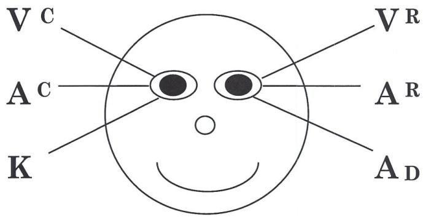

## ΚΙΝΗΣΕΙΣ ΤΩΝ ΜΑΤΙΩΝ ΣΕ ΕΝΑ ΦΥΣΙΟΛΟΓΙΚΑ ΟΡΓΑΝΩΜΕΝΟ-ΔΕΞΙΟΧΕΙΡΑ ΑΤΟΜΟ

(Έτσι φαίνονται όταν τους αντικρίζετε.)

Με βάση τις παρατηρήσεις των αρχικών ερευνητών, όταν οι άνθρωποι κοιτούν πάνω, οπτικοποιούν. Όταν κοιτούν οριζόντια προς τα αριστερά και δεξιά, είτε θυμούνται είτε κατασκευάζουν ήχους. Όταν κοιτούν προς τα κάτω και προς τα αριστερά μας, έχουν πρόσβαση στα συναισθήματά τους. Και όταν κοιτούν προς τα κάτω και προς τα δεξιά μας, μιλούν στον εαυτό τους (Auditory Digital). Το παραπάνω διάγραμμα είναι για ένα «κανονικό» δεξιόχειρα άτομο. Πολλοί αριστερόχειρες και ορισμένοι αμφιδέξιοι θα έχουν αντεστραμμένες κινήσεις των ματιών.


\rightline{\small 103}

# Vr

## Οπτικά Αναμνηστικό (Visual Remembered)

(Οπτική Ανάκληση) — Βλέποντας εικόνες από τη μνήμη, ανακαλώντας πράγματα που έχετε δει στο παρελθόν.

ΕΡΩΤΗΣΗ: «Τι χρώμα είχε το δωμάτιο στο οποίο μεγαλώσατε;» «Τι χρώμα έχει το υπνοδωμάτιό σας τώρα;» «Πώς μοιάζει το παλτό σας;»

# Vc

## Οπτικά Κατασκευασμένο (Visual Constructed)

(Οπτικά Δημιουργημένο) — Εικόνες πραγμάτων που δεν έχετε δει ποτέ πριν. Όταν το φτιάχνετε στο κεφάλι τους, χρησιμοποιείτε Οπτικά Κατασκευασμένο.

ΕΡΩΤΗΣΗ: «Πώς θα έμοιαζε το δωμάτιό σας στο σπίτι αν ήταν μπλε;» «Πώς θα έμοιαζε ο σκύλος σας αν είχε κεφάλι ελέφαντα;»

(Επιπλέον, ορισμένα άτομα έχουν οπτική πρόσβαση αποεστιάζοντας τα μάτια τους. Όταν συμβαίνει αυτό, τα μάτια συνήθως παραμένουν στο κέντρο.)

# Ar

## Ακουστικά Αναμνηστικό (Auditory Remembered)

(Ακουστική Ανάκληση) — Είναι όταν θυμάστε ήχους ή φωνές που έχετε ακούσει στο παρελθόν ή πράγματα που έχετε πει στον εαυτό σας στο παρελθόν. Όταν ρωτάτε κάποιον, «Ποιο ήταν το τελευταίο πράγμα που είπα», συνήθως κοιτάζει προς αυτή την κατεύθυνση.

ΕΡΩΤΗΣΗ: «Μπορείτε να θυμηθείτε τον ήχο της φωνής της μητέρας σας;»

# Ac

## Ακουστικά Κατασκευασμένο (Auditory Constructed)

(Ακουστικά Δημιουργημένο) — Είναι η κατασκευή ήχων που δεν έχετε ακούσει στο παρελθόν. Για παράδειγμα

ΕΡΩΤΗΣΗ: «Πώς θα ακουγόμουν αν είχα τη φωνή του Donald Duck;» «Πώς θα ακουγόταν η Λίμνη των Κύκνων αν παιζόταν σε γκάιντες;»

# K

## Κιναισθητικά (Kinesthetic)

(Συναισθήματα, Αίσθηση Αφής) — Γενικά κοιτάτε προς αυτή την κατεύθυνση όταν έχετε πρόσβαση στα συναισθήματά σας.

ΕΡΩΤΗΣΗ: «Πώς αισθάνεται όταν αγγίζετε εκείνο το χαλί;»

# Ad

## Ακουστικά Ψηφιακά (Auditory Digital)

(Μιλώντας στον Εαυτό σας) — Εδώ κινούνται τα μάτια σας όταν έχετε εσωτερικό διάλογο.

ΕΡΩΤΗΣΗ: «Μπορείτε να απαγγείλετε τον Όρκο Πίστης (Pledge of Allegiance);» «Έχετε ένα αγαπημένο ποίημα από το σχολείο;» «Μπορείτε να απαγγείλετε την προπαίδεια του 7;»

Τυπικά, κάθε φορά που έχουμε πρόσβαση στον εγκέφαλό μας, κινούμε τα μάτια μας προς εκείνη τη συγκεκριμένη κατεύθυνση που διευκολύνει τη χρήση εκείνου του μέρους της νευρολογίας μας. Ο νους και το σώμα είναι απολύτως διασυνδεδεμένα, οπότε κάθε φορά που έχουμε πρόσβαση στην Οπτική μας Μνήμη, για παράδειγμα, κινούμε τα μάτια μας προς τα πάνω και προς τα αριστερά μας. (Αν παρακολουθείτε κάποιον να έχει πρόσβαση στην Οπτική Μνήμη, θα τον δείτε να κινεί τα μάτια του προς τα πάνω και προς τα δεξιά σας.)

Με βάση το μοντέλο επικοινωνίας μας, και τον τρόπο με τον οποίο κατασκευάζουμε μια εσωτερική αναπαράσταση, θα θυμάστε ότι οι άνθρωποι βασίζονται στις 5 αισθήσεις τους για να φτιάξουν Ε/Α (I/R) για τον κόσμο γύρω τους. Εσωτερικά,


\rightline{\small 104}

γενικά καταλήγουμε να εξαρτώμαστε από ένα αναπαραστατικό σύστημα ή τροπικότητα περισσότερο από ένα άλλο καθώς προσπελαύνουμε πληροφορίες, και επίσης χρησιμοποιούμε αυτές τις πληροφορίες για να δημιουργήσουμε I/R. Έτσι, κάποιοι άνθρωποι χρησιμοποιούν περισσότερο το Οπτικό τους αναπαραστατικό σύστημα, κάποιοι χρησιμοποιούν περισσότερο το Ακουστικό τους αναπαραστατικό σύστημα, και κάποιοι χρησιμοποιούν το Κιναισθητικό τους περισσότερο από τα άλλα.

Συνήθως ένα άτομο θα προτιμά να χρησιμοποιεί μια συγκεκριμένη τροπικότητα ή θα χρησιμοποιεί κατά κύριο λόγο μια συγκεκριμένη τροπικότητα ως το πρωτεύον αναπαραστατικό του σύστημα. Ας περάσουμε από τους τρεις βασικούς τρόπους λειτουργίας ώστε να μπορείτε να παρατηρήσετε σε ποιον τρόπο λειτουργούν οι άνθρωποι, και να αρχίσετε να τους αναγνωρίζετε. Στη συνέχεια μπορείτε να αρχίσετε να ταιριάζετε τους τρόπους χρησιμοποιώντας τα κατηγορήματα και τη φυσιολογία που αντιστοιχούν στο αναπαραστατικό τους σύστημα.

## Οπτικός

Τυπικά, οι άνθρωποι που βρίσκονται σε οπτικό τρόπο στέκονται ή κάθονται με το κεφάλι και/ή το σώμα τους όρθιο με τα μάτια τους ψηλά, και αναπνέουν από το πάνω μέρος των πνευμόνων τους. Συχνά κάθονται μπροστά στην καρέκλα ή στην άκρη της καρέκλας. Τείνουν να είναι πιο οργανωμένοι, τακτικοί, καλοφτιαγμένοι και μεθοδικοί. Πιο μελετημένοι. Πιο προσανατολισμένοι στην εμφάνιση, και ορισμένες φορές πιο σιωπηλοί. Καλοί στην ορθογραφία. Απομνημονεύουν βλέποντας εικόνες, και αποσπώνται λιγότερο από τον θόρυβο. Συχνά δυσκολεύονται να θυμηθούν προφορικές οδηγίες, και βαριούνται με μακροσκελείς προφορικές εξηγήσεις γιατί το μυαλό τους τείνει να ταξιδεύει. Θα προτιμούσαν να διαβάσουν παρά να τους διαβάσουν. Ένας οπτικός άνθρωπος θα ενδιαφέρεται για το πώς τον κοιτάζει κάποιος, και θα ανταποκριθεί στο να τον πηγαίνουν σε μέρη και να του αγοράζουν πράγματα. Τείνουν να χρησιμοποιούν λέξεις όπως: τα λέμε, θέλω να το δω, να εστιάσω σε αυτό, να το παρακολουθήσω, να είμαι ξεκάθαρος, θολό, φαντάσου το, παρατήρησε, φαίνεται.

## Ακουστικός

Κάποιος που είναι ακουστικός θα κινεί τα μάτια του πλάγια καθώς και κάτω δεξιά. Αναπνέει από το μέσο του στήθους. Τυπικά μιλάει στον εαυτό του, και αποσπάται εύκολα από τον θόρυβο. Συχνά κινεί τα χείλη του όταν λέει λέξεις. Μπορεί να σας επαναλάβει πράγματα εύκολα. Μπορεί να βρίσκει τα μαθηματικά και το γράψιμο πιο δύσκολα και την προφορική γλώσσα πιο εύκολη. Τους αρέσει η μουσική και μαθαίνουν ακούγοντας. Απομνημονεύουν μέσω βημάτων, διαδικασιών και αλληλουχίας. Ένας ακουστικός άνθρωπος συχνά ενδιαφέρεται για το να του πουν πώς τα πάει, και ανταποκρίνεται σε ένα συγκεκριμένο σύνολο λέξεων ή τόνο της φωνής. Τείνουν να χρησιμοποιούν λέξεις και φράσεις όπως: άκου, μιλώ σε, είπε, μίλα, ακούω, και ακούγεται σαν, «Χάρηκα που σου μίλησα.»

## Κιναισθητικός

Τυπικά θα αναπνέουν από το κάτω μέρος των πνευμόνων τους, οπότε θα δείτε το στομάχι τους να ανεβοκατεβαίνει καθώς αναπνέουν. Η στάση τους είναι συχνά περισσότερο σκυφτή, και συχνά κινούνται και μιλάνε πολύύύ αργάάά. Τυπικά θα προσπελάσουν τα συναισθήματα και τις εκφράσεις τους για να «πάρουν μια αίσθηση» για το τι κάνουν. Ανταποκρίνονται σε σωματικές ανταμοιβές και άγγιγμα. Επίσης στέκονται κοντά στους ανθρώπους και τους αγγίζουν. Είναι συχνά σωματικά προσανατολισμένοι άνθρωποι (αθλητές). Μπορεί να κινούνται πολύ, και απομνημονεύουν κάνοντας, ή περπατώντας μέσα από κάτι. Χρησιμοποιούν λέξεις όπως: συναισθήματα, έλα σε επαφή, κράτα, άρπαξε, και χειρίσου.

Αυτά είναι τα χαρακτηριστικά των τριών βασικών τρόπων λειτουργίας. Και έτσι, το ερώτημα τώρα είναι, πώς τα χρησιμοποιείτε για να επικοινωνείτε με ανθρώπους; Πώς επικοινωνείτε με κάποιον που βρίσκεται κυρίως σε έναν από αυτούς τους τρόπους; Αυτό μας φέρνει στο θέμα του rapport.


\rightline{\small 105}

# RAPPORT

Σκεφτείτε το! Αν υπάρχει κάτι που θέλετε να αποκτήσετε, ή αν υπάρχει κάτι που χρειάζεστε, τότε πιθανότατα θα χρειαστείτε τη βοήθεια κάποιου για να το αποκτήσετε. Αυτό ισχύει είτε είστε πωλητής, δάσκαλος ή ακόμη και ξυλουργός. Ό,τι κι αν κάνετε, η ικανότητα να αναπτύσσετε και να διατηρείτε rapport με μεγάλο αριθμό ανθρώπων από ποικίλα υπόβαθρα θα σας επιτρέψει να αποκτάτε αυτό που θέλετε. Το να έχετε rapport με κάποιον θα σας επιτρέψει να κάνετε οτιδήποτε. Έτσι, το rapport είναι μάλλον η πιο σημαντική δεξιότητα στον πλανήτη.

Η βάση του rapport είναι ότι όταν οι άνθρωποι μοιάζουν μεταξύ τους, συμπαθούν ο ένας τον άλλον. Όταν οι άνθρωποι δεν μοιάζουν μεταξύ τους, δεν συμπαθούν ο ένας τον άλλον. Όταν συμπαθείτε κάποιον, είστε πρόθυμοι να τον βοηθήσετε να αποκτήσει ό,τι θέλει. Θυμηθείτε ότι το 38% όλης της επικοινωνίας είναι ο τόνος της φωνής, και το 55% είναι η φυσιολογία. Έτσι, το μεγαλύτερο μέρος της επικοινωνίας είναι εκτός της συνειδητής μας επίγνωσης. Υπάρχει τεράστια ευκαιρία επικοινωνίας εκτός των κανονικών διαύλων, και αυτό ακριβώς αφορά το rapport.

Για χάρη της αντίθεσης, παρακαλώ θυμηθείτε μια φορά που προσπελαύνατε τα συναισθήματά σας, βρισκόσασταν σε μια συναισθηματική κατάσταση ή ήσασταν ήρεμοι και ήσυχοι. Υπήρξε στιγμή που βρισκόσασταν σε αυτή την κατάσταση, και ίσως μπορείτε να ανακαλέσετε ότι βρισκόσασταν με ένα άλλο άτομο που βρισκόταν σε ενθουσιώδη (οπτική) κατάσταση. Θυμάστε τα συναισθήματα στο σώμα σας όταν αυτό συνέβη;

Ή μπορείτε να θυμηθείτε να βρισκόσασταν σε μια πραγματικά ενθουσιώδη (Οπτική) κατάσταση, και να μιλούσατε σε κάποιον σε μια πραγματικά αργή (Κιναισθητική) κατάσταση. Θυμάστε πώς σας έβγαζε εκτός εαυτού να περιμένετε το άλλο άτομο να σας προλάβει;

Παρακαλώ, θυμηθείτε ότι κανένας από αυτούς τους τρόπους λειτουργίας δεν είναι λανθασμένος, είναι απλά ο τρόπος που λειτουργούν οι άνθρωποι. Για να είστε ένας δάσκαλος επικοινωνητής, θα χρειαστεί επίσης να έχετε υπόψη ότι θα επικοινωνείτε καλύτερα με τους ανθρώπους, όταν χρησιμοποιείτε την πρωτεύουσα τους τροπικότητα.

Πολύ συχνά, ωστόσο, η επικοινωνία λαμβάνει χώρα σε ένα σύστημα όπου οι άνθρωποι αναντιστοιχίζουν ασυνείδητα τις τροπικότητες. Έτσι το πρώτο μεγάλο στοιχείο του rapport είναι να ταιριάξετε την τροπικότητα στην οποία βρίσκεται το άτομο.

Αν συναντάστε με κάποιον, για παράδειγμα, που βρίσκεται σε υψηλή οπτική κατάσταση, και εσείς δεν βρίσκεστε ακριβώς εκεί, καθίστε όρθιοι στην καρέκλα σας, αναπνεύστε από το πάνω μέρος των πνευμόνων σας, και να είστε ενθουσιώδεις. Ή τουλάχιστον φερθείτε με τρόπο που ταιριάζει σε αυτό που κάνουν. Από την άλλη πλευρά, αν συναντάστε με κάποιον που είναι ακουστικός, θα θέλετε να επιβραδύνετε λίγο, να διαμορφώσετε περισσότερο τη φωνή σας, και να «ακούσετε, να ακούσετε πραγματικά.» Αν συναντάστε με κάποιον που είναι κιναισθητικός, επιβραδύνετε πολύύύ. Και μιλήστε τους για συναισθήματα. Πράγματι αλλάξτε τον τόνο της φωνής σας ώστε να ταιριάζει με τον δικό τους, και πραγματικά «πάρτε μια αίσθηση γι' αυτό.»

Στις επόμενες δύο σελίδες υπάρχουν λίστες κατηγορημάτων και κατηγορηματικών φράσεων. Δείτε τες τώρα, και παρατηρήστε τις λέξεις και τις φράσεις που χρησιμοποιούν οι άνθρωποι σε κάθε βασικό αναπαραστατικό σύστημα. Σε κάθε βασικό αναπαραστατικό σύστημα, οι άνθρωποι χρησιμοποιούν διαφορετικές λέξεις, διαφορετικές φράσεις που στην πραγματικότητα αποκαλύπτουν τι συμβαίνει μέσα στο κεφάλι τους.


\rightline{\small 106}

<table><tr><th>VISUAL</th><th>AUDITORY</th><th>KINESTHETIC</th><th>UNSPECIFIED</th></tr><tr><td>see</td><td>hear</td><td>feel</td><td>sense</td></tr><tr><td>look</td><td>listen</td><td>touch</td><td>experience</td></tr><tr><td>view</td><td>sound(s)</td><td>grasp</td><td>understand</td></tr><tr><td>appear</td><td>make music</td><td>get hold of</td><td>think</td></tr><tr><td>show</td><td>harmonize</td><td>slip through</td><td>learn</td></tr><tr><td>dawn</td><td>tune in/out</td><td>catch on</td><td>process</td></tr><tr><td>reveal</td><td>be all ears</td><td>tap into</td><td>decide</td></tr><tr><td>envision</td><td>rings a bell</td><td>make contact</td><td>motivate</td></tr><tr><td>illuminate</td><td>silence</td><td>throw out</td><td>consider</td></tr><tr><td>imagine</td><td>be heard</td><td>turn around</td><td>change</td></tr><tr><td>clear</td><td>resonate</td><td>hard</td><td>perceive</td></tr><tr><td>foggy</td><td>deaf</td><td>unfeeling</td><td>insensitive</td></tr><tr><td>focused</td><td>mellifluous</td><td>concrete</td><td>distinct</td></tr><tr><td>hazy</td><td>dissonance</td><td>scrape</td><td>conceive</td></tr><tr><td>crystal</td><td>question</td><td>get a handle</td><td>know</td></tr><tr><td>picture</td><td>unhearing</td><td>solid</td><td></td></tr></table>


\rightline{\small 107}

<table><tr><th>VISUAL</th><th>AUDITORY</th><th>KINESTHETIC</th></tr><tr><td>An eyeful</td><td>Afterthought</td><td>All washed up</td></tr><tr><td>Appears to me</td><td>Blabbermouth</td><td>Boils down to</td></tr><tr><td>Beyond a shadow of a doubt</td><td>Clear as a bell</td><td>Chip off the old block</td></tr><tr><td>Bird's eye view</td><td>Clearly expressed</td><td>Come to grips with</td></tr><tr><td>Catch a glimpse of</td><td>Call on</td><td>Control yourself</td></tr><tr><td>Clear cut</td><td>Describe in detail</td><td>Cool/calm/collected</td></tr><tr><td>Dim view</td><td>Earful</td><td>Firm foundations</td></tr><tr><td>Flashed on</td><td>Give an account of</td><td>Get a handle on</td></tr><tr><td>Get a perspective on</td><td>Give me your ear</td><td>Get a load of this</td></tr><tr><td>Get a scope on</td><td>Grant an audience</td><td>Get in touch with</td></tr><tr><td>Hazy Idea</td><td>Heard voices</td><td>Get the drift of</td></tr><tr><td>Horse of a different color</td><td>Hidden message</td><td>Get your goat</td></tr><tr><td>In light of</td><td>Hold your tongue</td><td>Hand in hand</td></tr><tr><td>In person</td><td>Idle talk</td><td>Hang in there</td></tr><tr><td>In view of</td><td>Inquire into</td><td>Heated argument</td></tr><tr><td>Looks like</td><td>Keynote speaker</td><td>Hold it!</td></tr><tr><td>Make a scene</td><td>Loud and clear</td><td>Hold on!</td></tr><tr><td>Mental image</td><td>Manner of speaking</td><td>Hothead</td></tr><tr><td>Mental picture</td><td>Pay attention to</td><td>Keep your shirt on</td></tr><tr><td>Mind's eye</td><td>Power of speech</td><td>Know-how</td></tr><tr><td>Naked eye</td><td>Purrs like a kitten</td><td>Lay cards on table</td></tr><tr><td>Paint a picture</td><td>State your purpose</td><td>Pain-in the neck</td></tr><tr><td>See to it</td><td>Tattle-tale</td><td>Pull some strings</td></tr><tr><td>Short sighted</td><td>To tell the truth</td><td>Sharp as a tack</td></tr><tr><td>Showing off</td><td>Tongue-tied</td><td>Slipped my mind</td></tr><tr><td>Sight for sore eyes</td><td>Tuned in/tuned out</td><td>Smooth operator</td></tr><tr><td>Staring off into space</td><td>Unheard of</td><td>So-so</td></tr><tr><td>Take a peek</td><td>Utterly</td><td>Start from scratch</td></tr><tr><td>Tunnel vision</td><td>Voiced an opinion</td><td>Stiff upper lip</td></tr><tr><td>Under your nose</td><td>Well informed</td><td>Stuffed shirt</td></tr><tr><td>Up front</td><td>Within hearing</td><td>Too much of a hassle</td></tr><tr><td>Well defined</td><td>Word for word</td><td>Topsy-turvy</td></tr><tr><td></td><td></td><td>Underhanded</td></tr></table>


\rightline{\small 108}

Το **δεύτερο** στοιχείο του rapport είναι ο **σωματικός κατοπτρισμός** της φυσιολογίας του ατόμου. Το να αντιγράφετε πραγματικά σωματικά τη στάση τους, τις εκφράσεις του προσώπου τους, τις χειρονομίες και τις κινήσεις των χεριών τους, και το ανοιγόκλεισμα των ματιών τους θα κάνει το σώμα τους να πει ασυνείδητα στο μυαλό τους, «Έλα, αυτός/αυτή είναι σαν εμένα!» Είναι αδιαμφισβήτητο για το νευρικό σύστημα.

Το **τρίτο** στοιχείο είναι να **ταιριάξετε τη φωνή τους**: Τον τόνο, το τέμπο, τη χροιά (την ποιότητα της φωνής) και την ένταση. Μπορείτε επίσης να ταιριάξετε τις λέξεις-κλειδιά τους. Ίσως λένε συχνά, «Στην πραγματικότητα.» Μπορείτε να τη χρησιμοποιήσετε σε μια πρόταση αρκετές φορές. Πείτε τη πίσω σε αυτούς.

Το **τέταρτο** στοιχείο είναι να **ταιριάξετε την αναπνοή τους**. Μπορείτε πραγματικά να ρυθμίσετε την αναπνοή κάποιου αναπνέοντας ακριβώς την ίδια στιγμή με αυτόν (ταιριάζοντας την εισπνοή και την εκπνοή). Με το να ταιριάζετε την αναπνοή τους, ρυθμίζοντας την αναπνοή τους, μπορείτε στη συνέχεια να αρχίσετε να τους οδηγείτε εκτός του αναπαραστατικού συστήματος στο οποίο βρίσκονται, σε ένα άλλο.

Το **πέμπτο** στοιχείο είναι να **ταιριάξετε το μέγεθος των κομματιών πληροφορίας** (μέγεθος chunk ή επίπεδο αφαίρεσης) με τα οποία ασχολούνται. Αν κάποιος συνήθως ασχολείται με τη γενική εικόνα, πιθανώς θα βαρεθεί με τις λεπτομέρειες. Από την άλλη πλευρά κάποιος που είναι των λεπτομερειών θα θεωρήσει ότι δεν υπάρχουν αρκετές πληροφορίες για να ασχοληθεί, αν του δώσετε μόνο τη γενική εικόνα. Έτσι βεβαιωθείτε ότι ταιριάζετε τα κομμάτια περιεχομένου με τα οποία ασχολείται το άτομο.

Το **έκτο** στοιχείο είναι να **ταιριάξετε τις κοινές τους εμπειρίες**. Αυτό είναι που συνήθως αποκαλείται rapport. Όταν οι άνθρωποι συναντώνται για πρώτη φορά, συχνά η πρώιμη σχέση τους αφορά την αντιστοίχιση κοινών εμπειριών, κοινών ενδιαφερόντων, υπόβαθρου, και πεποιθήσεων και αξιών και των ιδεολογιών τους και κοινών συσχετισμών.

Αυτά είναι τα κρίσιμα στοιχεία του rapport. Στη συνέχεια, πώς εδραιώνω rapport, και έπειτα πώς ξέρω πότε είμαι σε rapport;

Για να εδραιώσετε rapport, η διαδικασία είναι να ταιριάξετε και να καθρεφτίσετε πλήρως ό,τι κάνει το άλλο άτομο. Όταν εκπαιδεύω ανθρώπους σε δεξιότητες rapport συχνά ρωτούν, «Λοιπόν πώς μπορώ να το κάνω αυτό, θα νομίζουν ότι τους κοροϊδεύω.» Πράγματι πρέπει να είστε διακριτικοί όταν κάνετε ταίριασμα και καθρεφτισμό, αλλά τυπικά οι περισσότεροι άνθρωποι βρίσκονται σε έκσταση όταν μιλούν ούτως ή άλλως. Είναι τόσο απορροφημένοι σε αυτό που θα πουν στη συνέχεια που σπάνια αντιλαμβάνονται πλήρως τι κάνετε. Και αν το κάνουν, μπορείτε να γελάσετε καλά γι' αυτό.

Η **Calibration (Βαθμονόμηση)** είναι ένας τρόπος για να ελέγξετε αν είστε σε rapport με κάποιον. Απλά, αυτό σημαίνει ότι πρέπει να αναπτύξετε την αισθητηριακή σας οξύτητα σε τέτοιο βαθμό ώστε να μπορείτε να αρχίσετε να βλέπετε τις αντιδράσεις των ανθρώπων στην επικοινωνία σας. Παρατηρήστε τα μάτια τους, τους μύες γύρω από τα μάτια, το κάτω χείλος, το χρώμα του προσώπου και των χεριών, την αναπνοή. Όλα αυτά είναι δείκτες του rapport.

Επιπλέον υπάρχουν ορισμένοι δείκτες που συμβαίνουν στο δικό σας σώμα τους οποίους μπορείτε να παρατηρήσετε. Καθώς αρχίζετε να μπαίνετε σε rapport, υπάρχει μια συγκεκριμένη, ειδική φυσιολογική αίσθηση που αρχίζει να εμφανίζεται στο σώμα. Συμβαίνει στην περιοχή των ποδιών, και του στήθους, και θα μπορούσε σχεδόν να περιγραφεί ως αίσθηση νευρικότητας ή προσμονής. Το επόμενο πράγμα που συμβαίνει είναι ότι μπορείτε να αισθανθείτε το χρώμα στο δικό σας πρόσωπο να αρχίζει να αλλάζει. Είναι μια αίσθηση ζεστασιάς στο πρόσωπο που ανεβαίνει από τον λαιμό. Καθώς το παρατηρείτε αυτό, μπορείτε επίσης να παρατηρήσετε, εντός περίπου ενός λεπτού, το χρώμα στο πρόσωπο του άλλου ατόμου να αυξάνεται. Η αλλαγή χρώματος συνήθως συμβαίνει ένα λεπτό αφού παρατηρήσετε τις εσωτερικές αισθήσεις. Συνήθως εντός ενός ακόμη λεπτού περίπου, το άτομο με το οποίο μιλάτε θα πει κάτι σαν, «...και (το όνομά σας), ο καλός μου φίλος εδώ...» ή «Νιώθω σαν να σε ξέρω χρόνια...» Μπορεί ακόμη και να χρησιμοποιήσουν τη λέξη «rapport» ή «εμπιστοσύνη» για να περιγράψουν αυτό που βιώνουν.

Ακόμη και αν δεν έχετε εμπειρία αυτών των δεικτών του rapport, υπάρχει άλλος ένας τρόπος που μπορείτε να καταλάβετε. Αυτή η διαδικασία είναι η ρύθμιση και η καθοδήγηση του άλλου ατόμου. Αφού έχετε ταιριάξει και καθρεφτίσει ένα


\rightline{\small 109}

άτομο για, ας πούμε, 5 ή 10 λεπτά, μπορείτε στη συνέχεια να αρχίσετε να το οδηγείτε και να οδηγείτε τη συμπεριφορά του. Η επιτυχημένη καθοδήγηση είναι ένας ακόμη τρόπος για να καταλάβετε αν είστε σε rapport με κάποιον.

Η εδραίωση rapport είναι επίσης σημαντική στην περίπτωση των διαπροσωπικών σχέσεων, ας πούμε με ένα μέλος του αντίθετου φύλου. Αυτό που θα θέλατε να κάνετε πρώτα απ' όλα είναι να εδραιώσετε rapport μαζί τους. Μπείτε σε rapport. Ταιριάξτε και καθρεφτίστε τους ώστε να αρχίσουν να σας εμπιστεύονται, να αισθάνονται καλά για εσάς, και να έχουν καλές εσωτερικές αναπαραστάσεις για το ποιοι είστε. Μπορεί να θυμάστε φορές που έχετε κάνει το αντίθετο, εγώ σίγουρα. Και είμαι βέβαιος ότι το άλλο άτομο νόμιζε ότι ήμουν ένας τελείως ανίκανος άνθρωπος (στην καλύτερη περίπτωση). Στη χειρότερη περίπτωση, δεν υπάρχει εμπιστοσύνη. Το rapport είναι μια σημαντική διαδικασία τόσο στις επιχειρήσεις όσο και στις διαπροσωπικές σχέσεις.

Οι ακόλουθες ασκήσεις είναι για να σας βοηθήσουν να αναπτύξετε την ικανότητά σας να αποκτάτε rapport με άλλους ανθρώπους:

1. Εδραιώστε rapport με όσο περισσότερους ανθρώπους μπορείτε την επόμενη εβδομάδα. Για παράδειγμα, εξασκηθείτε όταν πηγαίνετε σε ένα εστιατόριο, εδραιώστε rapport με τον maitre d', και με τον σερβιτόρο ή τη σερβιτόρα σας.
2. Ταιριάξτε και καθρεφτίστε κάποιον κοντά σας σε ένα εστιατόριο, ή όπου κι αν βρίσκεστε. Παρατηρήστε αν μπορείτε να εδραιώσετε rapport.
3. Όταν πηγαίνετε σε έναν πάγκο για να αγοράσετε κάτι, εξασκηθείτε στο να εδραιώνετε «στιγμιαίο» rapport (είναι εφικτό).
4. Παρατηρήστε τη φυσιολογία των ανθρώπων για μια ολόκληρη εβδομάδα. Για παράδειγμα τη Δευτέρα, παρατηρήστε το χρώμα· την Τρίτη, παρατηρήστε τα κάτω χείλη, κ.λπ.

Για να κατακτήσετε τη δεξιότητα του rapport, είναι σημαντικό να μάθετε την ικανότητα να αποκτάτε στιγμιαίο rapport με οποιονδήποτε. Έμενα στο Anchorage της Alaska κάποτε το καλοκαίρι, και μια σειρά γεγονότων με είχε βάλει σε μια κατάσταση όπου χρειαζόμουν να έχω δωμάτιο ξενοδοχείου, και δεν είχα προηγούμενη κράτηση. Τηλεφώνησα σε αρκετά μεγάλα ξενοδοχεία «επώνυμων εταιρειών» στον τηλεφωνικό κατάλογο, και τα βρήκα όλα κλεισμένα. Έτσι όταν με κυρίευσε ο πανικός, άρχισα να τηλεφωνώ στα τυφλά, και βρήκα ένα ξενοδοχείο που είχε χώρο. Όταν έφτασα στο ξενοδοχείο, ανακάλυψα ότι δεν ήταν το είδος του ξενοδοχείου που πραγματικά θα έμενα. Στην πραγματικότητα, άρχισα να αισθάνομαι ότι το να μένω εκεί ΔΕΝ ήταν άσκηση της προσωπικής μου δύναμης. Αποφάσισα ότι χρειαζόμουν ένα δωμάτιο ξενοδοχείου, και το χρειαζόμουν τώρα!

Έτσι, επέστρεψα σε ένα ξενοδοχείο «επώνυμης εταιρείας» στο οποίο είχα ήδη τηλεφωνήσει και μου είχαν πει ότι δεν υπήρχε δωμάτιο, ότι ήταν 150% κλεισμένο. Πήγα στη ρεσεψιόν, και ταίριαξα και καθρέφτισα την κοπέλα πίσω από τη ρεσεψιόν. Καθώς ξεκινήσαμε τη συνομιλία μας, μίλησα όπως φανταζόμουν ότι θα μιλούσε εκείνη. Σχεδόν αμέσως, είδα το χρώμα του προσώπου της να αλλάζει. Σε εκείνο το σημείο, ήξερα ότι είχα εδραιώσει rapport. Είπε, «Θα κάνω ό,τι χρειάζεται για να σου βρω ένα δωμάτιο.» Πέρασε μισή ώρα «βρίσκοντας» μου ένα δωμάτιο. Μίλησε στον μάνατζερ δύο φορές, και πήρα το δωμάτιό μου. Όχι μόνο εδραίωσα rapport, αλλά δύο μέρες αργότερα όταν ένας φίλος ήρθε να με παραλάβει από το ξενοδοχείο, πέρασε αρκετά λεπτά λέγοντάς του τι υπέροχος άνθρωπος ήμουν. Και της είχα μιλήσει μόνο για δέκα λεπτά!

Αν εξασκηθείτε σε αυτές τις δεξιότητες θα αναπτύξετε την ικανότητα να μπαίνετε σε στιγμιαίο rapport με ΟΠΟΙΟΝΔΗΠΟΤΕ. Είχα μόλις τελειώσει μια εκπαίδευση στο rapport, και πήγαινα για μεσημεριανό με έναν από τους μαθητές μου. Πηγαίναμε σε ένα εστιατόριο για μεσημεριανό περίπου 1 1/2 ώρα πριν από ένα απογευματινό ραντεβού. Όταν φτάσαμε στο εστιατόριο, η κοπέλα πίσω από τον πάγκο είπε, με το κεφάλι της να κοιτάζει κάτω στο πρόγραμμα, «Θα είναι τουλάχιστον 20 λεπτά.» Και είπα στον εαυτό μου, «Ωχ, ήρθε η ώρα για rapport!» Καθώς κοίταξα τον φίλο μου, τον είδα να την ταιριάζει και να την καθρεφτίζει, και αποφάσισα να δω τι θα συμβεί. Όταν τον κοίταξε, μπήκε σε στιγμιαίο rapport και το χρώμα του προσώπου της άλλαξε αμέσως, χαμογέλασε και είπε, «Σας πειράζει ένα τραπέζι στους μη καπνίζοντες;» Είπαμε, «Όχι.» Και μας πήγε στις θέσεις μας αμέσως!

Δυνατά πράγματα!


\rightline{\small 110}

Ορίστε άλλη μία άσκηση! Αυτή περιλαμβάνει δύο άτομα. Το άτομο "Α" αρχίζει να αφηγείται στο άτομο "Β" μια εργασιακή ή προσωπική εμπειρία. Το άτομο Β εναρμονίζεται και καθρεφτίζει το άτομο Α. Εδραιώστε πλήρως επαφή (rapport). Και τα δύο, Α και Β, παρατηρούν την εναρμόνιση και την απουσία εναρμόνισης στα οπτικά σημάδια ματιών, στους κατηγορηματικούς όρους και σε άλλα στοιχεία της επαφής. Παρατηρήστε επίσης τα αισθήματα άνεσης και δυσφορίας καθώς εμφανίζονται. Παρατηρήστε τι συμβαίνει εσωτερικά στο σώμα σας καθώς και εξωτερικά, καθώς προχωράτε την άσκηση. Παρατηρήστε τα αισθήματα καθώς εισέρχεστε σε επαφή. Μετά από περίπου 3-5 λεπτά, θα πρέπει να παρατηρήσετε τα φυσιολογικά αισθήματα της επαφής. Παρατηρήστε τα. Αναζητήστε επίσης τα εξωτερικά σημάδια της επαφής.

## ΠΡΟΣΒΑΣΗ ΣΕ ΘΕΤΙΚΕΣ ΚΑΤΑΣΤΑΣΕΙΣ

Βάσει των πληροφοριών μέχρι τώρα, είμαστε έτοιμοι να ανακαλύψουμε πώς να φέρνουμε τους ανθρώπους σε μια κατάσταση. Στην πραγματικότητα, αν κάνατε την άσκηση επαφής, ήδη ξέρετε πώς να φέρνετε τους ανθρώπους σε κατάσταση. Η διαδικασία της εισόδου σε επαφή με κάποιον πράγματι τον φέρνει σε αυτήν. Στην πραγματικότητα, αν εναρμονίζεστε και καθοδηγείτε το άτομο, απλώς το γεγονός ότι εσείς εισέρχεστε σε μια κατάσταση θα το φέρει σε εκείνη την κατάσταση. (Θυμηθείτε, μια κατάσταση αποτελείται από ένα Ε/Α (I/R) και μια φυσιολογία.)

Έτσι, το πρώτο βήμα για να φέρετε τους ανθρώπους σε κατάσταση είναι να εδραιώσετε επαφή. Το δεύτερο βήμα είναι να φέρετε τον εαυτό σας στην κατάσταση που θέλετε να εδραιώσετε σε αυτούς.

Το επόμενο βήμα είναι να πείτε: "Μπορείς να θυμηθείς μια στιγμή που ήσουν;.. (η κατάσταση στην οποία θέλεις να αποκτήσει πρόσβαση)." Για παράδειγμα: "Μπορείς να θυμηθείς μια στιγμή που πήρες μια απόφαση εύκολα και γρήγορα, όταν ήσουν εντελώς αποφασιστικός;.. (για αποφασιστικότητα)." Ή: "μπορείς να ανακαλέσεις μια στιγμή που αγόρασες κάτι με το οποίο ήσουν πολύ ευχαριστημένος;.. (για κατάσταση αγοράς)."

Αυτό που θα συμβεί είναι ότι οι άνθρωποι θα μπουν κυριολεκτικά μέσα τους και θα κάνουν μια αναζήτηση στη μνήμη τους για να ανακαλύψουν εκείνη τη συγκεκριμένη στιγμή. Αν τους βάλετε να κάνουν αρκετά από αυτό (όπως ευτυχισμένη κατάσταση αγοράς), θα συνδέσουν (ή θα συνδέσουν με σύνδεσμο) εσάς με εκείνη την κατάσταση.

Μπορεί να προκύψει η ερώτηση, τι γίνεται αν αντιστέκονται ή σας ρωτήσουν: "Γιατί με ρωτάς αυτά τα πράγματα;" Μου συνέβη αυτό μια φορά όταν ενέγραφα έναν νέο πελάτη. Και του ζητούσα να ανακαλέσει διάφορα εξωφρενικά πράγματα. Είπε: "Δεν μπορώ να πιστέψω ότι κάθομαι εδώ και απαντώ σε όλες αυτές τις τρελές σου ερωτήσεις!" Είπα: "Το ξέρω! Ούτε εγώ μπορώ να το πιστέψω! Γιατί το κάνεις αυτό;" Απάντησε: "Ξέρεις, απλά νιώθω πολύ κοντά σου." Οι Bandler και Grinder λένε: "Δεν υπάρχουν ασθενείς που αντιστέκονται, μόνο θεραπευτές που αντιστέκονται." Έτσι, πριν κάνετε εξωφρενικές ερωτήσεις, εδραιώστε επαφή. Τότε μπορείτε να κάνετε οτιδήποτε, και θα σας το συγχωρήσουν.

Ένα ακόμη πράγμα που μπορείτε να κάνετε εκ των προτέρων είναι να ορίσετε το πλαίσιο για αυτό που πρόκειται να κάνετε. Ορίστε μερικά ωραία πλαίσια για να τοποθετήσετε γύρω από τη διαδικασία να φέρετε κάποιον σε κατάσταση:

"Καθώς καθόμαστε εδώ και μιλάμε για την επιχείρησή σας, αρχίζω να αναρωτιέμαι αν θα ήταν κατάλληλο να σας ζητήσω τώρα, να ανακαλέσετε μια στιγμή..."

"Αυτό μου θυμίζει, μπορείς να θυμηθείς μια στιγμή που ήσουν εντελώς αποφασιστικός, τώρα..."

"Ξέρεις, αναρωτιόμουν, μπορείς να ανακαλέσεις μια στιγμή που πήρες μια επιχειρηματική απόφαση που ήταν μια μεγάλη νίκη για σένα και σου έφερε πολλά χρήματα;"

"Και καθώς σου κάνω τόσες πολλές ερωτήσεις, μπορεί να αναρωτηθείς πώς θα ήταν να είσαι πελάτης, και καθώς αναρωτιέσαι, αν μπορούσες απλά να φανταστείς ότι είσαι πελάτης τώρα, πιθανότατα θα διαπίστωνες ότι θα ήταν ευκολότερο να πάρεις τη σωστή απόφαση..."

"Το ότι μου λες για την επιχείρησή σου μου θυμίζει μια εποχή που εγώ (παύση), λοιπόν, αναρωτιέμαι αν μπορείς να θυμηθείς μια στιγμή που ήσουν εντελώς ικανοποιημένος με μια αγορά που μόλις είχες κάνει."


\rightline{\small 111}

Και θα σας υποχρεώσουν εισερχόμενοι ακριβώς σε εκείνη την κατάσταση.

Θυμηθείτε ότι μια κατάσταση αποτελείται από μια εσωτερική αναπαράσταση και μια φυσιολογία. Έτσι, το να τους ζητήσετε να φτιάξουν μια εσωτερική αναπαράσταση μιας στιγμής όταν ήταν (για παράδειγμα) ικανοποιημένοι με κάτι, τους επαναφέρει ακριβώς σε εκείνη την κατάσταση. Και όταν έχετε πρόσβαση σε μια κατάσταση, αυτό που θέλετε να κάνετε στη συνέχεια είναι να την αγκυρώσετε.

# ΑΓΚΥΡΩΣΗ (ANCHORING)

Έτσι, όταν έχετε πρόσβαση σε μια κατάσταση, το επόμενο βήμα είναι να την αγκυρώσετε. Και θυμηθείτε ότι μια αυθόρμητη κατάσταση είναι συνήθως πιο ισχυρή από μία που προκαλείται. Όποτε βρίσκετε μια κατάσταση που μπορείτε να χρησιμοποιήσετε (είτε είναι σε εσάς είτε σε κάποιον άλλον), μπορείτε να την αγκυρώσετε.

Τι είναι μια άγκυρα; Η έννοια της Αγκύρωσης (Anchoring) προέρχεται από τον Pavlov. Θυμάστε τα σκυλιά του Pavlov; Αυτό που έκανε ο Pavlov με τα σκυλιά του ήταν ότι χτυπούσε ένα κουδούνι και έδειχνε στα σκυλιά μια μπριζόλα. Χτυπούσε το κουδούνι και τους έδειχνε μια μπριζόλα. Στη συνέχεια χτυπούσε το κουδούνι, και τα σκυλιά έβγαζαν σάλια ακριβώς σαν να είχαν μόλις δει μια μπριζόλα. Ο Pavlov συνήγαγε τη θεωρία του ερεθίσματος-απόκρισης από αυτό το πείραμα. Το κουδούνι ήταν στην πραγματικότητα μια άγκυρα. Αυτό που είχε κάνει ήταν να εγκαταστήσει μια άγκυρα για τα σκυλιά.

Μια άγκυρα συμβαίνει κάθε φορά που ένα άτομο βρίσκεται σε μια έντονη κατάσταση, και στην κορύφωση εκείνης της έντονης κατάστασης ή εκείνης της εμπειρίας εφαρμόζεται σταθερά ένα συγκεκριμένο ερέθισμα, η κατάσταση και το συγκεκριμένο ερέθισμα συνδέονται νευρολογικά έτσι ώστε η κατάσταση να μπορεί να παράγεται συνεχώς ενεργοποιώντας το ερέθισμα.

Υπάρχουν τέσσερα βήματα στην αγκύρωση:

1. Το πρώτο βήμα είναι να φέρετε το άτομο σε κατάσταση. Μπορείτε να χρησιμοποιήσετε μια αυθόρμητη κατάσταση, ή μια προκληθείσα κατάσταση ("Μπορείς να θυμηθείς μια στιγμή..."). Είναι σημαντικό η κατάσταση να είναι πλήρως συσχετισμένη. Πράγμα που σημαίνει ότι το άτομο είναι μέσα στο σώμα του, κοιτάζοντας μέσα από τα δικά του μάτια (σε αντίθεση με το να βλέπει το σώμα του από έξω). Είναι επίσης σημαντικό η κατάσταση να είναι έντονη και συμβατή.

Ορίστε κάποια συγκεκριμένη γλώσσα για να φέρετε το άτομο σε μια έντονη και συμβατή κατάσταση. "Μπορείς να ανακαλέσεις μια στιγμή που ήσουν εντελώς Χ; Μπορείς να θυμηθείς μια συγκεκριμένη στιγμή; Καθώς πηγαίνεις πίσω σε εκείνη τη στιγμή, μπορείς να μπεις στο σώμα σου και να δεις αυτό που είδες μέσα από τα δικά σου μάτια, να ακούσεις αυτό που άκουσες και να νιώσεις τα συναισθήματα που ένιωσες όταν ήσουν εντελώς Χ;"

Οι άνθρωποι μπαίνουν σε καταστάσεις με διαφορετικούς ρυθμούς, οπότε είναι σημαντικό να βαθμονομήσετε την κατάσταση, ή μπορείτε να τους ζητήσετε να σας πουν πότε βρίσκονται πλήρως μέσα στην κατάσταση, στην κορύφωση της εμπειρίας. Μπορείτε να τους ζητήσετε να γνέψουν, να κουνήσουν το κεφάλι τους, ή ένα δάχτυλο, ή ένα πόδι ή οτιδήποτε άλλο.

2. Το δεύτερο βήμα, όταν βρίσκονται στην κορύφωση, είναι να παρέχετε ένα συγκεκριμένο ερέθισμα. Παρέχετε ένα συγκεκριμένο ερέθισμα και εφαρμόστε το σταθερά. Όταν βρίσκονται στην κορύφωση εκείνης της εμπειρίας, η άγκυρα θα πρέπει στην πραγματικότητα να τελειώνει:

# ΕΦΑΡΜΟΓΗ ΜΙΑΣ ΑΓΚΥΡΑΣ:

Παρατηρήστε ότι καθώς η κατάσταση αρχίζει να κορυφώνεται, η άγκυρα πρέπει να εφαρμόζεται. Πρέπει να ξεκινά λίγο πριν, και να τελειώνει ακριβώς στην κορύφωση ή λίγο πριν. Μια άγκυρα πρέπει να εφαρμόζεται για 5 έως 15 δευτερόλεπτα, οπότε χρησιμοποιώντας μια φυσιολογική (κιναισθητική) άγκυρα θα κρατούσατε το άγγιγμα έως 15 δευτερόλεπτα. Αυτό που μπορεί να θέλετε να κάνετε, προκειμένου να επιτύχετε μια πολύ έντονη (θετική) κατάσταση όταν δουλεύετε με κάποιον, είναι να "στοιβάξετε" κυριολεκτικά άγκυρες. Έτσι μπορείτε να πείτε,

a) "Μπορείς να ανακαλέσεις μια στιγμή που ήσουν εντελώς ικανός;"

b) "Μπορείς να ανακαλέσεις μια στιγμή που σε αγαπούσαν εντελώς;"


\rightline{\small 112}

c) "Μπορείς να ανακαλέσεις μια στιγμή που ήσουν εντελώς δυνατός;"
d) "Μπορείς να ανακαλέσεις μια στιγμή που γέλασες υστερικά;"

Όταν έχετε πρόσβαση σε εκείνη την κατάσταση, αγκυρώστε την. Αγκυρώστε όλες τις καταστάσεις αγγίζοντας το άτομο στο ίδιο σημείο με ακριβώς τον ίδιο τρόπο.

3. Το επόμενο βήμα είναι να **αλλάξετε την κατάσταση του ατόμου**. Βάλτε το να βγει από την κατάσταση στην οποία βρισκόταν. Ίσως βάλτε το να περπατήσει λίγο. Τουλάχιστον βάλτε το να πάρει μια βαθιά ανάσα.

4. **Ενεργοποιήστε την άγκυρα** εφαρμόζοντάς την με ακριβώς τον ίδιο τρόπο, και ανακαλύψτε αν επανέρχεται στην κατάσταση.

Υπάρχουν **πέντε κλειδιά για την επιτυχημένη αγκύρωση**:

1. Το πρώτο είναι η **ένταση** της απόκρισης, ή η συμβατότητα της κατάστασης. Στην αγκύρωση, αναζητάμε μια πλήρως **συσχετισμένη έντονη κατάσταση**. Μπορεί να ρωτήσετε: "Βλέπεις τον εαυτό σου ή είσαι μέσα στο δικό σου σώμα;" Θέλουμε να είναι μέσα στο δικό τους σώμα (συσχετισμένοι).

2. Το δεύτερο στοιχείο είναι ο **χρονισμός** της άγκυρας. Η άγκυρα πρέπει να εφαρμόζεται ακριβώς πριν από την κορύφωση. Αν την κρατήσετε για πολύ, τότε μπορεί να διαπιστώσετε ότι το άτομο έχει ξεπεράσει την πρώτη εμπειρία και έχει εισέλθει σε μια δεύτερη, σε μια άλλη κατάσταση, και οι δύο καταστάσεις μπορεί να συνδεθούν.

3. Το ερέθισμα πρέπει επίσης να είναι μοναδικό. Η **μοναδικότητα** του ερεθίσματος είναι σημαντική γιατί αν εγκαταστήσετε μια άγκυρα σε μια περιοχή του σώματος (υποθέτοντας κιναισθητική άγκυρα) που αγγίζεται πολύ, όπως μια χειραψία, τότε η άγκυρα θα εξασθενήσει με τον χρόνο (θα αραιωθεί) γιατί θα ενεργοποιείται από άλλους ανθρώπους. Έτσι θα θέλετε να παρέχετε μια άγκυρα που βρίσκεται σε μια μοναδική περιοχή του σώματος. Συχνά ένας επαγγελματίας του NLP θα χρησιμοποιήσει ένα αυτί για να εγκαταστήσει μια άγκυρα ή θα σας ζητήσει να βάλετε μια σειρά από θετικές άγκυρες σε μια γροθιά.

Πόσο διαρκεί μια άγκυρα εξαρτάται συγκεκριμένα από το πόσο μοναδική είναι η τοποθεσία. Αν δεν είναι έντονη κατάσταση αυτή που αγκυρώνετε, ή αν δεν την έχετε στοιβάξει, τότε η άγκυρα θα φθαρεί ή θα αραιωθεί πιο γρήγορα. Αν η τοποθεσία δεν είναι μοναδική μπορεί να ενεργοποιηθεί τόσες πολλές φορές που δεν θα λειτουργήσει ξανά, γιατί δεν θα συνδέεται με τη συγκεκριμένη κατάσταση.

4. Το τελευταίο κλειδί είναι η **αναπαραγωγή** του ερεθίσματος. Ο τρόπος με τον οποίο εφαρμόζετε την άγκυρα κατά την εγκατάστασή της και κατά την ενεργοποίησή της για δοκιμή, πρέπει να είναι ακριβώς ο ίδιος κάθε φορά. Έτσι αν χτυπάτε τα δάχτυλά σας ή δίνετε ένα συγκεκριμένο βλέμμα, πρέπει να το κάνετε με τον ίδιο τρόπο κάθε φορά. Αυτή η άγκυρα πρέπει να επιστρέφεται στο άτομο με ακριβώς τον ίδιο τρόπο που εγκαταστάθηκε.

5. Το πέμπτο κλειδί είναι ο **αριθμός των φορών**. Δηλαδή: Πόσες φορές στοιβάξατε την άγκυρα.

## ΚΑΤΑΡΡΕΥΣΗ ΑΓΚΥΡΩΝ

Όλη η ανθρώπινη αλλαγή (Όλη; Ναι, όλη.) δεν είναι τίποτα περισσότερο από μια ενσωμάτωση πόρων ή μια κατάρρευση πραγματικοτήτων, της μιας μέσα στην άλλη. Η συγκεκριμένη διαδικασία της κατάρρευσης αγκύρων περιλαμβάνει τη λήψη μιας αρνητικής κατάστασης και την ενσωμάτωση ή κατάρρευσή της σε μια θετική κατάσταση. Κάνοντας αυτό δίνεται στο άτομο με το οποίο ασχολούμαστε περισσότερη νευρολογική επιλογή. Ένα από τα κύρια αξιώματα του NLP είναι να αυξάνει τις επιλογές που έχει ένα άτομο.

Έτσι, αν βρούμε για παράδειγμα ότι κάθε φορά που ένας συγκεκριμένος πωλητής βγαίνει για να κάνει μια πώληση γίνεται αρνητικός. Μπορεί να είναι επειδή ανακαλεί όλες τις φορές που έχει αποτύχει. Αν τα δύο συνδέονται, μπορούμε να καταρρεύσουμε τη συσχέτιση πωλήσεων και αποτυχίας, με μια νικηφόρα στάση, και να δώσουμε στον πωλητή την επιλογή να νιώθει καλά και για την πώληση. Η διαδικασία της κατάρρευσης αγκύρων θα ελευθερώσει τον πωλητή από την αναγκαιότητα να πρέπει να έχει πρόσβαση στην αρνητική κατάσταση κάθε φορά που βγαίνει και κάνει μια κλήση πώλησης.


\rightline{\small 113}

Η διαδικασία της κατάρρευσης αγκυρών είναι μία από τις πιο ισχυρές διαδικασίες στο NLP, και αυτή η τεχνική μπορεί επίσης να χρησιμοποιηθεί για την κατάρρευση αγκυρών από μόνοι σας, και είναι επίσης εύκολη στη χρήση.

1. Ζητήστε από το άτομο να ανακαλέσει μια σειρά από θετικές εμπειρίες, και αγκυρώστε την κάθε μία. Συσσωρεύστε τις αγκύρες. Για παράδειγμα, όταν δεν μπορούσαν να χάσουν, όταν ένιωθαν δυνατοί, όταν ήξεραν ότι μπορούσαν να τα έχουν όλα, όταν ήξεραν ότι μπορούσαν να έχουν οτιδήποτε ήθελαν.
2. Βάλτε τους να τοποθετήσουν όλες τις εμπειρίες, μία τη φορά, στο δεξί τους χέρι, ενώ εσείς ενεργοποιείτε την αρχική αγκύρα που έχετε θέσει, με κάθε εμπειρία.
3. Βάλτε τους να κοιτάξουν το δεξί χέρι, και να περιγράψουν πώς φαίνονται αυτές οι εμπειρίες. Τι λένε, ή πώς ακούγονται; Πώς αισθάνονται; Ποιο είναι το σχήμα, το χρώμα, το μέγεθος, ο ήχος, η οσμή. Σφίξτε τη γροθιά τώρα, και κρατήστε όλες αυτές τις θετικές εμπειρίες.
4. Τώρα βάλτε τους να τοποθετήσουν την αρνητική εμπειρία στο αριστερό χέρι. Αν η αρνητική εμπειρία είναι ιδιαίτερα έντονη, μπορείτε να βάλετε το άτομο να τοποθετήσει την αρνητική εμπειρία στο αριστερό χέρι γρήγορα χωρίς να την κοιτάξει. Αν δεν είναι πολύ έντονη, βάλτε τους να την περιγράψουν όπως έκαναν με τη θετική.) Δεν χρειάζεται να θέσετε αγκύρα για την αρνητική εμπειρία πέρα από το χέρι.
5. Επιστρέψτε στο δεξί χέρι. Βάλτε τους να παρατηρήσουν ξανά αυτές τις εμπειρίες. Ρωτήστε τους πάλι για κάποιες από τις Υπομορφοτροπίες (Submodalities), την οσμή, τον ήχο, το χρώμα, τη φωτεινότητα, και το σχήμα.
6. Τώρα, κρατώντας το δεξί χέρι πάνω από το αριστερό χέρι, βάλτε τους να ρίξουν τις θετικές εμπειρίες από το δεξί χέρι, συμπεριλαμβανομένων των συναισθημάτων και των ήχων, στο αριστερό χέρι. Βάλτε τους να κάνουν έναν θόρυβο "σσσσσσς" (ή οποιονδήποτε) καθώς το κάνουν. Και βάλτε τους να συνεχίσουν να χύνουν μέχρι το περιεχόμενο και των δύο χεριών να είναι το ίδιο. Όταν και τα δύο χέρια μοιάζουν, ακούγονται, και αισθάνονται το ίδιο, τότε μπορούν να σταματήσουν.
7. Στη συνέχεια, βάλτε τους να χτυπήσουν τα χέρια τους μαζί μία φορά, και μετά να τα τρίψουν μεταξύ τους έντονα.
8. Τέλος, βάλτε τους να κοιτάξουν ξανά και να βεβαιωθούν ότι και τα δύο χέρια είναι το ίδιο. Αν όχι, επιστρέψτε στο #1.

Η αρνητική εμπειρία στο αριστερό χέρι και η θετική εμπειρία στο δεξί χέρι θα συνδεθούν στη νευρολογία, ώστε το άτομο να έχει περισσότερες επιλογές. Το άτομο μπορεί να νιώθει αρνητικά για την αρνητική εμπειρία ή μπορεί να νιώθει θετικά γι' αυτές. Η αρνητική δεν θα έχει την επιρροή πάνω τους που είχε πριν. Είναι μια πολύ ισχυρή διαδικασία, παρεμπιπτόντως, και μία που μπορείτε να χρησιμοποιήσετε στον εαυτό σας ή σε άλλους για να μειώσετε την επίδραση των αρνητικών εμπειριών και να δημιουργήσετε νέες νευρολογικές επιλογές.

Μια σημαντική προσοχή σε αυτή τη διαδικασία είναι ότι ο NLP Practitioner θα πρέπει να βεβαιωθεί ότι οι θετικές αγκύρες είναι ισχυρότερες από τις αρνητικές αγκύρες. Αυτό που κάνετε είναι να αραιώνετε την αρνητικότητα με τη θετικότητα, νευρολογικά. Έτσι είναι μια νευρολογική αραίωση της αρνητικής εμπειρίας. Ωστόσο, αν η αρνητική εμπειρία είναι ισχυρότερη από τη θετική, τότε οι θετικές εμπειρίες θα αραιωθούν μέσα στην αρνητική, κάτι που δεν είναι αυτό που θέλετε. Συνήθως, ένας επαγγελματίας του NLP θα θέσει έναν αριθμό θετικών αγκυρών πριν ξεκινήσει αυτή τη διαδικασία, ώστε οι αρνητικές εμπειρίες να είναι ασθενέστερες από τις θετικές. Επιπλέον, βεβαιωθείτε ότι το άτομο με το οποίο εργάζεστε είναι αποσυνδεδεμένο από τις αρνητικές εμπειρίες. Μην τους αφήνετε να έχουν πρόσβαση στις αρνητικές καταστάσεις για πολύ, και βεβαιωθείτε ότι θα τους βγάλετε από τις αρνητικές καταστάσεις.


\rightline{\small 114}

# ΣΤΡΑΤΗΓΙΚΕΣ

## Η ΣΥΝΔΕΣΗ ΝΟΥ-ΣΩΜΑΤΟΣ ΜΕ ΤΗ ΣΥΜΠΕΡΙΦΟΡΑ

Συχνά ρωτάω τους ανθρώπους στα σεμινάρια που δίνουμε, πριν αρχίσουμε να διδάσκουμε στρατηγικές, «Πόσοι από εσάς χρησιμοποιήσατε μια στρατηγική σήμερα;» Με ενδιαφέρει πόσοι άνθρωποι θα σηκώσουν το χέρι τους και πόσοι όχι, και συνήθως μόνο λίγοι άνθρωποι σηκώνουν τα χέρια τους, επειδή οι άνθρωποι συνήθως δεν γνωρίζουν την διάχυτη χρήση των στρατηγικών τους.

### ΤΙ ΕΙΝΑΙ ΜΙΑ ΣΤΡΑΤΗΓΙΚΗ;

Μια Στρατηγική (Strategy) είναι οποιοδήποτε εσωτερικό και εξωτερικό σύνολο (σειρά, σύνταξη) εμπειριών που παράγει με συνέπεια ένα συγκεκριμένο επιθυμητό αποτέλεσμα. Για παράδειγμα, όταν πηγαίνω κάπου, χρειάζεται να φτιάξω μια εικόνα στο μυαλό μου για το πού πηγαίνω και πώς να φτάσω εκεί. Συλλέγω πληροφορίες λεκτικά μέχρι να έχω μια καθαρή εικόνα ολόκληρης της διαδρομής που πρόκειται να ταξιδέψω. Όταν έχω αρκετές πληροφορίες, τότε τις ξεχνάω και εμπιστεύομαι το Ασυνείδητο Μυαλό μου. Αυτή είναι η στρατηγική μου για να οδηγώ κάπου, όταν το κάνω επιτυχώς. Όταν δεν το κάνω επιτυχώς, είναι συνήθως επειδή δεν έχω συλλέξει αρκετές πληροφορίες. Έτσι, δεν έχω μια καθαρή εικόνα, και τότε μπορεί ακόμη και να στρίψω λάθος ή να χαθώ. Χρησιμοποιείτε εσείς μια στρατηγική όταν πηγαίνετε κάπου; Φυσικά και ναι, αν και μπορεί να μην το γνωρίζατε μέχρι αυτή τη στιγμή. Σκεφτείτε το, ποια είναι η στρατηγική σας; Τι κάνετε όταν πηγαίνετε κάπου;

Χρησιμοποιούμε εσωτερικές στρατηγικές επεξεργασίας για όλα όσα κάνουμε. Όλες οι φαινομενικές εξωτερικές συμπεριφορές μας ελέγχονται από εσωτερικές στρατηγικές επεξεργασίας. Όλες οι έκδηλες συμπεριφορές μας! Αυτό σημαίνει λοιπόν ότι χρησιμοποιούμε στρατηγικές για την αγάπη, στρατηγικές για το μίσος, στρατηγικές για τη μάθηση, στρατηγικές για τα μαθηματικά, τη γονεϊκότητα, τα σπορ, την επικοινωνία, τις πωλήσεις, το μάρκετινγκ, τον πλούτο, τη φτώχεια, την ευτυχία, τον θάνατο, το σεξ, το φαγητό, την ασθένεια, τη δημιουργικότητα, τη χαλάρωση, την προσοχή και τη διασκέδαση. Υπάρχουν στρατηγικές για τα πάντα.

Αναπτύσσουμε αρχικά μια συγκεκριμένη στρατηγική όταν είμαστε νέοι. Σε μικρή ηλικία, ίσως συνδυάσατε μια σειρά εσωτερικών και εξωτερικών εμπειριών, και πήρατε (για παράδειγμα) μια απόφαση. Στη συνέχεια, σε κάποιο σημείο όταν ξέρατε ότι λειτούργησε, γενικεύσατε τη διαδικασία που χρησιμοποιήσατε προηγουμένως για να πάρετε την απόφαση και είπατε, είτε συνειδητά είτε ασυνείδητα, «ΟΚ, αυτός είναι ένας καλός τρόπος για να πάρω μια απόφαση», και πιθανότατα τη χρησιμοποιήσατε ξανά και ξανά και ξανά.

Ας πούμε, για παράδειγμα, ότι φτιάξατε μια εικόνα στο μυαλό σας και μιλήσατε στον εαυτό σας ή σε κάποιον άλλο γι' αυτήν, μέχρι να έχετε αρκετές πληροφορίες, και έτσι πήρατε την απόφαση. Αν αυτή η σύνταξη λειτούργησε για εσάς, τότε σε κάποια στιγμή αρχίσατε να τη χρησιμοποιείτε ξανά και ξανά.

Στις ζωές μας, χρησιμοποιούμε στρατηγικές για ό,τι κάνουμε. Και έτσι η επόμενη ερώτηση που συχνά κάνω στους ανθρώπους, στη διαδικασία ενός σεμιναρίου είναι, «Έτσι όσοι από εσάς δεν χρησιμοποιήσατε μια στρατηγική ακόμη σήμερα, πώς ήρθατε εδώ;» «Πώς ήρθατε στο σεμινάριο;» «Πώς αποφασίσατε σε ποιο κάθισμα να καθίσετε;» Έτσι, μια στρατηγική είναι ουσιαστικά αυτό που κάνετε στο μυαλό σας στη διαδικασία να κάνετε κάτι.

Δεδομένου ότι το NLP ασχολείται περισσότερο με τη μορφή και λιγότερο με το περιεχόμενο, δεν μας ενδιαφέρει τόσο το περιεχόμενο της σκέψης — μόνο η μορφή. Μπορεί να πείτε, «Λοιπόν, σκέφτηκα αυτό», ή «Σκέφτηκα εκείνο» ή «Σκέφτηκα λουλούδια» ή ό,τι κι αν κάνατε. Αντί για το περιεχόμενο, μας ενδιαφέρει περισσότερο η πληροφορία διαδικασίας σχετικά με το τι κάνατε. Φτιάξατε μια εικόνα στο μυαλό σας· είχατε ένα


\rightline{\small 115}

συγκεκριμένο σύνολο λέξεων που είπατε στον εαυτό σας; Σκεφτήκατε τη φωνή κάποιου άλλου, ή είχατε ένα συγκεκριμένο συναίσθημα ή αίσθηση; Το ενδιαφέρον μας είναι περισσότερο στο πλαίσιο, τη μορφή και τη διαδικασία αυτού που κάνατε, και λιγότερο στο περιεχόμενο.

Το NLP δημιουργήθηκε ως αποτέλεσμα της μοντελοποίησης. Οι δημιουργοί του NLP επινόησαν ένα «σύστημα μοντελοποίησης» που ήταν ουσιαστικά για να ανακαλύπτει τα συστήματα πεποιθήσεων κάποιου, τη φυσιολογία, και τις νοητικές στρατηγικές. Στη διαδικασία της μοντελοποίησης, θα αναδυκνύανε το εσωτερικό πρόγραμμα ενός ατόμου, το οποίο ονόμαζαν «νοητική σύνταξη» ή «στρατηγική». Όσον αφορά τη μοντελοποίηση λοιπόν, ένα σημαντικό στοιχείο είναι η εσωτερική σύνταξη ή τι κάνουν μέσα στο κεφάλι τους όταν κάνουν αυτό που κάνουν — ποια στρατηγική χρησιμοποιούν;

Τώρα, ως παράδειγμα, ας δούμε πώς θα μπορούσατε να μοντελοποιήσετε μια ξένη γλώσσα. Αν μοντελοποιούσατε μια γλώσσα, όπως τα Γαλλικά, θα μοντελοποιούσατε τρία πράγματα. Πρώτον, θα μοντελοποιούσατε το λεξιλόγιο, μαθαίνοντας στην πραγματικότητα το λεξιλόγιο. Θα μαθαίνατε ότι "plume" σημαίνει "στυλό". Στη συνέχεια θα μαθαίνατε τη σύνταξη. Έτσι, θα μαθαίνατε πώς να λέτε προτάσεις στα Γαλλικά, βάζοντας ορισμένες λέξεις σε ορισμένη σειρά. Όσον αφορά τη σειρά και την ακολουθία των λέξεων, «Το σκυλί δάγκωσε τον Τζόνι» διαφέρει ουσιωδώς από «Ο Τζόνι δάγκωσε το σκυλί». Έχει εντελώς διαφορετική σημασία, αλλά είναι οι ίδιες λέξεις. Είναι όμως σε διαφορετική σειρά. Η διαφορά στη σημασία δημιουργείται από τη σύνταξη (σειρά, ακολουθία).

Και επίσης στη μοντελοποίηση μιας γλώσσας, θα μοντελοποιούσατε επίσης τις κινήσεις του στόματος. Θα μαθαίνατε πώς να προφέρετε το "plume" ώστε να μπορείτε να το πείτε με τη σωστή προφορά.

Η μοντελοποίηση νοητικών στρατηγικών στο NLP μας επιτρέπει να πάρουμε μια στρατηγική από ένα μέρος και να τη μεταφέρουμε σε ένα άλλο μέρος. Τώρα, αν ασχολούμαι με το περιεχόμενο, τότε είναι δύσκολο να μεταφέρω περιεχόμενο από ένα μέρος σε ένα άλλο. Αλλά αν ασχολούμαι με τη διαδικασία, αν ασχολούμαι με το «πώς» σχετικά με την επεξεργασία πληροφοριών τότε μπορώ να ανακαλύψω το εσωτερικό πρόγραμμα κάποιου και μπορώ να το εγκαταστήσω σε κάποιον άλλο.

Ένας άλλος σκοπός για την ανακάλυψη της στρατηγικής κάποιου είναι ότι μπορεί να θέλετε να τον βοηθήσετε να αλλάξει τη στρατηγική του. Μιλήσαμε γι' αυτό σε ένα σεμινάριο που έκανα πρόσφατα όπου μια συμμετέχουσα είχε μια στρατηγική αγοράς του «το βλέπω», «νιώθω καλά γι' αυτό» και «το αγοράζω». Έτσι, «βλέπω κάτι που θέλω και παίρνω αμέσως ένα συναίσθημα, και το αγοράζω», είναι αρκετά αποτελεσματικό για να παίρνεις γρήγορες αποφάσεις, ειδικά αν είσαι πιλότος αεροπλάνου. Ένιωθε, ωστόσο, ότι δεν ήταν πραγματικά αποτελεσματικό για αγορές επειδή θα έβλεπε πολλά πράγματα που της άρεσαν και τα αγόραζε. Έτσι, αποφάσισε ότι ήθελε να αλλάξει τη στρατηγική.

Οι περισσότερες στρατηγικές που έχουν οι άνθρωποι μπορούν εύκολα να υιοθετηθούν ή να τροποποιηθούν, σύμφωνα με οποιοδήποτε είναι το επιθυμητό αποτέλεσμά μας. Και γι' αυτό στο NLP μία από τις προϋποθέσεις είναι ότι οι άνθρωποι έχουν όλους τους πόρους που χρειάζονται. Για παράδειγμα, αν κάποιος είναι πολύ αποφασιστικός στο σπίτι και έχει πρόβλημα να πάρει αποφάσεις στη δουλειά, ένα από τα πράγματα που μπορούμε να κάνουμε είναι να μεταφέρουμε τη στρατηγική λήψης αποφάσεων του «σπιτιού» στη δουλειά.

## ΣΤΡΑΤΗΓΙΚΗ: ΟΡΙΣΜΟΣ

Ο ορισμός μιας στρατηγικής είναι μια συγκεκριμένη σύνταξη εξωτερικής και εσωτερικής εμπειρίας που παράγει με συνέπεια ένα συγκεκριμένο συμπεριφορικό αποτέλεσμα, ή για να το πούμε σε απλά Ελληνικά, μια στρατηγική είναι κάτι που κάποιος κάνει στον εγκέφαλό του και στο νευρικό του σύστημα που παράγει ένα συγκεκριμένο αποτέλεσμα. Είναι αυτό που κάνει κάποιος στο κεφάλι του όταν κάνει αυτό που κάνει.

Μια αναλογία που φαίνεται να λειτουργεί πραγματικά καλά στην περιγραφή στρατηγικών είναι η αναλογία του ψησίματος ενός κέικ. Στη διαδικασία ψησίματος ενός κέικ, μαζεύετε όλα τα συστατικά μαζί, παίρνετε ένα μπολ, και βάζετε τα συστατικά σε ένα μπολ με μια συγκεκριμένη σειρά. Είναι σημαντικό να πάρετε όλα τα συστατικά και να τα βάλετε σε


\rightline{\small 116}

ένα μπολ με μια συγκεκριμένη σειρά. Σε μια συνταγή, υπάρχει μια συγκεκριμένη σειρά ή ακολουθία για το πότε τα στοιχεία πρέπει να μπαίνουν στη συνταγή. Και έτσι, αν βάλετε τα στοιχεία του κέικ στο μπολ με τη λάθος σειρά, ή ακόμη και στον φούρνο πριν τα βάλετε στο μπολ, θα πάρετε ένα ουσιωδώς διαφορετικό αποτέλεσμα.

Μια στρατηγική είναι μια συγκεκριμένη σειρά και ακολουθία εσωτερικών και εξωτερικών διαδικασιών ή εσωτερικών και εξωτερικών εμπειριών που παράγουν με συνέπεια ένα συγκεκριμένο επιθυμητό αποτέλεσμα. Αν αντιστρέψετε τη στρατηγική, δηλαδή, αν αντιστρέψετε τη σειρά και την ακολουθία της στρατηγικής, το αποτέλεσμα που παίρνετε μπορεί να είναι ουσιωδώς διαφορετικό.

Πώς ανακαλύπτετε τη στρατηγική κάποιου για το να κάνει κάτι συγκεκριμένο; Απλώς ρωτήστε! Σωστά, απλώς ρωτήστε, και όταν το κάνετε, ακούστε τα κατηγορήματά τους, παρατηρήστε τα μάτια τους (μοτίβα ματιών), και σημειώστε τη σειρά και την ακολουθία των μορφοτροπιών όπως σας παρουσιάζονται.

Ποια είναι τα στοιχεία που μπορούν να μπουν σε μια στρατηγική; Υπάρχουν μόνο έξι, ευτυχώς. Αυτό κάνει τα πράγματα εύκολα! Υπάρχουν μόνο έξι πράγματα που μπορούν να κάνουν οι άνθρωποι στο μυαλό τους — τι έκπληξη. Νομίζατε ότι θα μπορούσατε να κάνετε πολύ περισσότερα από έξι πράγματα, έτσι; Υπάρχουν όμως μόνο έξι πράγματα που μπορείτε να κάνετε. Τα έξι είναι εικόνες, ήχοι, συναισθήματα, γεύσεις, οσμές, και μπορείτε να μιλάτε στον εαυτό σας. Και μπορείτε να κάνετε καθένα από αυτά τα πράγματα είτε εσωτερικά είτε εξωτερικά.

Αν σημειώνετε τη σύνταξη των στοιχείων στη στρατηγική ενός ατόμου, έχουμε αναπτύξει μια διαδικασία συντομογραφικού συμβολισμού για τις στρατηγικές. Και φαίνονται παρακάτω:

<table><tr><td>V =</td><td>Visual</td><td>e =</td><td>External</td></tr><tr><td>A =</td><td>Auditory</td><td>i =</td><td>Internal</td></tr><tr><td>K =</td><td>Kinesthetic (feelings)</td><td>t =</td><td>Tonal (At)</td></tr><tr><td>O =</td><td>Olfactory</td><td>d =</td><td>Digital</td></tr><tr><td>G =</td><td>Gustatory</td><td></td><td></td></tr></table>

Το σύστημα συμβολισμού στρατηγικών που χρησιμοποιούμε αντιστοιχεί άμεσα στο διάγραμμα μοτίβων ματιών που θυμάστε (βλ. σελίδα 123). Καθώς ακούτε και παρατηρείτε το άτομο από το οποίο αναδυκνύετε τη στρατηγική, σημειώστε πρώτα τις κύριες μορφοτροπίες — [V], [At], [K], [O], [G], [Ad]. Επίσης σημειώστε αν είναι εσωτερικές ή εξωτερικές. Για παράδειγμα, το να βλέπετε μια εικόνα στο κεφάλι σας είναι Οπτικό Εσωτερικό (ή Vi), το να κοιτάτε ένα αυτοκίνητο για να δείτε αν σας αρέσει είναι Οπτικό Εξωτερικό (ή Ve), και μπορεί να περιλαμβάνει μια σύγκριση με ένα αυτοκίνητο που θυμάστε ή που δημιουργήσατε (Vr ή Vc). Το να μιλάτε με τον πωλητή, και να συλλέγετε πληροφορίες για την αγορά για να βρείτε αν πληροί τα κριτήριά σας είναι Ακουστικό ψηφιακό (ή Ad), και Εξωτερικό. Ή το να αισθάνεστε ένα χαλί για να ανακαλύψετε αν σας αρέσει η αίσθηση είναι Κιναισθητικό εξωτερικό (ή Ke), ενώ το να νιώθετε καλά για την αγορά είναι Κιναισθητικό εσωτερικό (ή Ki).

Αν θέλετε μπορείτε επίσης να συμπεριλάβετε τη διάκριση του αν κάθε βήμα είναι εσωτερικό ή εξωτερικό. Φτιάχνουμε έναν εκθέτη, «e» για εξωτερικό και «i» για εσωτερικό. Και όταν ασχολούμαστε με το ακουστικό, θέλετε να κάνετε τη διαφοροποίηση μεταξύ ακουστικού ψηφιακού [Ad] ή ακουστικού τονικού [At]. Το ψηφιακό περιλαμβάνει λίστες, κριτήρια — αν «έχει νόημα», ενώ το τονικό ενδιαφέρεται περισσότερο για το αν «ακούγεται σωστό». Η διαφορά μεταξύ Ψηφιακού και Τονικού είναι το αν η σημασία των λέξεων είναι σημαντική ή αν η τονικότητα είναι σημαντική. Φτιάξτε έναν δείκτη του «t» για τονικό ή «d» για ψηφιακό.


\rightline{\small 117}

Θα θελήσετε να σημειώσετε τα στοιχεία με τη σειρά που εμφανίζονται. Και, είναι εντάξει να ρωτάτε ξανά και ξανά μέχρι να έχετε μια στρατηγική για την οποία να είστε σίγουροι. Κάντε αρκετές δοκιμές. Ρωτήστε ξανά αν χρειάζεται ώστε να το πάρετε σωστά, και να είστε σίγουροι ότι τα δομικά στοιχεία είναι στη σωστή σειρά.

## ΤΟ ΜΟΝΤΕΛΟ T.O.T.E.

Οι Bandler, Grinder, Dilts και άλλοι στο βιβλίο, *Neuro-linguistic Programming, Volume I*, αναφέρονται σε ένα μοντέλο στρατηγικών που ονομάζεται Μοντέλο T.O.T.E. T.O.T.E. σημαίνει test, operate, test, and exit (δοκιμή, λειτουργία, δοκιμή, και έξοδος).

Η έννοια των στρατηγικών προτάθηκε αρχικά από τους Miller, Galanter και Pribram στο βιβλίο με τίτλο *Plans and the Structure of Behavior*, 1965. Το μοντέλο T.O.T.E. προοριζόταν να εξηγήσει πώς οι άνθρωποι επεξεργάζονται πληροφορίες και δημιουργούν σύνθετες συμπεριφορές. Ήταν μια προσπάθεια να εξηγηθεί η συμπεριφορά που ήταν πιο σύνθετη από αυτή που παράγεται από την απλή ερέθισμα-απόκριση.

Σύμφωνα με τη θεωρία, μια στρατηγική ή T.O.T.E. αρχίζει με μια συγκεκριμένη δοκιμή (βλέπε διάγραμμα παρακάτω). Είναι μια δοκιμή που στην πραγματικότητα ξεκινά ή ενεργοποιεί τη στρατηγική. Είναι το σημείο εκκίνησης. Καθώς κοιτάτε το παρακάτω διάγραμμα, ακολουθήστε ξεκινώντας με τη λέξη «T.O.T.E.», όπου λέει «input» (από εδώ προέρχονται οι πληροφορίες για τη στρατηγική), και προς τα δεξιά, βλέπετε την πρώτη δοκιμή.

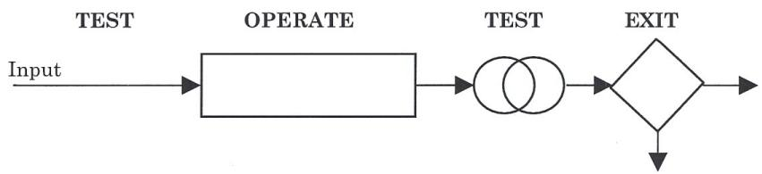

## Test:

Δείτε πώς λειτουργεί: Ένας ενεργοποιητής τίθεται σε λειτουργία, και πληροφορίες συλλέγονται, οι οποίες γίνονται μέρος της πρώτης δοκιμής, και η στρατηγική ξεκινά. Λειτουργεί για λίγο και δοκιμάζει ξανά, για να δει αν είναι ολοκληρωμένη. Αν δεν είναι ολοκληρωμένη, επιστρέφει σε ένα συγκεκριμένο σημείο, και μετά επιστρέφει στη δοκιμή ξανά. Συνεχίζει αυτόν τον βρόχο μέχρι να πάρει ένα θετικό επιθυμητό αποτέλεσμα, και τότε βγαίνει.

Η πρώτη δοκιμή θεσπίζει τα κριτήρια δοκιμής της στρατηγικής που μεταφέρονται στην επόμενη δοκιμή. Έτσι, η πρώτη δοκιμή ξεκινά τη στρατηγική και θεσπίζει κριτήρια για την επόμενη δοκιμή.

Ως παράδειγμα, ας δούμε πώς ξέρετε ότι είστε με κίνητρο. Ποιο είναι το ένα πράγμα — ο ενεργοποιητής που σας δίνει κίνητρο; (Η πρώτη δοκιμή μπορεί επίσης να ονομαστεί ενεργοποιητής επειδή είναι αυτό που σας θέτει σε λειτουργία.) Υπάρχει συνήθως ένα πράγμα (όπως κάτι που βλέπετε, ή ακούτε); Θυμηθείτε μια εποχή που είχατε ιδιαίτερο κίνητρο. Τι σας έθεσε σε λειτουργία; Θυμάστε τον ενεργοποιητή; Αν όχι, διαλέξτε μια άλλη στιγμή. Θυμάστε τον ενεργοποιητή τώρα; Ήταν κάτι που είδατε, κάτι που ακούσατε ή η αφή κάτι ή κάποιου; Είναι πραγματικά σημαντικό στη διαδικασία της ανάδειξης, της χρήσης, του σχεδιασμού ή της δημιουργίας νέων στρατηγικών να ανακαλύψετε έναν συγκεκριμένο ενεργοποιητή που θα φέρει το άτομο στη στρατηγική. Για παράδειγμα, αν σχεδιάσετε την καλύτερη νέα στρατηγική του κόσμου για ένα άτομο που δεν έχει


\rightline{\small 118}

κατάλληλο έναυσμα, δεν θα ενεργοποιηθεί ποτέ. Επομένως, είναι σημαντικό να ανακαλύψουμε το έναυσμα που ενεργοποιεί τη Στρατηγική.

## Operate (Λειτουργία):

Επόμενο είναι η λειτουργία. Η λειτουργία προσπελάζει και συγκεντρώνει τα δεδομένα που απαιτεί η Στρατηγική. Η λειτουργία μιας Στρατηγικής, TEST-OPERATE, πρόκειται να προσπελάσει συγκεκριμένα δεδομένα. Τα δεδομένα που θα προσπελαστούν στο τμήμα της λειτουργίας είναι τριών ειδών. Ποια πιστεύετε ότι θα έπρεπε να είναι;

Το πρώτο είδος δεδομένων που προσπελάζονται είναι εξωτερικά (θυμηθείτε τις σημειογραφίες που καλύψαμε νωρίτερα;) — οπτικά εξωτερικά, ακουστικά εξωτερικά και κιναισθητικά εξωτερικά — οποιαδήποτε εξωτερική διαδικασία στο τμήμα Operate της Στρατηγικής θα συγκεντρώνει δεδομένα.

Τα δεδομένα που προσπελάζονται μπορούν επίσης να είναι εσωτερικά. Και αν είναι εσωτερικά, υπάρχουν δύο πιθανότητες. Τα δύο δεδομένα μπορεί να είναι είτε δεδομένα ανάκλησης (Remembering) είτε δεδομένα δημιουργίας (Creating) — Αναμνήσεις ή κατασκευασμένα δεδομένα. Έτσι, οι τρεις τύποι είναι εξωτερικά, που είναι συγκέντρωση, και εσωτερικά, τα οποία μπορούν να είναι ανακαλούμενα ή κατασκευασμένα.

## Test (Δοκιμή):

Στη συνέχεια έρχεται η επόμενη δοκιμή. Έχουμε περάσει από το TEST-OPERATE-TEST ... βρισκόμαστε σε αυτό το σημείο τώρα. Η δεύτερη δοκιμή είναι μια σύγκριση. Πρόκειται πάντα να είναι μια σύγκριση που σας επιτρέπει να γνωρίζετε ότι η Στρατηγική έχει ολοκληρωθεί. Είναι μια σύγκριση των νέων δεδομένων με τα κριτήρια που καθορίστηκαν στην πρώτη δοκιμή. Έτσι, η πρώτη δοκιμή θα καθορίσει τα κριτήρια. Η δεύτερη δοκιμή θα συγκρίνει όλα τα γνωστά δεδομένα με τα κριτήρια που καθορίστηκαν στην πρώτη δοκιμή. Και, τυπικά, η δοκιμή θα συμβεί με μια σύγκριση στο ίδιο αντιπροσωπευτικό σύστημα (V, A, K, O ή G). Τώρα, σε εκείνο το σημείο, αν υπάρχει ένα «συν», που σημαίνει ότι η δοκιμή είναι επιτυχής, θα υπάρχει αντιστοίχιση μεταξύ των συγκεντρωμένων δεδομένων και των κριτηρίων, και θα έχουμε έξοδο σε εκείνο το σημείο. Αν δεν υπάρχει αντιστοίχιση σε εκείνο το σημείο, τότε συνήθως θα επιστρέψουμε και θα συνεχίσουμε τη Στρατηγική.

## Exit (Έξοδος):

Τέλος, η έξοδος θα είναι ένα σημείο απόφασης ή ένα σημείο επιλογής, και είναι μια αναπαράσταση της δοκιμής όπου η Στρατηγική είτε θα εξέλθει σε εκείνο το σημείο, είτε θα κάνει βρόχο πίσω και θα λάβει περισσότερα δεδομένα.

Για να συνοψίσουμε, οι λειτουργικές ιδιότητες των Στρατηγικών είναι το TEST, OPERATE, TEST και EXIT. Η πρώτη δοκιμή είναι ένα έναυσμα. Το έναυσμα τροφοδοτεί τις πληροφορίες προς τα εμπρός στη δεύτερη δοκιμή, η οποία συγκρίνει τα δεδομένα με την έξοδο της διαδικασίας της λειτουργίας, και η οποία (η λειτουργία) συγκεντρώνει ή προσπελάζει δεδομένα ή δημιουργεί δεδομένα. Και τότε, όταν η δοκιμή είναι επιτυχής, η Στρατηγική είναι, σε εκείνο το σημείο, ολοκληρωμένη.

Όλη η εξωτερική μας συμπεριφορά είναι αποτέλεσμα αυτών των νευρολογικών μοτίβων επεξεργασίας. Όλη η εμφανής συμπεριφορά ελέγχεται από αυτές τις ακολουθίες εσωτερικών και εξωτερικών νευρολογικών αναπαραστάσεων. Αν εμφανιστεί ένα συγκεκριμένο μοτίβο, τότε παράγεται μια συγκεκριμένη συμπεριφορά. Αν το νευρολογικό μοτίβο δεν εμφανιστεί, τότε η συμπεριφορά δεν εμφανίζεται.

Ένα τυπικό νευρολογικό μοτίβο είναι το αποτέλεσμα είτε μίας από τις δύο βασικές διαδικασίες:


\rightline{\small 119}

(1) Μοτίβα Συναισθησίας (Synesthesia) (τα οποία συμβαίνουν με τον ίδιο σχεδόν τρόπο όπως οι Αγκυρώσεις (Anchors), καθώς οι συσχετίσεις τους είναι συνδεδεμένες σε μια αλυσίδα όπου υπάρχουν επικαλύψεις αντιπροσωπευτικών συστημάτων), ή
(2) Στρατηγικές. Και ένα μοτίβο Συναισθησίας είναι κάπως σαν μια πολύ σύντομη γρήγορη Στρατηγική με μόνο δύο στοιχεία.

## ΜΟΤΙΒΑ ΣΥΝΑΙΣΘΗΣΙΑΣ (SYNESTHESIA PATTERNS)

Ένα μοτίβο Συναισθησίας, μοιάζει κάπως με αυτό: «... είναι κάπως σαν να θέλω να δω πώς αισθάνομαι γι' αυτό». Γλωσσικά, μπορείτε να εντοπίσετε ένα μοτίβο Συναισθησίας όταν κάποιος λέει: «Λοιπόν, πρέπει να δω αν ακούγεται σωστό.» «Προσπαθώ να σκεφτώ πώς να νιώσω.» Ένα μοτίβο Συναισθησίας συμβαίνει επίσης όταν αγγίζετε κάτι με τα μάτια κλειστά και στη συνέχεια κάνετε μια εικόνα του αυτόματα.

Ένα μοτίβο Συναισθησίας εμφανίζεται όταν δύο τροπικότητες πρόσβασης (όπως Οπτική–Κιναισθητική) είναι στενά συνδεδεμένες, με μία από αυτές πιθανώς εκτός επίγνωσης. Μερικά τυπικά εμφανιζόμενα μοτίβα Συναισθησίας είναι το βλέπω–νιώθω (που αναφέρθηκε παραπάνω)· ένα άλλο είναι, στο σχολείο, αν ο δάσκαλος σου μιλούσε με σκληρό τόνο, θα ένιωθες άσχημα, και έτσι τώρα κάθε φορά που κάποιος σου μιλά με αυτόν τον τόνο φωνής, νιώθεις άσχημα, παρόλο που δεν εννοούν τίποτα με αυτόν τον τόνο φωνής· ή ένα ατύχημα — ας πούμε ότι είδες ένα ατύχημα, βλέπεις αίμα και νιώθεις ναυτία· ή νιώθεις θυμωμένος και κατηγορείς κάποιον. Σας έχει συμβεί ποτέ αυτό; Ή στη θεραπεία, για παράδειγμα, ο πελάτης λέει, με τα μάτια του να ανεβαίνουν και να πηγαίνουν στα δεξιά του, «Ξέρετε», και μετά κάτω δεξιά, «Δεν ξέρω γιατί νιώθω έτσι.» Καθώς παρατηρείτε τον πελάτη απέναντί σας να λέει: «Ξέρετε, δεν ξέρω γιατί νιώθω έτσι», βλέπετε επίσης ότι κάνει εικόνες, κατασκευάζει εικόνες, πιθανώς άσχημων πραγμάτων που θα μπορούσαν να συμβούν και μετά μεταπηδά σε ένα συναίσθημα γι' αυτό. Αυτό είναι ένα μοτίβο Συναισθησίας! Σε αυτή την περίπτωση, οι εικόνες μπορεί επίσης να είναι εκτός της επίγνωσής του. Αυτό είναι ένα μοτίβο Συναισθησίας.

## ΕΠΑΓΩΓΗ ΣΤΡΑΤΗΓΙΚΗΣ (STRATEGY ELICITATION)

Τώρα, ας μιλήσουμε για την Επαγωγή (Elicitation) Στρατηγικής: Υπάρχουν δύο τρόποι για να επαγάγουμε Στρατηγικές. Ο ένας τρόπος είναι τυπικός, ο άλλος είναι άτυπος. Και, αν απλώς ρωτήσετε κάποιον άτυπα, «Πώς το κάνεις αυτό», γιατί θα σας πει. Συχνότερα από όχι, θα σας πει επίσης με τρόπο που περιλαμβάνει τις τροπικότητες που χρησιμοποιεί στην επεξεργασία αυτών των πληροφοριών. Θα σας πει τη Στρατηγική του.

Πολλές Στρατηγικές θα εμφανιστούν αυθόρμητα και φυσικά κατά τη διάρκεια μιας συζήτησης και δεν θα χρειαστεί να επαχθούν τυπικά. Η άτυπη επαγωγή Στρατηγικής μπορεί να είναι τόσο απλή όσο κάποιος που σας λέει: «Ξέρεις, κάθε φορά που βλέπω αυτό το συγκεκριμένο θέαμα, παρακινούμαι.» Και λέτε: «Λοιπόν, πώς ξέρεις να παρακινείσαι; Τι είναι σε αυτό το θέαμα;» Το γεγονός είναι ότι οι άνθρωποι κάνουν εσωτερικά αυτό για το οποίο μιλούν. Έτσι θα επιδείξουν λεκτικά και μη λεκτικά τις Στρατηγικές που χρησιμοποιούν για να προσπελάσουν και να κατανοήσουν αυτές τις εμπειρίες. Έτσι, για παράδειγμα, καθώς κάποιος μιλά για μια παρελθούσα απόφαση, συνήθως θα τρέξει επίσης μέσα από τα βήματα της Στρατηγικής. Θα περάσουν πραγματικά από τα βήματα της Στρατηγικής — όπως μια στιγμιαία επανάληψη. Έχετε δει ποτέ μια αθλητική εκπομπή στην τηλεόραση και είδατε μια στιγμιαία επανάληψη; Ακριβώς έτσι.

Οι Στρατηγικές μπορούν επίσης να επαχθούν τυπικά με ένα επίσημο σενάριο, και την επίσημη σημειογραφία σας. Γίνεται λίγο πιο εύκολο όταν έχετε τη συνεργασία του ατόμου, και στα αρχικά στάδια εκμάθησης της επαγωγής Στρατηγικής μπορεί να είναι λίγο πιο εύκολο απλώς να διαβάζετε το σενάριο. Στην επίσημη επαγωγή, μπορείτε να περάσετε ξανά και ξανά από τα βήματα της Στρατηγικής μέχρι να την λάβετε. Η πρότασή μου είναι να μάθετε πώς να κάνετε τόσο επίσημη όσο και άτυπη επαγωγή ώστε να μπορείτε να κάνετε και τα δύο όπως χρειάζεται. Αν κάνετε μια επίσημη επαγωγή, απλώς ακολουθήστε αυτό το περίγραμμα:


\rightline{\small 120}

# ΚΕΙΜΕΝΟ ΓΙΑ ΕΠΙΣΗΜΗ ΕΠΑΓΩΓΗ ΣΤΡΑΤΗΓΙΚΗΣ

Μπορείς να θυμηθείς μια στιγμή που ήσουν εντελώς X;

Μπορείς να θυμηθείς μια συγκεκριμένη στιγμή;

Καθώς γυρνάς πίσω σε εκείνη τη στιγμή τώρα...

Ποιο ήταν το πρώτο πράγμα που σε έκανε να είσαι εντελώς X;

Ήταν κάτι που είδες (ή ο τρόπος που κάποιος σε κοίταξε;),

Ήταν κάτι που άκουσες (ή ο τόνος φωνής κάποιου;), ή

Ήταν το άγγιγμα κάποιου ή κάτι;

Ποιο ήταν το πρώτο πράγμα που σε έκανε να είσαι εντελώς X;

Αφού (είδες, άκουσες, ένιωσες) αυτό, ποιο ήταν το αμέσως επόμενο πράγμα που συνέβη ενώ ήσουν εντελώς X;

→ Φαντάστηκες κάτι στο μυαλό σου;

Είπες κάτι στον εαυτό σου, ή

Είχες ένα συγκεκριμένο συναίσθημα ή αίσθημα;

Ποιο ήταν το επόμενο πράγμα που συνέβη καθώς ήσουν εντελώς X.

Αφού (παραθέστε τα προηγούμενα), ήξερες ότι ήσουν εντελώς X, ή...

(Συνεχίστε μέχρι την ολοκλήρωση.)

# ΜΙΑ ΕΠΙΣΗΜΗ ΕΠΑΓΩΓΗ — ΕΠΙΔΕΙΞΗ

Ας το κάνουμε τώρα. Bill, μπορούμε να μιλήσουμε; Πώς τα πας; «Υπέροχα». Μπορείς να θυμηθείς μια στιγμή που ήσουν ιδιαίτερα παρακινημένος;

«Ναι».

Μπορείς να θυμηθείς μια στιγμή που ήσουν εντελώς παρακινημένος;

Σκέφτεται... «Ναι».

Μπορείς να θυμηθείς μια συγκεκριμένη στιγμή; (Γνέφει.)

Καθώς γυρνάς πίσω σε εκείνη τη στιγμή τώρα...

Ποιο ήταν το πρώτο πράγμα που συνέβη και σε έκανε να είσαι εντελώς παρακινημένος; (χωρίς παύση) Ήταν κάτι που είδες ή ο τρόπος που κάποιος σε κοίταξε; Ήταν κάτι που άκουσες


\rightline{\small 121}

ή ο τόνος φωνής κάποιου; Ή, ήταν το άγγιγμα κάποιου ή κάτι; Ποιο ήταν το πρώτο πράγμα που σε έκανε να είσαι εντελώς παρακινημένος;

«Ήταν κάτι που είδα».

Ωραία. Αφού είδες αυτό που είδες, ποιο ήταν το αμέσως επόμενο πράγμα που συνέβη ενώ ήσουν εντελώς παρακινημένος; Φαντάστηκες κάτι στο μυαλό σου; Είπες κάτι στον εαυτό σου, ή είχες ένα συγκεκριμένο συναίσθημα ή αίσθημα; Ποιο ήταν το επόμενο πράγμα που συνέβη καθώς ήσουν εντελώς παρακινημένος;

«Έφτιαξα μια εικόνα στο μυαλό μου».

Υπέροχα. Αφού έφτιαξες μια εικόνα στο μυαλό σου, ήξερες ότι ήσουν εντελώς παρακινημένος ή είπες κάτι στον εαυτό σου, ή είχες ένα συγκεκριμένο συναίσθημα ή αίσθημα;

«Είπα κάτι στον εαυτό μου».

Ωραία, αφού έφτιαξες μια εικόνα στο μυαλό σου και είπες κάτι στον εαυτό σου, ήξερες ότι ήσουν εντελώς παρακινημένος ή είπες κάτι στον εαυτό σου, ή είχες ένα συγκεκριμένο συναίσθημα ή αίσθημα; Ποιο ήταν το επόμενο πράγμα που συνέβη καθώς ήσουν εντελώς παρακινημένος;

«Λοιπόν, ήμουν απλώς παρακινημένος, αυτό είναι όλο.»

Ωραία, οπότε ένιωθες παρακινημένος;

«Ναι, σωστά.»

Τώρα, ξέρουμε ότι η Στρατηγική παρακίνησης του Bill είναι:


Τώρα, μπορούμε επίσης να επαγάγουμε τις Υπομορφοτροπίες (Submodalities) κάθε ενός από τα κύρια μέρη αυτής της Στρατηγικής, και δεν θα κάνω μια πλήρη επαγωγή Υπομορφοτροπιών τώρα. Όταν το κάνετε, μπορεί να θέλετε να βγάλετε τον πίνακά μας με τις πιθανές Υπομορφοτροπίες. Έτσι, Bill, τι ήταν σε αυτό που είδες που σε έκανε να παρακινηθείς;

«Τι εννοείς;»

Σε αυτό που είδες, ποιο ήταν το σημαντικό πράγμα που το έκανε παρακινητικό για σένα; Ήταν το χρώμα σημαντικό;

«Όχι, όχι πραγματικά.»

Ήταν το μέγεθος;


\rightline{\small 122}

«Ναι, λοιπόν, αν ήταν μικρότερο, είμαι σίγουρος ότι δεν θα ήμουν τόσο παρακινημένος.»

Άρα το μέγεθος ήταν σημαντικό. Ήταν σημαντικό πόσο κοντά ήσουν σε αυτό;

«Δεν νομίζω. Αρκεί να μπορούσα να το δω.»

Τώρα όταν έφτιαξες την εικόνα μέσα σου που έφτιαξες όταν ήσουν παρακινημένος, ήταν αυτή η εικόνα μια ανάμνηση ή την έφτιαξες στο κεφάλι σου;

«Έφτιαξα μια εικόνα του εαυτού μου να κάνει κάτι νέο.»

Ήταν αυτή η εικόνα κοντά ή μακριά;

«Ήταν πολύ κοντινή.»

Και μπορούσες να δεις τον εαυτό σου στην εικόνα ή έβλεπες μέσα από τα δικά σου μάτια;

«Έβλεπα μέσα από τα δικά μου μάτια.»

Και τι είπες στον εαυτό σου;

«Είπα: 'Ουάου'.»

Σ' ευχαριστώ, Bill.

«Σ' ευχαριστώ.»

Αφού κατακτήσετε την επίσημη επαγωγή Στρατηγικής, μπορείτε να προχωρήσετε στην άτυπη επαγωγή. Θα μπορούσατε να επαγάγετε τη στρατηγική λήψης απόφασης κάποιου απλώς λέγοντας: «Ε, λατρεύω το πουκάμισό σου, πώς αποφάσισες να το αγοράσεις;» και μετά απλώς να ακούσετε και να παρατηρήσετε. Ακούστε τα κατηγορούμενα, και παρατηρήστε τα μοτίβα των ματιών και τα άλλα μη λεκτικά σήματα. Δεδομένου ότι οι Στρατηγικές μπορούν να επαχθούν είτε άτυπα είτε τυπικά, αν δεν κάνετε τίποτα άλλο εκτός από το να μιλήσετε με το άτομο, θα σας πει ακριβώς πώς κάνει ό,τι κάνει, και το μόνο που έχετε να κάνετε είναι απλώς να τους παρατηρείτε και να τους ακούτε.

Στις επιχειρήσεις πολλές φορές, είναι λίγο πιο εύκολο να ανακαλύψετε τη Στρατηγική κάποιου χωρίς να το κάνετε επίσημα, οπότε θα καλύψουμε επίσης αρκετούς τρόπους για να κάνετε επαγωγή Στρατηγικής χωρίς να είστε ιδιαίτερα επίσημοι ή απροκάλυπτοι σχετικά με αυτό.


\rightline{\small 123}

# ΕΠΑΓΩΓΗ ΣΤΡΑΤΗΓΙΚΗΣ ΑΠΟ ΜΟΤΙΒΑ ΜΑΤΙΩΝ

Ο επόμενος τύπος επαγωγής Στρατηγικής είναι η επαγωγή από μοτίβα ματιών. Θα μπορούσατε απλώς να πλησιάσετε κάποιον και να πείτε: «Ουάου, λατρεύω πραγματικά το ρολόι σου! Πώς αποφάσισες να το αγοράσεις;» και αυτό που θα κάνουν είναι, θα μετακινήσουν τα μάτια τους προς μια συγκεκριμένη κατεύθυνση καθώς το θυμούνται.

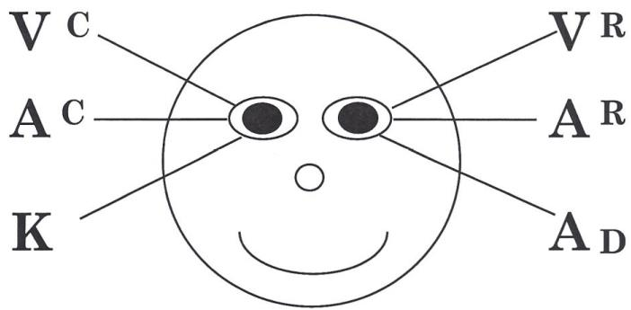
ΚΙΝΗΣΕΙΣ ΜΑΤΙΩΝ—ΚΑΝΟΝΙΚΟ ΔΕΞΙΟΧΕΙΡΟ ΑΤΟΜΟ
Εικόνα 1
(Έτσι φαίνονται όταν τους αντικρίζετε.)

Όταν επάγετε Στρατηγικές από μοτίβα ματιών είναι σημαντικό να βεβαιωθείτε ότι μαθαίνετε τα μοτίβα ματιών για «άλλους», όχι για τον «εαυτό». Έχω δει ανθρώπους να αγωνίζονται για χρόνια προσπαθώντας να καταλάβουν τι κάνουν οι ίδιοι. Άρα αυτό είναι για άλλους.

Το πρώτο πράγμα που πρέπει να θυμάστε είναι ότι δεν είναι κάθε κίνηση ματιού που βλέπετε μια Στρατηγική. Μερικοί άνθρωποι θα επεξεργαστούν τις πληροφορίες που μόλις τους ζητήσατε προτού αρχίσουν να προσπελάζουν τη Στρατηγική τους. Μπορεί, για παράδειγμα, να επαναλάβουν στον εαυτό τους ακριβώς αυτό που είπατε, «Α, μόλις είπε 'όμορφο ρολόι', πώς το πήρα; Και μετά θα τρέξουν τη Στρατηγική τους για εσάς με τα μάτια τους. Μερικοί άνθρωποι θα καταλάβουν αμέσως αυτό που είπατε και θα πηδήξουν κατευθείαν στη Στρατηγική, μετακινώντας τα μάτια τους προς μια συγκεκριμένη κατεύθυνση καθώς προσπελάζουν τις Στρατηγικές τους. Οι περισσότεροι άνθρωποι θα μετακινούν τα μάτια τους με ένα αναγνωρίσιμο μοτίβο καθώς προσπελάζουν τη Στρατηγική τους ή καθώς αναπαράγουν τις πληροφορίες στο κεφάλι τους. Το ερώτημα είναι, μετακινούν τα μάτια τους ώστε να μπορείτε να τα δείτε επαρκώς; Και εδώ είναι που η αισθητηριακή σας οξύτητα γίνεται πολύ, πολύ σημαντική. Εδώ είναι που η αισθητηριακή σας οξύτητα κάνει μεγάλη διαφορά. Η πρότασή μου είναι να βεβαιωθείτε ότι έχετε εμβαθύνει πραγματικά στα μοτίβα των ματιών και ότι τα μάθετε πολύ καλά. Έχοντας το κάνει αυτό, μπορείτε απλώς να χαλαρώσετε και να αφήσετε τις πληροφορίες να έρθουν σε εσάς. Απλώς παρατηρήστε τα μοτίβα των ματιών τους και στη συνέχεια σημειώστε τα σε ένα κομμάτι χαρτί — ένα από τα πράγματα που κάνω είναι να κουβαλώ μαζί μου ένα μικρό κομμάτι χαρτί, και να γράφω τη σειρά και την ακολουθία των μοτίβων των ματιών τους καθώς τα λαμβάνω, ώστε να τα θυμάμαι — και να τα σημειώνω, χρησιμοποιώντας τη σημειογραφική μορφή παραπάνω. Προτείνω, όπως με κάθε επαγωγή Στρατηγικής, να δοκιμάσετε επίσης την επαγωγή Στρατηγικής από μοτίβα ματιών όπου είναι δυνατό, ρωτώντας τους ξανά και ξανά, μέχρι να είστε σίγουροι ότι την έχετε πιάσει. Είναι εντάξει να ελέγξετε αρκετές φορές γιατί το κύριο ερώτημα στην επαγωγή Στρατηγικών από μοτίβα ματιών είναι: «Πού τελειώνει η προσπέλαση των πληροφοριών και αρχίζει η Στρατηγική;» Έτσι μπορεί


\rightline{\small 124}

να χρειαστεί να επαγάγετε την ίδια Στρατηγική σε μερικές διαφορετικές καταστάσεις, ή σε μερικά διαφορετικά πλαίσια προκειμένου να ανακαλύψετε πώς το έκαναν.

Οι Στρατηγικές από μοτίβα ματιών είναι πιθανώς ένα από τα πιο ισχυρά πράγματα που μπορείτε να μάθετε στον NLP, και σε ένα μεταγενέστερο κεφάλαιο θα τα συνδυάσουμε όλα όταν θα δείξουμε πώς να χρησιμοποιήσετε αυτές τις Στρατηγικές στον σχεδιασμό ενσωματωμένων εντολών. Ας επαγάγουμε μερικές Στρατηγικές, τώρα... παρακάτω, έχουμε συμπεριλάβει απομαγνητοφωνήσεις πραγματικών επαγωγών Στρατηγικής:

## ΕΠΙΔΕΙΞΗ ΕΠΑΓΩΓΗΣ 2

Έτσι, θα μπορούσαμε να καθίσουμε απέναντι από τον καλό μας φίλο Dave εδώ, και να πούμε: «Λατρεύω το αυτοκίνητό σου, Dave. Πού πήρες το αυτοκίνητό σου;» Και ο Dave λέει: «Το πήρα από την αντιπροσωπεία Plymouth» και κρατά επαφή με τα μάτια μας, σωστά; Έτσι ο Dave είναι ένας από εκείνους τους τύπους που έχουν έναν κανόνα «κοίτα-για-να-μιλήσεις». Και τότε, τι κάνουμε; Αλλάζουμε τα μάτια μας, μετακινούμε τα μάτια μας μακριά από τον Dave, και λέμε: «Λοιπόν, τι έκανες, μπήκες στην έκθεση αυτοκινήτων και το αυτοκίνητο πετάχτηκε σε σένα και το αγόρασες.» Και ο Dave λέει: «Όχι, όχι ακριβώς» και προσπελάζει το κιναισθητικό. (Περίμενε ένα δευτερόλεπτο, Dave.) Δεν έχουμε ακόμα πάρα πολλές πληροφορίες εκεί, σωστά; (Εντάξει, προχώρα. — Ο Dave κινεί τα μάτια του...)

Έτσι, έχουμε ολόκληρη τη Στρατηγική του Dave ακριβώς εκεί. Έχουμε ολόκληρη τη Στρατηγική του Dave στα μοτίβα των ματιών. Και μπορούμε να την σημειώσουμε ως:

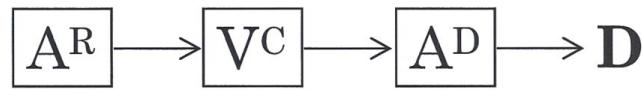

Θα μπορούσαμε επίσης να ρωτήσουμε τον Landon (ηλικίας 7). Landon, πώς ξέρεις πότε ένα παιχνίδι είναι ένα καλό παιχνίδι; (Ο Landon απαντά χωρίς να κινήσει τα μάτια του.) Στην πραγματικότητα με κοιτούσε. Πρέπει να τους πεις, επίσης. Πώς ξέρεις — άσε με να σε ρωτήσω ξανά την ερώτηση — Πώς ξέρεις πότε ένα παιχνίδι είναι ένα καλό παιχνίδι; («Όταν παίζω πολύ με αυτό».)

Έτσι, αυτό που είπε ήταν: «Όταν παίζω πολύ με αυτό.» και αυτό που έκανε ήταν να μετακινήσει τα μάτια του προς ορισμένες κατευθύνσεις. Και έτσι το πρώτο πράγμα που έκανε ήταν να μετακινήσει τα μάτια του πάνω και προς τα αριστερά, και μετά κίνησε τα μάτια του κάτω και προς τα δεξιά, που είναι κιναισθητικό. Έτσι, Landon, άσε με να σε ρωτήσω ξανά, πώς ξέρεις πότε ένα παιχνίδι είναι ένα καλό παιχνίδι; Κοίτα τα μάτια του.

Τώρα, αυτό που έκανε σε αυτή την περίπτωση ήταν να μετακινήσει τα μάτια του κάτω και προς τα δεξιά, που ήταν ακουστικά ψηφιακό, οπότε επαναλάμβανε την ερώτηση: «Πώς ξέρω πότε το παιχνίδι είναι ένα καλό παιχνίδι;» Κινεί τα μάτια του πάνω και προς τα αριστερά οπότε δημιουργεί το παιχνίδι με το παιχνίδι στο μυαλό του και ελέγχει τα


\rightline{\small 125}

συναισθήματά του και βλέπει αν νιώθει σωστά. (Είναι σωστά αυτό Landon; Έτσι, παίζεις πολύ με αυτό, και μετά βλέπεις πώς νιώθεις, ναι;)

K

Και όταν το είπα αυτό, απλώς κίνησε τα μάτια του κάτω και προς τα αριστερά — κιναισθητικά.

Όταν επάγετε Στρατηγικές από μοτίβα ματιών, μπορεί να διαπιστώσετε ότι παίρνετε μια οπτική κατασκευή ή μια οπτική ανάκληση και είναι στην πραγματικότητα ένα οπτικό εξωτερικό. Συνήθως όταν βλέπετε μια οπτική-ανάκληση ακριβώς στην αρχή, είναι ένα οπτικό-εξωτερικό. Ή μπορεί να είναι ένα οπτικό κατασκευασμένο, και έτσι το ερώτημα θα είναι, πώς το κατασκευάζουν; Μπορεί επίσης να διαπιστώσετε ότι μετακινούν τα μάτια τους εμπρός και πίσω οπτικά έτσι:

Vc

VR

VC

VR

Σε αυτή την περίπτωση, σημειώστε το ως Vc/Vr. Το Vc/Vr υποδηλώνει μια σύγκριση. Πρώτα, μια κατασκευασμένη εικόνα, και στη συνέχεια συγκρίνεται με μια ανάμνηση (ή το αντίστροφο). Αυτό το μοτίβο ματιών σημαίνει απλώς ότι υπάρχει μια σύγκριση που ξεκινά τη Στρατηγική. Σε κάθε περίπτωση, δεν είναι απολύτως απαραίτητο να κάνετε τη διάκριση μεταξύ εσωτερικού και εξωτερικού όταν κατασκευάζετε μόνο ενσωματωμένες εντολές, οπότε όταν απλώς συνθέτω ενσωματωμένες εντολές, δεν το σημειώνω.

Τώρα, ας επαγάγουμε μια Στρατηγική από τα μοτίβα ματιών του Craig μόνο. «Craig, (αγαπητέ...) λατρεύω το ρολόι σου. Το αγόρασες ο ίδιος; (Όχι.) Λατρεύω το πουκάμισό σου, Craig. Πού το πήρες; Ήσουν μόνος σου για την απόφασή σου; (Όχι.) Craig, λατρεύω το αυτοκίνητό σου. Το αγόρασες ο ίδιος; (Όχι.)

Τώρα, γιατί είπα: «Το αγόρασες ο ίδιος»; Ήθελα να μάθω αν ο Craig πήρε την απόφαση μόνος του, ή αν τον βοήθησε κάποιος άλλος σε αυτό, γιατί μια απόφαση που λαμβάνεται με κάποιον άλλον μπορεί να είναι διαφορετική. (Ο Craig λέει ότι αγόρασε ένα πλυντήριο πιάτων μόνος του.)

Έτσι, Craig, λατρεύω το πλυντήριο πιάτων σου, πού το πήρες; (Sears.)

Vc

VR

AD

K

Τώρα, παρατηρήστε ότι ο Craig κινεί τα μάτια του πάνω και προς τα αριστερά, μετά προς τα δεξιά, και μετά τα κίνησε κάτω και προς τα δεξιά και μετά προς τα αριστερά (καθώς τον κοιτάτε). Μετά τελείωσε.

Τον είδαμε να το κάνει δύο φορές. Κάθε φορά που του ζητώ να μπει ξανά στη Στρατηγική, κάνει το ίδιο πράγμα. Έτσι, αν το κάνει αρκετές φορές στη σειρά, μπορείτε να είστε αρκετά σίγουροι ότι αυτή είναι η Στρατηγική του. Έτσι, πού το πήρες, Craig; Λοιπόν... τι... μπήκες στο Sears και πετάχτηκε σε σένα;

K

Εντάξει, τώρα αυτή τη φορά πήγε και προσπέλασε το κιναισθητικό.

Αυτό που θέλετε να κάνετε είναι να τον ξεγελάσετε — οπότε, τον ρωτάτε: «Σου πετάχτηκε», «Απλά εμφανίστηκε», ή «Όταν πήρες αυτό το ρολόι, σου...» Αλλά δεν θέλετε να χρησιμοποιήσετε κάτι που τους οδηγεί σε μια συγκεκριμένη τροπικότητα. Έτσι, δεν θέλετε να πείτε κάτι όπως: «Α, έλαμπε


\rightline{\small 126}

έντονα, οπότε αυτό ήταν που ήθελες;» Όχι, γιατί αυτό θα τους οδηγήσει υπερβολικά. Ή «Σε φώναξε με το όνομά σου;» — αυτό θα τον οδηγήσει σε ακουστικό τονικό. Ή, «Είχε καλύτερη αίσθηση;» Δεν θέλετε να τους οδηγείτε, ωστόσο, αυτό που θέλετε να πείτε είναι κάτι που τους ξεγελά και τους επιτρέπει να σκεφτούν ελεύθερα και επίσης σπάει την επαφή με τα μάτια.

Θυμηθείτε, υπάρχει μια λεπτή γραμμή μεταξύ Επαγωγής και Εγκατάστασης, οπότε όταν επάγετε Στρατηγικές, βεβαιωθείτε ότι δεν καθοδηγείτε. Να είστε μη κατευθυντικοί.

Λοιπόν, ας επιστρέψουμε στην αρχή. Craig, μπήκες στο Sears και τι συνέβη;


Αυτό που βλέπουμε είναι: οπτική κατασκευή, οπτική ανάκληση, ακουστικό ψηφιακό, κιναισθητικό. Εντάξει, λοιπόν μπαίνεις στο Sears και ρωτάς για τα πλυντήρια πιάτων τους... (και, παρεμπιπτόντως, το να μπεις στο Sears και να ρωτήσεις για τα πλυντήρια πιάτων δεν είναι μέρος της Στρατηγικής. Δεν είμαστε ακόμα στο σημείο εναύσματος της Στρατηγικής, με βάση αυτό που μας λέει...) Λοιπόν, τι έκανες; («Πήγα και το κοίταξα.») Λοιπόν, μπήκες στο Sears και ρώτησες πού ήταν το πλυντήριο πιάτων. Ρώτησες τον πωλητή ερωτήσεις σχετικά με το πλυντήριο πιάτων που ήθελες να αγοράσεις.

Τώρα αυτό που κάνουμε εδώ, είναι να ελέγχουμε για να βεβαιωθούμε ότι πιάσαμε τα μοτίβα των ματιών — να βεβαιωθούμε ότι τα αναγνωρίσαμε και τα οργανώσαμε σωστά. Λοιπόν, μπήκες στο Sears, ρώτησες πού ήταν τα πλυντήρια πιάτων, πήγες προς τα πλυντήρια πιάτων. («Ναι, και μετά διάλεξα ένα πλυντήριο πιάτων.») Αχά. Τώρα, δεν μας το έδωσε αυτό λεκτικά πριν, σωστά; Είπε: «Διάλεξα ένα πλυντήριο πιάτων». Λοιπόν είδες ένα πλυντήριο πιάτων που ήθελες. («Α-χα.») Πώς το ήξερα αυτό; Είδα τα μοτίβα των ματιών του, σωστά; Λοιπόν είδες ένα πλυντήριο πιάτων που ήθελες, μετά τι έκανες; («Πήρα έναν πωλητή για να δω αν είχε ορισμένα κριτήρια που είχα.») Όπα! Είναι αυτό ακουστικό ψηφιακό, ή τι; Έτσι, τρέχει μέσα από τη λίστα των κριτηρίων του.

Εντάξει, Craig, οπότε θα γυρίσουμε πίσω, ορίστε γυρίζουμε πίσω ξανά, έτοιμος; Έτσι, θα γυρίσουμε πίσω ξανά, και καθώς γυρνάς ακριβώς πίσω σε εκείνη τη στιγμή, μπαίνεις στο Sears. Τώρα, γιατί το λέω αυτό ξανά; Για να τον βάλω ακριβώς πίσω στη στιγμή. Μπαίνεις στο Sears και λες: «Ε, πού είναι τα πλυντήρια πιάτων;» Και είναι εκεί πέρα. Πηγαίνεις εκεί που είναι τα πλυντήρια πιάτων και τι; («Είδα αυτά που ήταν σε προσφορά.»)

Εντάξει. Τώρα έχουμε περισσότερα κριτήρια, σωστά; «Είδα ένα που ήταν σε προσφορά.» Τώρα, ήταν αυτό ένα σημαντικό κριτήριο για σένα; («Ναι, ήταν.») Α, εντάξει, οπότε μόλις μας έδωσες ένα άλλο κριτήριο. Γι' αυτό θέλουμε να κάνουμε βρόχο, και να συνεχίσουμε να δοκιμάζουμε.

Πήγες εκεί που ήταν τα πλυντήρια πιάτων και είδες ένα σε προσφορά, και σου άρεσε. Τι ήταν αυτό που είδες σε αυτό το πλυντήριο πιάτων που σε έκανε να ξέρεις ότι αυτό ήταν το πλυντήριο πιάτων που ήθελες να αγοράσεις; («Ήθελα ένα φορητό που θα μπορούσε να στερεωθεί μόνιμα, και αφού μίλησα με τον πωλητή, ανακάλυψα ότι αυτό μπορούσε να στερεωθεί μόνιμα.») Εντάξει, τώρα αυτό που έχουμε εδώ είναι κριτήρια. Δεν έχουμε απαραίτητα ακόμα τη Στρατηγική λήψης απόφασης, παρεμπιπτόντως. Αλλά έχουμε κριτήρια που είναι πιθανώς μέρος της Στρατηγικής παρακίνησης. Τώρα αν τα πήρε αργότερα ή όχι, δεν είναι πραγματικά σημαντικό. Αν του πουλάμε κάτι, ξέρουμε ότι οι τιμές προσφοράς είναι κριτήρια γι' αυτόν, ειδικά στο πλυντήριο πιάτων.


\rightline{\small 127}

Έτσι είδες το πλυντήριο πιάτων. Αλλά τι ήταν σε αυτό που είδες που σε έκανε να ξέρεις αν αυτό ήταν το πλυντήριο πιάτων; («Μια ταμπέλα στο πάνω μέρος που έλεγε ότι η τιμή ήταν μέσα στο εύρος τιμής που έψαχνα. Επίσης, το χρώμα του πλυντηρίου πιάτων ήταν κόκκινο. Ένα κριτήριο της κουζίνας μας — ότι θα ταίριαζε με την κουζίνα.»)

Πολύ καλά. Έχουμε κάποιες οπτικές υπομορφοτροπίες. Άρα τώρα το χρώμα. Τώρα μας έδωσε Ad κριτήρια πριν. Έτσι, άσε με να σε ρωτήσω, έλεγξες πρώτα το χρώμα ή έλεγξες πρώτα την τιμή; («Έλεγξα πρώτα την τιμή.») Έλεγξες πρώτα την τιμή; («Επειδή συνήθως έχουν όλα τα χρώματα...») Έτσι, έλεγξες πρώτα την τιμή επειδή ήξερες ότι μπορούσες να έχεις οποιοδήποτε χρώμα ήθελες. («Ναι, λοιπόν, στο Sears».) Εντάξει, λοιπόν είδες το πλυντήριο πιάτων που ήθελες και έλεγξες ένα σωρό κριτήρια. Τώρα σε εκείνο το σημείο όταν έλεγξες ένα σωρό κριτήρια, μίλησες με τον πωλητή, πήρες τα κριτήρια. Μετά εσύ — τώρα μόλις κίνησε τα μάτια του προς το κιναισθητικό — μόλις τελείωσε το μοτίβο ματιών για εμάς. Σ' ευχαριστώ Craig!

Τον καθοδήγησα μέσα από αυτό, και σε οποιοδήποτε σημείο μπορώ να τον κάνω να ξανα-προσπελάσει τα μοτίβα ματιών. Μόλις προσπέλασε το κιναισθητικό. Έτσι θα τον ρωτήσω απλώς για να βεβαιωθώ. Craig, σε εκείνο το σημείο, όταν τελείωσες να μιλάς με τον τύπο, ήξερες ότι αυτό ήταν αυτό που ήθελες να αγοράσεις, ή είχες μια καλή αίσθηση γι' αυτό, και μετά ήξερες; («Στην πραγματικότητα, ήξερα ότι ήταν αυτό που ήθελα να αγοράσω, αλλά προσπέλασα τα συναισθήματά μου επειδή ήταν μια κοινή συσκευή, κάτι που ήθελα να βεβαιωθώ ότι όλοι οι άλλοι θα χρησιμοποιούσαν. Έτσι προσπέλασα τα συναισθήματά μου... ήξερα ότι προσπέλασα.) Λοιπόν, ήταν εντάξει για σένα, αλλά ήθελες να ελέγξεις τα συναισθήματά σου για να βεβαιωθείς ότι όλοι ήταν εντάξει με αυτό; («Σωστά»...)

Τώρα, λοιπόν έχουμε αυτή τη συγκεκριμένη Στρατηγική, ξέρουμε ότι έτσι πήρε εκείνη την απόφαση. Το ερώτημα είναι, θα γενικευθεί μια κιναισθητική έξοδος σε όλες τις άλλες αποφάσεις του; Η υπόθεσή μου είναι ότι θα γενικευθεί.

Έτσι, τώρα τρέχουμε απλώς μια μικρή δοκιμή ώστε να μπορούμε να είμαστε απολύτως βέβαιοι. Αυτή η κιναισθητική έξοδος είναι απλώς μια υπόθεση από την πλευρά μου. Έρχεται μόνο από το να έχω επαγάγει πολλές Στρατηγικές, ξέρεις, στην πορεία. Αλλά, ας δοκιμάσουμε μια άλλη Στρατηγική του Craig. Craig, θυμάσαι πότε αγόρασες το τελευταίο σου χορτοκοπτικό;

```markdown
Όταν τον ρωτήσαμε αυτό, αναβόσβησε εμπρός και πίσω, οπτική κατασκευή / οπτική ανάκληση. Κατασκεύασε το τελευταίο του χορτοκοπτικό. Ή κατασκεύασε αυτό που νόμιζε ότι θα έπρεπε να είναι και μετά πήγε στην οπτική ανάκληση και το θυμήθηκε. Και αυτό δεν ήταν ακόμα η Στρατηγική. Έτσι, Craig, τι συνέβη όταν αγόρασες το τελευταίο σου χορτοκοπτικό; («Καθόταν στο γραφείο και θυμήθηκα το κουτί και θυμήθηκα ότι είχαμε πάρει ένα με ανταλλαγή, και τότε θα μπορούσα πιθανώς να πάρω μια συμφωνία μισής τιμής σε αυτό.») Έτσι, έχουμε μια προσφορά που έρχεται ως άλλο κριτήριο; Ναι, νομίζω ότι έχουμε! Λοιπόν, είδε το κουτί, ήξερε ότι μπορούσε να το πάρει σε καλή τιμή — κριτήριο. Και, σε εκείνο το σημείο, είχες μια αίσθηση γι' αυτό, και ήξερες ότι αυτό ήταν αυτό που ήθελες να κάνεις; («Λοιπόν, ήξερα ότι ήταν ένα καλό χορτοκοπτικό...»)

Μόλις έφτασε στο τέλος της Στρατηγικής του και όταν το είπε αυτό, προσπέλασε ξανά το κιναισθητικό του. Είναι προφανές ότι παίρνει αρκετά κριτήρια μέχρι να χτυπήσει το κιναισθητικό κουμπί συν του και μετά έχει τελειώσει. Και το είδες αυτό, σωστά; Ωραία. Αυτή είναι η Στρατηγική του — η Στρατηγική λήψης απόφασης, η οποία είναι μέρος της Στρατηγικής αγοράς, είναι βλέπω κάτι (Οπτικό εξωτερικό), και ότι ικανοποιεί τα κριτήριά σου (Ακουστικό ψηφιακό), και νιώθεις καλά γι' αυτό. Έτσι, νομίζω ότι θα μπορούσαμε να πούμε ότι αυτή είναι η Στρατηγική του.


\rightline{\small 128}

# VC/VR → AD → K → D

Σε αυτή τη Στρατηγική, αν πάρετε ένα Ad + (που σημαίνει ότι ικανοποιεί τα κριτήριά του), ακολουθείται από ένα θετικό K. Αν όχι, κάνετε βρόχο πίσω στο οπτικό εξωτερικό. Επειδή, αν δεν ικανοποιεί τα κριτήριά σου, ξαναπαίρνεις το ψάξιμο. Τώρα, ισχύει αυτό; Απλώς παραισθάνομαι τώρα, ξέφρενα, μπορώ να προσθέσω. Εσύ είσαι αυτός του οποίου η Στρατηγική είναι. («Ναι»)

Στην περίπτωση του χορτοκοπτικού, έφτιαξε μια εικόνα στο μυαλό του. Έτσι έφτιαξες μια εικόνα, ή ανακάλεσες μια εικόνα, και αυτό είναι που ανέφερα νωρίτερα. Στην περίπτωση του πλυντηρίου πιάτων, πήγε στο Sears και είδε το πλυντήριο πιάτων. Σε αυτή την περίπτωση, δεν είδε το χορτοκοπτικό, αλλά είτε δημιούργησε είτε ανακάλεσε ότι το χορτοκοπτικό ήταν στο κιβώτιο. Τώρα μπορούμε να κάνουμε κάποιες πραγματικά λεπτές διακρίσεις εδώ και μπορούμε να το δοκιμάσουμε, σωστά;

Έτσι, καθώς γυρνάς ακριβώς πίσω σε εκείνη τη στιγμή, και γυρνάς ακριβώς πίσω στο γραφείο — και αναβοσβήνει εμπρός και πίσω μεταξύ κατασκευής και ανάκλησης και στη συνέχεια έτρεξε ολόκληρη τη Στρατηγική του τότε για εμάς.

# Vc

# Vn

# AD

# K

Και ήταν ανάκληση, σωστά; Έτσι, ανακάλεσες, το μοτίβο των ματιών σου είπε ότι ήταν ανάκληση. Άρα ανακάλεσες την — έτσι είναι; («Ναι») Ο Craig ανακάλεσε την εικόνα του χορτοκοπτικού στο κουτί και είπε: «Ε, ξέρω ότι μπορώ να το πάρω αυτό σε προσφορά» — κριτήριο, κριτήριο, και μετά ένιωσε καλά γι' αυτό. Έτσι ο Craig όντως λειτουργεί με τα συναισθήματά του. Βγαίνει από αυτό με ένα K συν. Έτσι αυτό που θα έλεγα είναι ότι υπήρχε μια οπτική-εξωτερική ή μια οπτική ανάκληση, και αυτό που συνήθως γράφω είναι οπτική ανάκληση.

Τώρα, όταν κάνω Στρατηγικές από μοτίβα ματιών για τον σκοπό της δημιουργίας ενσωματωμένων εντολών, σημειώνω μόνο τα μοτίβα ματιών που βλέπω, επειδή θα δημιουργήσω μόνο μια πρόταση με κατηγορούμενα γι' αυτή τη Στρατηγική. ΚΑΙ, αν το κάνω μόνο από μοτίβα ματιών για τον σκοπό της δημιουργίας ενσωματωμένων εντολών, δεν ρωτάω με το βάθος που ρωτάω τώρα. Αν κάνω πραγματικά μια επίσημη επαγωγή, θα σημειώσω Οπτικό εξωτερικό, και θα ρωτήσω πολύ πιο στενά.

Εντάξει, οπότε μετά πάμε — οπτική ανάκληση, ακουστικό ψηφιακό, κιναισθητικό, και ο βρόχος πίσω είναι από ακουστικό ψηφιακό πίσω στο οπτικό. Και αν, για παράδειγμα, Craig, είχες κάνει μια εικόνα του χορτοκοπτικού και πήγαινες στο αφεντικό σου, και αυτός έλεγε: «Λοιπόν, δεν υπάρχει περίπτωση να σου το πουλήσω για μισή τιμή, θα πρέπει να πληρώσεις την πλήρη τιμή λιανικής.» Τι θα είχες κάνει τότε; Εντάξει, οπότε θα πήγαινες στον πελάτη τους και έτσι, αυτό που πήρε ήταν ένα K μείον. Έτσι πρέπει να πάει να ψάξει για περισσότερα χορτοκοπτικά.

Έχουμε κάνει δύο επαγωγές Στρατηγικής, και οι δύο μέχρι στιγμής, Στρατηγικών λήψης απόφασης, και σημειώστε ότι τα χαρακτηριστικά, τα κριτήρια, η προσφορά — όλες αυτές οι πληροφορίες είναι ακουστικές ψηφιακές — κριτήρια. «Έχει νόημα».

Η εκτεταμένη ερώτηση κατά την επαγωγή Στρατηγικών από μοτίβα ματιών μπορεί να σας βοηθήσει να αποκτήσετε μεγαλύτερη ακρίβεια στην επαγωγή Στρατηγικής. Είναι αποτελεσματική, και μπορεί, κατά καιρούς, να χρειαστεί να πάρετε λίγο περισσότερες πληροφορίες προκειμένου να συμπληρώσετε τις Υπομορφοτροπίες ή να ανακαλύψετε περισσότερα κριτήρια.


\rightline{\small 129}

Τώρα, το επόμενο βήμα πριν από τη χρήση, παρεμπιπτόντως, το οποίο θα έπρεπε να κάνουμε τώρα, είναι να επιστρέψουμε και να επαγάγουμε τις υπομορφοτροπίες των Στρατηγικών του Craig για να βεβαιωθούμε ότι έχουμε τις υπομορφοτροπίες κάθε μεγάλου κομματιού της Στρατηγικής.

Craig, καθώς γυρνάς πίσω στο Sears και το πλυντήριο πιάτων, τι ήταν σε αυτό που είδες που σε έκανε να ξέρεις ότι έδειχνε σωστό; (Παρεμπιπτόντως, οι κύριες δοκιμές είναι Οπτική — Δείχνει Σωστό, Ακουστικό Τονικό — Ακούγεται Σωστό, Ακουστικό Ψηφιακό — Έχει Νόημα, Κιναισθητικό — Νιώθει Σωστό.) Craig, νωρίτερα, ανέφερες το χρώμα. («Ναι, το χρώμα ταίριαζε με το... στην πραγματικότητα, το χρώμα δεν ήταν σημαντικό επειδή ήμουν στο Sears και ήξερα ότι μπορούσα να πάρω το χρώμα που ήθελα.») Και είδες το σωστό χρώμα. («Και το σωστό χρώμα συνέβη... στην πραγματικότητα αυτό που παραδόθηκε στο σπίτι μου ήταν αυτό στον όροφο της έκθεσης.») Και ήταν το σωστό χρώμα. Ωραία. Υπήρχε οτιδήποτε άλλο εκτός από το χρώμα; Ήταν το σχήμα; Ήταν ο τρόπος... υπήρχε οτιδήποτε άλλο σχετικά με τον τρόπο που έδειχνε; («Όχι»)

Εντάξει, ας πάμε στο χορτοκοπτικό. Όταν φαντάστηκες το χορτοκοπτικό, τι ήταν σημαντικό για τον τρόπο που έδειχνε το χορτοκοπτικό; Είχε το χρώμα κάτι να κάνει με αυτό κατά τύχη; («Όχι, ήταν σε ένα κουτί. Λοιπόν, ήταν κόκκινο, αλλά πραγματικά δεν νομίζω...») Τι χρώμα ήταν το πλυντήριο πιάτων σου; («Πράσινο, σαν το ψυγείο.») Εντάξει, οπότε δεν υπάρχει κοινότητα αυτή τη φορά, αλλά μερικές φορές όταν επάγετε τις Υπομορφοτροπίες, θα βρείτε ομοιότητες στη Στρατηγική.

Τώρα, ας πάμε στο ακουστικό ψηφιακό τμήμα της Στρατηγικής με τον Craig, επειδή ο Craig είναι πιθανώς πιο AD από τον μέσο άνθρωπο του δρόμου. Δεν ξέρω γιατί, αλλά... Εντάξει, Craig, λοιπόν ας μιλήσουμε για τα κριτήρια.

Η προσφορά είναι ένα μεγάλο κριτήριο. Ποια άλλα κριτήρια υπάρχουν; Όσον αφορά το πλυντήριο πιάτων, υπήρχε το μέγεθος. («Τώρα») Α, ώστε μπορείς να το έχεις εκεί τώρα; Και τι γίνεται με το χορτοκοπτικό; Ήταν σημαντικό να το έχεις αμέσως; Ας υποθέσουμε ότι το αφεντικό σου είχε πει: «Ναι, θα σου πουλήσω το χορτοκοπτικό σε μισή τιμή, αλλά πρέπει να περιμένεις δύο εβδομάδες, επειδή θέλουμε να κάνουμε μια έκθεση.» Έπρεπε να έχεις ένα χορτοκοπτικό — Εντάξει. Έτσι το αγόρασες. Αυτό που έχουμε είναι δύο μεγάλα κριτήρια. Το ένα είναι τιμή προσφοράς και το άλλο είναι «Πρέπει να το έχω αυτή τη στιγμή». Όχι ασυνήθιστο, παρεμπιπτόντως. Άρα ένα μεγάλο κριτήριο για τον Craig είναι το «τώρα». Ποια άλλα κριτήρια έχεις καθώς το σκέφτεσαι; Καθώς γυρνάς πίσω στο χορτοκοπτικό, για παράδειγμα; Ποια άλλα κριτήρια υπάρχουν που υπήρχαν; ... Εύκολο. Εύκολο. Εντάξει, εύκολο να γίνει. Αν το πλυντήριο πιάτων ήταν δύσκολο να γίνει, δεν θα το είχες κάνει; («Θα το ζύγιζα έναντι του να το κάνει κάποιος άλλος όσον αφορά την τιμή...») Αγόρασες το πλυντήριο πιάτων μόνος σου; («Ναι») Έτσι, αν το πλυντήριο πιάτων ήταν δύσκολο στη χρήση, θα είχες... πάρει άλλο. («Ναι»)

Έχουμε ολόκληρη τη Στρατηγική του Craig εδώ — εύκολο, σε προσφορά, μπορείς να το έχεις τώρα — τα κύρια κριτήριά του. Και παρεμπιπτόντως, είναι πολύ εύκολο να το χρησιμοποιήσεις για να το ανατροφοδοτήσεις στον Craig... και Craig, ορίστε (κρατώντας ένα στυλό), όταν δεις πώς μπορείς να το χρησιμοποιήσεις αυτό, πιθανώς θα ξέρεις ότι έχει νόημα, και είναι εδώ, οπότε ξέρεις ότι δεν χρειάζεται να περιμένεις, οπότε μπορείς να νιώσεις καλά γι' αυτό. Κοίτα τον, είναι έτοιμος να ξεκινήσει.

Εντάξει. Έτσι έχουμε καλύψει την επαγωγή από μοτίβα ματιών και την ελέγξαμε αρκετές φορές. Τώρα, αν δεν μπορείτε να διαβάσετε τα μοτίβα των ματιών, μπορείτε να χρησιμοποιήσετε το σενάριο που καλύψαμε νωρίτερα. Στην πραγματική επίσημη επαγωγή της Στρατηγικής κάποιου υπάρχουν δέκα βήματα:


\rightline{\small 130}

ΤΑ ΒΗΜΑΤΑ ΣΕ ΜΙΑ ΕΠΑΓΩΓΗ ΣΤΡΑΤΗΓΙΚΗΣ

1. Βεβαιωθείτε ότι είστε σε Rapport (σχέση εμπιστοσύνης) με το άτομο.
2. Θέστε το Πλαίσιο.
3. Μπείτε στη Συγκεκριμένη Κατάσταση που επάγετε.
4. Ακολουθήστε το Περίγραμμα (παρακάτω).
5. Βεβαιωθείτε ότι το άτομο βρίσκεται σε μια Πλήρως Συσχετισμένη, Έντονη, Σύμφωνη Κατάσταση.
6. Αγκυρώστε την Κατάσταση.
7. Βεβαιωθείτε ότι η κατάσταση που επαγάγατε είναι έντονη [αν όχι, επιλέξτε άλλη κατάσταση, ή ελέγξτε τη δική σας κατάσταση].
8. Σε κάθε βήμα, ενεργοποιήστε την αγκύρωση για να τους βοηθήσετε στην προσπέλαση.
9. Επαγάγετε Τροπικότητες μέχρι την ολοκλήρωση.
10. Στη συνέχεια επιστρέψτε και επαγάγετε τις υπομορφοτροπίες.

ΤΑ ΒΗΜΑΤΑ ΣΕ ΜΙΑ ΕΠΑΓΩΓΗ ΣΤΡΑΤΗΓΙΚΗΣ

1. Το πρώτο βήμα είναι να βρίσκεστε σε rapport. Αυτό είναι πολύ σημαντικό σε οποιαδήποτε διαδικασία. Το συζητήσαμε σε προηγούμενο κεφάλαιο.
2. Το δεύτερο βήμα είναι να θέσετε το πλαίσιο. Αυτό που θέλετε να κάνετε είναι να θέσετε ένα μαλακτικό πλαίσιο. Το μαλακτικό πλαίσιο σε αυτή την περίπτωση μπορεί να είναι: «Ξέρετε καθώς καθόμαστε εδώ και μιλάμε για την επιχείρησή σας, παρακινούμαι πραγματικά να σας κάνω μερικές ερωτήσεις που θα μου επιτρέψουν να σας εξυπηρετήσω καλύτερα. Έτσι ελπίζω να μην σας πειράζει αν σας ρωτήσω...»
3. Στη συνέχεια θέλετε να μπείτε στην κατάσταση που επάγετε. Έτσι, σε αυτή την περίπτωση, αν είχα να κάνω με κάποιον, θα ήθελα να γνωρίζω τη Στρατηγική λήψης απόφασης του πριν από τη στιγμή που έπρεπε να του ζητήσω μια απόφαση, ώστε να μπορώ να του παρουσιάσω πληροφορίες με τρόπο που του επιτρέπει να αποφασίσει εύκολα. Έτσι θα έμπαινα σε μια αποφασιστική κατάσταση — μια κατάσταση όταν έπαιρνα μια απόφαση. Ελπίζω να βρίσκεστε σε rapport με αυτούς, και αυτό θα τους οδηγήσει στην κατάσταση και θα τους κάνει ευκολότερο να προσπελάσουν τη δική τους κατάσταση λήψης απόφασης.
4. Στη συνέχεια, περάστε μέσα από το επίσημο κείμενο επαγωγής.
5. Το επόμενο βήμα: Αφού πείτε: «Μπορείς να θυμηθείς μια στιγμή...» Μπορείτε να το κάνετε αυτό ταυτόχρονα με την αγκύρωση, αν θέλετε. Απλώς βεβαιωθείτε ότι το άτομο από το οποίο επάγετε τη Στρατηγική, βρίσκεται σε μια πλήρως συσχετισμένη έντονη σύμφωνη κατάσταση. Δηλαδή, ότι είναι πραγματικά συσχετισμένοι στην ανάμνηση του γεγονότος. (Συσχετισμένος σημαίνει ότι κοιτάζουν μέσα από τα δικά τους μάτια, και δεν βλέπουν τον εαυτό τους στην ανάμνηση.)
6. Το βήμα 6 είναι να αγκυρώσετε την κατάσταση. (Δείτε Αγκύρωση)
7. Το βήμα 7 είναι απλώς ένας έλεγχος — Βεβαιωθείτε ότι η κατάσταση που επαγάγατε είναι έντονη. Τώρα, αυτό σημαίνει ότι είναι μια καλή κατάσταση. Σημαίνει ότι μπορείτε να ενεργοποιήσετε την αγκύρωση (βήμα 8), και να πάρετε ξανά την ίδια κατάσταση.
8. Ενεργοποιήστε την αγκύρωση. (Το οποίο είναι επίσης χρήσιμο αν ένας τύπος λέει: «Ε, δυσκολεύομαι να πάρω μια απόφαση», και βρίσκεστε στη διαδικασία της εγγραφής του ως πελάτη σας, τότε μπορείτε


\rightline{\small 131}

απλώς να ενεργοποιήσετε αυτή την αγκύρωση και θα γυρίσει πίσω σε αποφασιστική κατάσταση. Δεν θα έχει κανένα πρόβλημα να πάρει μια απόφαση.) Στη συνέχεια, στη διαδικασία επαγωγής Στρατηγικών, μπορείτε να ενεργοποιείτε την αγκύρωση σε κάθε βήμα για να τους βοηθήσετε στην προσπέλαση.

9. Στη συνέχεια επάγετε όλες τις τροπικότητες μέχρι να ολοκληρώσετε, και επιστρέφετε και το ελέγχετε όπως κάναμε με τον Craig, και

10. Στη συνέχεια επιστρέφετε και επάγετε τις Υπομορφοτροπίες.

Και, αυτά είναι τα δέκα βήματα στην επίσημη επαγωγή Στρατηγικής.

## ΠΡΟΣΘΕΤΕΣ ΙΔΕΕΣ ΣΤΗΝ ΕΠΑΓΩΓΗ ΣΤΡΑΤΗΓΙΚΩΝ

Σε περίπτωση που σας τελειώσουν οι τρόποι για να ξεκινήσετε μια επαγωγή Στρατηγικής, ορίστε μερικά άλλα πράγματα που μπορείτε να πείτε:

1. «Υπήρξε ποτέ μια στιγμή που ήσουν πραγματικά παρακινημένος να κάνεις κάτι;» (Παρακίνηση)

2. «Πώς είναι όταν είσαι εξαιρετικά δημιουργικός;» Ή, «Υπήρξε ποτέ μια κατάσταση στην οποία ήσουν εξαιρετικά δημιουργικός;» (Δημιουργικότητα)

3. «Μπορείς να μου πεις για μια στιγμή που ήσουν στο καλύτερό σου να κάνεις 'x';» (μια Δεξιότητα)

4. «Πώς είναι να κάνεις 'x';»

5. «Μπορείς να κάνεις 'x';» ή «Πώς κάνεις 'x';» ή «Έχεις ποτέ κάνει 'x';»

6. «Θα ήξερες αν μπορούσες να κάνεις 'x';»

7. «Τι σου συμβαίνει καθώς κάνεις 'x';»

Οποιοδήποτε από τα παραπάνω μπορεί να χρησιμοποιηθεί για να ξεκινήσει μια επίσημη επαγωγή Στρατηγικής, ή ακόμα και μια άτυπη για το θέμα.

## ΧΡΗΣΗ ΣΤΡΑΤΗΓΙΚΗΣ (STRATEGY UTILIZATION)

Τώρα που ξέρετε πώς να επάγετε Στρατηγικές, το επόμενο βήμα είναι η χρήση.

Μόλις ανακαλύψετε ποιες είναι οι Στρατηγικές κάποιου, το επόμενο πράγμα που πρέπει να κάνετε είναι να χρησιμοποιήσετε ή να αξιοποιήσετε τις Στρατηγικές αυτού του ατόμου τροφοδοτώντας πληροφορίες πίσω σε αυτούς με τρόπο που γίνεται ακαταμάχητο γι' αυτούς. Για παράδειγμα, μπορεί να θέλετε να αξιοποιήσετε τη Στρατηγική κάποιου στη διαδικασία βοήθειάς του να είναι παρακινημένος με συγκεκριμένο τρόπο, ή να τον κάνετε να θέλει να κάνει αυτό που προτείνετε, ή στη διαδικασία να του πουλήσετε κάτι.

Μόλις επαχθεί, μπορείτε στη συνέχεια να χρησιμοποιήσετε τη Στρατηγική ως πλαίσιο για τις πληροφορίες που θέλετε να τροφοδοτήσετε σε αυτό το άτομο, και η χρήση της Στρατηγικής με αυτόν τον τρόπο θα παρουσιάσει μια δομή πληροφοριών στο άτομο ώστε οι πληροφορίες να γίνουν ακαταμάχητες γι' αυτούς ή ακαταμάχητες για τη νευρολογία τους, ανεξάρτητα από το περιεχόμενο αυτών των πληροφοριών.


\rightline{\small 132}

Είναι πολύ απλό θέμα να τροφοδοτήσετε τις πληροφορίες πίσω σε ένα άτομο μέσα στη Στρατηγική του, που σημαίνει ότι βάζετε τις πληροφορίες σε πλαίσιο στη μορφή της Στρατηγικής που μόλις σας έδωσαν, και τις τροφοδοτείτε πίσω σε αυτούς χρησιμοποιώντας κατηγορούμενα. Για παράδειγμα, αν η Στρατηγική ενός ατόμου ήταν οπτική, ακουστική ψηφιακή και κιναισθητική, και αν στο ακουστικό ψηφιακό συνέκριναν κριτήρια, θα μπορούσατε να τους πείτε: «Έχεις δει την πρότασή μας ακόμα, ώστε να μπορείς να δεις ότι ικανοποιεί τα κριτήριά σου και να νιώσεις καλά γι' αυτό;» Θα ένιωθαν καλά για αυτό που είπατε, και πιθανότατα δεν θα είχαν επίγνωση του γιατί. Το πιο σημαντικό, θα ένιωθαν επίσης καλά για την πρότασή σας!

Ας πούμε ότι επαγάγατε μια Στρατηγική που ήταν οπτική εξωτερική (υπομορφοτροπίες — μεγάλη εικόνα), ακουστική ψηφιακή, στο ακουστικό ψηφιακό μέρος είπαν: «Είναι αυτό εντάξει;», και στο κιναισθητικό (νιώθει συμπαγές, στέρεο). Όταν ήταν εντάξει, το άτομο θα έλεγε: «Ναι, αυτό είναι το ένα.» Αυτό που θα λέγατε σε αυτό το άτομο είναι: «Νομίζω ότι θα έπρεπε να ρίξεις μια καλή ματιά σε αυτό ώστε να μπορείς να δεις πώς θα ταιριάξει στη συνολική εικόνα. Είμαι σίγουρος ότι θα διαπιστώσεις ότι θα απαντήσει σε όλες τις ερωτήσεις που κάναμε στον εαυτό μας, και θα μπορείς πραγματικά να πεις 'ναι', αυτό είναι το ένα», και να νιώσεις, όπως κι εγώ, ότι αυτή είναι η πιο συμπαγής στέρεα επιλογή που διατίθεται.

Ο τρόπος που παρουσιάζετε πληροφορίες σε κάποιον κάνει μεγάλη διαφορά αν τις παρουσιάσετε με τη σειρά και την ακολουθία που επεξεργάζεται πληροφορίες (μέσα στη Στρατηγική του), ή αν τις βάλετε σε μια σειρά ή ακολουθία που είναι διαφορετική (εκτός της Στρατηγικής του).

## ΕΝΣΩΜΑΤΩΜΕΝΕΣ ΕΝΤΟΛΕΣ (EMBEDDED COMMANDS)

Προφανώς, θα θέλετε να ανακαλύψετε τις Στρατηγικές κάποιου και μετά να ταιριάξετε την επικοινωνία σας σε αυτή τη σειρά και ακολουθία απευθείας. Πρόσφατα διδάσκαμε σε κάποιον πώς να κάνει ενσωματωμένες εντολές. (Και ουσιαστικά, κάνοντας ενσωματωμένες εντολές μέσα στη Στρατηγική κάποιου, αυτό που κάνετε είναι να κάνετε τις ενσωματωμένες εντολές ακόμα πιο ακαταμάχητες από ό,τι ήταν ήδη.) Καθώς της έδειχνα ένα παράδειγμα χρήσης ενσωματωμένων εντολών και Στρατηγικών, χρησιμοποίησα μια «τυπική» ακολουθία οπτική – ακουστική ψηφιακή – κιναισθητική (η οποία δεν ήταν η Στρατηγική της). Καθώς μιλούσαμε, δυσκολευόταν να καταλάβει. Στη συνέχεια, την έβαλα μέσα στη Στρατηγική της (η οποία ήταν ακουστική ψηφιακή – οπτική – κιναισθητική), και κατάλαβε αμέσως.

Την πρώτη φορά είπα: «Πιθανότατα θα δεις σε μια στιγμή ότι αυτό έχει νόημα για σένα, και μπορείς να νιώσεις καλά να το μαθαίνεις.» Καμία αντίδραση. Έτσι, της το επεσήμανα, και είπα «Λοιπόν, νομίζω ότι πιθανότατα θα ανακαλύψεις ότι αυτό έχει νόημα για σένα μόλις μπορέσεις να δεις ότι νιώθει σωστά.» Και είπε: «Α, ναι, τώρα κατάλαβα.» Η ιδέα είναι, λοιπόν, να τροφοδοτείτε πίσω τις πληροφορίες σε αυτούς μέσα στη Στρατηγική τους.

Με κάποια εξοικείωση σχετικά με τις ενσωματωμένες εντολές, το επόμενο πράγμα που μου αρέσει να κάνω είναι να περικλείσω ολόκληρη την πρόταση με ένα κατηγορούμενο χρονικότητας στην αρχή και στο τέλος. Ένα κατηγορούμενο χρονικότητας είναι ένα κατηγορούμενο ή μια λέξη που αφορά τον χρόνο. Ποιες είναι κάποιες λέξεις που αφορούν τον χρόνο; Λοιπόν, όταν, πότε πρόκειται να, αργότερα, τώρα, σύντομα... απόψε.


\rightline{\small 133}

Θα μπορούσαμε να πούμε (υποθέτοντας μια Στρατηγική οπτική κατασκευή / οπτική ανάκληση – ακουστική ψηφιακή – κιναισθητική), «Αναρωτιέμαι (υπνωτικό γλωσσικό μοτίβο) πόσο σύντομα...» (που είναι ένα κατηγορούμενο χρονικότητας) «Αναρωτιέμαι πόσο σύντομα θα έχεις την ευκαιρία να δεις την πρότασή μας και να θυμηθείς, βλέποντας ότι ικανοποιεί τα κριτήριά σου για να νιώσεις καλά γι' αυτό απόψε, έτσι δεν είναι (υπνωτικό γλωσσικό μοτίβο). Και έτσι αυτό γίνεται μια πολύ, πολύ ισχυρή μορφή ενσωματωμένης εντολής.

Ο μαγικός αριθμός φαίνεται να είναι τρεις προϋποθέσεις σε μία πρόταση, που σας μεταφέρει αμέσως πέρα από τη συνειδητή σκέψη. Όταν φτάσετε στον μαγικό αριθμό 3 σε μια δεδομένη πρόταση, αν βάλετε τρεις προϋποθέσεις μέσα στην πρόταση... στην πραγματικότητα αυτή η πρόταση είχε 6.

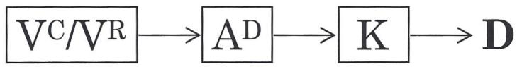

Δεδομένης της παραπάνω Στρατηγικής, εδώ είναι η πρόταση: Αναρωτιέμαι πόσο σύντομα [1] (υποθέτοντας ότι δεν έχουν συμφωνήσει καν να δουν την πρόταση ακόμα) θα έχεις την ευκαιρία να δεις την πρότασή μας [2], και να θυμηθείς βλέποντας ότι ικανοποιεί τα κριτήριά σου [3], ώστε να μπορέσεις να νιώσεις καλά γι' αυτό [4] απόψε [5], έτσι δεν είναι [tag question-6]. Έτσι λειτουργεί:

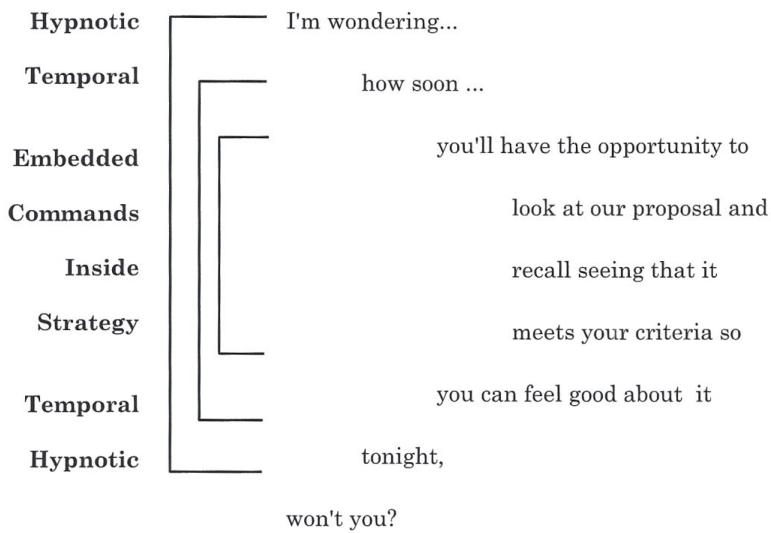

Έτσι, αυτό που έχουμε είναι ένα υπνωτικό γλωσσικό μοτίβο ακολουθούμενο από ένα κατηγορούμενο χρονικότητας στην αρχή, και στο τέλος, που συμπτύσσει και τις 3 ενσωματωμένες εντολές μαζί σε μία εξαιρετικά ακαταμάχητη πρόταση. Μπορείτε να τις κατασκευάσετε με όποιον τρόπο θέλετε βάζοντας κατηγορούμενα χρονικότητας στην αρχή και στο τέλος και βάζοντας τις ενσωματωμένες εντολές στη μέση.

Πώς μαθαίνετε να το κάνετε αυτό; Ανακαλύπτετε τη Στρατηγική τους, και (αν χρειάζεται) τη γράφετε σε ένα κομμάτι χαρτί καθώς κατασκευάζετε τις ενσωματωμένες εντολές. Στη συνέχεια βάζετε την υπνωτική γλώσσα και τα


\rightline{\small 134}

κατηγορούμενα χρονικότητας στην αρχή και στο τέλος και την λέτε. Βλέπετε, στην προηγούμενη πρόταση υπάρχει επίσης μια εντολή να νιώσει καλά για την πρόταση απόψε σε αντίθεση με κάποια άλλη νύχτα, η οποία προϋποθέτει ξανά ότι θα την κοιτάξουν απόψε, ενώ ξεκινήσαμε ρωτώντας τους πόσο σύντομα, τώρα καταλήξαμε υποδεικνύοντας ότι θα είναι απόψε.

Τώρα, ενώ ήσασταν στη διαδικασία επαγωγής των Στρατηγικών κάποιου, μπορεί επίσης να έχετε θέσει κάποιες αγκυρώσεις.

Όταν κάνουμε εκπαίδευση για πωλητές λιανικής, προτείνουμε να χρησιμοποιούν αγκύρωση επιπλέον της επαγωγής Στρατηγικής και των ενσωματωμένων εντολών. Όταν κάποιος μπαίνει για να μιλήσει σε έναν πωλητή στο κατάστημα που εκπαιδεύουμε πώς να πουλάει, ένα από τα πράγματα που προτείνουμε είναι να ρωτήσει ο πωλητής τον πελάτη: «Έχεις αγοράσει ποτέ έναν υπολογιστή (ας πούμε ότι είναι ένας πωλητής υπολογιστών), που πραγματικά λειτουργεί καλά και ένιωσες πραγματικά καλά γι' αυτόν;» Και όταν ο πελάτης ή ο υποψήφιος πελάτης το θυμηθεί, θα προσπελάσει ολόκληρη αυτή τη Στρατηγική αγοράς αυτού του υπολογιστή, έτσι δεν είναι; Θα περάσουν μέσα από και θα προσπελάσουν αυτή την κατάσταση. Όταν ο πωλητής ρώτησε τον πελάτη αν είχε ποτέ έναν υπολογιστή που ένιωσαν καλά γι' αυτόν και λειτουργούσε πραγματικά καλά γι' αυτούς, θα πρέπει να γυρίσουν πίσω και να προσπελάσουν μια στιγμή αν είχαν. Αν είχαν, θα προσπελάσει μια κατάσταση όπου είχαν έναν υπολογιστή που λειτουργούσε καλά γι' αυτούς, την οποία μπορείτε να αγκυρώσετε. Στη συνέχεια λέτε: «Πώς ήξερες ότι ήταν η ώρα να αγοράσεις τον υπολογιστή;», που επάγει τη Στρατηγική λήψης απόφασης.

Τους λέτε: «Έχεις αγοράσει ποτέ έναν υπολογιστή που ένιωσες πραγματικά καλά γι' αυτόν;» Θα πουν είτε ναι είτε όχι. Έτσι αν πουν ναι, ή ακόμα και αν πουν όχι, αγκυρώστε αυτή την κατάσταση! Υποθέτοντας ότι είπαν ναι, έχετε επίσης μία ή περισσότερες αγκυρώσεις τοποθετημένες μαζί τους τη στιγμή της επαγωγής της Στρατηγικής. Όταν πάτε να κλείσετε, μπορείτε να κάνετε το κλείσιμο μέσα στη Στρατηγική τους, και να τροφοδοτείτε πίσω τις πληροφορίες σε αυτούς ακριβώς με τον ίδιο τρόπο που επεξεργάζονται τις πληροφορίες, μπορείτε επίσης να ενεργοποιήσετε τις αγκυρώσεις. Έτσι, με μια θετική αγκύρωση τεθειμένη, υποθέτοντας μια ακουστική ψηφιακή Στρατηγική, μπορείτε να πείτε κάτι όπως: «Είμαι σίγουρος ότι καθώς κοιτάς τον υπολογιστή μας, θα δεις ότι ικανοποιεί όλα τα κριτήριά σου για υπολογιστές, και ότι μπορείς να αποφασίσεις ότι το θέλεις (ενεργοποιώντας την αγκύρωση), έτσι δεν είναι;» Αυτή είναι μια οπτική ακουστική ψηφιακή Στρατηγική. Εντάξει;

Και, αν λάβετε μια αρνητική απάντηση στην ερώτηση: «Έχεις αγοράσει ποτέ έναν υπολογιστή που ένιωσες πραγματικά καλά γι' αυτόν», αγκυρώστε την κι αυτή. Μπορείτε πάντα να τη χρησιμοποιήσετε για να την προσαρτήσετε σε μια αντίρρηση που μπορεί να έχουν στο μέλλον.

## ΣΧΕΔΙΑΣΜΟΣ ΣΤΡΑΤΗΓΙΚΗΣ (STRATEGY DESIGN)

Το επόμενο στοιχείο στις Στρατηγικές, είναι ο σχεδιασμός Στρατηγικής. Τώρα, θα θέλατε να σχεδιάσετε μια νέα Στρατηγική για ένα άτομο αν η Στρατηγική που έχει είναι ιδιαίτερα αναποτελεσματική ή δεν επεξεργάζεται τα δεδομένα καλά γι' αυτό. Για παράδειγμα, ένας πελάτης μπορεί να έχει μια οπτική κιναισθητική Στρατηγική λήψης απόφασης αγοράς. Δηλαδή, το βλέπουν, το θέλουν, το αγοράζουν. «Το θέλουν» είναι ένα συναίσθημα. Και μπορεί να βρίσκονται σε μια κατάσταση όπου: «Ε, αγοράζω πάρα πολλά.»

Μπορείτε να τους βοηθήσετε προσθέτοντας ένα άλλο σημείο σε αυτή τη συγκεκριμένη Στρατηγική. Υπάρχουν κάποια πράγματα που πρέπει να γνωρίζετε. Όταν σχεδιάζετε Στρατηγικές υπάρχουν κάποια πράγματα που είναι πολύ σημαντικά:

1. Το άτομο πρέπει να έχει μια καλά καθορισμένη αναπαράσταση του επιθυμητού αποτελέσματος (Outcome). Πρέπει να είναι ένα καλά σχεδιασμένο επιθυμητό αποτέλεσμα. Πρέπει να γνωρίζουμε τι είδους επιθυμητό αποτέλεσμα θέλουμε ως αποτέλεσμα της αλλαγής της Στρατηγικής. Και έτσι, περνάμε από τα Κλειδιά για ένα Επιθυμητό Αποτέλεσμα και το Meta Model και σχεδιάζουμε μια πολύ καλά καθορισμένη αναπαράσταση του επιθυμητού αποτελέσματος. Ρωτήστε: «για ποιον σκοπό...» γιατί θέλουν την αλλαγή.


\rightline{\small 135}

2. Δεύτερον, η Στρατηγική θα πρέπει να χρησιμοποιεί και τα τρία κύρια αντιπροσωπευτικά συστήματα, δηλαδή, οπτικό, ακουστικό και κιναισθητικό.

3. Το τρίτο πράγμα είναι ότι δεν θα πρέπει να υπάρχουν δι-σημειακοί βρόχοι. Ένας δι-σημειακός βρόχος γίνεται Συναισθησία (όπως μια Συναισθησία V-K). Και μια Συναισθησία κάνει βρόχο πολύ γρήγορα, και είναι πιο δύσκολο να βγει κανείς. Αν βρίσκεστε σε μια Συναισθησία όπου πηγαίνετε σε κύκλο, V-K, V-K, V-K, είναι πραγματικά δύσκολο να σπάσετε από αυτό το είδος βρόχου. Ενώ, αν είναι ένας τρι-σημειακός βρόχος, υπάρχει περισσότερος χρόνος ανάμεσα στο να πάτε πίσω και να το πάρετε ξανά και να πάτε γύρω ξανά, και αν έχουν κάποιο ακουστικό ψηφιακό μπορούν να πουν: «... ε, είναι ώρα να βγω από εδώ.»

4. Που μας οδηγεί στο σημείο τέσσερα, δηλαδή, μετά από τόσα βήματα η Στρατηγική θα πρέπει να έχει έναν εξωτερικό έλεγχο. Αυτό που δεν θέλουμε να κάνουμε είναι, αυτό που έχω δει τόσες πολλές φορές, άνθρωποι που έχουν Στρατηγικές, φυσικά ασυνείδητα σχεδιασμένες, όπου κυριολεκτικά πηγαίνουν και καταλήγουν σε αυτόν τον ακουστικό ψηφιακό βρόχο ανατροφοδότησης όπου απλώς αξιολογούν κριτήρια, συγκεντρώνουν περισσότερες πληροφορίες, συνεχίζουν να κολλάνε σε αυτόν τον Ad βρόχο, όπου μιλούν στον εαυτό τους να μπει και να βγει από μια απόφαση. Πηγαίνουν Οπτικό – Ακουστικό Ψηφιακό, να πάρω μια απόφαση; Όχι... συγκεντρώστε περισσότερες πληροφορίες... μιλήστε στον εαυτό σας έξω... καταλήγουν σε έναν πολύ σφιχτό ψηφιακό βρόχο όπου απλώς δεν παίρνουν μια απόφαση. Άρα το σημείο είναι να έχουν έναν τρι-σημειακό βρόχο.

Τώρα, υπάρχουν τρία ακόμα σημεία σχετικά με τη λειτουργικότητα της Στρατηγικής που πρόκειται να σχεδιάσετε. Στη διαδικασία σχεδιασμού μιας Στρατηγικής, υπάρχουν τρία ακόμα σημεία που είναι πραγματικά σημαντικά:

Πρώτα απ' όλα η Στρατηγική θα πρέπει να έχει μια δοκιμή, και μέρος της δοκιμής θα πρέπει να είναι μια σύγκριση της παρούσας κατάστασης, και της επιθυμητής κατάστασης. Θυμηθείτε ότι είπαμε στην αρχή αυτού του κεφαλαίου, ότι συνήθως υπάρχει ένα έναυσμα ή μια δοκιμή που τροφοδοτεί τις πληροφορίες προς τα εμπρός στην επόμενη δοκιμή. Οι πληροφορίες που υπάρχουν στο μέρος προς τα εμπρός θέτουν συγκεκριμένα κριτήρια.

Στη σύγκριση, η Στρατηγική θα πρέπει να έχει μια δοκιμή που είναι η σύγκριση της παρούσας κατάστασης με την επιθυμητή κατάσταση. Αυτό θα σας δώσει είτε ένα μείον (πηγαίνετε πίσω και συνεχίστε τη Στρατηγική), είτε ένα συν (έξοδος με επιτυχία).

Το δεύτερο στοιχείο σχετικά με τη λειτουργικότητα των Στρατηγικών είναι ότι η Στρατηγική θα πρέπει να έχει ένα βήμα ανατροφοδότησης, δηλαδή μια αναπαράσταση που προκύπτει από το συν ή το μείον, δηλαδή η Συμφωνία ή Ασυμφωνία (Congruence/Incongruence) της σύγκρισης δοκιμής, ώστε μια Στρατηγική όταν εγκαθίσταται θα πρέπει να έχει ένα μέρος συν και μείον όπου επιστρέφει και κάνει βρόχο πίσω ή όπου βγαίνει.

Τέλος η Στρατηγική θα πρέπει να έχει μια λειτουργία. Αυτή έρχεται κατευθείαν από την έξοδο δοκιμής. Η Στρατηγική θα πρέπει να έχει μια λειτουργία που είναι μια αλυσίδα αντιπροσωπευτικών ή/και κινητικών δραστηριοτήτων για τον σκοπό αλλαγής της παρούσας κατάστασης προκειμένου να την φέρει πιο κοντά στην επιθυμητή κατάσταση, δηλαδή, θα πρέπει να έχει μια σειρά από βήματα, με άλλα λόγια, μια λειτουργία θα πρέπει να έχει μια σειρά από βήματα ή μια αλυσίδα αντιπροσωπευτικών συστημάτων ή εσωτερική/εξωτερική πρόοδο.

Μόνο μερικές ακόμα παρατηρήσεις σχετικά με τις Στρατηγικές, τώρα. Πρώτα απ' όλα η Στρατηγική με τα λιγότερα βήματα είναι πιθανώς καλύτερη από τη Στρατηγική με τα περισσότερα βήματα. Με άλλα λόγια, αν σχεδιάσατε μια Στρατηγική 23 σημείων για κάποιον, και πάτε να την εγκαταστήσετε, ξεχάστε το. Αυτό που είναι πολύ καλύτερο είναι να τους δώσετε όσο το δυνατόν λιγότερα βήματα για να τους επιτρέψετε να επιτύχουν το επιθυμητό τους αποτέλεσμα. Έτσι με βάση τα κριτήριά μας, όσον αφορά τις δομικά καλά διαμορφωμένες Στρατηγικές, τα κριτήρια θα ήταν κάπου μεταξύ τριών και έχοντας όσο το δυνατόν λιγότερα βήματα.

Ένα άλλο σημείο είναι ότι το να έχεις μια επιλογή είναι καλύτερο από το να μην έχεις επιλογή. Έτσι αν πρόκειται να εγκαταστήσετε μια Στρατηγική, βεβαιωθείτε ότι δίνετε στο άτομο μια επιλογή, παρά καμία επιλογή.

Θα πρέπει να λάβετε υπόψη το Μετα-Πρόγραμμα Κατεύθυνσης. Είναι σημαντικό να λάβετε υπόψη αν το άτομο κινείται Προς ή Μακριά Από στον σχεδιασμό της Στρατηγικής.


\rightline{\small 136}

# ΕΓΚΑΤΑΣΤΑΣΗ ΣΤΡΑΤΗΓΙΚΗΣ (STRATEGY INSTALLATION)

Τέλος, η Εγκατάσταση (Installation) είναι θέμα πρόβας, μοτίβων swish, και αλυσιδωτών αγκυρώσεων εγκατεστημένων για να ανακαλέσουν κάθε βήμα της νέας Στρατηγικής. Για παράδειγμα, για να αλλάξετε μια Στρατηγική, αγκυρώστε κάθε στοιχείο της Στρατηγικής:

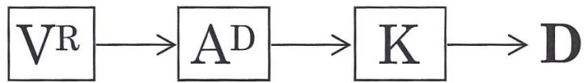

Αγκύρωση:
- Vr
-Ad
- K

Στη συνέχεια, υποθέτοντας ότι θέλετε να προσθέσετε το στοιχείο Vc, αγκυρώστε το.
- Vc

Στη συνέχεια αλυσιδώστε το στη Στρατηγική, μέσω αγκύρωσης ως:
- Vr
- Vc
- Ad
- K

Έτσι καταλήγετε με

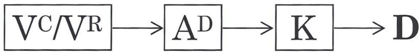


\rightline{\small 137}

# ΓΛΩΣΣΑΡΙ NLP

Accessing Cues (Σήματα Προσπέλασης)
Εξωτερικά σημάδια που μας δίνουν πληροφορίες για το τι κάνουμε μέσα μας. Τα σημάδια περιλαμβάνουν την αναπνοή, τις χειρονομίες, τη στάση του σώματος και τα μοτίβα των ματιών.

'As-If' Frame (Πλαίσιο «Σαν-Εάν»)
Αυτό είναι το «να ενεργείς σαν» κάτι να ισχύει. Δηλ.: Προσποιείσαι ότι είσαι ικανός σε κάτι που δεν είσαι, όπως το τένις. Η ιδέα είναι ότι η προσποίηση θα αυξήσει την ικανότητά σου.

Analogue (Αναλογικό)
(Σε αντίθεση με το Digital) Οι αναλογικές διακρίσεις έχουν διακριτές παραλλαγές, όπως σε ένα αναλογικό ρολόι.

Anchoring (Αγκύρωση)
Η Τεχνική του NLP κατά την οποία ένα ερέθισμα συνδέεται με μια απάντηση. Μια Αγκύρωση μπορεί να είναι σκόπιμη ή να συμβαίνει φυσικά. (Δείτε σελίδα 46.)

Associated (Συσχετισμένος)
Αφορά τη σχέση σου με μια εμπειρία. Σε μια ανάμνηση, για παράδειγμα, είσαι συσχετισμένος όταν κοιτάς μέσα από τα δικά σου μάτια, και βιώνεις το ακουστικό και κιναισθητικό ταυτόχρονα.

Auditory (Ακουστικό)
Ακοή.

Backtrack (Επανάληψη)
Να γυρίσεις πίσω και να συνοψίσεις ή να ανασκοπήσεις αυτό που καλύφθηκε προηγουμένως, όπως σε μια συνάντηση.

Behavior (Συμπεριφορά)
Οποιαδήποτε εξωτερική επαληθεύσιμη δραστηριότητα στην οποία εμπλεκόμαστε.

Beliefs (Πεποιθήσεις)
Γενικεύσεις που κάνουμε για τον κόσμο και οι απόψεις μας γι' αυτόν.

Calibration (Βαθμονόμηση)
Συνήθως περιλαμβάνει τη σύγκριση μεταξύ δύο διαφορετικών συνόλων μη λεκτικών σημάτων (εξωτερική επαληθεύσιμη συμπεριφορά). Μας επιτρέπει να διακρίνουμε την κατάσταση κάποιου άλλου μέσω μη λεκτικών σημάτων.

Chunking (Ομαδοποίηση)
Όπως στη σκέψη – η μετακίνηση πάνω ή κάτω σε ένα λογικό επίπεδο. Η ομαδοποίηση προς τα πάνω είναι η μετακίνηση σε ένα υψηλότερο, πιο αφηρημένο επίπεδο που περιλαμβάνει το χαμηλότερο επίπεδο. Η ομαδοποίηση προς τα κάτω είναι η μετακίνηση σε ένα επίπεδο, το οποίο είναι πιο συγκεκριμένο. (Δείτε Ιεραρχία Ιδεών, σελίδα 39.)

Complex Equivalence (Πολύπλοκη Ισοδυναμία)
Αυτό συμβαίνει όταν δύο δηλώσεις θεωρούνται ότι σημαίνουν το ίδιο πράγμα, Π.Χ.: «Δεν με κοιτάζει, και αυτό σημαίνει ότι δεν με συμπαθεί.» (Δείτε Meta Model, σελίδα Error! Bookmark not defined.)

Congruence (Συμφωνία)
Όταν η συμπεριφορά (εξωτερική επαληθεύσιμη) ταιριάζει με τα λόγια που λέει το άτομο.

Conscious (Συνειδητό)
Αυτό για το οποίο είμαστε επί του παρόντος επίγνωση.

Contrastive Analysis (Συγκριτική Ανάλυση)
Αυτή είναι μια διαδικασία Υπομορφοτροπιών ανάλυσης δύο συνόλων Υπομορφοτροπιών για την ανακάλυψη των Οδηγών (Drivers), Δηλ.: Τι τις κάνει διαφορετικές. Για παράδειγμα η διαφορά μεταξύ Παγωτού (που του αρέσει στον πελάτη) και Γιαουρτιού (που δεν του αρέσει στον πελάτη) βασίζονται σε διακρίσεις Υπομορφοτροπιών. (Δείτε σελίδα 28.)


\rightline{\small 138}

Content Reframe (Επαναπλαισίωση Περιεχομένου)
(Λέγεται επίσης Επαναπλαισίωση Νοήματος) Δίνοντας ένα άλλο νόημα σε μια δήλωση ανακτώντας περισσότερο περιεχόμενο, το οποίο αλλάζει την εστίαση, είναι μια Επαναπλαισίωση Περιεχομένου. Θα μπορούσατε να ρωτήσετε τον εαυτό σας: «Τι άλλο θα μπορούσε να σημαίνει αυτό;» ή «Τι είναι κάτι που δεν είχατε παρατηρήσει;» (Δείτε Επαναπλαισίωση Νοήματος, σελίδα 67.)

Context Reframing (Επαναπλαισίωση Πλαισίου)
Δίνοντας ένα άλλο νόημα σε μια δήλωση αλλάζοντας το πλαίσιο. Θα μπορούσατε να ρωτήσετε τον εαυτό σας: «Ποιο είναι ένα άλλο πλαίσιο στο οποίο αυτή η συμπεριφορά θα ήταν πιο κατάλληλη;» (Δείτε Επαναπλαισίωση Πλαισίου, σελίδα 67.)

Criteria (Κριτήρια)
Η λέξη NLP για τις αξίες – τι είναι σημαντικό για εσάς. (Δείτε Time Line Therapy and the Basis of Personality, 1988.)

Crossover Mirroring (Διασταυρωμένος Καθρεπτισμός)
Ταιριάζοντας την εξωτερική συμπεριφορά ενός ατόμου με μια διαφορετική κίνηση, Π.Χ.: Κινώντας το δάχτυλό σας για να ταιριάξει την αναπνοή του πελάτη.

Deep Structure (Βαθιά Δομή)
Η ασυνείδητη βάση για την επιφανειακή δομή μιας δήλωσης. Μεγάλο μέρος της βαθιάς δομής είναι εκτός επίγνωσης.

Deletion (Διαγραφή)
Μία από τις τρεις κύριες διαδικασίες (συμπεριλαμβανομένης της παραμόρφωσης και της γενίκευσης) στις οποίες βασίζεται το Meta Model. Η Διαγραφή συμβαίνει όταν παραλείπουμε ένα τμήμα της εμπειρίας μας. (Δείτε σελίδα Error! Bookmark not defined.)

Digital (Ψηφιακό)
Ψηφιακό (Σε αντίθεση με το Αναλογικό) Οι ψηφιακές διακρίσεις έχουν διακριτές παραλλαγές νοήματος όπως σε ένα Ψηφιακό ρολόι, ή έναν διακόπτη «Ανοιχτό/Κλειστό».

Dissociated (Αποσυνδεδεμένος)
Αφορά τη σχέση σας με μια εμπειρία. Σε μια ανάμνηση, για παράδειγμα, είστε αποσυνδεδεμένος όταν δεν κοιτάτε μέσα από τα δικά σας μάτια, και βλέπετε το σώμα σας στην εικόνα.

Distortion (Παραμόρφωση)
Μία από τις τρεις κύριες διαδικασίες (συμπεριλαμβανομένης της διαγραφής και της γενίκευσης) στις οποίες βασίζεται το Meta Model. Η παραμόρφωση συμβαίνει όταν κάτι θεωρείται εσφαλμένα ότι είναι αυτό που δεν είναι. Στην Ινδία υπάρχει μια μεταφορά που το εξηγεί αυτό: Ένας άνθρωπος βλέπει ένα κομμάτι σχοινί στον δρόμο και νομίζει ότι είναι ένα επικίνδυνο φίδι, οπότε προειδοποιεί το χωριό, αλλά δεν υπάρχει φίδι. (Δείτε σελίδα Error! Bookmark not defined.)

Downtime (Εσωτερικός Χρόνος)
Ο Εσωτερικός Χρόνος συμβαίνει όταν πηγαίνουμε προς τα μέσα. Μπορεί να συμβεί όταν πηγαίνουμε εσωτερικά για ένα κομμάτι πληροφορίας ή όταν συνδεόμαστε με συναισθήματα. (Δείτε Up Time.)

Drivers (Οδηγοί)
Στις Υπομορφοτροπίες, οι οδηγοί είναι η διαφορά που κάνει τη διαφορά. Ανακαλυπτόμενοι μέσω της διαδικασίας Συγκριτικής Ανάλυσης, οι Οδηγοί είναι οι κρίσιμες Υπομορφοτροπίες, και όταν αλλάζουν τείνουν να παρασύρουν μαζί τους τις άλλες Υπομορφοτροπίες.

Ecology (Οικολογία)
Στο NLP, η Οικολογία είναι η μελέτη των συνεπειών. Μας ενδιαφέρουν τα αποτελέσματα οποιασδήποτε αλλαγής που συμβαίνει. Είναι συχνά χρήσιμο να εξετάζουμε την οικολογία κάνοντας οποιαδήποτε αλλαγή ως προς τις συνέπειες για τον εαυτό, την οικογένεια (ή την επιχείρηση), την κοινωνία και τον πλανήτη.

Elicitation (Επαγωγή)
Επαγωγή μιας κατάστασης σε έναν πελάτη, ή συλλογή πληροφοριών κάνοντας ερωτήσεις ή παρατηρώντας τη συμπεριφορά του πελάτη.


\rightline{\small 139}

Eye Accessing Cues (Σήματα Πρόσβασης Ματιών)
Κινήσεις των ματιών προς ορισμένες κατευθύνσεις που υποδεικνύουν οπτική, ακουστική ή κιναισθητική σκέψη. (Δείτε σελίδα 23.)

Epistemology (Επιστημολογία)
Η μελέτη της γνώσης ή του πώς ξέρουμε αυτό που ξέρουμε.

First Position (Πρώτη Θέση)
Αυτή είναι μία από τις Αντιληπτικές Θέσεις. Η Πρώτη Θέση είναι όταν είστε σε επαφή μόνο με το δικό σας εσωτερικό Μοντέλο του Κόσμου.

Frame (Πλαίσιο)
Ένα πλαίσιο θέτει ένα περιβάλλον, που είναι ένας τρόπος με τον οποίο μπορούμε να κάνουμε μια διάκριση για κάτι, όπως σε Πλαίσιο Σαν-Εάν, Πλαίσιο Επανάληψης, Πλαίσιο Επιθυμητού Αποτελέσματος.

Future Pace (Μελλοντικός Συγχρονισμός)
Νοητική πρόβα ενός μελλοντικού αποτελέσματος για την εγκατάσταση μιας Στρατηγικής ανάκαμψης ώστε να συμβεί το επιθυμητό αποτέλεσμα.

Generalization (Γενίκευση)
Μία από τις τρεις κύριες διαδικασίες (συμπεριλαμβανομένης της παραμόρφωσης και της διαγραφής) στις οποίες βασίζεται το Meta Model. Η Γενίκευση συμβαίνει όταν μια συγκεκριμένη εμπειρία αντιπροσωπεύει μια ολόκληρη κατηγορία εμπειριών. (Δείτε σελίδα Error! Bookmark not defined.)

Gustatory (Γευστικό)
Γεύση.

Incongruence (Ασυμφωνία)
Όταν η συμπεριφορά (εξωτερική επαληθεύσιμη) δεν ταιριάζει με τα λόγια που λέει το άτομο.

Intent (Πρόθεση)
Το επιθυμητό αποτέλεσμα μιας συμπεριφοράς.

Internal Representations (Εσωτερικές Αναπαραστάσεις)
Το περιεχόμενο της σκέψης μας που περιλαμβάνει Εικόνες, Ήχους, Συναισθήματα, Γεύσεις, Οσμές, και Εσωτερικό Διάλογο.

Kinesthetic (Κιναισθητικό)
Αυτή η αίσθηση περιλαμβάνει συναισθήματα, και αισθήσεις.

Law of Requisite Variety (Νόμος της Απαραίτητης Ποικιλίας)
Ο Νόμος της Απαραίτητης Ποικιλίας δηλώνει ότι «Σε ένα δεδομένο φυσικό σύστημα, το μέρος του συστήματος με τη μεγαλύτερη ευελιξία συμπεριφοράς θα ελέγξει το σύστημα.»

Leading (Καθοδήγηση)
Μετά τον συγχρονισμό (ταίριασμα ή καθρεπτισμό) της συμπεριφοράς ενός πελάτη, η Καθοδήγηση περιλαμβάνει την αλλαγή της συμπεριφοράς σας ώστε το άλλο άτομο να ακολουθεί τις συμπεριφορές σας.

Lead System (Σύστημα Καθοδήγησης)
Εδώ πηγαίνουμε για να προσπελάσουμε πληροφορίες. Το Σύστημα Καθοδήγησης ανακαλύπτεται παρατηρώντας τα Σήματα Πρόσβασης Ματιών.

Logical Level (Λογικό Επίπεδο)
Το επίπεδο εξειδίκευσης ή αφαίρεσης. (Π.Χ.: Τα Χρήματα είναι ένα χαμηλότερο λογικό επίπεδο από την Ευημερία.)

Logical Type (Λογικός Τύπος)
Η κατηγορία πληροφοριών. (Π.Χ.: Οι Πάπιες είναι διαφορετικός λογικός τύπος από τα Αυτοκίνητα.)

Mapping Across (Χαρτογράφηση)
Μετά τη Συγκριτική Ανάλυση, η Χαρτογράφηση είναι η διαδικασία Υπομορφοτροπιών της πραγματικής αλλαγής του συνόλου των Υπομορφοτροπιών μιας ορισμένης Εσωτερικής Αναπαράστασης για την αλλαγή του νοήματός της. Π.Χ.: Η χαρτογράφηση των Υπομορφοτροπιών του Παγωτού (που του αρέσει στον πελάτη) πάνω σε αυτές του Γιαουρτιού (που δεν του αρέσει στον πελάτη) θα έπρεπε να κάνει τον πελάτη να μην του αρέσει το Παγωτό. (Δείτε σελίδα 28.)


\rightline{\small 140}

Matching (Ταίριασμα)
Σκόπιμη μίμηση τμημάτων της συμπεριφοράς ενός άλλου με σκοπό την αύξηση του rapport. (Π.Χ.: Αν και οι δύο σηκώσουμε το δεξί μας χέρι, τότε σας ταιριάζω.)

Meaning Reframe (Επαναπλαισίωση Νοήματος)
(Μερικές φορές ονομάζεται Επαναπλαισίωση Περιεχομένου) Δίνοντας ένα άλλο νόημα σε μια δήλωση ανακτώντας περισσότερο περιεχόμενο, το οποίο αλλάζει την εστίαση, Θα μπορούσατε να ρωτήσετε τον εαυτό σας: «Τι άλλο θα μπορούσε να σημαίνει αυτό;» ή «Τι είναι κάτι που δεν είχατε παρατηρήσει σε αυτό το πλαίσιο που θα αλλάξει το νόημα αυτού;» (Δείτε Επαναπλαισίωση Νοήματος, σελίδα 67.)

Meta Model
Το Meta Model σημαίνει «Πάνω» Μοντέλο. Ένα μοντέλο γλώσσας, προερχόμενο από τη Virginia Satir, που μας επιτρέπει να αναγνωρίσουμε διαγραφές, γενικεύσεις και παραμορφώσεις στη γλώσσα μας, και μας δίνει ερωτήσεις για να αποσαφηνίσουμε την ασαφή γλώσσα. (Δείτε σελίδα Error! Bookmark not defined.)

Meta Programs (Μετα Προγράμματα)
Αυτά είναι ασυνείδητα, ανεξάρτητα από περιεχόμενο προγράμματα που τρέχουμε, τα οποία φιλτράρουν τις εμπειρίες μας. Προς &amp; Μακριά Από, και Ταίριασμα &amp; Μη Ταίριασμα είναι παραδείγματα Μετα Προγραμμάτων. (Δείτε Time Line Therapy and the Basis of Personality, 1988· δείτε επίσης, τη Συλλογή Εκπαίδευσης NLP Master Practitioner μας.)

Metaphor (Μεταφορά)
Μια ιστορία (αναλογία ή σχήμα λόγου) που λέγεται με σκοπό, η οποία μας επιτρέπει να παρακάμψουμε τη συνειδητή αντίσταση του πελάτη και να κάνουμε τον πελάτη να κάνει συνδέσεις σε ένα βαθύτερο επίπεδο.

Milton Model
Το Milton Model έχει την αντίθετη πρόθεση από το Meta Model (Έκσταση), και προέρχεται από τα γλωσσικά μοτίβα του Milton Erickson. Το Milton Model είναι μια σειρά αφηρημένων γλωσσικών μοτίβων που είναι διφορούμενα ώστε να ταιριάζουν με την εμπειρία του πελάτη μας και να τον βοηθούν στην προσπέλαση ασυνείδητων πόρων.

Mirroring (Καθρεπτισμός)
Ταίριασμα τμημάτων της συμπεριφοράς ενός άλλου ατόμου, όπως σε έναν καθρέφτη. (Π.Χ.: Αν εσείς σηκώσετε το δεξί σας χέρι, και εγώ σηκώσω το αριστερό μου, τότε σας καθρεπτίζω.)

Mismatching (Μη Ταίριασμα)
Αυτό γενικά σχετίζεται με αντιφατική συμπεριφορά ή λόγια, και είναι ένα από τα Μετα Προγράμματα.

Modal Operator (Τροπικός Τελεστής)
Ο Τροπικός Τελεστής της Αναγκαιότητας σχετίζεται με λέξεις, οι οποίες σχηματίζουν τους κανόνες στη ζωή μας (πρέπει, οφείλει, χρειάζεται να, κ.λπ.). Ο Τροπικός Τελεστής της Δυνατότητας σχετίζεται με λέξεις που υποδηλώνουν αυτό που θεωρείται δυνατό (μπορεί, δεν μπορεί, κ.λπ.).

Model (Μοντέλο)
Στο NLP, ένα Μοντέλο είναι μια περιγραφή μιας έννοιας ή μιας συμπεριφοράς, που περιλαμβάνει τις Στρατηγικές, τα Μοτίβα Φίλτρων και τη Φυσιολογία ώστε να μπορεί να υιοθετηθεί εύκολα.

Modeling (Μοντελοποίηση)
Η Μοντελοποίηση είναι η διαδικασία με την οποία δημιουργήθηκε όλο το NLP. Στη Μοντελοποίηση επάγουμε τις Στρατηγικές, τα Μοτίβα Φίλτρων (Πεποιθήσεις και Αξίες) και τη Φυσιολογία που επιτρέπουν σε κάποιον να παράγει μια ορισμένη συμπεριφορά. Στη συνέχεια τα κωδικοποιούμε σε μια σειρά βημάτων σχεδιασμένων για να καθιστούν τη συμπεριφορά εύκολη στην αναπαραγωγή.


\rightline{\small 141}

<table><tr><td>Model of the World (Μοντέλο του Κόσμου)</td><td>Οι αξίες, οι πεποιθήσεις και οι στάσεις ενός ατόμου που σχετίζονται με και δημιουργούν τον δικό του κόσμο.</td></tr><tr><td>Neuro Linguistic Programming</td><td>Το NLP είναι η μελέτη της αριστείας, που περιγράφει πώς η σκέψη μας παράγει τη συμπεριφορά μας, και μας επιτρέπει να μοντελοποιήσουμε την αριστεία και να αναπαράγουμε αυτή τη συμπεριφορά.</td></tr><tr><td>Nominalization (Ονοματοποίηση)</td><td>Μια λέξη διαδικασίας που έχει μετατραπεί σε ουσιαστικό, συχνά προσθέτοντας «τιον». (Δείτε Meta Model, Σελίδα Error! Bookmark not defined.)</td></tr><tr><td>Olfactory (Οσφρητικό)</td><td>Η αίσθηση της όσφρησης.</td></tr><tr><td>Outcome (Επιθυμητό αποτέλεσμα)</td><td>Επιθυμητό αποτέλεσμα.</td></tr><tr><td>Overlap (Επικάλυψη)</td><td>Χρήση ενός προτιμώμενου αντιπροσωπευτικού συστήματος για να μας επιτρέψει να αποκτήσουμε πρόσβαση σε ένα άλλο, Π.Χ.: «Φαντάσου να περπατάς (προτιμώμενο αντιπροσωπευτικό σύστημα) κατά μήκος της παραλίας και να ακούς τα πουλιά. Τώρα, κοίτα κάτω στην άμμο και νιώσε τη δροσερή υγρή άμμο κάτω από τα πόδια σου.»</td></tr><tr><td>Pacing (Συγχρονισμός)</td><td>Ο Συγχρονισμός είναι το ταίριασμα ή ο καθρεπτισμός της εξωτερικής συμπεριφοράς ενός άλλου ατόμου ώστε να αποκτηθεί rapport.</td></tr><tr><td>Parts (Μέρη)</td><td>Τα Μέρη είναι ένα τμήμα του ασυνείδητου νου, τα οποία συχνά έχουν αντικρουόμενες πεποιθήσεις και αξίες. (Δείτε σελίδα 73.)</td></tr><tr><td>Parts Integration (Ενσωμάτωση Μερών)</td><td>Μια τεχνική NLP, η οποία μας επιτρέπει να ενσωματώσουμε μέρη στο ασυνείδητο επίπεδο βοηθώντας το καθένα να διασχίσει λογικά επίπεδα (μέσω ομαδοποίησης προς τα πάνω) και να ξεπεράσει τα όρια του καθενός για να βρει ένα υψηλότερο επίπεδο ολότητας. (Δείτε σελίδα 73.)</td></tr><tr><td>Perceptual Position (Αντιληπτική Θέση)</td><td>Περιγράφει την οπτική γωνία μας σε μια συγκεκριμένη κατάσταση: Η Πρώτη Θέση είναι η δική μας οπτική γωνία. Η Δεύτερη Θέση είναι συνήθως η οπτική γωνία κάποιου άλλου. Η Τρίτη θέση είναι η οπτική γωνία ενός αποσυνδεδεμένου παρατηρητή.</td></tr><tr><td>Phonological Ambiguity (Φωνολογική Αμφισημία)</td><td>Αυτό συμβαίνει όταν υπάρχουν δύο λέξεις, που ακούγονται ίδια αλλά έχουν διαφορετικές σημασίες. (Δείτε Milton Model, σελίδα 39.)</td></tr><tr><td>Preferred Rep System (Προτιμώμενο Αντιπροσωπευτικό Σύστημα)</td><td>Αυτό είναι το αντιπροσωπευτικό σύστημα που κάποιος χρησιμοποιεί συχνότερα για να σκεφτεί, και να οργανώσει τις εμπειρίες του.</td></tr><tr><td>Presuppositions (Προϋποθέσεις)</td><td>Οι Προϋποθέσεις σημαίνουν κυριολεκτικά υποθέσεις. Στη φυσική γλώσσα οι προϋποθέσεις είναι αυτό που υποτίθεται από την πρόταση. Είναι χρήσιμες στο «να ακούς ανάμεσα στις γραμμές» και επίσης για να επικοινωνείς με κάποιον χρησιμοποιώντας υποθέσεις που θα πρέπει να γίνουν αποδεκτές από τον ακροατή ώστε η επικοινωνία να έχει νόημα. (Δείτε σελίδα 35.)</td></tr><tr><td>Presuppositions of NLP (Προϋποθέσεις του NLP)</td><td>Υποθέσεις ή βολικές πεποιθήσεις, οι οποίες δεν είναι απαραίτητα «αληθείς», αλλά οι οποίες αν γίνουν αποδεκτές και πιστευτές θα αλλάξουν τη σκέψη μας και θα βελτιώσουν τα αποτελέσματά μας ως NLP Practitioner. (Δείτε σελίδα 12.)</td></tr><tr><td>Primary Rep System (Πρωταρχικό Αντιπροσωπευτικό Σύστημα)</td><td>Αυτό είναι πώς αναπαριστούμε την εσωτερική μας επεξεργασία, εξωτερικά. (Ανακαλύπτεται ακούγοντας τα Κατηγορούμενα και κοιτώντας τη Φυσιολογία.)</td></tr><tr><td>Punctuation Ambiguity (Σημειακή Αμφισημία)</td><td>Αμφισημία, η οποία δημιουργείται αλλάζοντας τη σημείωση μιας πρότασης κάνοντας παύση στο λάθος σημείο, ή ενώνοντας δύο προτάσεις. (Δείτε Milton Model, σελίδα 39.)</td></tr></table>


\rightline{\small 142}

Quotes (Αποσπάσματα)

Αυτό είναι ένα Γλωσσικό Μοτίβο στο οποίο το μήνυμά σας εκφράζεται σαν να ήταν από κάποιον άλλο. (Δείτε επίσης Εκτεταμένα Αποσπάσματα και Milton Model, σελίδα 39.)


\rightline{\small 143}

Rapport
Η διαδικασία Ταιριάσματος ή Καθρεπτισμού κάποιου ώστε να αποδεχτεί, χωρίς κριτική, τις προτάσεις που του δίνετε. (Αρχικά στην Ύπνωση το 'Rapport' είχε διαφορετική σημασία, η οποία ήταν, μια κατάσταση όπου το υποκείμενο στην Ύπνωση βλέπει, ακούει μόνο τον Υπνοθεραπευτή.) Αυτή δεν είναι η σημασία στο NLP όπου σχετίζεται με την εγκαθίδρυση εμπιστοσύνης και rapport μεταξύ δύο ατόμων.

Reframing (Επαναπλαισίωση)
Η διαδικασία αλλαγής του πλαισίου ή του περιβάλλοντος μιας δήλωσης για να της δώσει ένα άλλο νόημα. Στις πωλήσεις αυτή η διαδικασία ονομάζεται «Απάντηση Αντιρρήσεων.»

Representation (Αναπαράσταση)
Μια σκέψη στο μυαλό που μπορεί να αποτελείται από Οπτικό, Ακουστικό, Κιναισθητικό, Οσφρητικό (όσφρηση), Γευστικό (γεύση) και Ακουστικό Ψηφιακό (Εσωτερικός Διάλογος).

Representational System (Αντιπροσωπευτικό Σύστημα)
Ένα από τα έξι πράγματα που μπορείτε να κάνετε στο μυαλό σας: Οπτικό, Ακουστικό, Κιναισθητικό, Οσφρητικό (όσφρηση), Γευστικό (γεύση), και Ακουστικό Ψηφιακό (Εσωτερικός Διάλογος).

Resources (Πόροι)
Οι Πόροι είναι τα μέσα για τη δημιουργία αλλαγής μέσα στον εαυτό μας ή για την επίτευξη ενός επιθυμητού αποτελέσματος. Οι Πόροι μπορεί να περιλαμβάνουν ορισμένες καταστάσεις, την υιοθέτηση συγκεκριμένης φυσιολογίας, νέες Στρατηγικές, πεποιθήσεις, αξίες ή στάσεις, ακόμα και συγκεκριμένη συμπεριφορά.

Resourceful State (Κατάσταση Πόρων)
Αυτό αναφέρεται σε οποιαδήποτε κατάσταση όπου ένα άτομο έχει θετικά, βοηθητικά συναισθήματα και Στρατηγικές διαθέσιμες σε αυτό. Προφανώς η κατάσταση συνεπάγεται ένα επιτυχημένο επιθυμητό αποτέλεσμα.

Second Position (Δεύτερη Θέση)
Σχετιζόμενη με μια Αντιληπτική Θέση: Η Δεύτερη Θέση περιγράφει την οπτική γωνία μας σε μια συγκεκριμένη κατάσταση. Η Δεύτερη Θέση είναι συνήθως η οπτική γωνία κάποιου άλλου. (Η Πρώτη Θέση είναι η δική μας οπτική γωνία, η Τρίτη θέση είναι η οπτική γωνία ενός αποσυνδεδεμένου παρατηρητή.)

Sensory Acuity (Αισθητηριακή Οξύτητα)
Αυτό σχετίζεται με τις δεξιότητες παρατήρησης. Το να έχει κανείς Αισθητηριακή Οξύτητα σημαίνει ότι μπορούμε να παρατηρήσουμε πράγματα για τη φυσιολογία του πελάτη μας που οι περισσότεροι άνθρωποι δεν θα παρατηρούσαν. (Δείτε σελίδα 15.)

Sensory-Based Description (Περιγραφή Βασισμένη στις Αισθήσεις)
Είναι η περιγραφή της εξωτερικής επαληθεύσιμης συμπεριφοράς κάποιου με τρόπο που δεν περιλαμβάνει αξιολογήσεις, αλλά με τρόπο που απλώς σχετίζεται με τη συγκεκριμένη φυσιολογία. Π.Χ.: «Είναι χαρούμενη», είναι (στην ορολογία NLP) μια παραίσθηση. Μια περιγραφή βασισμένη στις αισθήσεις θα ήταν, τα χείλη της είναι καμπυλωμένα προς τα πάνω στα άκρα, και το πρόσωπό της είναι συμμετρικό.

State (Κατάσταση)
Σχετίζεται με την εσωτερική μας συναισθηματική κατάσταση. Δηλ.: Μια χαρούμενη κατάσταση, μια λυπημένη κατάσταση, μια παρακινημένη κατάσταση, κ.λπ. Στο NLP πιστεύουμε ότι η κατάσταση καθορίζει τα αποτελέσματά μας, και έτσι είμαστε προσεκτικοί να βρισκόμαστε σε καταστάσεις αριστείας.

Strategy (Στρατηγική)
Μια συγκεκριμένη ακολουθία εσωτερικών και εξωτερικών αναπαραστάσεων που οδηγεί σε ένα συγκεκριμένο επιθυμητό αποτέλεσμα.


\rightline{\small 144}

SubModalities (Υπομορφοτροπίες)
Αυτές είναι διακρίσεις (ή υποσύνολα) που είναι μέρος κάθε αντιπροσωπευτικού συστήματος που κωδικοποιούν και δίνουν νόημα στις εμπειρίες μας. Π.Χ.: Μια εικόνα μπορεί να είναι Ασπρόμαυρη ή Έγχρωμη, μπορεί να είναι Ταινία ή Στατική, μπορεί να είναι εστιασμένη ή θαμπή – αυτές είναι οπτικές Υπομορφοτροπίες.

Surface Structure (Επιφανειακή Δομή)
Αυτός είναι ένας γλωσσικός όρος που σημαίνει τη δομή της επικοινωνίας μας, η οποία γενικά παραλείπει την πληρότητα της Βαθιάς Δομής. Η διαδικασία είναι η Διαγραφή, η Γενίκευση και η Παραμόρφωση. (Δείτε επίσης Βαθιά Δομή.)

Synesthesia (Συναισθησία)
Μια Στρατηγική δύο βημάτων, όπου τα δύο βήματα συνδέονται μεταξύ τους με ένα συνήθως εκτός επίγνωσης, όπως στο «Θέλω να δω πώς νιώθω.»

Syntactic Ambiguity (Συντακτική Αμφισημία)
Όπου είναι αδύνατο να ειπωθεί από τη σύνταξη μιας πρότασης το νόημα μιας ορισμένης λέξης. Συχνά δημιουργείται προσθέτοντας «ing» σε ένα ρήμα, όπως στο «Hypnotizing Hypnotists can be easy.»

Third Position (Τρίτη Θέση)
Σχετιζόμενη με μια Αντιληπτική Θέση: Η Τρίτη Θέση περιγράφει την οπτική γωνία μας σε μια συγκεκριμένη κατάσταση. Η Τρίτη θέση είναι η οπτική γωνία ενός αποσυνδεδεμένου παρατηρητή. (Η Πρώτη Θέση είναι η δική μας οπτική γωνία, η Δεύτερη Θέση είναι συνήθως η οπτική γωνία κάποιου άλλου.)

Time Line (Γραμμή Χρόνου)
Η Γραμμή Χρόνου μας είναι ο τρόπος με τον οποίο αποθηκεύουμε τις αναμνήσεις μας του παρελθόντος, του παρόντος και του μέλλοντος.

Time Line Therapy™
Μια συγκεκριμένη διαδικασία που δημιουργήθηκε από τον Tad James, η οποία επιτρέπει στον πελάτη να απελευθερώσει αρνητικά συναισθήματα, να εξαλείψει περιοριστικές αποφάσεις και να δημιουργήσει ένα θετικό μέλλον για τον εαυτό του. (Δείτε Time Line Therapy and the Basis of Personality, 1988.)

Trance (Έκσταση)
Οποιαδήποτε εναλλαγμένη κατάσταση. Στην Ύπνωση χαρακτηρίζεται συνήθως από εσωτερική μονοσήμαντη εστίαση.

Unconscious (Ασυνείδητο)
Αυτό για το οποίο δεν είστε συνειδητοί, ή το οποίο είναι εκτός επίγνωσης.

Unconscious Mind (Ασυνείδητος Νους)
Το μέρος του νου σας που δεν έχετε συνείδηση... αυτή τη στιγμή.

Universal Quantifiers (Καθολικοί Ποσοδείκτες)
Λέξεις που είναι καθολικές γενικεύσεις και δεν έχουν αναφορικό δείκτη. Περιλαμβάνει λέξεις όπως «όλοι», «κάθε», και «ποτέ» Δείτε Meta Model σελίδα Error! Bookmark not defined., και Milton Model, σελίδα 39.)

Uptime (Εξωτερικός Χρόνος)
Μια κατάσταση όπου η προσοχή εστιάζεται στο εξωτερικό (σε αντίθεση με το Downtime όπου η προσοχή εστιάζεται προς τα μέσα).

Values (Αξίες)
Γενικεύσεις υψηλού επιπέδου που περιγράφουν αυτό που είναι σημαντικό για εσάς – στο NLP μερικές φορές ονομάζονται κριτήρια. (Δείτε Time Line Therapy and the Basis of Personality, 1988.)

Vestibular System (Αιθουσαίο Σύστημα)
Σχετίζεται με την αίσθηση της ισορροπίας.

Visual (Οπτικό)
Σχετίζεται με την αίσθηση της όρασης.

Visual Squash
(Τώρα ονομάζεται Ενσωμάτωση Μερών.) Μια τεχνική NLP η οποία μας επιτρέπει να ενσωματώσουμε μέρη στο ασυνείδητο επίπεδο βοηθώντας το καθένα να


\rightline{\small 145}

Wall Formedness

διασχίσει λογικά επίπεδα (μέσω ομαδοποίησης προς τα πάνω) και να ξεπεράσει τα όρια του καθενός για να βρει ένα υψηλότερο επίπεδο ολότητας.

Μαζί με τα Κλειδιά για ένα Εφικτό Επιθυμητό Αποτέλεσμα (δείτε σελίδα 10), οι Συνθήκες Καλής Διαμόρφωσης (δείτε σελίδα 11) μας επιτρέπουν να καθορίσουμε επιθυμητά αποτελέσματα που είναι πιο εφικτά, επειδή η γλώσσα συμμορφώνεται με ορισμένους κανόνες.


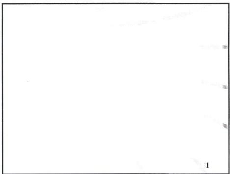

## Αυτή η Εκπαίδευση

- Μελέτη στο Σπίτι: Κασέτες &amp; Διάβασμα **55 Ώρες**
- Ολοκλήρωση Τεστ: **10 Ώρες**
- Ζωντανή Εκπαίδευση: 7 Μέρες = **51 Ώρες**
- Εργασία για το Σπίτι: **14 Ώρες**

**ΣΥΝΟΛΟ: 130 Ώρες**

- NLP: 130 Ώρες
- Υπνοθεραπεία: 130 Ώρες
- Time Line Therapy: 130 Ώρες

## Θέματα

- Ενδυνάμωση -- Λόγοι -vs- Αποτελέσματα
- Η Αντίληψη είναι Προβολή
- Ο Νευροδιαβιβαστής λούζει κάθε κύτταρο στο σώμα
- Η Ευθύνη για την Αλλαγή είναι Δική σας
- Μεταμορφώστε τον Πλανήτη

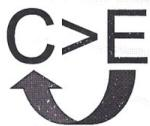

Σε ποια πλευρά της Εξίσωσης Αιτίας &amp; Αποτελέσματος βρίσκεστε????

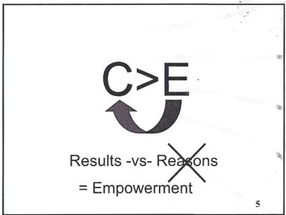

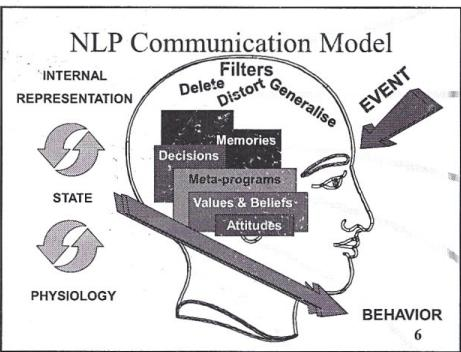


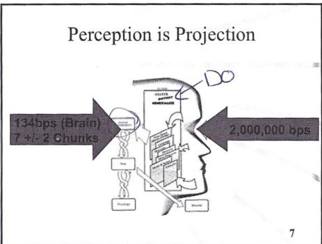

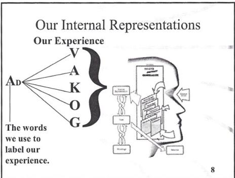

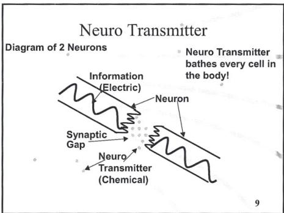

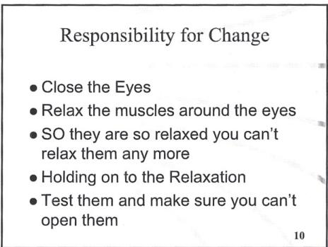

## Ευθύνη για την Αξία

- Όταν αγοράζετε ένα Μπλέντερ
- Όταν αγοράζετε ένα Αυτοκίνητο
- Όταν βγαίνετε για Δείπνο
- Όταν αγοράζετε μια Υπηρεσία
- και ... Όταν παρακολουθείτε μια Εκπαίδευση

\rightline{\small 11}

## Επαν-Επινοώντας το NLP

- ΟΧΙ μια διαδικασία «Κάνω-ΠΡΟΣ» αλλά «Κάνω-ΜΕ»
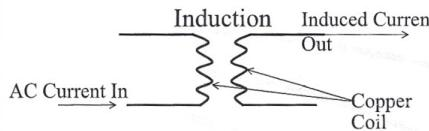
- Το NLP (&amp; Ύπνωση) είναι η ΕΠΑΓΩΓΗ μιας βαθιάς αλλαγής στην κατάσταση συνείδησης ενός πελάτη μέσω μιας συνεργατικής ροής ενέργειας και ιδεών. 12


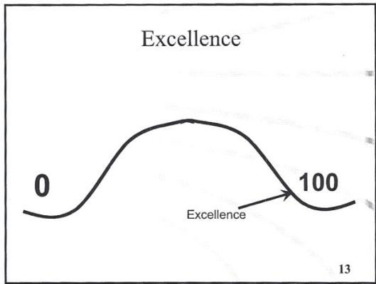

## FasTrak

Εκπαιδεύσεις NLP

- Εκπαίδευση NLP Practitioner
- Εκπαίδευση Master Practitioner
- Εκπαίδευση NLP Trainer's Training
- Πρόγραμμα Ανάπτυξης NLP Master Trainer

\rightline{\small 14}

## Αρχαία Huna

### FasTrak

Εκπαιδεύσεις Huna

- Huna Haumana -- Βασική Ενεργειακή Θεραπεία
- Huna Ho'omaka -- La'au Kahea
- Huna Alaka'i -- Προχωρημένο La'au Kahea
- Πρόγραμμα Ανάπτυξης Huna Ho'omanaloa

\rightline{\small 15}

## Οι Στόχοι μου για την Εκπαίδευση

- Κάντε τους τόσο **ΜΕΓΑΛΟΥΣ** ώστε, αν τους πετυχαίνατε, αυτή θα ήταν η σημαντικότερη εκπαίδευση που έχετε παρακολουθήσει ποτέ!!!

\rightline{\small 16}

## Συμφωνίες Λειτουργίας

- Μιλάτε μόνο από μπροστά προς τα πίσω
- Να είστε στην ώρα σας
- Κάντε όλες τις ασκήσεις στο μέγιστο των δυνατοτήτων σας
→ Μην ασκείστε σε ό,τι ήδη γνωρίζετε
→ Αν χρειαστείτε εργασία (Tasking)
→ Μόνο NLP, ακόμη κι αν γνωρίζετε άλλα πράγματα
- Αυτή είναι μια Εντατική Εκπαίδευση
→ Κρατήστε τις περισπάσεις στο ελάχιστο
→ Επιτηρείται αυστηρά από Βοηθούς
- Αν έχετε πρόβλημα με κάτι ή με κάποιον σε αυτή την εκπαίδευση, μιλήστε μόνο σε κάποιον που μπορεί να κάνει κάτι γι' αυτό

\rightline{\small 17}

## Νευρο-Γλωσσικός Προγραμματισμός (Neuro Linguistic Programming)

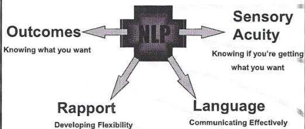

\rightline{\small 18}



# Αρχές για την Επιτυχία

- Γνωρίζετε το Αποτέλεσμά σας (Outcome)
- Αναλάβετε Δράση
- Έχετε Αισθητηριακή Οξύτητα (Sensory Acuity)
- Έχετε Συμπεριφορική Ευελιξία (Behavioral Flexibility)
- Λειτουργείτε από μια Φυσιολογία &amp; Ψυχολογία Αριστείας

\rightline{\small 19}

# Επίτευξη Αποτελεσμάτων

- Διατυπωμένα Θετικά
- Διαδικασία Απόδειξης (Evidence Procedure)
- Συγκλίνοντα Επιθυμητά (Congruently Desirable)
- Αυτο-εκκινούμενα και Διατηρούμενα
- Κατάλληλα Πλαισιωμένα ως προς το Πλαίσιο
- Ποιοι Πόροι (Resources) Χρειάζονται
- Οικολογικά (Ecological)

\rightline{\small 20}

# Προϋποθέσεις του NLP

- Σεβασμός για το μοντέλο του κόσμου του άλλου ανθρώπου!
- Το νόημα της επικοινωνίας είναι η απόκριση που λαμβάνετε.
- Ο νους και το σώμα επηρεάζουν το ένα το άλλο.
- Οι λέξεις που χρησιμοποιούμε ΔΕΝ είναι το γεγονός ή το πράγμα που αναπαριστούν.
- Η σημαντικότερη πληροφορία για ένα πρόσωπο είναι η συμπεριφορά (Behavior) του 21

# Προϋποθέσεις του NLP

- Η συμπεριφορά είναι προσαρμοσμένη για επιβίωση, και η παρούσα συμπεριφορά είναι η καλύτερη διαθέσιμη επιλογή.
- Η συμπεριφορά ενός ανθρώπου δεν είναι ποιος είναι. (αποδεχτείτε το πρόσωπο, αλλάξτε τη συμπεριφορά)
- Δεν υπάρχουν άνθρωποι χωρίς πόρους, μόνο καταστάσεις χωρίς πόρους.
- Είμαι υπεύθυνος για τον νου μου, και άρα για τα αποτελέσματά μου. 22

# Προϋποθέσεις του NLP

- Το σύστημα (πρόσωπο) με τη μεγαλύτερη ευελιξία συμπεριφοράς θα ελέγξει το σύστημα.
- Δεν υπάρχει αποτυχία, μόνο ανατροφοδότηση.
- Δεν υπάρχουν ανθεκτικοί πελάτες, μόνο μη ευέλικτοι επικοινωνιακοί.
- Η συμπεριφορά &amp; η αλλαγή πρέπει να αξιολογούνται με βάση το πλαίσιο και την οικολογία.
- Όλες οι διαδικασίες θα πρέπει να αυξάνουν την ολότητα. 23

# Όλη η...

- Μάθηση
- Συμπεριφορά
- Αλλαγή

...Είναι Ασυνείδητη

\rightline{\small 24}


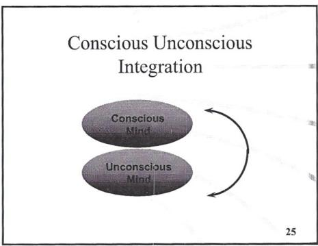

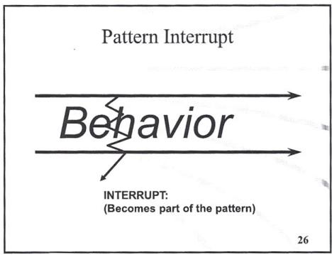

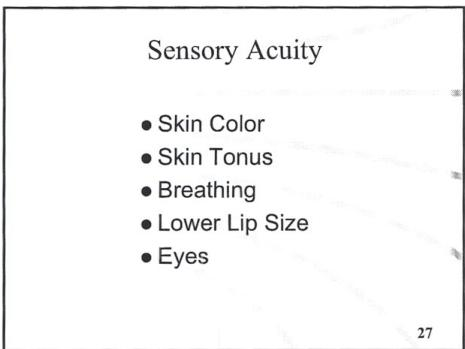

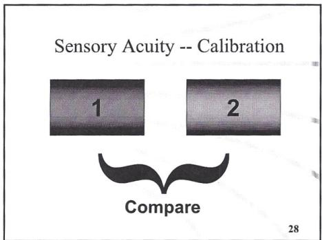

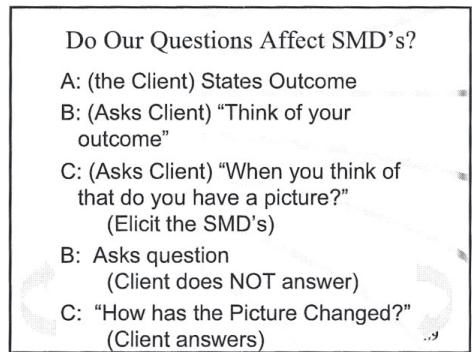

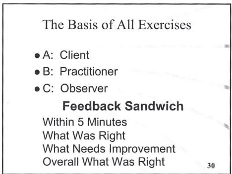



# Συντονισμός (Rapport)

- Στάση σώματος, Χειρονομίες
- Εκφράσεις προσώπου, Ανοιγοκλείσιμο ματιών
- Αναπνοή
- Φωνή -- Τόνος, Ρυθμός, Χροιά, Ένταση
- Κατηγορήματα (Predicates) -- V, A, K, AD
- Λέξεις Κλειδιά

\rightline{\small 31}

# Ταίριασμα Φωνής

- Τόνος
- Ρυθμός
- Χροιά
- Ένταση

\rightline{\small 32}

# Οι 4 Δείκτες Συντονισμού (Rapport)

- Εσωτερικό Συναίσθημα
- Αλλαγή Χρώματος
- Λένε Κάτι (Προαιρετικό)...
- Καθοδήγηση (Leading)

\rightline{\small 33}

# Καλυμμένη Αγκύρωση (Covert Anchoring)

Πρώτα: Συντονισμός (Rapport)

- Συμπαθώ
- Αντιπαθώ
- Γνωρίζει Απαντήσεις

**Αγκυρώσεις Συνθήκης**

- Δεν Γνωρίζει Απαντήσεις

**Επιρροή** 34

# Συντονισμός σε Ομάδα

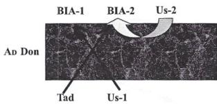

\rightline{\small 35}

# Συντονισμός σε Ομάδα

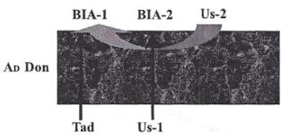

\rightline{\small 36}



# Άσκηση Συντονισμού σε Ομάδα

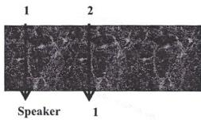

\rightline{\small 37}

# Θυμηθείτε!

Όποτε κάνετε NLP...
«Πείτε το με τον τρόπο που το θέλετε!»

\rightline{\small 38}

# Αλλαγή


Είναι η σειρά και η αλληλουχία των Εσωτερικών Αναπαραστάσεων

\rightline{\small 39}

# Εργασία για το Σπίτι

- Απόψε
- Διαβάστε σελ. 91-109 Μοντέλο Επικοινωνίας, Τροπικότητες, κλπ
- Κεφάλαιο 3 του Magic of NLP Demystified
- Αύριο το Βράδυ
- Στρατηγικές
- Αύριο Καλύπτουμε: Μεταφορές, Μετα-Μοντέλο, Smd's &amp; Αγκύρωση 40

# Γλωσσικές Προϋποθέσεις

- Ύπαρξη
- Δυνατότητα (Αδυναμία)
- Αιτία-Αποτέλεσμα
- Σύνθετη Ισοδυναμία
- Επίγνωση
- Χρόνος
- Επίθετο/Επίρρημα
- Συμπεριληπτικό/Αποκλειστικό OR
- Τακτικό 41

# Ιεραρχία Ιδεών

## Ανέβασμα Επιπέδου (Chunking Up)

- Για ποιον σκοπό...
- Ποια είναι η πρόθεση...
- Παράδειγμα του τι είναι αυτό...

## Κατέβασμα Επιπέδου (Chunking Down)

- Τι ή Ποιον Συγκεκριμένα
- Ποια είναι τα παραδείγματα αυτού;

\rightline{\small 42}


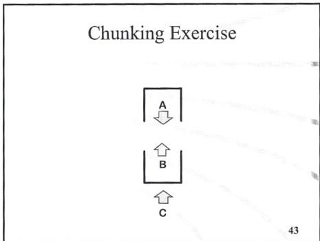

## Μοντέλο Clinton

- Διαβάσματα Νου (Mind Reads)
- Χαμένο Εκτελεστικό (Lost Performative)
- Αιτία &amp; Αποτέλεσμα
- Σύνθετη Ισοδυναμία
- Προϋποθέσεις
- Καθολικοί Ποσοδείκτες
- Τροπικοί Τελεστές
- Ονοματοποιήσεις
- Απροσδιόριστα Ρήματα
- Ερωτήσεις Επιβεβαίωσης

- Έλλειψη Δείκτη Αναφοράς
- Συγκριτικές Διαγραφές
- Συγχρονισμός Τρέχουσας Εμπειρίας
- Διπλά Δεσμά
- Συνομιλιακά Αιτήματα
- Εκτεταμένες Παραθέσεις
- Παραβίαση Περιορισμού Επιλογής
- Αμφισημία
- Αξιοποίηση

\rightline{\small 44}

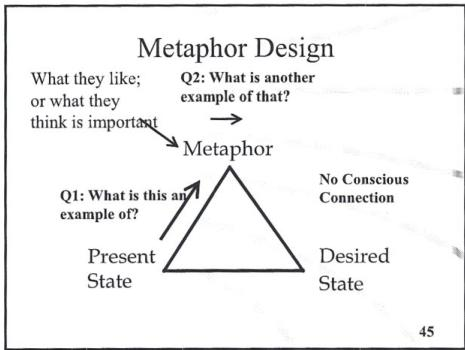

## Πώς να Λειτουργήσουν οι Μεταφορές (Metaphors) – Καταστάσεις που Προκαλούνται

- Είναι Καθαρή;
- Είναι δική σας; Την ΕΧΕΤΕ ιδιόκτητη;
- Είστε συμπαγείς ως προς αυτή;
- Έχει Πάθος;
- Είστε πραγματικά ενθουσιασμένοι γι' αυτή;
- Ζωντανεύει την αυτο-έκφρασή σας;
- Είστε συνδεδεμένοι με αυτή;

\rightline{\small 46}

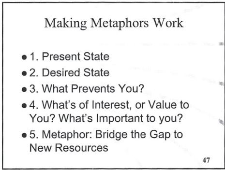

## Πώς να Λειτουργήσουν οι Μεταφορές

- 1. Παρούσα Κατάσταση
- 2. Επιθυμητή Κατάσταση
- 3. Τι Σας Εμποδίζει;
- 4. Τι Σας Ενδιαφέρει ή Έχει Αξία για Εσάς; Τι Είναι Σημαντικό για Εσάς;
- 5. Μεταφορά: Γεφυρώστε το Κενό προς Νέους Πόρους (Resources)

\rightline{\small 47}

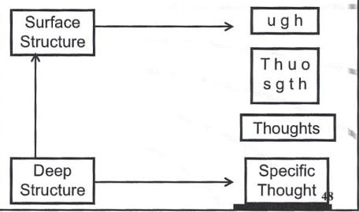



# Ερωτήσεις Μετα-Μοντέλου (Meta Model)

- Διαβάσματα Νου (Mind Reads)
- Χαμένο Εκτελεστικό (Lost Performative)
- Αιτία &amp; Αποτέλεσμα
- Σύνθετη Ισοδυναμία
- Προϋποθέσεις
- Καθολικοί Ποσοδείκτες
- Τροπικοί Τελεστές
- Ονοματοποιήσεις
- Απροσδιόριστα Ρήματα
- Έλλειψη Δείκτη Αναφοράς
- Διαγραφές

Πώς;

Τι θα συνέβαινε αν...
(Απλώς αποονοματικοποιήστε)
Ποιος ή Τι συγκεκριμένα;

\rightline{\small 49}

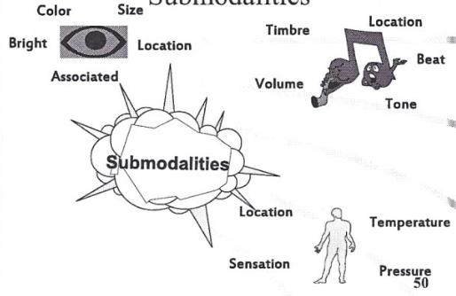

# Να Παράγουν Αποτελέσματα οι Υπομορφοτροπίες (Submodalities)

## Οδηγοί (Drivers)

- Αντιπαραθετική Ανάλυση
- Η Διαφορά που Κάνει τη Διαφορά
- Όταν Αλλάζει Ένα, Αλλάζουν Όλα
- Τοποθεσία &amp; Συσχέτιση/Αποσύνδεση Συχνά Οδηγοί

\rightline{\small 51}

# Να Παράγουν Αποτελέσματα οι Υπομορφοτροπίες

## Καθολικά (Universals)

- Γενικευμένη Εμπειρία
- με Πολλά Νοήματα
- Προκαλούν μια Καθολική Εμπειρία
- Πεποίθηση (Belief) -- Δεν Ισχύει Πλέον
- Ο Ήλιος Ανατέλλει Αύριο
- Κόκκινο Φανάρι, Πράσινο Φανάρι

\rightline{\small 52}

# Οδηγοί από Αντιπαραθετική Ανάλυση


- Χρώμα
- Κοντά
- Συνδεδεμένη
- Κέντρο


- Χρώμα
- Κοντά
- Αποσυνδεδεμένη
- Πάνω Δεξιά

\rightline{\small 53}

# Αλλαγή από Συμπάθεια σε Αντιπάθεια

- Εκμαιεύστε #1 &amp; #2
- Αλλάξτε τα Smd's του #1 σε αυτά του #2
- Δοκιμή

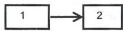

\rightline{\small 54}



# Εργασία για το Σπίτι

- Απόψε
- Στρατηγικές
- Αύριο το Βράδυ
- Διαβάστε Time Line Therapy Ενότητες 1 &amp; 2
- Αύριο Καλύπτουμε: Αγκύρωση, Στρατηγικές

\rightline{\small 55}

# Μοτίβο Swish

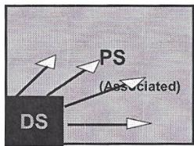

\rightline{\small 56}

# Μοτίβο Swish


\rightline{\small 57}

# Αγκύρωση (Anchoring)


\rightline{\small 59}

# Αγκύρωση

- Στοίβαξη Αγκυρώσεων
- Όλες στο ίδιο μέρος


\rightline{\small 60}



# Κατάρρευση Αγκυρώσεων

- Αποφασίστε + &amp; - καταστάσεις
- Μπείτε σε κάθε κατάσταση
- Στοιβάξτε + καταστάσεις, &amp; δοκιμάστε + αγκύρωση
- Αγκυρώστε - κατάσταση
- Πατήστε +/- αγκυρώσεις -- κρατήστε μέχρι ολοκλήρωσης
- Απελευθερώστε πρώτα την αρνητική
- Κρατήστε τη θετική για 5 δευτερόλεπτα


# Αγκύρωση

- Κατάρρευση Αγκυρώσεων Ταυτόχρονη
- Αλυσιδωτή Αγκύρωση Διαδοχική


\rightline{\small 62}

# Αλυσιδωτή Αγκύρωση

- Εκμαιεύστε όλες τις καταστάσεις και αγκυρώστε
- Δοκιμή
- Συνδέστε σε αλυσίδα 1 σε 2 σε 3 σε 4


Αναβλητικότητα

Κίνητρο

\rightline{\small 63}

# Σχεδιασμός Αλυσίδας

- Αποφασίστε την Πρώτη &amp; Τελευταία Κατάσταση
- Κριτήρια για Ενδιάμεσες Καταστάσεις
- Προς -ή- Μακριά Από;
- Ίδιος Λογικός Τύπος
- Η Επόμενη Κατάσταση Πρέπει Να Έχει Κίνηση!!
- Ποια Θα Είναι Μια Επαρκώς Έντονη Κατάσταση για να Μετακινήσει την Αλυσίδα στην Επόμενη Κατάσταση;
- Η Προτελευταία Κατάσταση Πρέπει Να Είναι Προς.
- Η Κατάσταση Πρέπει Να Είναι Αυτο-εκκινούμενη.
- Η Κατάσταση ΔΕΝ Πρέπει Να Είναι Πώς Ήδη Το Κάνουν

\rightline{\small 64}

# Στρατηγικές (Strategies)

Η Σειρά και η Αλληλουχία των Εσωτερικών &amp; Εξωτερικών Αναπαραστάσεων που Παράγουν ένα Συγκεκριμένο Αποτέλεσμα.


Θα μπορούσατε να σχεδιάσετε την καλύτερη στρατηγική, αλλά αν δεν λάβετε τον σκανδαλισμό, η στρατηγική δεν θα ενεργοποιηθεί ποτέ!

\rightline{\small 65}

# Εγκατάσταση μιας Στρατηγικής

- Εκμαιεύστε όλα τα βήματα &amp; αγκυρώστε τα
Vc
AL
K
- Αγκυρώστε το Πρόσθετο Βήμα
Ad
- Συνδέστε σε αλυσίδα τα βήματα: 1 σε 2 σε 3 σε 4
Vc
AL
Ad
IL

\rightline{\small 66}



Μοτίβα Ματιών NLP
Συνήθως Οργανωμένο Άτομο Όπως το Κοιτάτε

\rightline{\small 67}

# Ακουστικές Διακρίσεις

- Ab -- Είναι συνήθως η δική σας φωνή, και πιθανώς σχετίζεται με κριτήρια, ή και τιμή
- At -- Είναι συχνά η φωνή κάποιου άλλου, όπως της μητέρας σας, κλπ.

\rightline{\small 68}

# Μερικοί Τύποι Στρατηγικών

## Γενικές Στρατηγικές Αγοράς

- Κίνητρο
- Απόφαση
- →Πειστής (Convincer)
- Καθησύχαση

## Στρατηγικές Αγάπης

- Έλξη
- Αναγνώριση της Έλξης
- Βαθιά Αγάπη

\rightline{\small 69}

# Η Στρατηγική του Υποκειμένου Σημειωμένη για να Συμπληρώσετε...

- Απόφαση
- Κίνητρο
- Καθησύχαση

\rightline{\small 70}

# Επαναπλαισίωση (Reframing)

## Πλαίσιο

### Συγκριτική Διαγραφή

- Αλλάξτε το Πλαίσιο και Αλλάξτε το νόημα της Συμπεριφοράς
- Ποιο είναι ένα άλλο πλαίσιο για αυτή τη συμπεριφορά όπου το νόημα θα είναι διαφορετικό;


\rightline{\small 71}

# Επαναπλαισίωση

## Νόημα (C&gt;E,CEq)

- Αλλάξτε το Περιεχόμενο ή το Νόημα της Συμπεριφοράς και Αλλάξτε το Νόημα
- Ποιο είναι ένα Αντίθετο Πλαίσιο που Θα Αλλάξει το Νόημα;


\rightline{\small 72}


^{}[]


\rightline{\small 2}

# ΠΕΡΙΕΧΟΜΕΝΑ

ΟΙ ΚΥΡΙΕΣ ΤΕΧΝΙΚΕΣ ... 3
ΚΥΡΙΑ ΥΠΟΘΕΣΗ ... 5
ΠΡΩΤΑΡΧΙΚΕΣ ΕΝΤΟΛΕΣ ΤΟΥ ΑΣΥΝΕΙΔΗΤΟΥ ΝΟΥ ... 6
ΠΡΩΤΑΡΧΙΚΕΣ ΕΝΤΟΛΕΣ ΤΟΥ ΑΣΥΝΕΙΔΗΤΟΥ ΝΟΥ ... 6
ΕΡΩΤΗΣΕΙΣ ΓΙΑ ΑΠΟΤΕΛΕΣΜΑΤΑ ... 8
ΕΚΜΑΙΕΥΣΗ ΤΗΣ ΓΡΑΜΜΗΣ ΧΡΟΝΟΥ #1 ... 9
ΕΚΜΑΙΕΥΣΗ ΤΗΣ ΓΡΑΜΜΗΣ ΧΡΟΝΟΥ #2 ... 10
ΠΡΩΤΗ ΔΟΚΙΜΗ ΕΚΜΑΙΕΥΣΗΣ ... 11
ΑΝΑΚΑΛΥΨΗ ΤΗΣ ΡΙΖΙΚΗΣ ΑΙΤΙΑΣ ... 12
ΑΡΝΗΤΙΚΑ ΣΥΝΑΙΣΘΗΜΑΤΑ #1 ... 13
ΤΑ 3 ΠΡΑΓΜΑΤΑ ΠΡΟΣ ΕΛΕΓΧΟ ΣΤΗ ΘΕΣΗ #3 ... 14
ΣΗΜΕΙΩΣΕΙΣ ΣΧΕΤΙΚΑ ΜΕ ΤΑ ΜΑΘΗΜΑΤΑ ... 14
ΓΕΝΙΚΕΣ ΕΠΑΝΑΠΛΑΙΣΙΩΣΕΙΣ ... 15
ΑΡΝΗΤΙΚΑ ΣΥΝΑΙΣΘΗΜΑΤΑ #2 ... 16
ΑΓΧΟΣ ... 17
ΑΝ ΕΝΑΣ ΠΕΛΑΤΗΣ ΣΥΝΔΕΘΕΙ ΜΕ ΤΡΑΥΜΑΤΙΚΗ ΑΝΑΜΝΗΣΗ ... 18
ΠΡΟΣΔΙΟΡΙΣΜΟΣ ΠΕΡΙΟΡΙΣΤΙΚΩΝ ΑΠΟΦΑΣΕΩΝ ... 19
ΠΕΡΙΟΡΙΣΤΙΚΕΣ ΑΠΟΦΑΣΕΙΣ ... 20
3 ΛΟΓΟΙ ΓΙΑ ΤΟΥΣ ΟΠΟΙΟΥΣ ΕΞΑΦΑΝΙΖΟΝΤΑΙ ΤΑ ΣΥΝΑΙΣΘΗΜΑΤΑ ... 21
ΑΛΛΑΓΗ ΤΗΣ ΓΡΑΜΜΗΣ ΧΡΟΝΟΥ ... 22
ΤΟΠΟΘΕΣΙΑ/ΚΑΤΕΥΘΥΝΣΗ #1 ... 22
ΣΤΟΧΟΙ S.M.A.R.T. ... 24
ΣΤΟ ΜΕΛΛΟΝ ΣΑΣ ... 25
ΜΟΝΤΕΛΟ ΓΡΗΓΟΡΗΣ ΦΟΒΙΑΣ ... 26
ΕΝΟΠΟΙΗΣΗ ΜΕΡΩΝ (PARTS) ... 27
ΠΩΣ ΝΑ ΚΑΝΕΤΕ ΜΙΑ ΠΑΡΕΜΒΑΣΗ TIME LINE THERAPY™ ... 28
Ο ΚΥΚΛΟΣ CYF COACHING ... 32
ΔΗΛΩΣΗ ΠΕΔΙΟΥ ΕΦΑΡΜΟΓΗΣ ... 34


\rightline{\small 3}


\rightline{\small 4}

# ΟΙ ΚΥΡΙΕΣ ΤΕΧΝΙΚΕΣ

1. Εκμαίευση της Γραμμής Χρόνου. Ανακάλυψη της κατεύθυνσης και της τοποθεσίας της Γραμμής Χρόνου του πελάτη.

2. Ανακάλυψη της Ριζικής Αιτίας ή του Πρώτου Γεγονότος για ένα Αρνητικό Συναίσθημα ή μια Περιοριστική Απόφαση.

3. Απελευθέρωση Αρνητικού Συναισθήματος. (Συμπεριλαμβανομένων: θυμού, λύπης, φόβου, πληγής, ενοχής, κλπ. ΣΗΜΕΙΩΣΗ: ΑΥΤΗ ΕΙΝΑΙ ΕΠΙΣΗΣ Η ΣΕΙΡΑ ΜΕ ΤΗΝ ΟΠΟΙΑ ΑΠΕΛΕΥΘΕΡΩΝΟΝΤΑΙ ΤΑ ΣΥΝΑΙΣΘΗΜΑΤΑ)

4. Άρση μιας Περιοριστικής Απόφασης. (Συμπεριλαμβανομένων «δεν είμαι αρκετά καλός», «δεν μπορώ να βγάλω αρκετά χρήματα», ή «δεν μπορώ να έχω μια σπουδαία σχέση».)

5. Αλλαγή της Κατεύθυνσης/Τοποθεσίας της Γραμμής Χρόνου. (Εναλλαγή από Εντός Χρόνου σε Δια Χρόνου ή το αντίστροφο.)

6. Δημιουργώντας το Μέλλον σας® (Τοποθέτηση ενός γεγονότος στο μέλλον του πελάτη με τρόπο που να το πραγματώνει.)


ΚΥΡΙΑ ΥΠΟΘΕΣΗ

ΟΛΗ Η

ΜΑΘΗΣΗ

ΣΥΜΠΕΡΙΦΟΡΑ

ΑΛΛΑΓΗ

ΕΙΝΑΙ ΑΣΥΝΕΙΔΗΤΗ


\rightline{\small 6}

# ΠΡΩΤΑΡΧΙΚΕΣ ΕΝΤΟΛΕΣ ΤΟΥ ΑΣΥΝΕΙΔΗΤΟΥ ΝΟΥ

1. Αποθηκεύει αναμνήσεις
- Χρονικές (σε σχέση με τον χρόνο)
- Άχρονες (όχι σε σχέση με τον χρόνο)

2. Κάνει Συσχετίσεις (συνδέει παρόμοια πράγματα και ιδέες), και Μαθαίνει Γρήγορα

3. Οργανώνει όλες τις αναμνήσεις σας
- (Χρησιμοποιεί τη Γραμμή Χρόνου. Ο μηχανισμός είναι η Gestalt)

4. Καταπιέζει αναμνήσεις με **ανεπίλυτο** αρνητικό συναίσθημα

5. Παρουσιάζει καταπιεσμένες αναμνήσεις για επίλυση.
- (για να γίνουν λογικές και να απελευθερωθούν τα συναισθήματα)

6. Μπορεί να διατηρεί τα καταπιεσμένα συναισθήματα καταπιεσμένα για προστασία

7. Διαχειρίζεται το σώμα
- Έχει ένα προσχέδιο:
- του σώματος όπως είναι τώρα
- της τέλειας υγείας (στον Ανώτερο Εαυτό)

8. Διατηρεί το σώμα
- Συντηρεί την ακεραιότητα του σώματος

9. Είναι το πεδίο των συναισθημάτων

10. Είναι μια εξαιρετικά ηθική οντότητα (η ηθική που σας διδάχθηκε και αποδεχτήκατε)

# ΠΡΩΤΑΡΧΙΚΕΣ ΕΝΤΟΛΕΣ ΤΟΥ ΑΣΥΝΕΙΔΗΤΟΥ ΝΟΥ


\rightline{\small 7}

11. Απολαμβάνει να υπηρετεί, χρειάζεται καθαρές εντολές για να ακολουθήσει

12. Ελέγχει και διατηρεί όλες τις αντιλήψεις
Κανονικές
Τηλεπαθητικές
Λαμβάνει και μεταδίδει αντιλήψεις στον συνειδητό νου

13. Παράγει, αποθηκεύει, διανέμει και μεταδίδει «ενέργεια»

14. Διατηρεί τα ένστικτα και δημιουργεί συνήθειες

15. Χρειάζεται επανάληψη μέχρι να εγκατασταθεί μια συνήθεια

16. Είναι προγραμματισμένος να αναζητά συνεχώς όλο και περισσότερα
Πάντα υπάρχει κάτι περισσότερο να ανακαλύψει

17. Λειτουργεί καλύτερα ως ένα ολόκληρο ενοποιημένο σύνολο
Δεν χρειάζεται μέρη για να λειτουργήσει

18. Είναι συμβολικός
Χρησιμοποιεί και ανταποκρίνεται σε σύμβολα

19. Παίρνει τα πάντα προσωπικά. (Η βάση της Αντίληψης είναι η Προβολή)

20. Λειτουργεί στην αρχή της ελάχιστης προσπάθειας
Μονοπάτι της ελάχιστης αντίστασης

21. Δεν επεξεργάζεται τις αρνήσεις άμεσα


\rightline{\small 8}

# ΕΡΩΤΗΣΕΙΣ ΓΙΑ ΑΠΟΤΕΛΕΣΜΑΤΑ

## Ερώτηση:
Πώς κάνετε ερωτήσεις που παράγουν τα περισσότερα αποτελέσματα;

## Απάντηση:
Ρωτήστε τον εαυτό σας: «Ποια είναι η ερώτηση που μπορώ να κάνω, η οποία λόγω της ίδιας της φύσης των προϋποθέσεων στην ίδια την ερώτηση θα κάνει τον πελάτη να επιφέρει τη μεγαλύτερη δυνατή αλλαγή, καθώς θα πρέπει να αποδεχτεί τις προϋποθέσεις που είναι έμφυτες στην ερώτηση;»


\rightline{\small 9}

# ΕΚΜΑΙΕΥΣΗ ΤΗΣ ΓΡΑΜΜΗΣ ΧΡΟΝΟΥ #1


(Αυτό το κάνουμε με τον πελάτη ξύπνιο—όχι σε έκσταση (Trance)—αυξάνοντας την ασυνείδητη εμπιστοσύνη &amp; συνεργασία.)

«Αν ρωτούσα τον ασυνείδητο νου σας, πού είναι το παρελθόν σας, και πού είναι το μέλλον σας, έχω την αίσθηση ότι μπορεί να λέγατε: 'Είναι από τα δεξιά προς τα αριστερά, ή από μπροστά προς τα πίσω, ή από πάνω προς τα κάτω, ή προς κάποια κατεύθυνση από εσάς σε σχέση με το σώμα σας'. Και δεν με ενδιαφέρει η συνειδητή σας αντίληψη, αλλά η ασυνείδητη. Έτσι, αν ρωτούσα τον ασυνείδητο νου σας πού είναι το παρελθόν σας, προς ποια κατεύθυνση θα δείχνατε;»

(Σημειώστε πάντα όλη την αναλογική συμπεριφορά κατά την εκμαίευση)

«Και το μέλλον σας, προς ποια κατεύθυνση θα δείχνατε αν ρωτούσα τον ασυνείδητο νου σας πού είναι το μέλλον σας;»

ΣΗΜΕΙΩΣΗ: Καθώς εκμαιεύετε τη Γραμμή Χρόνου, βεβαιωθείτε ότι κατανοείτε πως όπως κι αν την κάνει ο πελάτης σας (πώς οργανώνει το παρελθόν και το μέλλον) είναι τέλειο για τον πελάτη σας. Μην κάνετε αξιολογικές κρίσεις για την οργάνωση της Γραμμής Χρόνου του πελάτη σας, μέχρι να διαπιστώσετε αν λειτουργεί για τον πελάτη σας.

Αν υπάρχουν δύο ή περισσότερες Γραμμές Χρόνου, πείτε: «Ποια από αυτές τις Γραμμές Χρόνου θα ήταν η καλύτερη για χρήση ώστε να προκαλέσει την πιο διάχυτη και μακροχρόνια αλλαγή;»


\rightline{\small 10}

# ΕΚΜΑΙΕΥΣΗ ΤΗΣ ΓΡΑΜΜΗΣ ΧΡΟΝΟΥ #2

Χρησιμοποιήστε αυτή τη σελίδα ΜΟΝΟ ΑΝ η σελίδα 9 δεν λειτουργήσει

Διατηρήστε τη σχέση και την επικοινωνία με τον ασυνείδητο νου ώστε να ανακαλύψετε την ασυνείδητη αποθήκευση και οργάνωση.

1. Μπορείς να θυμηθείς κάτι που συνέβη πριν 1 εβδομάδα;
2. Καλά, καθώς το κάνεις, μπορείς να παρατηρήσεις από πού έρχεται; (Εναλλακτικά, καθώς ορισμένοι πελάτες δεν μπορούν να παρατηρήσουν από πού έρχεται μια ανάμνηση, «μπορούν να παρατηρήσουν πού πηγαίνει.»)
3. Επαναλάβετε τη διαδικασία για τα 1 &amp; 2 για 1 μήνα πριν, 1 χρόνο πριν, 5 χρόνια πριν, και 10 χρόνια πριν.
4. Τώρα, επαναλάβετε τα 1 &amp; 2 για 1 μήνα στο μέλλον, 1 χρόνο στο μέλλον, 5 χρόνια στο μέλλον, και 10 χρόνια στο μέλλον.
5. Τώρα, ρωτήστε τον πελάτη: «Παρατηρείς ότι αυτή η διάταξη υπονοεί μια γραμμή, ή κάποια γραμμική διάταξη των αναμνήσεών σου;»

Η διάταξη μπορεί να είναι γραμμική ή όχι. Αφήστε τη γλώσσα σας και τη συμπεριφορά σας να είναι μη κατευθυντική ώστε να ανακαλύψετε και όχι να εγκαταστήσετε τη Γραμμή Χρόνου για τον πελάτη σας.


\rightline{\small 11}

# ΠΡΩΤΗ ΔΟΚΙΜΗ ΕΚΜΑΙΕΥΣΗΣ

«Τώρα, θα φέρεις στο νου σου τις κατευθύνσεις που έδειξες (ή τις αναμνήσεις του παρελθόντος και του μέλλοντος που παρατήρησες). Παρατηρείς ότι υπονοούν μια γραμμή;»

Αν όχι: «Λοιπόν, θα μπορούσες να το παρατηρήσεις;»

Αν παραμένει αρνητικό: «Είναι το παρελθόν σου διαταγμένο με βάση την τοποθεσία, για παράδειγμα, πού ζούσες;»

Αν ναι: «Πώς θα έμοιαζε αν, για τους σκοπούς αυτής της διαδικασίας, ξετυλιγόταν σε μια γραμμή;»

(Θυμηθείτε ότι η Time Line Therapy™ δεν είναι μόνο μια οπτική διαδικασία, μπορεί να γίνει οπτικά ή ακουστικά ή κιναισθητικά.)

«Καλά, τώρα όταν λέω γραμμή, δεν εννοώ μόνο οπτικά, γιατί σε λίγο θα σου ζητήσω να επιπλεύσεις πάνω από αυτή τη γραμμή, και με τη λέξη επίπλευση, εννοώ επίσης ως ήχοι που επιπλέουν στον άνεμο, ή να επιπλέεις στην μπανιέρα, ή οπτικά. Όπως κι αν επιπλεύσεις πάνω από τη Γραμμή Χρόνου σου είναι τέλειο. Έτσι, μπορείς απλώς να επιπλεύσεις πάνω από τη Γραμμή Χρόνου σου;

(Αν ο πελάτης κάνει τη διαδικασία οπτικά) «Βεβαιώσου ότι κοιτάς μέσα από τα δικά σου μάτια.»

Τώρα, παραμένοντας πάνω από τη Γραμμή Χρόνου σου απλά επίπλευσε πίσω στο παρελθόν (παύση). Είσαι εκεί;»

«Καλά, επίπλευσε προς το τώρα, και σταμάτα εκεί (παύση). Είσαι εκεί; Καλά. Τώρα, βλέποντας προς το μέλλον, επίπλευσε πιο ψηλά και πιο πίσω στο παρελθόν.

«Και τώρα, επίπλευσε προς το μέλλον σου (παύση). Είσαι εκεί;»

«Τώρα, επίπλευσε πιο ψηλά. Επίπλευσε τόσο ψηλά που η γραμμή χρόνου σου να μοιάζει μια ίντσα μήκος.» (παύση)

«Καλά, επίπλευσε πίσω στο τώρα, και επίπλευσε προς τα κάτω στο τώρα και επέστρεψε στο δωμάτιο.» (παύση)

«Πώς ήταν αυτό;»


\rightline{\small 12}

# ΑΝΑΚΑΛΥΨΗ ΤΗΣ ΡΙΖΙΚΗΣ ΑΙΤΙΑΣ


ΣΗΜΕΙΩΣΗ: Αυτή η ενότητα γίνεται πριν ο πελάτης είναι πάνω από τη Γραμμή Χρόνου. Αυξάνει την ασυνείδητη εμπιστοσύνη και συνεργασία.

1. Ρωτήστε: «Είναι εντάξει για τον Ασυνείδητο Νου σου να αφήσεις αυτό (συναίσθημα ή περιοριστική απόφαση) σήμερα και να γίνεις συνειδητά ενήμερος γι' αυτό;»

## 2. Βρείτε το Πρώτο Γεγονός:

«Ποια είναι η ριζική αιτία αυτού του προβλήματος, το πρώτο γεγονός, το οποίο, όταν αποσυνδεθεί, θα προκαλέσει την εξαφάνιση του προβλήματος;

Αν ήταν να ξέρεις, ήταν πριν, κατά τη διάρκεια, ή μετά τη γέννησή σου;

→ ΠΡΙΝ: «Στη μήτρα ή πριν;»

ΜΗΤΡΑ: «Ποιον μήνα;»

ΠΡΙΝ: «Ήταν μια προηγούμενη ζωή ή μεταβιβάστηκε σε σένα γενεαλογικά;»

ΠΡΟΗΓΟΥΜΕΝΗ ΖΩΗ: «Πόσες ζωές πριν;»

ΓΕΝΕΑΛΟΓΙΚΑ: «Πόσες γενιές πριν;»

→ ΜΕΤΑ: «Αν ήταν να ξέρεις, τι ηλικία είχες;»

(Πηγαίνετε στην επόμενη σελίδα.)

## ΣΗΜΕΙΩΣΕΙΣ:

- Αν ο πελάτης πει «Δεν ξέρω ποια είναι η ριζική αιτία», τότε απαντήστε με «Ξέρω ότι δεν ξέρεις, αλλά αν ήξερες... πάρε ό,τι έρθει... εμπιστεύσου τον ασυνείδητο νου σου.»
- Αν ο πελάτης πει και γενεαλογικά και προηγούμενη ζωή, δουλέψτε πρώτα με την προηγέστερη, και μετά με την μεταγενέστερη.
- Επικυρώστε την αλλαγή: Επαληθεύστε τη συνειδητή αναγνώριση της μετατόπισης. Όταν συμβεί μια μεγάλη φυσιολογική μετατόπιση στον πελάτη, βεβαιωθείτε ότι θα την αναφέρετε: «Αυτό ήταν μεγάλο, έτσι δεν είναι;»
- Όταν εκμαιεύετε τη Ριζική Αιτία για μια Περιοριστική Απόφαση, σημειώστε αν ο πελάτης βρίσκεται στην Αιτία. Αν όχι, τότε ρωτήστε για την Περιοριστική Απόφαση που προκάλεσε τη συγκεκριμένη Περιοριστική Απόφαση.


ΑΡΝΗΤΙΚΑ ΣΥΝΑΙΣΘΗΜΑΤΑ #1
\rightline{\small 13}


# Διαδικασία:

1. «Απλώς επίπλευσε πάνω από τη Γραμμή Χρόνου σου, και πάνω από το παρελθόν στη Θέση #1, βλέποντας προς το παρελθόν, και όταν φτάσεις εκεί παρατήρησε το γεγονός. Πες μου όταν είσαι εκεί»

2. «Τώρα, επίπλευσε στη Θέση #2 ακριβώς πάνω από το γεγονός έτσι ώστε να κοιτάς προς τα κάτω στο γεγονός. Ρώτησε τον Ασυνείδητο Νου σου τι χρειάζεται να μάθει από το γεγονός, η εκμάθηση του οποίου θα σου επιτρέψει να αφήσεις τα συναισθήματα εύκολα και αβίαστα. Ο Ασυνείδητος Νους σου μπορεί να διατηρήσει τα μαθήματα έτσι ώστε αν τα χρειαστείς στο μέλλον, θα είναι εκεί.» (παύση) Όταν ο Πελάτης έχει τα μαθήματα, «Πες μου ποια είναι.» Αν δεν υπάρχουν νέα μαθήματα πηγαίνετε στο #3. Αν υπάρχουν νέα μαθήματα πηγαίνετε στο #3.

3. «Τώρα, επίπλευσε στη Θέση #3 έτσι ώστε να είσαι πάνω από το γεγονός και πριν το γεγονός, και κοιτάς προς το τώρα. (Βεβαιωθείτε ότι είστε αρκετά πριν από οποιαδήποτε αλυσίδα γεγονότων που οδήγησαν σε εκείνο το γεγονός.) Και ρώτησε τον εαυτό σου: 'Τώρα, πού είναι τα συναισθήματα;'» 1

4. «Επίπλευσε προς τα κάτω μέσα στο γεγονός, στη Θέση #4, κοιτώντας μέσα από τα δικά σου μάτια, και έλεγξε τα συναισθήματα. Είναι εκεί; Ή έχουν εξαφανιστεί! Τώρα!! Καλά, γύρισε πίσω στη Θέση #3.»

5. «Τώρα, γύρισε πίσω στο τώρα πάνω από τη Γραμμή Χρόνου σου μόνο τόσο γρήγορα όσο μπορείς να αφήσεις όλο το (ονομάστε το συναίσθημα) στα γεγονότα όλη τη διαδρομή πίσω στο τώρα, ανέλαβε τη θέση 3 με κάθε επόμενο γεγονός, διατήρησε τα μαθήματα, και άφησε το (ονομάστε το συναίσθημα) όλη τη διαδρομή πίσω στο τώρα. (Όταν ο Πελάτης τελειώσει) Επίπλευσε προς τα κάτω στο τώρα, και επέστρεψε στο δωμάτιο.» (Διακοπή Κατάστασης)

6. Δοκιμή: (Ο Πελάτης πίσω στο τώρα.) «Μπορείς να θυμηθείς κάποιο γεγονός στο παρελθόν όπου συνήθιζες να μπορείς να νιώσεις εκείνο το παλιό συναίσθημα, και να πας πίσω και να παρατηρήσεις αν μπορείς να το νιώσεις, ή μπορεί να διαπιστώσεις ότι δεν μπορείς. Καλά γύρισε στο τώρα.» (Δοκιμή μέχρι ο πελάτης να πειστεί)

7. Μελλοντικός συγχρονισμός (Future pacing): (Ο Πελάτης πίσω στο τώρα.) «Θέλω να πας στο μέλλον σε μια απροσδιόριστη στιγμή στο μέλλον, η οποία αν είχε συμβεί στο παρελθόν, θα είχες νιώσει ακατάλληλο ή αδικαιολόγητο (ονομάστε το συναίσθημα), και παρατήρησε αν μπορείς να βρεις εκείνο το παλιό συναίσθημα, ή μπορεί να διαπιστώσεις ότι δεν μπορείς. ΟΚ;» Καλά γύρισε στο τώρα.

1 Σημείωση: Αν το συναίσθημα δεν εξαφανιστεί, τότε επαναπλαισιώστε. Δείτε σελίδα 14.


\rightline{\small 14}

# ΤΑ 3 ΠΡΑΓΜΑΤΑ ΠΡΟΣ ΕΛΕΓΧΟ ΣΤΗ ΘΕΣΗ #3

1. Βεβαιωθείτε ότι ο πελάτης είναι στη θέση #3.
(Ένδειξη: Ο πελάτης νιώθει πραγματικά τα συναισθήματα)
Πείτε στον πελάτη:
«Πήγαινε πιο ψηλά, και επίπλευσε πιο πίσω.»
«Πήγαινε αρκετά ψηλά και αρκετά πίσω μέχρι το συναίσθημα να εξαφανιστεί.»

2. Βεβαιωθείτε ότι ο πελάτης είναι πριν από το πρώτο γεγονός.
(Ένδειξη: Το 90% των συναισθημάτων απελευθερώνεται.)
Ρωτήστε τον πελάτη:
«Είσαι πριν από το πρώτο γεγονός;»
«Υπάρχει κάποιο γεγονός νωρίτερα από αυτό; Πήγαινε πίσω πριν από το ΠΡΩΤΟ.»

3. Πρέπει να συμφωνεί πλήρως να αφήσει το συναίσθημα.
(Ένδειξη: Ο πελάτης λέει «Τα συναισθήματα δεν απελευθερώνονται.»)
Ρωτήστε τον πελάτη:
«Τι υπάρχει να μάθεις από αυτό το γεγονός; Αν το μάθεις αυτό, δεν θα είναι καλύτερο από το να έχεις τα παλιά συναισθήματα; Πώς μπορείς να έχεις το ίδιο όφελος που παρείχαν τα συναισθήματα όταν τα αφήσεις;»
(Χρησιμοποιήστε αυτή την επαναπλαισίωση ή οποιαδήποτε άλλη από τις ΓΕΝΙΚΕΣ ΕΠΑΝΑΠΛΑΙΣΙΩΣΕΙΣ, σελίδα 15.)

# ΣΗΜΕΙΩΣΕΙΣ ΣΧΕΤΙΚΑ ΜΕ ΤΑ ΜΑΘΗΜΑΤΑ

Τα μαθήματα δεν είναι πάντα προφανή στον πελάτη. Ειδικά όπου ο πελάτης έχει ήδη μαθήματα, μπορεί να μην πάρει νέα ή προφανή. Όταν εσείς (ως Time Line Therapy™ Practitioner) είστε ενήμεροι για τα μαθήματα, αυτά ΔΕΝ πρέπει να είναι:
- Αρνητικά
- Παρελθοντικά
- Άλλων

Όταν είστε ενήμεροι για τα μαθήματα, αυτά πρέπει να είναι:
- Θετικά
- Εαυτού
- Μελλοντικά


\rightline{\small 15}

# ΓΕΝΙΚΕΣ ΕΠΑΝΑΠΛΑΙΣΙΩΣΕΙΣ
ΧΡΗΣΙΜΟΠΟΙΗΣΤΕ ΑΝ ΤΑ ΑΡΝΗΤΙΚΑ ΣΥΝΑΙΣΘΗΜΑΤΑ ΔΕΝ ΑΠΕΛΕΥΘΕΡΩΘΟΥΝ

## ΒΑΣΙΣΜΕΝΕΣ ΣΕ:

1.  Μάθημα:
«Τι υπάρχει να έχεις μάθει από αυτό το γεγονός, η εκμάθηση του οποίου θα σου επιτρέψει να αφήσεις εύκολα τα συναισθήματα; Δεν θα είναι καλύτερο να διατηρήσεις τα μαθήματα παρά τα συναισθήματα; Αν αφήσεις τα συναισθήματα και διατηρήσεις τα μαθήματα, θα έχεις μάθει αυτό που χρειαζόσουν.»

2.  Προστασία/Ασφάλεια:
«Το αρνητικό συναίσθημα του __________ δεν σε προστατεύει.»
(Αν δουλεύετε με φόβο ή θυμό, αναφέρετε φυγή ή μάχη)
«Στην πραγματικότητα τα αρνητικά συναισθήματα δεν είναι ασφαλή για το σώμα. Κάθε αρνητικό συναίσθημα μπορεί να συμβάλλει στους ακόλουθους τύπους προβλημάτων υγείας:

Θυμός Καρδιακή προσβολή, Αυξημένη Χοληστερόλη (JAMA, 6/96)
Λύπη Εξασθενημένο Ανοσοποιητικό Σύστημα, Κατάθλιψη
Φόβος Υπερβολικό άγχος, PTSD, Φοβία
Ενοχή Μειωμένη ενέργεια επούλωσης
Σύγκρουση Καρκίνος

«Δεν θα είσαι πολύ πιο ασφαλής αν αφήσεις τα συναισθήματα και διατηρήσεις τα μαθήματα για το πώς να φροντίζεις τον εαυτό σου;»

3.  Πρωταρχικές Εντολές:
«Το να μην αφήνεις αυτό το συναίσθημα είναι σε άμεση σύγκρουση με την ανώτατη Πρωταρχική Εντολή του ασυνείδητου νου, η οποία είναι: 'Να διατηρεί το σώμα.' Αυτό το συναίσθημα, παρόλο που φέρνει αποτελέσματα, δεν διατηρεί το σώμα· βλάπτει το σώμα. Δεν θα ήταν καλύτερα να αφήσεις το καταπιεσμένο συναίσθημα και να πάρεις τα ίδια αποτελέσματα με κάποιον άλλο τρόπο;»


\rightline{\small 16}

ΑΡΝΗΤΙΚΑ ΣΥΝΑΙΣΘΗΜΑΤΑ #2


## Διαδικασία:

1. «Θα ήθελα να ζητήσω από τον ασυνείδητο νου σου να επιπλεύσει στον αέρα, πάνω από τη Γραμμή Χρόνου σου, στο παρελθόν και προς τα κάτω μέσα στο γεγονός—ακριβώς στη Θέση #4, κοιτώντας μέσα από τα δικά σου μάτια, και (παύση) όταν είσαι εκεί, παρατήρησε το συναίσθημα που είναι παρόν.»
2. «Επίπλευσε πάλι πάνω από τη Γραμμή Χρόνου και πήγαινε στη Θέση #3, καλά πριν από την αρχή του γεγονότος, ή οποιουδήποτε από τα γεγονότα που οδήγησαν σε εκείνο το γεγονός, και στρέψου και κοίτα προς το τώρα. Ρώτησε τον Ασυνείδητο Νου σου τι χρειάζεται να μάθει από το γεγονός, η εκμάθηση του οποίου θα σου επιτρέψει να αφήσεις τα συναισθήματα εύκολα και αβίαστα. Ο Ασυνείδητος Νους σου μπορεί να διατηρήσει τα μαθήματα έτσι ώστε αν τα χρειαστείς στο μέλλον, θα είναι εκεί.» (παύση) Όταν ο Πελάτης έχει τα μαθήματα, «Πες μου ποια είναι.» Αν δεν υπάρχουν νέα μαθήματα πηγαίνετε στο #3. Αν υπάρχουν νέα μαθήματα πηγαίνετε στο #3.
3. «Τώρα πού είναι το συναίσθημα; 1. Πού πήγε; Έτσι ακριβώς, εξαφανίστηκε.»
4. «Απλώς επίπλευσε προς τα κάτω μέσα στο γεγονός και παρατήρησε ότι το συναίσθημα έχει εξαφανιστεί. Έχει εξαφανιστεί τελείως το συναίσθημα! Καλά, έλα πίσω στη Θέση #3.»
5. «Τώρα, γύρισε πίσω στο τώρα, πάνω από τη Γραμμή Χρόνου σου μόνο τόσο γρήγορα όσο μπορείς να αφήσεις όλο το (ονομάστε το συναίσθημα) στα γεγονότα όλη τη διαδρομή πίσω στο τώρα, ανέλαβε τη θέση 3 με κάθε επόμενο γεγονός, διατήρησε τα μαθήματα, και άφησε το (ονομάστε το συναίσθημα) όλη τη διαδρομή πίσω στο τώρα. (Όταν ο Πελάτης τελειώσει) Επίπλευσε προς τα κάτω στο τώρα, και επέστρεψε στο δωμάτιο.» (Διακοπή Κατάστασης)
6. Δοκιμή: (Ο Πελάτης πίσω στο τώρα.) «Μπορείς να θυμηθείς κάποιο γεγονός στο παρελθόν όπου συνήθιζες να μπορείς να νιώσεις εκείνο το παλιό συναίσθημα, και να πας πίσω και να παρατηρήσεις αν μπορείς να το νιώσεις, ή μπορεί να διαπιστώσεις ότι δεν μπορείς.» Καλά γύρισε στο τώρα. (Δοκιμή μέχρι ο πελάτης να πειστεί)
7. Μελλοντικός συγχρονισμός: (Ο Πελάτης πίσω στο τώρα.) «Θέλω να πας στο μέλλον σε μια απροσδιόριστη στιγμή στο μέλλον, η οποία αν είχε συμβεί στο παρελθόν, θα είχες νιώσει ακατάλληλο ή αδικαιολόγητο (ονομάστε το συναίσθημα), και παρατήρησε αν μπορείς να βρεις εκείνο το παλιό συναίσθημα, ή μπορεί να διαπιστώσεις ότι δεν μπορείς. ΟΚ;» Καλά γύρισε στο τώρα.

1 Σημείωση: Αν το συναίσθημα δεν εξαφανιστεί, τότε επαναπλαισιώστε. Δείτε σελίδα 14.


\rightline{\small 17}

# ΑΓΧΟΣ


Παρελθόν

Τώρα

Μέλλον

Γεγονός

## Διαδικασία: (Βεβαιωθείτε ότι εργάζεστε πάνω σε ένα συγκεκριμένο γεγονός.)

1. «Για ποιο πράγμα αγχώνεσαι; Τι συγκεκριμένα;»
2. «Καλά, απλώς επίπλευσε πάνω από τη Γραμμή Χρόνου...»
3. «Και επίπλευσε προς τα έξω πάνω από το μέλλον σε 15 λεπτά μετά την επιτυχή ολοκλήρωση του γεγονότος για το οποίο νόμιζες ότι αγχωνόσουν. Πες μου όταν είσαι εκεί.»
4. «Καλά. Στρέψου και κοίτα προς το τώρα, κατά μήκος της Γραμμής Χρόνου.»
5. «Τώρα, πού είναι το άγχος;»¹

(Αν ο Πελάτης πει «Έφυγε» πηγαίνετε στο #6.)

(Αν ο Πελάτης πει «Είναι ακόμα εκεί», τότε ρωτήστε: «Το φαντάζεσαι να ολοκληρώνεται με επιτυχία;» Αν «όχι», τότε μιλήστε για την επιτυχή ολοκλήρωση του γεγονότος και μετά πηγαίνετε στο #3.)

6. «Γύρισε πίσω στο τώρα.»
7. Αν είναι επιθυμητό, δοκιμάστε ζητώντας από τον πελάτη να σκεφτεί τι τον έκανε να αγχώνεται και να παρατηρήσει ότι δεν υπάρχει άγχος.
8. Αν εξαλείφετε όλο το άγχος, τότε πηγαίνετε στο #1 χρησιμοποιώντας ένα νέο γεγονός.

¹ ΣΗΜΕΙΩΣΗ: Αν το άγχος δεν εξαφανιστεί, τότε επαναπλαισιώστε: «Γνωρίζω ότι υπάρχει ένα μέρος (Part) σου που πιστεύει ότι είναι σημαντικό για σένα να έχεις λίγο άγχος για να σε παρακινεί, και συμφωνώ ότι είναι σημαντικό για σένα να έχεις κίνητρο. Το πρόβλημα είναι ότι το άγχος δεν είναι καλό για το σώμα. Υπάρχουν άλλοι τρόποι που θα ήταν εντάξει για σένα να παρακινείς τον εαυτό σου, και να αφήσεις το άγχος;»

Επιπλέον, το άγχος μπορεί να είναι αποτέλεσμα φόβου, ο οποίος δεν έχει απελευθερωθεί. Για ένα Παρουσιαζόμενο Πρόβλημα άγχους, απελευθερώστε πάντα τον φόβο πρώτα.


\rightline{\small 18}

# ΑΝ ΕΝΑΣ ΠΕΛΑΤΗΣ ΣΥΝΔΕΘΕΙ ΜΕ ΤΡΑΥΜΑΤΙΚΗ ΑΝΑΜΝΗΣΗ

Θυμηθείτε, δεν είναι ασυνήθιστο για τους πελάτες να συνδεθούν με μια τραυματική ανάμνηση κατά τη διάρκεια μιας Τεχνικής Time Line Therapy™. Υπάρχουν άλλες τεχνικές που στην πραγματικότητα συνδέουν τους πελάτες με τραυματικά γεγονότα σκόπιμα. Σε αντίθεση με αυτές τις τεχνικές, δεν είναι η πρόθεση της Time Line Therapy να συνδέσει τον πελάτη με μια τραυματική ανάμνηση, ωστόσο δεν είναι ασυνήθιστο. Αν ο πελάτης σας συνδεθεί με μια ανεπιθύμητη ανάμνηση, ιδού τι να κάνετε:

1. «Πού είσαι;» (Αν ο πελάτης νιώθει τα συναισθήματα, ο πελάτης βρίσκεται μέσα στην ανάμνηση – στη θέση 4.)
2. Ό,τι κι αν πει ο πελάτης, «Καλά, απλώς πήγαινε πάνω από τη Γραμμή Χρόνου ώστε να κοιτάς προς τα κάτω στο γεγονός.»
3. (Παύση) «Είσαι πάνω από τη Γραμμή Χρόνου;» (Αν όχι, τότε γυρίστε στο #2)
4. Αν ναι, «Καλά τώρα βεβαιώσου ότι είσαι στη Θέση 3. (Παύση) Τώρα, πού είναι τα συναισθήματα;»

Μερικές φορές ο Time Line Therapy™ Practitioner, παρόλο που υπομονετικός, πρέπει να είναι αρκετά έντονος ή αυταρχικός για να βάλει τον πελάτη να πάει πάνω από τη Γραμμή Χρόνου. Θυμηθείτε ότι είναι σημαντικό για την άνεση του πελάτη να τον βγάλετε από την τραυματική ανάμνηση όσο το δυνατόν συντομότερα. Παρόλο που λέμε ότι τα αρνητικά συναισθήματα είναι καλά, επίσης δεν είναι καλό να κρατάμε τα συναισθήματα. Αν ο πελάτης παραμείνει συνδεδεμένος απλώς ενισχύει τα συναισθήματα.

5. Αν τα βήματα 1-4 δεν λειτουργήσουν, τότε σταθείτε όρθιοι και χτυπήστε τα χέρια σας πάνω από το κεφάλι του πελάτη και πείτε: «Άνοιξε τα μάτια σου και κοίτα προς το ταβάνι. Κράτα τα μάτια σου προς τα πάνω.» (Με τα μάτια του πελάτη ανοιχτά, πηγαίνετε στο βήμα #2.)
6. Αν το βήμα #5 δεν λειτουργήσει, σηκωθείτε όρθιοι και πείτε στον πελάτη: «Σήκω και περπάτα μαζί μου.» Στη συνέχεια περπατήστε με τον πελάτη γύρω στο δωμάτιο με μεγάλη ταχύτητα ενώ κάνετε τη Διαδικασία Time Line Therapy ενώ ο πελάτης περπατά.
7. Μπορεί επίσης να χρειαστεί να χρησιμοποιήσετε το ΜΟΝΤΕΛΟ ΓΡΗΓΟΡΗΣ ΦΟΒΙΑΣ στη σελίδα 26


\rightline{\small 19}

# ΠΡΟΣΔΙΟΡΙΣΜΟΣ ΠΕΡΙΟΡΙΣΤΙΚΩΝ ΑΠΟΦΑΣΕΩΝ

Κάνοντας Τεχνικές Time Line Therapy™, θα δουλεύουμε κυρίως με την εξάλειψη των παρελθοντικών Αρνητικών Συναισθημάτων και Περιοριστικών Αποφάσεων του πελάτη. Είναι σημαντικό να προσδιορίσουμε τη διαφορά μεταξύ αυτών των δύο τροπικοτήτων παρέμβασης. Γενικά οτιδήποτε δεν είναι Αρνητικό Συναίσθημα είναι Περιοριστική Απόφαση. Υπάρχουν επίσης κάποια πρόσθετα κριτήρια για τον προσδιορισμό μιας Περιοριστικής Απόφασης. Θα δουλέψετε με μια Περιοριστική Απόφαση όταν περιγράφεται ως:

1. **Οτιδήποτε δεν μπορείς να νιώσεις**: Αν η περιγραφή που σας δίνει ο πελάτης είναι κάτι, το οποίο όταν το «δοκιμάσετε» είναι κάτι που δεν μπορείτε να νιώσετε χωρίς να φαντασιωθείτε ουσιαστικά, τότε δουλεύετε με μια Περιοριστική Απόφαση. «Απλώς δεν αισθάνομαι ευτυχισμένος», για παράδειγμα, είναι μια Περιοριστική Απόφαση. Ρωτήστε: «Πότε το αποφάσισες αυτό;»

2. **Αρνήσεις**: Όπως στο παραπάνω παράδειγμα, οποτεδήποτε ακούτε μια άρνηση να περιγράφει κάτι, το οποίο θα μπορούσε να είναι Αρνητικό Συναίσθημα, θα πρέπει να ψάχνετε για Περιοριστική Απόφαση. Παραδείγματα περιλαμβάνουν: «Δεν είμαι ικανός», «Δεν αισθάνομαι αγαπημένος», και «Δεν μπορώ να βγάλω το είδος των χρημάτων που θέλω.» Ρωτήστε: «Πότε το αποφάσισες αυτό;»

3. **Συγκρίσεις**: Όποτε ακούτε μια σύγκριση, όπως «Μακάρι να μπορούσα να βγάλω περισσότερα χρήματα», αντιμετωπίστε την ως Περιοριστική Απόφαση. Οι συγκρίσεις περιλαμβάνουν δηλώσεις όπως: «Έχω χαμηλή αυτοεκτίμηση», «Δεν είμαι αρκετά καλός», ή «Θέλω να νιώθω καλύτερα για τον εαυτό μου.» Ρωτήστε: «Πότε το αποφάσισες αυτό;»

4. **Όλες οι Πεποιθήσεις (Beliefs)**: Αυτό που δεν είναι προφανές είναι ότι κάθε φορά που έχουμε μια Περιοριστική Πεποίθηση πρέπει να έχουμε μια Περιοριστική Απόφαση, η οποία προηγήθηκε αυτής. Κάθε φορά στο παρελθόν που υιοθετούσατε μια Περιοριστική Πεποίθηση, μια Περιοριστική Απόφαση προηγήθηκε εκείνης της αποδοχής. Μια Περιοριστική Απόφαση προηγήθηκε ακόμη και των πεποιθήσεων που υιοθετήθηκαν από άλλους ανθρώπους. Αν ένας πελάτης πει: «Δεν πιστεύω ότι μπορώ να το κάνω», ο Practitioner θα πρέπει να πει: «Πότε το αποφάσισες αυτό;»

5. **Φυσιολογικά Ζητήματα**: Πολλά ζητήματα που οδηγούν σε φυσιολογική συμπτωματολογία έχουν τις ρίζες τους σε αποφάσεις. (Αυτό περιλαμβάνει όλα τα φυσιολογικά ζητήματα που μοιάζουν με ασθένεια.) Ρωτήστε: «Πότε το αποφάσισες αυτό;»

6. **Ατυχήματα**: Πολλά γεγονότα στο παρελθόν του πελάτη είναι αποτέλεσμα αποφάσεων που πήρε ο πελάτης και προηγήθηκαν του γεγονότος. Ακόμα κι αν αυτό δεν είναι «αλήθεια», όταν ο πελάτης αποδεχτεί τη δημιουργία ενός παρελθοντικού «ατυχήματος» από τον ίδιο, τότε ο πελάτης μπορεί να ανα-επιλέξει το γεγονός και έτσι να αλλάξει το μέλλον του. Ρωτήστε: «Πότε το αποφάσισες αυτό;»

7. **Ένα Αρνητικό Συναίσθημα το οποίο δεν είναι στην Αιτία**: Αν ο πελάτης έχει ένα αρνητικό συναίσθημα για το οποίο δεν είναι στην αιτία, τότε μπορεί να είναι απαραίτητο να βρείτε την περιοριστική απόφαση για όταν αποφάσισε να δημιουργήσει αυτό το αρνητικό συναίσθημα. Ρωτήστε: «Πότε το αποφάσισες αυτό;»

8. **Αμφιβολίες**: Όλες οι αμφιβολίες είναι περιοριστικές αποφάσεις. Ρωτήστε: «Πότε το αποφάσισες αυτό;»


\rightline{\small 20}

# ΠΕΡΙΟΡΙΣΤΙΚΕΣ ΑΠΟΦΑΣΕΙΣ


## Διαδικασία:

1. «Θα ήθελα να ζητήσω από τον ασυνείδητο νου σου να επιπλεύσει στον αέρα, πάνω από τη Γραμμή Χρόνου σου, στο παρελθόν και προς τα κάτω μέσα στο γεγονός—ακριβώς στη Θέση #4.» (παύση)
2. «Παρατήρησε ποια συναισθήματα είναι παρόντα, και επίσης σημείωσε αν είσαι ενήμερος για την απόφαση που πάρθηκε εκεί, επίσης.» (Αν «Όχι», πες: «Θα ήθελα να γυρίσεις πίσω την ταινία της μνήμης σου μέχρι να φτάσεις στη στιγμή της απόφασης ... αυτή τη στιγμή.»)
3. «Επίπλευσε πάλι πάνω από τη Γραμμή Χρόνου και πήγαινε στη Θέση #3, καλά πριν από την αρχή του γεγονότος, ή οποιασδήποτε από τις αλυσίδες γεγονότων που οδήγησαν σε εκείνο το γεγονός, και στρέψου και κοίτα προς το τώρα. Διατήρησε τα θετικά μαθήματα.» (παύση) Όταν ο Πελάτης έχει τα μαθήματα, «Πες μου ποια είναι.» Αν δεν υπάρχουν νέα μαθήματα πηγαίνετε στο #4. Αν υπάρχουν νέα μαθήματα πηγαίνετε στο #4.
4. «Τώρα πού είναι τα συναισθήματα; 1 Και η απόφαση, εξαφανίστηκε επίσης;
5. «Επίπλευσε προς τα κάτω μέσα στο γεγονός, στη Θέση #4, κοιτώντας μέσα από τα δικά σου μάτια, και έλεγξε τα συναισθήματα. Είναι εκεί; Ή έχουν εξαφανιστεί! Τώρα!! Καλά, &amp; η απόφαση επίσης—εξαφανίστηκε! Καλά, έλα πίσω στη Θέση #3.»
6. «Και γύρισε πίσω στο τώρα μόνο τόσο γρήγορα όσο επιτρέπεις σε όλα τα γεγονότα μεταξύ τότε και τώρα να επανεκτιμηθούν υπό το φως των νέων σου επιλογών, και άφησε όλα τα αρνητικά συναισθήματα σε εκείνα τα γεγονότα, ανέλαβε τη Θέση #3, διατήρησε τα μαθήματα, άφησε τα συναισθήματα και επίτρεψε σε κάθε γεγονός να επανεκτιμηθεί όλη τη διαδρομή πίσω στο τώρα.»
7. Καθώς γυρίζεις πίσω στο τώρα θα ήθελα ο Ασυνείδητος Νους σου να σου επιτρέψει να παρατηρήσεις τουλάχιστον 3 (ή περισσότερα) γεγονότα όπου θα μπορούσες να (επιθυμητή απόφαση) αλλά λόγω της απόφασης που μόλις διαγράψαμε, δεν παρατήρησες τη δυνατότητα, και τώρα μπορείς. (Διακοπή Κατάστασης)
8. Δοκιμή: «Τώρα, πώς αισθάνεσαι για εκείνη την παλιά απόφαση (ή πεποίθηση);»
9. Μελλοντικός συγχρονισμός: «Θέλω να πας στο μέλλον σε μια απροσδιόριστη στιγμή στο μέλλον που θα ήταν η πιο κατάλληλη, και φαντάσου μια στιγμή όπου κάτι σαν αυτό θα μπορούσε να συμβεί ξανά, και πώς αντιδράς, ΟΚ; ... Καλά, γύρισε πίσω στο τώρα.»

1 Σημείωση: Αν το συναίσθημα δεν εξαφανιστεί, τότε επαναπλαισιώστε. Δείτε σελίδα 14.


\rightline{\small 21}

# 3 ΛΟΓΟΙ ΓΙΑ ΤΟΥΣ ΟΠΟΙΟΥΣ ΕΞΑΦΑΝΙΖΟΝΤΑΙ ΤΑ ΣΥΝΑΙΣΘΗΜΑΤΑ

1. Ψυχολογικός: (Επαναπλαισίωση)
Με βάση το έργο της Leslie Cameron-Bandler στο *Emotional Hostage*, 1987, και του Alfred Korzybski, *Science and Sanity*, 1933, **όλα τα συναισθήματα χρειάζονται χρόνο για να εκφράσουν το νόημά τους**, οπότε μια αλλαγή στη χρονική προοπτική επαναπλαισιώνει το συναίσθημα. Το συναίσθημα επαναπλαισιώνεται, και έτσι εξαφανίζεται. (Τεχνικά πρόκειται για επαναπλαισίωση πλαισίου.)

2. Μεταφυσικός: (Ψευδαίσθηση)
Με βάση τη μεταφυσική σκέψη υπάρχει μόνο ένα πραγματικό συναίσθημα στον πλανήτη -- η Αγάπη. Όλα τα αρνητικά συναισθήματα είναι παράγωγα του φόβου &amp; είναι μια ψευδαίσθηση, οπότε μια αλλαγή στη χρονική προοπτική δείχνει ότι το συναίσθημα είναι η ψευδαίσθηση που είναι, και εξαφανίζεται.

3. Κβαντική Φυσική: (Μη Καθρεπτικά Αντίστροφη Εικόνα)
Με βάση το έργο της Κβαντικής Φυσικής και του Λογισμού, η Θέση 3 είναι το Μη Καθρεπτικό Αντίστροφο του τρόπου με τον οποίο κρατείται το συναίσθημα στο "τώρα." Έτσι η Θέση 3 είναι το πολυδιάστατο νευρολογικό αντίθετο του "τώρα." Αυτό που συμβαίνει είναι ότι αυτή η θέση δρα σαν αντι-ύλη, και τα νευρολογικά όρια του συναισθήματος στο σώμα ανατινάζονται -- εξαφανίζονται.


\rightline{\small 22}

# ΑΛΛΑΓΗ ΤΗΣ ΘΕΣΗΣ/ΚΑΤΕΥΘΥΝΣΗΣ ΤΗΣ ΓΡΑΜΜΗΣ ΧΡΟΝΟΥ #1

ΣΗΜΕΙΩΣΗ: Οποιαδήποτε μετατόπιση στη σχέση μεταξύ του σώματος και της Γραμμής Χρόνου (Time Line) θα έχει βαθιά επίδραση στην αντίληψη του χρόνου από ένα άτομο, οπότε κάντε αλλαγές μόνο μετά από διεξοδική διερεύνηση και συζήτηση με τον πελάτη σχετικά με τις συνέπειες.

1. Εκμαιεύστε τη Γραμμή Χρόνου του Πελάτη.
2. Καθαρίστε το παρελθόν: (Αρνητικά συναισθήματα και περιοριστικές αποφάσεις.)
3. Ελέγξτε την Οικολογία: "Εδώ είναι οι συνέπειες της μετατόπισης της Γραμμής Χρόνου (εξηγήστε)... Είναι εντάξει για το ασυνείδητό σας μυαλό να κάνει αυτήν την μετατόπιση, και να επιτρέψει να παραμείνει, και να είναι άνετη;"
4. Περιστρέψτε τη Γραμμή Χρόνου: "Τώρα, απλώς επιπλεύστε πάνω από τη Γραμμή Χρόνου, ακριβώς πάνω από το τώρα, και περιστρέψτε τη Γραμμή Χρόνου σας ώστε να βρίσκεται στη νέα επιθυμητή κατεύθυνση (θέση), και πείτε μου όταν το κάνετε αυτό."
5. Επανασυσχετίστε: "Καλά, τώρα απλώς επιπλεύστε ακριβώς κάτω στο παρόν, και οργανώστε τη Γραμμή Χρόνου σας με τον νέο τρόπο."
6. Κλειδώστε τη Γραμμή Χρόνου στη θέση της: "Και ξέρετε τον ήχο που κάνει το Tupperware όταν σφραγίζει; Ακριβώς έτσι, κλειδώστε το."
7. Δοκιμή: "Καθώς το σκέφτεστε, θα είναι εντάξει για το Ασυνείδητο Μυαλό σας να αφήσει τη Γραμμή Χρόνου έτσι, και εσείς να είστε άνετα;"
8. Future pace: "Υπάρχει κάποιος λόγος στο μέλλον για τον οποίο δεν θα ήσασταν εντελώς άνετα με αυτήν την οργάνωση της Γραμμής Χρόνου σας;"


\rightline{\small 23}

# ΑΛΛΑΓΗ ΤΗΣ ΘΕΣΗΣ/ΚΑΤΕΥΘΥΝΣΗΣ ΤΗΣ ΓΡΑΜΜΗΣ ΧΡΟΝΟΥ #2

## Η Κλασική Γραμμή Χρόνου Through-Time:

Είναι από αριστερά προς δεξιά (ή από δεξιά προς αριστερά).

Οριζόντια.

Εκτείνεται περίπου τόσο μακριά όσο το μήκος των απλωμένων χεριών.

Έχει αναμνήσεις που είναι περίπου 4 ίντσες ψηλές και βρίσκονται ακριβώς κάτω από το κέντρο του ματιού (οριζόντια).

Το τώρα βρίσκεται στο κέντρο.


## Η Κλασική Γραμμή Χρόνου In-Time:

Είναι από εμπρός προς τα πίσω (ή από πίσω προς τα εμπρός).

Οριζόντια.

Εκτείνεται προς τα πίσω όσο και η αρχική Γραμμή Χρόνου.

Έχει αναμνήσεις άνετου μεγέθους, γενικά μεγαλύτερου από 4 ίντσες.

Ο Πελάτης βρίσκεται στο Τώρα.



\rightline{\small 24}

S.M.A.R.T. ΣΤΟΧΟΙ

Στόχος: «Ένας σκοπός ή ένα τέλος στο μυαλό.»
Ο σκοπός σχετίζεται με την κατεύθυνση
Το τέλος σχετίζεται με το αποτέλεσμα

S
Specific (Συγκεκριμένος)
Simple (Απλός)

M
Measurable (Μετρήσιμος)
Meaningful to you (Νοηματοδοτημένος για εσάς)

A
As if now (Σαν να ισχύει τώρα)
Achievable (Εφικτός)
All areas of your life (Όλους τους τομείς της ζωής σας)

R
Realistic (Ρεαλιστικός)
Responsible / Ecological (Υπεύθυνος / Οικολογικός)

T
Timed (Χρονοδιαγραμμένος)
Toward What You Want (Προς αυτό που Θέλετε)


\rightline{\small 25}

# ΒΗΜΑΤΑ ΓΙΑ ΤΗΝ ΤΟΠΟΘΕΤΗΣΗ ΕΝΟΣ ΜΟΝΟΥ ΣΤΟΧΟΥ ΣΤΟ ΜΕΛΛΟΝ ΣΑΣ

1. Βεβαιωθείτε ότι ο στόχος είναι διατυπωμένος έτσι ώστε να είναι S.M.A.R.T.
2. Λάβετε το τελευταίο βήμα:
"Ποιο είναι το τελευταίο πράγμα που πρέπει να συμβεί ώστε να ξέρετε ότι το πετύχατε;"
3. Δημιουργήστε μια Εσωτερική Αναπαράσταση:
Μια Οπτική αναπαράσταση,
και μια Ακουστική αναπαράσταση,
και μια Κιναισθητική αναπαράσταση.
4. Μπείτε μέσα στην Εσωτερική Αναπαράσταση — συσχετίστε τον Πελάτη
5. Προσαρμόστε τις Υπομορφοτροπίες (SubModalities)—Προσαρμόστε τες για την πιο θετική Κιναισθητική ή για το πιο "πραγματικό" συναίσθημα.
6. Βγείτε έξω από την Εσωτερική Αναπαράσταση — αποσυσχετίστε τον Πελάτη.
7. Πάρτε την Εσωτερική Αναπαράσταση και επιπλεύστε πάνω από το τώρα.
8. Ενεργοποιήστε την Εσωτερική Αναπαράσταση με τέσσερις βαθιές αναπνοές: Βάλτε τον Πελάτη να εισπνέει από τη μύτη, να εκπνέει από το στόμα, και να φυσά όλη την ενέργεια μέσα στην Εσωτερική Αναπαράσταση.
9. Επιπλεύστε προς τα έξω στο Μέλλον: Πάρτε την Εσωτερική Αναπαράσταση και επιπλεύστε πάνω από τη Γραμμή Χρόνου προς τα έξω στο μέλλον.
10. Εισάγετε την Εσωτερική Αναπαράσταση στη Γραμμή Χρόνου: "Αφήστε την Εσωτερική Αναπαράσταση και αφήστε την να επιπλεύσει ακριβώς κάτω στη Γραμμή Χρόνου.
11. Παρατηρήστε ότι τα γεγονότα μεταξύ τότε και τώρα επαναξιολογούνται για να υποστηρίξουν τον στόχο: Ο Πελάτης μπορεί ή να μην έχει εμπειρία της επαναξιολόγησης, οπότε την επιστήσουμε στην προσοχή του (της).
12. Επιπλεύστε πίσω στο τώρα.


\rightline{\small 26}

# ΜΟΝΤΕΛΟ ΤΑΧΕΙΑΣ ΦΟΒΙΑΣ (FAST PHOBIA MODEL)


**Διαδικασία:** (Χρησιμοποιήστε πρώτα το Negative Emotions #1. Αν αυτό δεν λειτουργήσει, τότε χρησιμοποιήστε αυτή τη σελίδα.)

1. (Προαιρετικό) Καθιερώστε μια αγκύρωση πόρων.
2. Αναγνωρίστε τη μάθηση μίας δοκιμής και την ικανότητα του πελάτη να μαθαίνει.
3. Ανακαλύψτε &amp; ανακατέψτε τη στρατηγική που χρησιμοποιείται για να έχει τη φοβία. (Χρησιμοποιήστε την Παρέμβαση Λογικών Επιπέδων.)
4. Βάλτε τους να γυρίσουν πίσω στο πρώτο γεγονός.
5. Φτιάξτε μια οθόνη ταινίας πάνω από τη Γραμμή Χρόνου, και βάλτε τους να παρακολουθούν από τη θαλαμίσκος προβολής.
6. Παίξτε την ταινία μπροστά σε ασπρόμαυρο μέχρι το τέλος.
7. Παγώστε το καρέ στο τέλος, και κάντε το άσπρο (ή μαύρο).
8. Βάλτε τον πελάτη να συσχετιστεί μέσα στη μνήμη και να την παίξει ανάποδα έγχρωμη μέχρι την αρχή.
9. Επαναλάβετε τα βήματα 5 - 8 μέχρι ο πελάτης να μην μπορεί να επαναφέρει το συναίσθημα (Κ). (Αν διαγράφετε μια μνήμη, τότε επαναλάβετε μέχρι η μνήμη να μην είναι προσβάσιμη — δώστε κατάλληλες οδηγίες.)
10. Ελέγξτε την οικολογία. Αν είναι απαραίτητο, χρησιμοποιήστε ένα swish.
11. Δοκιμάστε και κάντε future pace.


\rightline{\small 28}

# ΠΩΣ ΝΑ ΚΑΝΕΤΕ ΜΙΑ ΠΑΡΕΜΒΑΣΗ TIME LINE THERAPY™

Οι Τεχνικές Time Line Therapy™ είναι μια εξαιρετική μορφή σύντομης παρέμβασης, καθώς προσφέρουν ένα γρήγορο και αποτελεσματικό μέσο για την αλλαγή της αλυσίδας γεγονότων που οδηγούν σε ένα συγκεκριμένο σύνολο ανεπιθύμητων συμπεριφορών ή εσωτερικών καταστάσεων, καθώς και τις επακόλουθες παρόμοιες εμπειρίες. Τα Αρνητικά Συναισθήματα του Παρελθόντος και οι Περιοριστικές Αποφάσεις εξαλείφονται, ώστε να είναι δυνατόν να αφήσετε τον πελάτη μόνο με θετικά συναισθήματα και ενδυναμωτικές αποφάσεις στην ιστορία του.

## Πριν τη Συνεδρία:

1. Πριν προγραμματίσετε το ραντεβού, υπάρχουν μερικές ερωτήσεις που θα μπορούσατε να κάνετε:
- Για πόσο καιρό έχετε αυτό το πρόβλημα;
- Τι έχετε κάνει γι' αυτό;
- Νιώθετε ποτέ θετικά/αρνητικά συναισθήματα;
- Έχετε ακούσει ότι έχετε ένα Ασυνείδητο Μυαλό;
- Γιατί θέλετε να αφήσετε το πρόβλημα;
- Ίσως σας δώσουμε κάποια Tasking πριν σας δούμε. Πρέπει να κάνετε αυτές τις εργασίες αλλιώς δεν μπορούμε να σας δούμε. Καταλαβαίνετε; Είναι εντάξει αυτό;

Μπορείτε να αναφέρετε ότι αυτό είναι μια συμπληρωματική παρέμβαση. "Αυτό σημαίνει ότι είμαι νόμιμος Πάροχος Συμπληρωματικής Υγειονομικής Περίθαλψης, και όχι αδειούχος Ιατρός, Ψυχολόγος, Ψυχίατρος, κάτοχος Master στη Συμβουλευτική Οικογένειας και Παιδιού, ή Master στην Κοινωνική Εργασία. Οι αυτορρυθμιζόμενες ολιστικές θεραπείες και οι πελατοκεντρικές πειθαρχίες στις οποίες έχω εκπαιδευτεί και στις οποίες έχω εμπειρία περιλαμβάνουν, συμβουλευτική και coaching, τεχνικές Time Line Therapy™, Νευρογλωσσικό Προγραμματισμό (NLP) και Ύπνωση."

2. Ίσως χρειαστεί να αναθέσετε μια εργασία:
Βεβαιωθείτε ότι αναθέτετε μια δοκιμασία:
- όταν ο πελάτης δεν πληρώνει για αυτό μόνος του,
- όταν έχει δει πολλούς θεραπευτές για το πρόβλημα,
- όταν αισθάνεται ότι το πρόβλημα είναι σημαντικό ("Το πρόβλημά μου είναι διαφορετικό ή μεγαλύτερο από οποιουδήποτε άλλου.")
- όταν έχει αίσθηση υπερηφάνειας ή ταυτότητας στο να έχει το πρόβλημα.
- Όταν αναθέτετε τη δοκιμασία: λάβετε συμφωνία ότι θα την κάνει πριν την αναθέσετε.


\rightline{\small 29}

Έναρξη της Συνεδρίας:

1. Εδραιώστε Rapport

2. Κάντε ερωτήσεις για να προσδιορίσετε τη βαθιά δομή του προβλήματος. Όσο περισσότερα ξέρετε για τον πελάτη, τόσο καλύτερη μπορεί να είναι η παρέμβασή σας. (Καθώς κάνετε αυτές τις ερωτήσεις, σημειώστε αν οι απαντήσεις υποδηλώνουν ότι ο πελάτης είναι στην αιτία ή στο αποτέλεσμα. ΒΕΒΑΙΩΘΕΙΤΕ ΟΤΙ ΑΚΟΥΤΕ ΠΡΟΣΕΚΤΙΚΑ ΤΙΣ ΠΡΟΫΠΟΘΕΣΕΙΣ ΣΤΗ ΓΛΩΣΣΑ – τι προϋποτίθεται από τον λόγο του πελάτη)

a. Τι ακριβώς θέλετε;
b. Πού βρίσκεστε τώρα; (σε σχέση με αυτό που θέλετε)
c. Τι θα δείτε, θα ακούσετε, &amp; θα νιώσετε, όταν το έχετε;
d. Ποιες είναι οι συνέπειες του να πάρετε αυτό που θέλετε (Δηλαδή για τον πελάτη, την οικογένεια, την επιχείρηση, την κοινότητα, κλπ)
e. Πώς θα ξέρετε όταν το έχετε;
f. Τι θα σας προσφέρει αυτό το αποτέλεσμα ή θα σας επιτρέψει να κάνετε;
g. Τι αλλαγές χρειάζεται να κάνετε ή τι δράση χρειάζεται να αναλάβετε για να συμβεί; (απαραίτητο για τον προσδιορισμό του tasking)
h. Είναι μόνο για εσάς; (βεβαιωθείτε ότι ο στόχος είναι για τον πελάτη, όχι για άλλους)
i. Πού, πότε, πώς και με ποιον το θέλετε;
j. Τι έχετε τώρα, και τι χρειάζεστε για να πετύχετε το αποτέλεσμά σας; (σημειώστε τυχόν αρνητικά συναισθήματα και περιοριστικές αποφάσεις)
k. Έχετε ποτέ ξανά κάνει αυτό; Ξέρετε κάποιον που το έχει κάνει;
l. Πώς θα δρούσατε αν το είχατε τώρα; Μπορείτε να δράσετε σαν να το έχετε; Γιατί όχι; (σημειώστε τυχόν αρνητικά συναισθήματα και περιοριστικές αποφάσεις)
m. Για ποιον σκοπό το θέλετε αυτό; (σημειώστε ξανά αν είναι οικολογικό)
n. Τι θα κερδίσετε ή θα χάσετε αν το έχετε; (δώστε προσοχή στη γλώσσα του πελάτη – ο πελάτης πρέπει να απαντήσει την ερώτηση όπως διατυπώθηκε. Δηλαδή ο πελάτης δεν πρέπει να απαντήσει τι ΔΕΝ θα συμβεί, ή τι θα συμβεί αν ΔΕΝ το πάρει σε αυτήν την ερώτηση)
o. Τι θα συμβεί αν το πάρετε; Τι δεν θα συμβεί αν το πάρετε;
p. Τι θα συμβεί αν δεν το πάρετε; Τι δεν θα συμβεί αν δεν το πάρετε;
q. Μπορείτε να το κάνετε τώρα; Δηλαδή το πρόβλημα (Εκμαιεύστε την Παρούσα Κατάσταση, Στρατηγική, Convincer)
r. Πώς το κάνετε;
s. Πότε το κάνετε;
t. Χρησιμοποιήστε οποιαδήποτε άλλη ερώτηση Meta Model για να αποκαλύψετε τη βαθιά δομή του παρουσιαζόμενου προβλήματος.


\rightline{\small 30}

u. Συνεχίστε να κάνετε ερωτήσεις μέχρι να γνωρίζετε ΠΩΣ ο πελάτης μπορεί ενδεχομένως να κατασκευάσει το πρόβλημα για το οποίο μιλά με τα γεγονότα που σας έχει δώσει. Βεβαιωθείτε ότι δεν διαβάζετε μυαλά ή μαντεύετε πώς κατασκευάζεται το πρόβλημα, αλλά ΠΡΑΓΜΑΤΙΚΑ ΚΑΤΑΛΑΒΕΤΕ το πριν κάνετε οποιαδήποτε παρέμβαση. ΑΚΟΥΣΤΕ ΠΡΟΣΕΚΤΙΚΑ και ΣΗΜΕΙΩΣΤΕ ΤΑ ΠΑΝΤΑ.

v. Προσδιορίστε αν ο πελάτης είναι πρόθυμος να παίξει στο 100%: Ρωτήστε τι είναι πρόθυμοι να κάνουν για να εξαφανιστεί το πρόβλημα. Είναι πρόθυμοι να κάνουν οτιδήποτε;

w. Στήστε τα Frames για τις συνεδρίες. Συζητήστε για Αιτία και Αποτέλεσμα, η Αντίληψη είναι Προβολή. 3 Απαιτήσεις για αλλαγή, κλπ. Υπενθυμίστε στον πελάτη ότι θα μπορούσε να υπάρχει μια Εργασία μετά. Λάβετε τη συμφωνία τους για να την κάνουν.

Οι τρεις απαιτήσεις για αλλαγή είναι:

- Απαλλαγή από Αρνητικά Συναισθήματα, Περιοριστικές Αποφάσεις, Parts Integration, Αξίες, Δημιουργία του Μέλλοντος
- Ανάληψη Δράσης (Περιλαμβάνει την Επιβολή των Ορίων σας)
- Εστίαση σε Αυτό που Θέλετε (Οι Αξιολογήσεις σας Γίνονται Υποβολές στο Ασυνείδητο Μυαλό).

**Παρέμβαση:**

1. Ξεκινήστε με Αρνητικά Συναισθήματα: Απαλλαγείτε από Θυμό, Λύπη, Φόβο, Πληγή, Ενοχή και οποιαδήποτε άλλα έχει αναφέρει ο πελάτης κατά τη διάρκεια του Ιστορικού.
2. Κάντε όλες τις περιοριστικές αποφάσεις που αναφέρθηκαν από τον πελάτη.
3. Κάντε Parts Integration: Ακόμη και αν το θέμα των parts δεν προέκυψε ή ακόμη και αν δεν υπήρχαν προφανείς συγκρούσεις, θα πρέπει να ελέγξετε για την πιθανότητα parts. Σημειώστε τη συνέπεια (ή ασυνέπεια) του πελάτη
4. Διατρέξτε τις σημειώσεις σας. Βεβαιωθείτε ότι έχετε χειριστεί όλα όσα ανέφερε ο πελάτης κατά τη διάρκεια του Ιστορικού, κλπ. Ελέγξτε με τον πελάτη. Λάβετε συμφωνία ότι έχετε χειριστεί τα πάντα.
5. Δοκιμάστε αν το Παρουσιαζόμενο Πρόβλημα έχει φύγει.
6. Υπενθυμίστε στον πελάτη τη διαδικασία απόδειξής του, βάλτε τον να ελέγξει: Για παράδειγμα αν το θέμα ήταν μια συμπεριφορά, δοκιμάστε και βεβαιωθείτε ότι δεν μπορεί να την εκτελέσει.


\rightline{\small 31}

7. Ελέγξτε την Οικολογία και/ή τις Συγκρούσεις: "Υπάρχει κάποιος λόγος για τον οποίο δεν θα ήταν εντάξει αυτή η αλλαγή να συνεχιστεί στο μέλλον;" Κάντε Parts Integrations για να ενσωματώσετε όλες τις συγκρούσεις.

8. Αν είναι απαραίτητο, κάντε Ύπνωση/Εκκρεμές Ζητήστε τη βοήθεια του Ασυνείδητου Μυαλού για την εξάλειψη του προβλήματος.

9. Κάντε Ύπνωση: Αν χρειαστεί και αν είναι κατάλληλο.

10. Future Pace: Όταν ο πελάτης βγαίνει στη Γραμμή Χρόνου, το πρόβλημα πρέπει να έχει φύγει για 1 χρόνο, 5 χρόνια, 10 χρόνια, κλπ.

11. Θέστε Μελλοντικούς Στόχους (Διαδικασία CYF): Βάλτε στόχους στο μέλλον.

## Ολοκλήρωση της Συνεδρίας:

1. Υπενθυμίστε στον Πελάτη: Τις τρεις απαιτήσεις για αλλαγή.
- Απαλλαγή από Αρνητικά Συναισθήματα, Περιοριστικές Αποφάσεις, Parts Integration, Αξίες, Δημιουργία του Μέλλοντος
- Ανάληψη Δράσης (Περιλαμβάνει την Επιβολή των Ορίων σας)
- Εστίαση σε Αυτό που Θέλετε (Οι Αξιολογήσεις σας Γίνονται Υποβολές στο Ασυνείδητο Μυαλό).

2. Αναθέστε όποιες Εργασίες είναι κατάλληλες: Αν αναθέτετε εργασίες, αυτές θα πρέπει να προϋποθέτουν και να βάζουν τον πελάτη υπεύθυνο για τη διατήρηση της επιτυχίας, και
3. θα πρέπει να κάνουν τον πελάτη να αναλάβει δράση, να εστιάσει σε αυτό που θέλει, και να παίξει στο 100%. Θα πρέπει να ανατίθενται ως απαίτηση (θυμηθείτε ότι ο πελάτης έχει ήδη συμφωνήσει να τις κάνει), και θα πρέπει να ενισχύουν τις αλλαγές που έγιναν, δηλαδή αυτο-ύπνωση, ημερολόγιο, διαλογισμός, άσκηση, εκκρεμές, κλπ. Οι Ανατεθείσες Εργασίες θα πρέπει, όπου είναι δυνατόν, να συνεχίζουν τη σχέση με το Ασυνείδητο Μυαλό.

4. Προγραμματίστε όποιες κλήσεις παρακολούθησης ή συνεδρίες.

## Αργότερα:

Παρακολούθηση, βεβαιωθείτε ότι ο πελάτης επικοινώνησε μαζί σας.


\rightline{\small 32}

# Ο ΚΥΚΛΟΣ COACHING

Σε μια συνεχιζόμενη σχέση coaching είναι σημαντικό να δημιουργηθεί μια αίσθηση συνέχειας καθώς και να υπάρχουν ορόσημα και στόχοι. Κάθε εβδομάδα όταν συναντάτε τον πελάτη στο τέλος της συνεδρίας είναι σημαντικό να εδραιώσετε εσείς και αυτός ένα όραμα για το τι πρόκειται να συμβεί την επόμενη εβδομάδα, τον επόμενο μήνα, την επόμενη χρονιά.

Νωρίς στη σχέση coaching ενδέχεται να ασχοληθούμε περισσότερο με την απαλλαγή από αρνητικά συναισθήματα, περιοριστικές αποφάσεις, και περιοριστικές πεποιθήσεις. Καθώς προχωράμε στη σχέση coaching, μπορεί να αφορά περισσότερο τη θέση στόχων και το tasking.

## Ο κύκλος Coaching NLP έχει 2 μέρη — μια αρχική και μια συνεχιζόμενη φάση: Φάση I: Νωρίς στη σχέση

### A. Συνάντηση με τον πελάτη:

Αυτή η φάση πιθανότατα θα απαιτήσει αρκετές ώρες, και έτσι μπορεί να επεκταθεί για αρκετές εβδομάδες. Αυτό μοιάζει με μια Personal Breakthrough Session από την εκπαίδευση CYF Master Practitioner. Μόλις τελειώσετε αυτό το τμήμα, προχωρήστε στη Φάση II.

1. Καθιερώστε στόχους και αποτελέσματα για το coaching
2. Ανακαλύψτε τι τον έχει εμποδίσει από το να επιτύχει αυτούς τους στόχους και τα αποτελέσματα
3. Κάντε Creating Your Future®, negative emotions #1 για να εξαλείψετε τα αρνητικά συναισθήματα
4. Κάντε Creating Your Future® limiting decisions για να εξαλείψετε τις περιοριστικές αποφάσεις και τις περιοριστικές πεποιθήσεις
5. Κάντε τη διαδικασία Creating Your Future® future process, ώστε οι στόχοι να βρίσκονται στο μέλλον (δείτε το περίγραμμα για το Creating Your Future® στο εγχειρίδιο Practitioner)
6. Εκμαιεύστε τις αξίες και την ιεραρχία, τα Metaprograms, Προσδιορίστε τη σκέψη VL, στρατηγικές, αρνητικές αγκυρώσεις, και οτιδήποτε άλλο σχετίζεται με αυτό που εμποδίζει τον πελάτη να επιτύχει τα αποτελέσματά του.
7. Καθώς το κάνετε αυτό, αρχίστε να αναπτύσσετε ένα μακροπρόθεσμο σχέδιο για τον πελάτη, ας πούμε έως αρκετούς μήνες στο μυαλό σας. Μόλις αρχίσετε να αναπτύσσετε το σχέδιο μπορείτε να αρχίσετε να το υπαινίσσεστε και να δοκιμάσετε αρκετά μέρη του ενώ κάνετε τα βήματα 1-6.
8. Ο Coach σχεδιάζει εργασίες που σχετίζονται με την εργασία που είναι σε εξέλιξη.
9. Ο πελάτης και ο coach επαναδιατυπώνουν στόχους και συμφωνημένες εργασίες. Τόσο ο πελάτης όσο και ο coach συμφωνούν να κάνουν τις εργασίες την επόμενη εβδομάδα.
10. Ο πελάτης και ο coach ορίζουν ημερομηνία για την επόμενη συνάντηση

### B. Κατά τη διάρκεια της εβδομάδας ο πελάτης και ο coach κάνουν και οι δύο τις ανατεθείσες εργασίες.

Ο πελάτης επικοινωνεί με τον coach αν το tasking μπορεί να καθυστερήσει ή αν υπάρχουν προκλήσεις στην ολοκλήρωση των εργασιών.

### C. Κατά τη διάρκεια της εβδομάδας ο coach προετοιμάζεται για την επόμενη συνάντηση και καθιερώνει τα αποτελέσματά του για αυτήν τη συνάντηση, και για τον πελάτη.

(είναι ζωτικής σημασίας κατά τη διάρκεια αυτού του χρόνου προετοιμασίας ο coach να κρατά στο μυαλό του ένα όραμα πέρα από την επόμενη συνάντηση ώστε να μπορεί συνεχώς να κάνει future pacing στον πελάτη για τις μηνιαίες και ετήσιες επιτυχίες του).


\rightline{\small 33}

# Φάση II: Η σχέση έχει εδραιωθεί και είναι συνεχιζόμενη

## A. Συνάντηση με τον πελάτη

1. Ανασκόπηση των ανατεθεισών εργασιών από την προηγούμενη εβδομάδα
2. Σημειώστε ποιες έχουν γίνει και ποιες δεν έχουν γίνει
3. Οι εργασίες που δεν έγιναν θα πρέπει να ανατεθούν εκ νέου για την επόμενη εβδομάδα με νέες συμφωνίες για να γίνουν
4. Ο Coach και ο πελάτης συζητούν στόχους και αντικειμενικούς σκοπούς για την επόμενη εβδομάδα και για το μέλλον
5. Ο Coach σχεδιάζει εργασίες που σχετίζονται με αυτούς τους στόχους και αντικειμενικούς σκοπούς
6. Ο Coach κάνει τις απαραίτητες διαδικασίες Creating Your Future™ για να εξαλείψει όλα τα εμπόδια στην επιτυχία του πελάτη
7. Ο Coach εξαλείφει τις αμφιβολίες και φέρνει τον πελάτη στη βεβαιότητα
8. Ο πελάτης και ο coach επαναδιατυπώνουν στόχους και συμφωνημένες εργασίες. Τόσο ο πελάτης όσο και ο coach συμφωνούν να κάνουν τις εργασίες την επόμενη εβδομάδα
9. Ο πελάτης και ο coach ορίζουν ημερομηνία για την επόμενη συνάντηση

## B. Κατά τη διάρκεια της εβδομάδας

**B. Κατά τη διάρκεια της εβδομάδας** ο πελάτης και ο coach κάνουν και οι δύο τις ανατεθείσες εργασίες. Ο πελάτης επικοινωνεί με τον coach αν το tasking μπορεί να καθυστερήσει ή αν υπάρχουν προκλήσεις στην ολοκλήρωση των εργασιών.

## C. Κατά τη διάρκεια της εβδομάδας

**C. Κατά τη διάρκεια της εβδομάδας** ο coach προετοιμάζεται για την επόμενη συνάντηση και καθιερώνει τα αποτελέσματά του για αυτήν τη συνάντηση, και για τον πελάτη. (είναι ζωτικής σημασίας κατά τη διάρκεια αυτού του χρόνου προετοιμασίας ο coach να κρατά στο μυαλό του ένα όραμα πέρα από την επόμενη συνάντηση ώστε να μπορεί συνεχώς να κάνει future pacing στον πελάτη για τις μηνιαίες και ετήσιες επιτυχίες του).


\rightline{\small 34}

# ΔΗΛΩΣΗ ΠΕΔΙΟΥ ΑΣΚΗΣΗΣ

Το "Scope of Practice" (Πεδίο Άσκησης) αφορά το είδος των παρεμβάσεων που θα πρέπει να κάνει ένας ασκούμενος Time Line Therapy™ Practitioner και με ποιον. Η απάντηση σε αυτό το ερώτημα εξαρτάται από το αν είστε αδειούχος ή μη αδειούχος.

**Μη Αδειούχος Practitioner**: Ένας μη αδειούχος practitioner θα πρέπει να περιορίσει την πρακτική του/της σε:

- κάπνισμα,
- απώλεια βάρους,
- μείωση άγχους και
- ορισμένα ζητήματα ενίσχυσης απόδοσης.

Αν ο practitioner σκοπεύει να δεχτεί έναν πελάτη με θέματα που δεν εμπίπτουν σε αυτούς τους τομείς, τότε ο practitioner θα πρέπει να λάβει περαιτέρω εκπαίδευση στην Time Line Therapy® στο επίπεδο Master Practitioner. Επιπλέον, ο Practitioner θα πρέπει επίσης να λάβει μια γραπτή παραπομπή από ένα αδειούχο άτομο ή να είναι υπό την άμεση επίβλεψη ενός αδειούχου ατόμου.

Ένας Time Line Therapy™ Practitioner θα πρέπει σίγουρα ΝΑ ΜΗΝ ενεργεί έξω από το πεδίο για το οποίο είναι εκπαιδευμένος και αδειούχος.

**Αδειούχος Practitioner**: Ένας αδειούχος practitioner μπορεί να χρησιμοποιήσει Τεχνικές Time Line Therapy™ για πρόσθετα ζητήματα, υπό την προϋπόθεση ότι αυτά τα ζητήματα είναι συνεπή με την άδεια του practitioner και αν ο practitioner έχει λάβει Εκπαίδευση Time Line Therapy® στο επίπεδο Master Practitioner.

## Πρόσθετες Σκέψεις:

1. Αν το παρουσιαζόμενο πρόβλημα ή το προσωπικό ιστορικό που συγκεντρώνετε από τον πελάτη σας υποδεικνύουν ότι ο πελάτης είναι επικίνδυνος για τον εαυτό του ή τους άλλους, τότε ο πελάτης είναι πέρα από το πεδίο θεραπείας από έναν μη αδειούχο practitioner. Κάποιος αυτού του είδους είναι καλύτερα να παραπεμφθεί σε έναν practitioner που είναι εκπαιδευμένος να χειρίζεται κλινικά ζητήματα.
2. Υπό ορισμένες συνθήκες, εξαιρετικά τραυματικό ή απωθημένο υλικό θα μπορούσε να υποδείξει ότι αν δεν είστε εκπαιδευμένοι σε παρεμβάσεις που ασχολούνται με αυτόν τον τομέα, θα ήταν καλύτερο να παραπέμψετε τον πελάτη σε έναν practitioner που είναι εκπαιδευμένος να χειρίζεται αυτά τα ζητήματα.
3. Ένας πελάτης που ζητά θεραπεία για μια φυσιολογική ή/και απειλητική για τη ζωή ασθένεια θα πρέπει να ενημερωθεί ότι μια τέτοια θεραπεία είναι "αμφιλεγόμενη" και θα πρέπει να ενθαρρυνθεί να λάβει διάγνωση και παραπομπή από έναν Ιατρό πριν προχωρήσει. ΣΗΜΕΙΩΣΗ: Δεν είναι παράνομο να χρησιμοποιηθούν Τεχνικές Time Line Therapy™ για, ας πούμε, την βοήθεια στην ανακούφιση ενός έλκους ή των συμπτωμάτων του. Είναι, ωστόσο, παράνομο να ισχυρίζεστε ότι χρησιμοποιείτε Τεχνικές Time Line Therapy™ για να θεραπεύσετε οποιαδήποτε σωματική κατάσταση.

Η άσκηση πέραν του Πεδίου Άσκησής σας ή η διατύπωση ισχυρισμών που είναι παράνομοι ή ανήθικοι θα έχει ως αποτέλεσμα την απο-πιστοποίηση από την Time Line Therapy® Association.


^{}[]



# ΠΕΡΙΕΧΟΜΕΝΑ

Περιεχόμενα ... 2
ΙΣΤΟΡΙΑ ΤΗΣ ΥΠΝΩΣΗΣ ... 3
ΥΠΝΩΤΙΚΑ ΜΟΤΙΒΑ ... 4
Τα Θεμελιώδη της Εριξονιανής Ύπνωσης ... 4
ΥΠΝΩΤΙΚΑ ΜΟΤΙΒΑ ... 5
Μοτίβα Έμμεσης Υποβολής ... 5
ΥΠΝΩΤΙΚΑ ΜΟΤΙΒΑ ... 6
Μοτίβα Έμμεσης Υποβολής (συν.) ... 6
Η ΠΡΟΕΤΟΙΜΑΣΙΑ ΓΙΑ ΤΟ TRANCE ... 8
Τι Να Πείτε Πριν Πείτε, «Έχετε ποτέ...» ... 8
ΣΤΑΔΙΑ ΤΗΣ ΥΠΝΩΣΗΣ ... 9
ΔΟΚΙΜΑΣΙΕΣ ΥΠΟΒΛΗΤΙΚΟΤΗΤΑΣ ... 10
ΕΡΙΞΟΝΙΑΝΕΣ ΕΠΑΓΩΓΕΣ ... 11
Ερωτήσεις Για Επαγωγή I ... 11
Ερωτήσεις Για Επαγωγή II ... 12
ΓΕΝΙΚΟ ΠΑΡΑΔΕΙΓΜΑ ΥΠΝΟΘΕΡΑΠΕΙΑΣ ... 14
Για χρήση με Πελάτες ... 14
ΓΡΑΦΗΜΑ ΕΚΚΡΕΜΟΥΣ ... 15
Τεχνικές ΕΜΒΑΘΥΝΣΗΣ ... 16
Άμεσες &amp; Έμμεσες ... 16
ΑΝΤΕΝΔΕΙΞΕΙΣ ΓΙΑ ΥΠΝΩΣΗ ... 17
Πότε να μην Υπνωτίζετε, ή να είστε προσεκτικοί ... 17
ΜΕΤΑ-ΥΠΝΩΤΙΚΕΣ ΥΠΟΒΟΛΕΣ ... 18
Δημιουργία Υποβολών που Λειτουργούν σε μεταγενέστερο χρόνο ... 18



# ΙΣΤΟΡΙΑ ΤΗΣ ΥΠΝΩΣΗΣ

NLP

<table><tr><td rowspan="2">A.M Krasner</td><td>Ernest Rossi<br/>Jeffrey Zeig</td></tr><tr><td>1964 Leslie LeCron<br/>1957 Andre Weitzenhoffer<br/>Milton Erickson</td></tr><tr><td>Carl Jung</td><td>1943 G.A. Estabrooks<br/>Andrew Salter<br/>1933 Clark Hull</td></tr><tr><td>Adler</td><td>1903 Bramwell<br/>I.P. Pavlov<br/>1898 Siddis</td></tr><tr><td>Freud</td><td>Behaviorism</td></tr><tr><td>1890</td><td>William James<br/>Freud studies with Charcot Nancy,<br/>but does not do Hypnosis</td></tr><tr><td>1825-1873</td><td>Charcot attempts to revive<br/>Mesmerism, discredited by Bernheim</td></tr><tr><td>1865-1885</td><td>Bernheim, forms The Nancy School<br/>with Liebault</td></tr><tr><td>1864</td><td>A.A. Liebault, MD, Nancy, develops<br/>system of Hypnosis &amp; suggestion.</td></tr><tr><td>1850</td><td>Esdaile -- Mesmerism in India</td></tr><tr><td>1795-1860</td><td>James Braid -- "Neurypnology"</td></tr><tr><td>1838</td><td>Elliotson -- Adopted Mesmerism</td></tr><tr><td>Early 1800's</td><td>Pusseguyr -- coins "Somnambulist"</td></tr><tr><td>1750</td><td>Franz Anton Mesmer -- "Mesmerism"</td></tr><tr><td>1725</td><td>Father Maximilian Hehl -- Magnets</td></tr><tr><td>1600</td><td>Valentine Braithwaite -- Hands on</td></tr><tr><td>1500</td><td>Paracelsus -- Healing with Magnets<br/>Europe -- "The Royal Touch"<br/>Egypt<br/>India</td></tr></table>



# ΥΠΝΩΤΙΚΑ ΜΟΤΙΒΑ

## ΤΑ ΘΕΜΕΛΙΩΔΗ ΤΗΣ ΕΡΙΞΟΝΙΑΝΗΣ ΥΠΝΩΣΗΣ

"Οι ασθενείς είναι ασθενείς γιατί είναι εκτός rapport με το δικό τους ασυνείδητο... Οι ασθενείς είναι άνθρωποι που έχουν είχε υπερβολικό προγραμματισμό - τόσο πολύ εξωτερικό προγραμματισμό που έχουν χάσει την επαφή με τους Εσωτερικούς εαυτούς τους. - Milton Erickson, 1976

"Η μάθησή μου με τα χρόνια ήταν ότι προσπαθούσα να κατευθύνω τον ασθενή πάρα πολύ. Μου πήρε πολύ καιρό για να αφήσω τα πράγματα να αναπτυχθούν και να αξιοποιήσω τα πράγματα καθώς αναπτύσσονταν." - Milton Erickson, 1976

Το να αφήνεις τα πράγματα να συμβαίνουν σημαίνει **Αξιοποίηση (Utilization)**.

## Η Προσέγγιση Αξιοποίησης έχει 3 στάδια:

1. **ΠΡΟΕΤΟΙΜΑΣΙΑ**
Εξερευνήστε το ρεπερτόριο των εμπειριών ζωής του πελάτη και διευκολύνετε εποικοδομητικά πλαίσια αναφοράς για να τους προσανατολίσετε προς τη θεραπευτική αλλαγή. Αυτή είναι η ώρα για να εδραιωθεί το rapport.

2. **ΕΡΓΑΣΙΑ TRANCE**
Ενεργοποιήστε και αξιοποιήστε τις ίδιες τις νοητικές δεξιότητες του πελάτη κατά τη διάρκεια της περιόδου Trance. Τα Βήματα:

a. **Καθήλωση της Προσοχής**
Αξιοποίηση των πεποιθήσεων και της συμπεριφοράς του πελάτη για να επικεντρωθεί η προσοχή στις Εσωτερικές πραγματικότητες.

b. **Σπάσιμο της Κράτησης του Πελάτη στο Μοντέλο του Κόσμου**
Περισπασμός, σοκ, έκπληξη, αμφιβολία, σύγχυση, ή οποιαδήποτε άλλη διαδικασία που διακόπτει το μοντέλο του κόσμου του πελάτη.

c. **Ασυνείδητη Αναζήτηση**
Υπονοούμενα, ερωτήσεις, λογοπαίγνια, και άλλες έμμεσες μορφές υπνωτικής υποβολής.

d. **Ασυνείδητη Διαδικασία**
Ενεργοποίηση προσωπικών συσχετισμών και νοητικών μηχανισμών από όλα τα παραπάνω.

e. **Υπνωτική Αντίδραση**
Μια έκφραση συμπεριφορικών δυνατοτήτων που βιώνονται σαν να συμβαίνουν, όπως καταληψία, αναισθησία, αμνησία, παραισθήσεις, παλινδρόμηση ηλικίας, και χρονική παραμόρφωση.

3. **ΑΞΙΟΛΟΓΗΣΗ ΤΩΝ ΑΠΟΤΕΛΕΣΜΑΤΩΝ**
Αναγνωρίστε, αξιολογήστε και επικυρώστε τη θεραπευτική αλλαγή που συμβαίνει.



# ΥΠΝΩΤΙΚΑ ΜΟΤΙΒΑ

## ΜΟΤΙΒΑ ΕΜΜΕΣΗΣ ΥΠΟΒΟΛΗΣ

1. **ΑΜΕΣΗ ΚΑΙ ΕΜΜΕΣΗ ΥΠΟΒΟΛΗ**
(Η διαφορά μεταξύ Άμεσης και Έμμεσης)
Μια άμεση υποβολή απευθύνεται στο συνειδητό μυαλό, το οποίο έχει την ευκαιρία να αξιολογήσει:
«Παρακαλώ κλείσε το παράθυρο.»
Οι έμμεσες υποβολές πηγαίνουν απευθείας στο ασυνείδητο μυαλό, και δεν αξιολογούνται τόσο πολύ:
«Αναρωτιέμαι αν μπορείς να κλείσεις το παράθυρο;»

2. **ΕΝΣΩΜΑΤΩΜΕΝΕΣ ΕΝΤΟΛΕΣ**
Διασπείρονται στη μέση της συζήτησης ώστε να παρακάμπτουν το συνειδητό μυαλό:
«Και θέλω να μου πεις μόνο τα πράγματα **που θες να μου πεις τα πάντα**. Μπορείς να το περιγράψεις τόσο **ελεύθερα** όσο θέλεις.»

3. **ΑΛΗΘΕΙΕΣ ΣΧΕΤΙΚΑ ΜΕ ΤΙΣ ΑΙΣΘΗΣΕΙΣ**
«Οι περισσότεροι άνθρωποι μπορούν να βιώσουν **το ένα χέρι να είναι πιο ελαφρύ από το άλλο**.»
«Οι περισσότεροι άνθρωποι **απολαμβάνουν** τη **δροσιστική ψυχρότητα** ενός ελαφρού αεράκι.»
«Μερικοί άνθρωποι **κοκκινίζουν εύκολα** όταν **αναγνωρίζουν συγκεκριμένα συναισθήματα** για τον εαυτό τους.»

4. **ΑΛΗΘΕΙΕΣ ΠΟΥ ΑΞΙΟΠΟΙΟΥΝ ΤΟΝ ΧΡΟΝΟ**
«Αργά ή γρήγορα, τα μάτια σου θα κλείσουν.»
«Ο πονοκέφαλός σου (ή άλλο σύμπτωμα) μπορεί **τώρα** να φύγει **μόλις** το σύστημά σου είναι έτοιμο να φύγει.»

5. **ΜΗ ΓΝΩΡΙΖΟΝΤΑΣ, ΜΗ ΚΑΝΟΝΤΑΣ**
«Δεν χρειάζεται να μιλήσεις ή να κουνηθείς ή να καταβάλεις οποιαδήποτε προσπάθεια.»
«Δεν χρειάζεται καν να κρατήσεις τα μάτια σου ανοιχτά.»
«Οι άνθρωποι μπορούν να κοιμηθούν και να μην ξέρουν ότι κοιμούνται. Μπορούν να ονειρευτούν και να μη θυμούνται το όνειρο. Δεν ξέρεις πότε τα βλέφαρα θα κλείσουν μόνα τους. Μπορεί να μην ξέρεις ποιο χέρι θα σηκωθεί πρώτο.»

6. **ΥΠΟΒΟΛΕΣ ΑΝΟΙΧΤΟΥ ΤΥΠΟΥ**
«Όλοι έχουμε δυναμικό για το οποίο δεν είμαστε ενήμεροι, και συνήθως δεν ξέρουμε πώς θα εκφραστεί.»
«Δεν ξέρει τι μαθαίνει, αλλά μαθαίνει. Και δεν είναι σωστό να του πω, ‘Μάθε αυτό ή μάθε εκείνο!’ άσε τον να μάθει ό,τι θέλει, με όποια σειρά θέλει.»

7. **ΚΑΛΥΨΗ ΟΛΩΝ ΤΩΝ ΠΙΘΑΝΟΤΗΤΩΝ ΑΠΑΝΤΗΣΕΩΝ**
«Σύντομα θα βρεις ένα δάχτυλο ή έναν αντίχειρα να κινείται λίγο, ίσως μόνο του. Μπορεί να κινηθεί πάνω ή κάτω, στο πλάι ή να πιέσει προς τα κάτω. Μπορεί να είναι αργό ή γρήγορο ή ίσως να μην κινείται καθόλου. Το πραγματικά σημαντικό είναι να αισθανθείς πλήρως οποιαδήποτε συναισθήματα αναπτύσσονται.»



# ΥΠΝΩΤΙΚΑ ΜΟΤΙΒΑ

## ΜΟΤΙΒΑ ΕΜΜΕΣΗΣ ΥΠΟΒΟΛΗΣ (ΣΥΝ.)

8. **ΕΡΩΤΗΣΕΙΣ ΠΟΥ ΔΙΕΥΚΟΛΥΝΟΥΝ ΝΕΕΣ ΠΙΘΑΝΟΤΗΤΕΣ ΑΝΤΑΠΟΚΡΙΣΗΣ** (TDS)

a. **Για την Εστίαση της Προσοχής:**
«Βίωσες την υπνωτική κατάσταση ως βασικά παρόμοια με την κατάσταση εγρήγορσης, ή διαφορετική από την κατάσταση εγρήγορσης;»

b. **Διευκόλυνση Εσωτερικής Αλλαγής**
«Και ποιο θα είναι το αποτελεσματικό μέσο για να χάσεις βάρος; Θα είναι επειδή απλώς ξεχνάς να φας και έχεις μικρή υπομονή με βαριά γεύματα γιατί σε εμποδίζουν από το να κάνεις πιο ενδιαφέροντα πράγματα;»

9. **ΣΥΝΘΕΤΕΣ ΥΠΟΒΟΛΕΣ**

a. **Yes Set:**
«Είναι μια τόσο όμορφη μέρα, ας πάμε για κολύμπι.»

b. **Συσχετισμοί:**
«Με κάθε αναπνοή που παίρνεις μπορείς να συνειδητοποιείς περισσότερο τους φυσικούς ρυθμούς του σώματός σου και τα αισθήματα άνεσης που αναπτύσσονται.»

c. **Αντίθετα:**
«Καθώς το ένα χέρι σηκώνεται το άλλο μπορεί να πιέσει κάτω.»

d. **Αρνητικές - Ερωτήσεις Tag:**
«Και μπορείς, δεν μπορείς;» «Μπορείς να προσπαθήσεις, δεν μπορείς;» «Δεν μπορείς να το σταματήσεις, μπορείς;» «Γιατί να μην το αφήσεις να συμβεί;»

e. **Αρνητική - Μέχρι:**
«Δεν χρειάζεται να μπεις σε trance μέχρι να είσαι έτοιμος.» «Δεν θα το κάνεις μέχρι το ασυνείδητό σου να είναι έτοιμο.»

f. **Σοκ, Έκπληξη:**
«Η σεξουαλική σου ζωή (παύση) ακριβώς αυτό που πρέπει να ξέρεις και να καταλάβεις γι' αυτή.
(Παύση) Κρυφά αυτό που θέλεις (παύση) είναι πιο σημαντικό για σένα.»

10. **ΥΠΟΝΟΟΥΜΕΝΟ ΚΑΙ ΥΠΟΝΟΟΥΜΕΝΗ ΟΔΗΓΙΑ** (Δηλώσεις «Αν... τότε»)

a. Αν καθίσεις τότε μπορείς να μπεις σε trance.

b. Τώρα, αν ξεσταυρώσεις τα πόδια σου και τοποθετήσεις τα χέρια σου άνετα στην αγκαλιά σου, τότε θα είσαι έτοιμος να μπεις σε trance.

c. Καθώς αυτή η άνεση βαθαίνει, το ασυνείδητό σου μυαλό μπορεί να χαλαρώσει ενώ το συνειδητό σου εξετάζει τη φύση του προβλήματος. Και όταν μια σχετική και ενδιαφέρουσα σκέψη φτάσει στο συνειδητό σου μυαλό, τα μάτια σου μπορούν να ανοίξουν καθώς την εξετάζεις προσεκτικά.



# ΥΠΝΩΤΙΚΑ ΜΟΤΙΒΑ

## ΜΟΤΙΒΑ ΕΜΜΕΣΗΣ ΥΠΟΒΟΛΗΣ (ΣΥΝ.)

### 11. ΔΕΣΜΟΣ ΚΑΙ ΔΙΠΛΟΙ ΔΕΣΜΟΙ

#### a. Προσέγγιση - Αποφυγή:
Θα ήθελες να μπεις σε trance τώρα ή αργότερα;

#### b. Συνειδητό - ασυνείδητο:
Νομίζω ότι το ασυνείδητό σου μυαλό γνωρίζει περισσότερα γι' αυτό από όσα γνωρίζει το συνειδητό σου μυαλό, και αν το ασυνείδητό σου μυαλό γνωρίζει περισσότερα γι' αυτό από όσα γνωρίζει το συνειδητό σου μυαλό, τότε πιθανότατα γνωρίζεις περισσότερα γι' αυτό από όσα νομίζεις ότι γνωρίζεις.

#### c. Διπλή Αποσύνδεση:
Μπορείς ως πρόσωπο να ξυπνήσεις, αλλά δεν χρειάζεται να ξυπνήσεις ως σώμα. (Παύση) Μπορείς να ξυπνήσεις όταν το σώμα σου ξυπνήσει αλλά χωρίς αναγνώριση του σώματός σου. (Παύση) Απλώς ξύπνα από τον λαιμό προς τα πάνω.

### 12. ΕΠΙΚΟΙΝΩΝΙΑ ΠΟΛΛΑΠΛΩΝ ΕΠΙΠΕΔΩΝ

(Τι είναι Μεταφορά;)

«Τώρα το επόμενο πράγμα που θέλω να τονίσω είναι η τεράστια ανάγκη του καθενός... από εσάς να... επεξεργαστείτε μια μέθοδο υποβολής για τον εαυτό σας. Στην ανάπτυξη της δικής μου τεχνικής, επεξεργάστηκα αυτό που θεωρούσα μια καλή υπνωτική τεχνική. Ήταν 30 δακτυλογραφημένες σελίδες, μονό διάστημα, διαφόρων τύπων υποβολών απαραίτητων για την επαγωγή ενός βαθέος trance. Και στη συνέχεια το έκοψα σιγά σιγά από 30 δακτυλογραφημένες σελίδες, μονό διάστημα, σε 25, σε 20, σε 15, σε 10, σε 5 και ούτω καθεξής, ώστε να μπορώ να χρησιμοποιήσω τις 30 σελίδες ή απλώς να χρησιμοποιήσω μια σελίδα ή μια παράγραφο. Αλλά έμαθα πώς να βαθμολογώ διεξοδικά τις υποβολές μου, και πώς να οδηγώ από τη μία υποβολή στην άλλη. Όταν κάνεις κάτι τέτοιο, μαθαίνεις πώς να ακολουθείς τις ενδείξεις που δίνει ο ασθενής σου.»
- Milton Erickson, 1981

«Θέλω να γυρίσεις πίσω σε μια εποχή που ήσουν ένα μικρό, μικρό κορίτσι, και η φωνή μου θα σε ακολουθήσει. Η φωνή μου θα γίνει οι φωνές των γονιών σου, των φίλων σου, των δασκάλων σου, και οποιουδήποτε άλλου χρειάζεται να είναι ώστε να παραμένει συνεπής με την εμπειρία σου. Η φωνή μου θα γίνει ο ψιθυριστός άνεμος καθώς σου λέει τα μυστικά των δέντρων, τα μυστικά της Φύσης, τα μυστικά της ίδιας της Ζωής. Μπορεί να ακούσεις τη φωνή μου στον άνεμο, στο θρόισμα των φύλλων, ή στο κουδούνισμα ενός ανεμοκούδουνου, ή στους ήχους γύρω σου καθώς συνεχίζεις την καθημερινή σου ζωή. Και όταν την ακούσεις, άκουσε! Μαθαίνεις. Και θα συνεχίσεις να μαθαίνεις και να κάνεις τις συνδέσεις που θα επιτρέψουν στο ασυνείδητό σου μυαλό την ελευθερία να σε βοηθήσει σε όλα αυτά τα πράγματα... ναι, μαθαίνεις.»
- Tad James, προσαρμοσμένο από τον Milton Erickson.


Η ΠΡΟΕΤΟΙΜΑΣΙΑ ΓΙΑ ΤΟ TRANCE

ΤΙ ΝΑ ΠΕΙΤΕ ΠΡΙΝ ΠΕΙΤΕ, «ΕΧΕΤΕ ΠΟΤΕ...»

Πολλά γίνονται πριν αρχίσει η επαγωγή. Στην πραγματικότητα, είναι ασφαλές να πούμε ότι αυτή μπορεί να είναι η πιο σημαντική στιγμή για τη δημιουργία επιτυχίας μιλώντας στους φόβους και τις παρανοήσεις του πελάτη, και συζητώντας τι να περιμένει.

1. «Μην περιμένετε να νιώσετε υπνωτισμένοι.»

Πολλοί άνθρωποι έρχονται στον Υπνοθεραπευτή νομίζοντας ότι υπάρχει κάτι στο trance που είναι αξιοσημείωτα διαφορετικό από τη «φυσιολογική» τους κατάσταση συνείδησης. Αυτό σίγουρα δεν συμβαίνει. Ένα Ελαφρύ Trance πιθανότατα δεν θα διαφέρει από τη χαλάρωση. Δεδομένου ότι το trance είναι μια κανονική, φυσική κατάσταση, τότε οι πελάτες πιθανότατα θα νιώσουν ένα αίσθημα οικειότητας, ανεξάρτητα από το πόσο βαθιά σε trance πάνε. Μπορείτε να πείτε, «Μην περιμένετε να νιώσετε υπνωτισμένοι. Το trance δεν είναι το να νιώθετε "ζαλισμένοι·" είναι μια κανονική φυσική κατάσταση.

2. «Να περιμένετε να νιώσετε χαλαρωμένοι.»

«Η Ύπνωση είναι μια φυσική κατάσταση όπου νιώθετε αυξανόμενα επίπεδα χαλάρωσης.»

3. «ΕΙΣΤΕ στον έλεγχο.»

«Κατά τη διάρκεια της επαγωγής trance, πρέπει να ξέρετε ότι εσείς έχετε τον έλεγχο. Για παράδειγμα, αν σας έλεγα να σηκωθείτε, και ήταν εντάξει, θα το κάνατε, σωστά; Αλλά αν σας έλεγα να ληστέψετε μια τράπεζα δεν θα το κάνατε αυτό. Λοιπόν είναι το ίδιο στην Ύπνωση. Εσείς έχετε τον έλεγχο. Δέχεστε μόνο τις υποβολές που δίνονται οι οποίες είναι συνεπείς με τις δικές σας εσωτερικές αξίες και πεποιθήσεις.

4. «Το trance αφορά τη μάθηση του πώς να μπαίνετε σε trance.»

«Έτσι η διαδικασία που πρόκειται να μάθουμε είναι ακριβώς αυτό, μια διαδικασία μάθησης. Σε κάθε βήμα του δρόμου υπάρχουν αρκετές δοκιμές, και θα δούμε σε πόσες δοκιμές πετυχαίνετε. Όσο πιο επιτυχημένοι είστε τόσο πιο βαθιά μπορείτε να πάτε.»



# ΣΤΑΔΙΑ ΤΗΣ ΥΠΝΩΣΗΣ

1. • Λήθαργος
• Χαλάρωση
• Καταληψία Ματιών

## ΚΑΤΑΛΗΨΙΑ ΒΡΑΧΙΟΝΑ

2. • Καταληψία Μεμονωμένων Μυϊκών Ομάδων
• Αισθήματα Βάρους ή Επίπλευσης

## ΠΛΗΡΕΙΣ ΜΥΪΚΕΣ ΟΜΑΔΕΣ

3. • Rapport
• Αλλαγές Οσμής και Γεύσης
• Μπλοκάρισμα Αριθμών

## ΜΕΡΙΚΗ ΑΜΝΗΣΙΑ/ ΑΝΑΙΣΘΗΣΙΑ ΓΑΝΤΙΟΥ

4. • Αμνησία
• Αναλγησία (Χωρίς Πόνο)
• Αυτόματη Κίνηση

## ΜΕΡΙΚΕΣ ΠΑΡΑΙΣΘΗΣΕΙΣ

5. • Παραισθήσεις (Θετικές)
Οπτικές και Ακουστικές
• Παράξενες Μετα-Υπνωτικές Υποβολές

## ΑΝΑΙΣΘΗΣΙΑ (ΧΩΡΙΣ ΑΙΣΘΗΣΕΙΣ)

6. • Αρνητικές Παραισθήσεις
• Κωματώδης
• Υπνοβασία


Ελαφρύ 20%

Μεσαίο 60%

Βαθύ 20%


ΔΟΚΙΜΑΣΙΕΣ ΥΠΟΒΛΗΤΙΚΟΤΗΤΑΣ

1. ΤΟ ΛΕΞΙΚΟ/ΜΠΑΛΟΝΙ

"Παρακαλώ κρατήστε και τα δύο χέρια απλωμένα και κλείστε τα μάτια σας. Τώρα γυρίστε το δεξί σας (ή το αριστερό σας) χέρι ανάποδα και φανταστείτε όσο πιο καθαρά μπορείτε, ένα μεγάλο μπαλόνι δεμένο στο χέρι σας που είναι παλάμη προς τα κάτω και ένα πλήρες λεξικό στο άλλο χέρι σας. Τώρα ανοίξτε τα μάτια σας."

2. Η ΜΕΓΓΕΝΗ ΔΑΧΤΥΛΩΝ

"Παρακαλώ πάρτε τα χέρια σας και πιάστε τα μαζί, με τους δείκτες σας απλωμένους, και κλείστε τα μάτια σας. Τώρα, φανταστείτε μια μέγγενη να συμπιέζει τα δάχτυλά σας μαζί και παρατηρήστε ότι τα δάχτυλά σας γίνονται όλο και πιο σφιχτά πιασμένα μαζί. Πιο σφιχτά και πιο σφιχτά. (κλπ.) Τώρα προσπαθήστε να τα ανοίξετε. Προσπαθήστε να τραβήξετε τα δάχτυλά σας μακριά. Προσπαθήστε και βρείτε ότι δεν μπορείτε. Όσο πιο πολύ προσπαθείτε τόσο πιο σφιχτά πιάνονται μαζί."

3. Η ΣΤΑΣΙΚΗ ΤΑΛΑΝΤΩΣΗ

"Παρακαλώ κλείστε τα μάτια σας και κοιτάξτε ευθεία πάνω. Στρέψτε το πρόσωπό σας ευθεία προς το ταβάνι. Τώρα πέφτετε προς τα πίσω· πέφτετε, πέφτετε, πέφτετε. Θα σας πιάσω. Πέφτετε, πέφτετε, πέφτετε."



# ΕΡΙΞΟΝΙΑΝΕΣ ΕΠΑΓΩΓΕΣ

## ΕΡΩΤΗΣΕΙΣ ΓΙΑ ΕΠΑΓΩΓΗ I

1. Έχετε ποτέ μπει σε trance πριν... αυτή τη στιγμή;
2. Βιώσατε εκείνη την κατάσταση ως παρόμοια με την κατάσταση εγρήγορσης, ή διαφορετική από την κατάσταση εγρήγορσης;
Αν το #1 είναι «όχι» τότε, «Ποια είναι η σχέση μεταξύ της κατάστασης στην οποία βρίσκεστε αυτή τη στιγμή, και της κατάστασης στην οποία βρισκόσασταν λίγο πριν ξυπνήσετε σήμερα το πρωί;»
3. Μπορείτε να βρείτε ένα σημείο που θα θέλατε να κοιτάξετε άνετα;
4. Καθώς συνεχίζετε να κοιτάτε άνετα αυτό το σημείο για λίγο, θέλουν να ανοιγοκλείσουν τα βλέφαρά σας;
5. Θα αρχίσουν αυτά τα βλέφαρα να ανοιγοκλείνουν ένα-ένα... δύο ή τρεις φορές πριν κλείσουν όλα μαζί;
6. Γρήγορα ή πιο αργά;
7. Θα κλείσουν απλά, τώρα, ή θα ανεμίσουν από μόνα τους πρώτα;
8. Θα κλείσουν τα μάτια όλο και περισσότερο καθώς γίνεστε όλο και πιο χαλαρωμένοι;
9. Σωστά. Μπορούν αυτά τα μάτια να μείνουν κλειστά καθώς η άνεσή σας... μπορεί να πάει βαθύτερα, ακριβώς όπως όταν πηγαίνετε για ύπνο;
10. Μπορεί η άνεσή σας να πάει όλο και πιο βαθιά, μέσα, ώστε να μην θέλετε καν να προσπαθήσετε να ανοίξετε τα μάτια σας;
11. Ή μήπως θα θέλατε πραγματικά να προσπαθήσετε μάταια και να διαπιστώσετε ότι δεν μπορείτε;
12. Και ακριβώς πότε θα τα ξεχάσετε σύντομα εντελώς γιατί το ασυνείδητό σας... θέλει να ονειρευτείτε!

## Υποβολές

Βγάλτε τους από το trance: «Σε λίγο, θα μετρήσω αντίστροφα από το 10 ως το 1, και θέλω να ξυπνήσετε κατά το 1/10 με κάθε αριθμό μέχρι να είστε πλήρως ξυπνητοί. 10... 9... 8... κλπ.»



# ΕΡΙΞΟΝΙΑΝΕΣ ΕΠΑΓΩΓΕΣ

## ΕΡΩΤΗΣΕΙΣ ΓΙΑ ΕΠΑΓΩΓΗ II

(Σε αυτό το τμήμα προσθέτουμε στις ερωτήσεις του προηγούμενου τμήματος, συμπεριλαμβάνοντας τώρα την αιώρηση χεριού. Ενώ τα τμήματα χαλάρωσης λέγονται στην εκπνοή, τα τμήματα αιώρησης χεριού λέγονται στην εισπνοή.)

1. Έχετε ποτέ μπει σε trance πριν... αυτή τη στιγμή;
Αν το #1 είναι «όχι» τότε, «Ποια είναι η σχέση μεταξύ της κατάστασης στην οποία βρίσκεστε αυτή τη στιγμή, και της κατάστασης στην οποία βρισκόσασταν λίγο πριν ξυπνήσετε σήμερα το πρωί;»

2. Βιώσατε εκείνη την κατάσταση ως παρόμοια με την κατάσταση εγρήγορσης, ή διαφορετική από την κατάσταση εγρήγορσης;

3. Μπορείτε να νιώσετε άνετα ακουμπώντας τα χέρια σας απαλά στους μηρούς σας, δεν μπορείτε; (Δείξτε) Σωστά, μην τα αφήσετε να αγγίξουν το ένα το άλλο.

4. Μπορείτε να αφήσετε αυτά τα χέρια να ξεκουραστούν σύντομα ελαφρά ώστε οι άκρες απλά να αγγίζουν τους μηρούς σας;

5. Μπορείτε να βεβαιωθείτε ότι τα χέρια και οι άκρες των δαχτύλων μόλις αγγίζουν τους μηρούς;

6. Σωστά. Καθώς ξεκουράζονται εκεί τόσο ελαφρά, έχετε ήδη παρατηρήσει, πώς τείνουν να σηκώνονται λίγο μόνα τους (Ο Υπνοθεραπευτής παίρνει μια βαθιά ανάσα εδώ) με κάθε αναπνοή που παίρνετε; Καλά. Τώρα απλώς θα περιμένουμε και θα δούμε.

7. Τώρα, μπορείτε να βρείτε ένα σημείο που θα θέλατε να κοιτάξετε άνετα;

8. Καθώς συνεχίζετε να κοιτάτε άνετα αυτό το σημείο για λίγο, θέλουν να ανοιγοκλείσουν τα βλέφαρά σας;

9. Θα αρχίσουν αυτά τα βλέφαρα να ανοιγοκλείνουν ένα-ένα... δύο ή τρεις φορές πριν κλείσουν όλα μαζί;

10. Γρήγορα ή πιο αργά;

11. Θα κλείσουν απλά, τώρα, ή θα ανεμίσουν από μόνα τους πρώτα;

12. Θα κλείσουν τα μάτια όλο και περισσότερο καθώς γίνεστε όλο και πιο χαλαρωμένοι;

13. Σωστά. Μπορούν αυτά τα μάτια να μείνουν κλειστά καθώς η άνεσή σας... μπορεί να πάει βαθύτερα, ακριβώς όπως όταν πηγαίνετε για ύπνο;

14. Μπορεί η άνεσή σας να πάει όλο και πιο βαθιά, μέσα, ώστε να μην θέλετε καν να προσπαθήσετε να ανοίξετε τα μάτια σας;

15. Ή μήπως θα θέλατε πραγματικά να προσπαθήσετε μάταια και να διαπιστώσετε ότι δεν μπορείτε;



# ΕΡΙΞΟΝΙΑΝΕΣ ΕΠΑΓΩΓΕΣ

## ΕΡΩΤΗΣΕΙΣ ΓΙΑ ΕΠΑΓΩΓΗ II (ΣΥΝ.)

16. Και ακριβώς πότε θα τα ξεχάσετε σύντομα εντελώς γιατί το ασυνείδητό σας... θέλει να ονειρευτείτε!... να σηκώνεστε, να σηκώνεστε, να σηκώνεστε

17. Έχετε παρατηρήσει τα χέρια σας να σηκώνονται, να σηκώνονται, να σηκώνονται ακόμη πιο ελαφρά, ακόμη πιο εύκολα... και από μόνα τους καθώς το υπόλοιπο σώμα σας χαλαρώνει όλο και περισσότερο;

18. Και καθώς το κάνετε, συνεχίζει το ένα από τα χέρια ή το άλλο ή ίσως και τα δύο να σηκώνονται, να σηκώνονται, να σηκώνονται ακόμη περισσότερο;

19. Και μένει το χέρι ψηλά και συνεχίζει να σηκώνεται, να σηκώνεται, να σηκώνεται ακόμη ψηλότερα και ψηλότερα και ψηλότερα, από μόνο του; Θέλει το άλλο χέρι να ακολουθήσει και να ανέβει κι αυτό, ή θα χαλαρώσει απλά το άλλο χέρι στην αγκαλιά σας;

20. Σωστά. Και συνεχίζει το χέρι να σηκώνεται, να σηκώνεται, να σηκώνεται όπως είναι, ή θα γίνει το σήκωμα πιο ομαλό ή λιγότερο ομαλό καθώς το χέρι συνεχίζει προς τα πάνω προς το πρόσωπό σας;

21. Τώρα... επιβραδύνει, ή πάει πιο γρήγορα και πιο γρήγορα καθώς πλησιάζει το πρόσωπό σας βαθαίνοντας την άνεσή σας; Θα... σταματήσει λίγο πριν αγγίξει το πρόσωπό σας ώστε να ξέρετε ότι πραγματικά μπαίνετε σε trance; Και δεν θα αγγίξει μέχρι το Ασυνείδητό σας... να είναι πραγματικά, πραγματικά έτοιμο να σας αφήσει να πάτε βαθύτερα... έτσι δεν είναι;

22. Και... θα πάρει αυτόματα το σώμα σας μια βαθύτερη ανάσα όταν εκείνο το χέρι αγγίξει απλά το πρόσωπό σας και χαλαρώσετε αυτόματα και βιώσετε τον εαυτό σας να πηγαίνει όλο και πιο βαθιά;

23. Σωστά. Ίσως δεν θα μπείτε στον κόπο να παρατηρήσετε ότι βαθαίνετε το άνετο συναίσθημα καθώς αυτό το χέρι πηγαίνει αργά πίσω στην αγκαλιά σας μόνο του; Ίσως το ασυνείδητό σας... θα είναι σε ένα όνειρο μέχρι να ξεκουραστεί πραγματικά εκείνο το χέρι;

## Υποβολές

Βγάλτε τους από το trance: «Σε λίγο, θα μετρήσω αντίστροφα από το 10 ως το 1, και θέλω να ξυπνήσετε κατά το 1/10 με κάθε αριθμό μέχρι να είστε πλήρως ξυπνητοί. 10... 9... 8... κλπ.»



# ΓΕΝΙΚΟ ΠΑΡΑΔΕΙΓΜΑ ΕΚΚΡΕΜΟΥΣ

## ΓΙΑ ΧΡΗΣΗ ΜΕ ΠΕΛΑΤΕΣ

(Για τη βαθμονόμηση του εκκρεμούς, ο πελάτης πρέπει να βλέπει το εκκρεμές.)

ΣΤΗΣΙΜΟ ΤΟΥ ΕΚΚΡΕΜΟΥΣ: «Μερικές φορές τα ασυνείδητα μυαλά αρέσκονται να μου δίνουν ένα σήμα για το «ναι» που μοιάζει με αυτό. (Πάρτε το εκκρεμές και τραβήξτε το έξω μέχρι να γίνει οριζόντιο. Στη συνέχεια αφήστε το.) Και μερικές φορές, τα ασυνείδητα μυαλά αρέσκονται να μου δίνουν ένα σήμα για το «ναι» που μοιάζει με αυτό. (Τραβήξτε το εκκρεμές προς μια αντίθετη κατεύθυνση 90 μοιρών, και αφήστε το.) Τώρα, ας ζητήσουμε από το Ασυνείδητο Μυαλό να μας δώσει ένα σήμα για το «ναι». Και τώρα, ένα σήμα για το «όχι»».

## ΕΡΓΑΣΙΑ ΑΛΛΑΓΗΣ:

1. Ξέρεις τι να κάνεις για να λύσεις αυτό το πρόβλημα;
2. Είναι δυνατό;
(Περιοριστική Απόφαση;)
3. Είναι εντάξει;
(Δευτερογενές Όφελος;)
4. Υπάρχουν άλλα Προβλήματα στα οποία θα ήθελε να εργαστεί το UM; (Αν ναι, «Εντάξει, όλα τα προβλήματα...» (πήγαινε στο #1))
5. «Εντάξει, προχώρα και λύσε το πρόβλημα. Δώσε μου ένα σήμα για ‘ναι’ όταν ξέρεις ότι έχεις άδεια.»
6. «Πόσο γρήγορα θα ξεκινήσεις και θα τελειώσεις;»
Έναρξη: «Μερικές φορές τα ασυνείδητα μυαλά αρέσκονται να αρχίζουν να λύνουν ένα πρόβλημα σαν αυτό σε μόλις _______ και μερικές φορές τα ασυνείδητα μυαλά αρέσκονται να παίρνουν πολύ, πολύ χρόνο για να αρχίσουν να λύνουν ένα πρόβλημα σαν αυτό, για όσο _______. Έτσι, πόσο γρήγορα θα ξεκινήσεις;»
Ολοκλήρωση: «Μερικές φορές τα ασυνείδητα μυαλά αρέσκονται να ολοκληρώνουν τη λύση ενός προβλήματος σαν αυτό σε μόλις _______ και μερικές φορές τα ασυνείδητα μυαλά αρέσκονται να παίρνουν πολύ, πολύ χρόνο για να ολοκληρώσουν τη λύση ενός προβλήματος σαν αυτό, για όσο _______. Έτσι, πόσο γρήγορα θα ολοκληρώσεις;»

Αν η απάντηση είναι «όχι» στο 1 ή 2: «Μπορεί το Ασυνείδητο Μυαλό να έρθει σε επαφή με το σχεδιάγραμμα τέλειας υγείας και ίασης που υπάρχει στο βαθύτερο μέρος του Ασυνείδητου Μυαλού (σε μια περιοχή που μερικοί άνθρωποι αποκαλούν Ανώτερο Εαυτό) και να το μεταφέρει στο σχεδιάγραμμα που χρησιμοποιεί το Ασυνείδητο Μυαλό για να δημιουργήσει το σώμα;»



# ΓΡΑΦΗΜΑ ΕΚΚΡΕΜΟΥΣ




# ΤΕΧΝΙΚΕΣ ΕΜΒΑΘΥΝΣΗΣ

## ΑΜΕΣΕΣ &amp; ΕΜΜΕΣΕΣ

Έχετε υπόψη ότι οποιεσδήποτε υποβολές παράγουν επιτυχώς φαινόμενα trance θα, από τη δική τους πρωτοβουλία, εμβαθύνουν το trance και την ανταποκριτικότητα του πελάτη.

## 1. ΜΕ ΑΜΕΣΗ Ή ΕΜΜΕΣΗ ΥΠΟΒΟΛΗ:

«(Κάθε φορά που αγγίζω το μέτωπό σας) παρατηρήστε ότι μπορείτε να πάτε ακόμη πιο βαθιά. Πηγαίνετε ακόμη πιο βαθιά τώρα.» «Με κάθε αναπνοή που παίρνετε, μπορεί να βρείτε μια αίσθηση της εμβαθύνουσας χαλάρωσης που επιτρέπει να συμβεί βαθύ trance.» «Μπορείτε να φανταστείτε να κατεβαίνετε μια σκάλα που πηγαίνει κάτω δέκα σκαλιά για καθένα από δέκα ορόφους, και καθώς το κάνετε πηγαίνετε πιο βαθιά σε trance. Με κάθε βήμα που παίρνετε πηγαίνετε πιο βαθιά. 1...2...3...4...5...6...7...8...9... και τώρα είστε στην αποβάθρα του πρώτου ορόφου,» κλπ.

## 2. ΜΕ ΕΠΑΝΑΛΑΜΒΑΝΟΜΕΝΗ ΕΠΑΓΩΓΗ:

Η επανάληψη της επαγωγής του trance, συχνά αποκαλούμενη «κλασματοποίηση,» εμβαθύνει το trance. Τυπικά, όσες περισσότερες φορές υπνωτίζεται ένας πελάτης, τόσο πιο βαθιά θα πάει ο πελάτης. Αν το trance επαγάγεται αρκετές φορές διαδοχικά σε σύντομη χρονική περίοδο χωρίς να επιτρέπεται στον πελάτη να ξυπνήσει πλήρως κάθε φορά, ο πελάτης θα πάει πιο βαθιά.

## 3. ΜΕ ΧΡΗΣΗ ΕΝΣΩΜΑΤΩΜΕΝΗΣ ΜΕΤΑΦΟΡΑΣ:

Η χρήση ενσωματωμένης μεταφοράς θα εμβαθύνει το trance του πελάτη. Στην πραγματικότητα, όσο περισσότερα επίπεδα ενσωματωμένης μεταφοράς χρησιμοποιούνται, τόσο πιο βαθύ είναι το trance που ακολουθεί. (Φαίνεται να υπάρχει ένα σημείο φθίνουσας απόδοσης που συμβαίνει μετά από 12 περίπου ενσωματωμένες μεταφορές.)



# ΑΝΤΕΝΔΕΙΞΕΙΣ ΓΙΑ ΥΠΝΩΣΗ

ΠΟΤΕ ΝΑ ΜΗΝ ΥΠΝΩΤΙΖΕΤΕ, Ή ΝΑ ΕΙΣΤΕ ΠΡΟΣΕΚΤΙΚΟΙ

1.  ΟΤΑΝ Ο ΠΕΛΑΤΗΣ ΕΙΝΑΙ ΕΠΙΚΙΝΔΥΝΟΣ ΓΙΑ ΤΟΝ ΕΑΥΤΟ ΤΟΥ Ή ΓΙΑ ΑΛΛΟΥΣ:

Αν το παρουσιαζόμενο πρόβλημα ή το προσωπικό ιστορικό που συγκεντρώνετε από τον πελάτη σας υποδεικνύουν ότι ο πελάτης είναι επικίνδυνος για τον εαυτό του ή τους άλλους, τότε ο πελάτης είναι πέρα από το πεδίο θεραπείας από έναν μη αδειούχο Υπνοθεραπευτή. Κάποιος αυτού του είδους είναι καλύτερα να παραπεμφθεί σε έναν practitioner που είναι εκπαιδευμένος να χειρίζεται κλινικά ζητήματα.

2.  ΟΤΑΝ Ο ΠΕΛΑΤΗΣ ΑΣΧΟΛΕΙΤΑΙ ΜΕ ΕΞΑΙΡΕΤΙΚΑ ΑΠΩΘΗΜΕΝΟ Ή ΤΡΑΥΜΑΤΙΚΟ ΥΛΙΚΟ

Υπό ορισμένες συνθήκες, εξαιρετικά τραυματικό ή εξαιρετικά απωθημένο υλικό θα μπορούσε να υποδείξει ότι η Ύπνωση από μόνη της δεν θα ήταν κατάλληλη για χρήση. Αν δεν είστε εκπαιδευμένοι σε παρεμβάσεις που ασχολούνται με αυτόν τον τομέα, θα ήταν καλύτερο να παραπέμψετε τον πελάτη σε έναν practitioner που είναι εκπαιδευμένος να χειρίζεται αυτά τα ζητήματα. (Μπορεί να ενδείκνυται η Time Line Therapy®.)

3.  ΟΤΑΝ Ο ΠΕΛΑΤΗΣ ΑΣΧΟΛΕΙΤΑΙ ΜΕ ΑΣΘΕΝΕΙΑ ΑΠΕΙΛΗΤΙΚΗ ΓΙΑ ΤΗ ΖΩΗ:

Ένας πελάτης που ζητά θεραπεία με Ύπνωση για μια φυσιολογική ή/και απειλητική για τη ζωή ασθένεια θα πρέπει να ενημερωθεί ότι μια τέτοια θεραπεία είναι "αμφιλεγόμενη" και θα πρέπει να ενθαρρυνθεί να λάβει διάγνωση ή παραπομπή από έναν Ιατρό πριν προχωρήσει. ΣΗΜΕΙΩΣΗ: Δεν είναι παράνομο να χρησιμοποιηθεί η ύπνωση για, ας πούμε, την βοήθεια στην ανακούφιση ενός έλκους ή των συμπτωμάτων του. Είναι, ωστόσο, παράνομο να ισχυρίζεστε ότι χρησιμοποιείτε την Ύπνωση για να θεραπεύσετε οποιαδήποτε σωματική κατάσταση.

4.  ΟΤΑΝ ΕΝΑΣ ΠΕΛΑΤΗΣ ΑΣΧΟΛΕΙΤΑΙ ΜΕ ΟΡΙΣΜΕΝΕΣ ΨΥΧΙΑΤΡΙΚΕΣ Ή ΝΕΥΡΟΛΟΓΙΚΕΣ ΔΙΑΤΑΡΑΧΕΣ:

Αν ένας πελάτης ασχολείται με ορισμένες διαταραχές που είναι ψυχιατρικής φύσης, όπως Πολλαπλή Προσωπικότητα, Σχιζοφρένεια, Διπολική Διαταραχή, Υστερία, και άλλες, καθώς και Επιληπτικούς Κρίσεις, θα ήταν κατάλληλο να ζητήσετε παραπομπή από έναν Ιατρό ή Ψυχίατρο πριν προχωρήσετε.

5.  ΜΕΛΗ ΤΟΥ ΑΝΤΙΘΕΤΟΥ ΦΥΛΟΥ:

Μέλη του αντίθετου φύλου θα πρέπει να υπνωτίζονται μόνο όταν υπάρχει αξιόπιστος μάρτυρας παρών.



# ΜΕΤΑ-ΥΠΝΩΤΙΚΕΣ ΥΠΟΒΟΛΕΣ

ΔΗΜΙΟΥΡΓΩΝΤΑΣ ΥΠΟΒΟΛΕΣ ΠΟΥ ΛΕΙΤΟΥΡΓΟΥΝ ΣΕ ΜΕΤΑΓΕΝΕΣΤΕΡΟ ΧΡΟΝΟ

Μια Μετα-Υπνωτική Υποβολή (Post-Hypnotic Suggestion) είναι μια υποβολή που ενεργοποιείται και λειτουργεί σε χρόνο μετά την επαγωγή της έκστασης. Ο χρόνος ενεργοποίησης της υποβολής μπορεί να είναι λεπτά αργότερα ή μήνες αργότερα.

1. Απαιτεί Μέτρια έως Βαθιά Έκσταση:
Μια Μετα-Υπνωτική Υποβολή απαιτεί γενικά μια έκσταση που βρίσκεται σε μέτριο έως βαθύ επίπεδο. Ένα βασικό στοιχείο είναι μια κατάσταση αμνησίας για την υποβολή.

2. Κάντε την Υποβολή Άμεση και στο Θέμα:
Ενώ οι υποβολές θα πρέπει, στην αρχή, να δίνονται με έμμεσο τρόπο, οι Μετα-Υπνωτικές Υποβολές πρέπει να είναι άμεσες και στο θέμα. Αυτό ισχύει για οποιεσδήποτε υποβολές δίνονται όσο ο Πελάτης βρίσκεται σε βαθιά έκσταση.

3. Πείτε στον Πελάτη ποιο θα είναι το έναυσμα για τη Μετα-Υπνωτική Υποβολή:
Πείτε στον Πελάτη τι θα προκαλέσει την ενεργοποίηση της Μετα-Υπνωτικής Υποβολής. Π.Χ.: «Όταν θα τρίψω το χέρι μου πάνω από το άνω χείλος μου...»

4. Πείτε στον Πελάτη τι να κάνει:
Να είστε συγκεκριμένοι σχετικά με αυτό που λέτε στον πελάτη ότι θέλετε να κάνει. Π.Χ.: «...θα νιώσετε μια αδιαμφισβήτητη παρόρμηση να σηκωθείτε, και θα σηκωθείτε, και θα περπατήσετε στο μπροστινό μέρος της αίθουσας...»

5. Πείτε στον Πελάτη πότε να το κάνει:
Αυτό λέει στον Πελάτη πότε να εκτελέσει τη Μετα-Υπνωτική Υποβολή. Π.Χ.: «...και θα το κάνετε αμέσως.»

6. Ενσωματώστε τις Υποβολές:
Βεβαιωθείτε ότι οδηγείτε προς τις υποβολές και απομακρύνεστε από τις υποβολές με τον ίδιο τρόπο που θα χειριζόσασταν τις ενσωματωμένες μεταφορές.


ΣΗΜΕΙΩΣΗ: Τυχόν Μετα-Υπνωτικές Υποβολές που δημιουργούνται για πειραματικούς σκοπούς πρέπει να αφαιρούνται στο τέλος της συνεδρίας. Π.Χ.: «...Ξυπνήστε πλήρως. Ωραία. Όλες και οποιεσδήποτε Υπνωτικές Υποβολές που σχετίζονται με την παραγωγή Υπνωτικών Φαινομένων αφαιρούνται διά του παρόντος.»



# ΓΙΑΤΙ COACHING

- Τελικά, η επιτυχία κάθε εταιρείας εξαρτάται από την απόδοση των ανθρώπων της. Δεν υπάρχει υποκατάστατο για την ανθρώπινη απόδοση.
- Όσο πιο υψηλά αποδίδει ένα άτομο, τόσο περισσότερο πληρώνεται, τόσο πιο επιτυχημένο είναι και ανταμείβεται.
- Το Coaching είναι επιτακτική ανάγκη για την επιτυχία ενός οργανισμού καθώς και των ατόμων.
- Το Coaching βγάζει τα καλύτερα από τους ανθρώπους, ακονίζει και τελειοποιεί τις ήδη αποκτηθείσες δεξιότητές τους ως άτομα, σε ομάδες και τελικά σε ολόκληρο τον οργανισμό.
- Το Coaching έχει μεγάλη συμβολή στην εκπλήρωση μιας ανάγκης ή στην ενθάρρυνση της προόδου ενός ατόμου για μια συγκεκριμένη προσπάθεια ή σκοπό, στο γεγονός ότι βγάζει τα καλύτερα από το άτομο για την επίτευξη στρατηγικά σημαντικών έργων.
- Το Coaching μπορεί να βοηθήσει στην ανάπτυξη και εξέλιξη των επαγγελματιών και των ηγετών του αύριο και σίγουρα βοηθά τεράστια στην ενίσχυση της παραγωγικότητας, στη βελτίωση της εργασιακής ικανοποίησης και της εργασιακής μακροζωίας.
- Η συναισθηματική ευημερία, η συνειδητοποίηση των συναισθημάτων και η ικανότητα να τα διαχειρίζεται κανείς κάνει τη διαφορά μεταξύ της σταδιακής στασιμότητας ή ακόμη και της αποτυχίας και της επιτυχίας και της επίτευξης—μπορεί να φτιάξει ή να γκρεμίσει μια καριέρα.
- Η συναισθηματική ισορροπία και τα θετικά συναισθήματα συνδέονται άμεσα με την ικανότητα να είναι κανείς παραγωγικός, εφευρετικός και αποτελεσματικός.
- Το Coaching τονώνει την ατομικότητα – επιτρέπει στους πελάτες ή πελάτες να αποφασίζουν για τον εαυτό τους την καλύτερη προσέγγιση στην επίλυση των προβλημάτων τους, πώς να αλληλεπιδρούν με τα αφεντικά τους, τους διευθυντές, τους πελάτες, πώς να εργάζονται ατομικά ή σε ομάδες, και τελικά πώς να προχωρήσουν στην προσωπική τους ανάπτυξη.
- Οι άνθρωποι πληρώνονται πρώτα για ό,τι κάνουν. Αλλά καθώς ανεβαίνετε την κλίμακα της εταιρικής αμοιβής και ευθύνης, κάνετε λιγότερα. Στις επιχειρήσεις συχνά, όσο περισσότερα κάνετε, τόσο λιγότερα κερδίζετε. Οι πιο υψηλά αμειβόμενοι άνθρωποι στις επιχειρήσεις πληρώνονται για να δημιουργούν και να κρατούν στο μυαλό τους τη σύλληψη του οργανισμού.



# ΤΡΙΑ ΚΥΡΙΑ ΑΠΟΤΕΛΕΣΜΑΤΑ ΓΙΑ ΤΟ COACHING

- Υποαπόδοση
- Αυξημένη και ενισχυμένη απόδοση
- Μελλοντική απόδοση



# ΤΟ NLP COACHING ΛΕΙΤΟΥΡΓΕΙ ΜΕ ΣΥΝΕΙΔΗΤΟ ΝΟΥ ΚΑΙ ΑΣΥΝΕΙΔΗΤΟ ΝΟΥ ΓΙΑ ΕΝΣΩΜΑΤΩΣΗ

Σύμφωνα με μια ομάδα υπό την ηγεσία του Καθηγητή Gerard Hodgkinson του Centre for Organizational Strategy, Learning and Change στη Leeds University Business School, η διαίσθηση είναι το αποτέλεσμα του τρόπου που ο εγκέφαλός μας αποθηκεύει, επεξεργάζεται και ανακτά πληροφορίες σε υποσυνείδητο επίπεδο και έτσι είναι ένα πραγματικό ψυχολογικό φαινόμενο που χρειάζεται περαιτέρω μελέτη για να μας βοηθήσει να αξιοποιήσουμε τις δυνατότητές του. (πηγή Science Daily της 6ης Μαρτίου 2008)

Μέσω της ανάλυσης ενός ευρέος φάσματος ερευνητικών εργασιών που εξετάζουν το φαινόμενο, οι ερευνητές συμπεραίνουν ότι η διαίσθηση είναι ο εγκέφαλος να αντλεί από προηγούμενες εμπειρίες και εξωτερικά ερεθίσματα για να λάβει μια απόφαση – αλλά μία που συμβαίνει τόσο γρήγορα που η αντίδραση είναι σε μη συνειδητό επίπεδο. Το μόνο που γνωρίζουμε είναι μια γενική αίσθηση ότι κάτι είναι σωστό ή λάθος.

«Ο οδηγός δεν μπορούσε να εξηγήσει γιατί ένιωσε ότι έπρεπε να σταματήσει, αλλά η παρόρμηση ήταν πολύ πιο ισχυρή από την επιθυμία του να κερδίσει τον αγώνα,» εξηγεί ο Καθηγητής Hodgkinson. «Ο οδηγός υποβλήθηκε σε εγκληματολογική ανάλυση από ψυχολόγους έπειτα, όπου του δείχθηκε ένα βίντεο για να ζήσει νοητικά ξανά το γεγονός. Εκ των υστέρων συνειδητοποίησε ότι το πλήθος, που κανονικά θα τον επευφημούσε, δεν τον κοιτούσε καθώς ερχόταν στη στροφή αλλά κοιτούσε προς την άλλη κατεύθυνση με στατικό, παγωμένο τρόπο. Αυτό ήταν το ερέθισμα. Δεν το επεξεργάστηκε συνειδητά, αλλά ήξερε ότι κάτι ήταν λάθος και σταμάτησε εγκαίρως.»

Ο Καθ. Hodgkinson πιστεύει ότι όλες οι διαισθητικές εμπειρίες βασίζονται στην ακαριαία αξιολόγηση τέτοιων εσωτερικών και εξωτερικών ερεθισμάτων – αλλά δεν εικάζει για το αν οι διαισθητικές αποφάσεις είναι κατ' ανάγκην οι σωστές.

«Οι άνθρωποι σαφώς χρειάζονται τόσο συνειδητές όσο και μη συνειδητές διαδικασίες σκέψης, αλλά είναι πιθανό κανένα από τα δύο να μην είναι εγγενώς 'καλύτερο' από το άλλο,» λέει.

Ως πιστοποιημένος ψυχολόγος εργασίας, ο Καθ. Hodgkinson ενδιαφέρεται ιδιαίτερα για τον αντίκτυπο της διαίσθησης στις επιχειρήσεις, όπου πολλά στελέχη και διευθυντές ισχυρίζονται ότι χρησιμοποιούν τη διαίσθηση έναντι της σκόπιμης ανάλυσης όταν απαιτείται γρήγορη απόφαση. «Θα θέλαμε να εντοπίσουμε πότε οι επιχειρηματίες επιλέγουν να μεταβούν από τη μία λειτουργία στην άλλη και γιατί – και επίσης να αναλύσουμε πότε η απόφασή τους είναι η σωστή


. Κατανοώντας αυτό το φαινόμενο, θα μπορούσαμε στη συνέχεια να βοηθήσουμε τους οργανισμούς να αξιοποιήσουν και να ακονίσουν τις διαισθητικές δεξιότητες στα στελέχη και τους διευθυντές τους.»

Η έρευνα δημοσιεύεται στο τρέχον τεύχος του British Journal of Psychology. Το άρθρο περιλαμβάνει μια κριτική επισκόπηση προηγουμένως δημοσιευμένης θεωρίας και έρευνας εντός της ψυχολογίας και των ευρύτερων επιστημών συμπεριφοράς.



# ΤΟ COACHING ΕΙΝΑΙ

Μια αναπτυξιακή συνεχιζόμενη αλληλεπίδραση μεταξύ δύο ανθρώπων, του Coach και του Πελάτη, η οποία βοηθά τον Πελάτη να αναπτύξει τις ικανότητές του, να επιτύχει τους στόχους και τα αντικείμενά του και να παράγει επιτυχημένα αποτελέσματα.

Ο NLP Coach διευκολύνει την αλλαγή μέσω λεκτικής και μη λεκτικής επικοινωνίας (ερωτήσεις, αντανακλάσεις, εξηγήσεις, μεταφορές, εργασίες, καθοδήγηση της εστίασης, ασκήσεις, κ.λπ.). Ο NLP Coach προάγει και υποστηρίζει την ανάπτυξη, τη μάθηση, την επαγγελματική εξέλιξη και τα προσωπικά ορόσημα του Πελάτη του.

Ο NLP Coach δημιουργεί και διευκολύνει την αλλαγή, εκμαιεύει, επιλέγει, εκπαιδεύει, θέτει σημαντικές ερωτήσεις, παρακινεί, δημιουργεί ενόραση, εξηγεί, αναθέτει εργασίες, προκαλεί, ερεθίζει, υποστηρίζει και ενθαρρύνει την αυτο-έκφραση των πελατών.



# ΧΡΗΣΙΜΟΠΟΙΕΙΤΕ ΤΟ COACHING ΓΙΑ

Αποδοχή Αλλαγής, Ζητήματα Προσαρμοστικότητας, Διαχείριση Θυμού, Ανάπτυξη Καριέρας, Αλλαγή Θέσης, Ζητήματα Δέσμευσης, Επικοινωνία Συναισθημάτων, Ζητήματα Επικοινωνίας, Τοποθέτηση Εταιρείας/Επιχείρησης ή Προσωπική Τοποθέτηση, Συγκρούσεις και Επίλυση Συγκρούσεων, Πολιτισμικές Διαφορές, Λήψη Αποφάσεων, Συναισθηματική Νοημοσύνη, Αίσθημα Αποκλεισμού ή Παραμελημένος, Επικοινωνία Φύλου, Επιλογή Εργασίας, Ακρίβεια Γλώσσας, Ικανότητες Ηγεσίας, Μαθησιακά Ζητήματα, Διαμεσολάβηση, Μοντελοποίηση για Αριστεία, Κίνητρα (Εαυτού και Άλλων), Δεξιότητες Διαπραγμάτευσης, Νευρικότητα, Οργανωτικά Ζητήματα, Βελτίωση Απόδοσης και Άλλα Ζητήματα, Προσωπική Οργάνωση, Δεξιότητες Παρουσίασης, Coaching Διαδικασίας, Αναβλητικότητα, Σχεδιασμός Έργων, Ζητήματα Σχέσεων, Ζητήματα Ρόλων, Ζητήματα Αυτοεκτίμησης, Κοινωνικές Δεξιότητες, Τρακ ή Αρνητικά Συναισθήματα, Διαχείριση Άγχους, Άγχος Εξετάσεων, Διαχείριση Χρόνου, Ισορροπία Εργασίας-Ζωής, κ.λπ.



# Η ΕΠΙΤΥΧΗΜΕΝΗ NLP COACHING ΕΞΑΡΤΑΤΑΙ ΠΟΛΥ ΑΠΟ ΜΕΡΙΚΟΥΣ ΠΑΡΑΓΟΝΤΕΣ

1. Ο NLP Coach έχει υψηλό βαθμό υπομονής, έχει ελάχιστη (αν όχι καθόλου) μισαλλοδοξία και προκατάληψη, και χρησιμοποιεί τα λάθη του Πελάτη για μάθηση.

2. Ο NLP Coach ενισχύει και υποστηρίζει τα επιτεύγματα του Πελάτη με ανταμοιβές όταν επιτυγχάνουν τον επιδιωκόμενο σκοπό τους.

3. Ο NLP Coach κατανοεί τη σημασία και δίνει ιδιαίτερη έμφαση στο γεγονός ότι όλοι βρισκόμαστε στη διαδικασία της αέναης ανάπτυξης και μάθησης και ότι αυτή η διαδικασία δεν τελειώνει ποτέ.

4. Ο NLP Coach κατανοεί ότι η οικοδόμηση μιας επιτυχημένης σχέσης με τον Πελάτη σας είναι απαραίτητη (πολύς συντονισμός — rapport). Αυτή η σχέση βασίζεται στην ειλικρίνεια, την ανοιχτή επικοινωνία, την ανατροφοδότηση και την 100% ευθύνη για τα αποτελέσματα και από τις δύο πλευρές (ο NLP Coach και ο Πελάτης).

5. Ο NLP Coach αναγνωρίζει ότι εκτός από τους στόχους και τα αντικείμενα που προβάλλονται και προγραμματίζονται για το coaching, η συνολική ανάπτυξη της αυτοπεποίθησης του Πελάτη, η ικανότητα και η ικανότητα να αυτο-ελέγχει την απόδοσή του υπερισχύει των πιο εγκόσμιων στόχων.

6. Στο NLP Coaching, η ανάπτυξη της ξεχωριστής προσωπικότητας του Πελάτη που θεωρείται ως άτομο είναι ουσιαστική.

7. Ο NLP Coach διατηρεί μια θετική προβολή της επιτυχίας του Πελάτη του. Η Αντίληψη είναι Προβολή (Perception is Projection). Ο Πελάτης δεν μπορεί να πραγματώσει συμπεριφορές τις οποίες ο NLP Coach δεν πιστεύει ότι είναι αληθινές.

8. Ο NLP Coach πιστεύει απόλυτα ότι οποιοσδήποτε Πελάτης μπορεί να πετύχει και να επιτύχει τα αποτελέσματά του και γνωρίζει ότι αν δεν μπορεί να το πιστέψει αυτό θα παραπέμψει τον Πελάτη σε κάποιον άλλον.

9. Ο NLP Coach κατανοεί ότι αυτή η σχέση είναι συνεργασία, και ως τέτοια συνεπάγεται 100% ευθύνη τόσο στον NLP Coach όσο και στον Πελάτη.


10. Ο NLP Coach επιτρέπει χωρίς κριτική στον Πελάτη να επιτύχει τους στόχους και τα αντικείμενα που τίθενται με όποιον τρόπο μπορεί. (Προσωπικά χαρακτηριστικά και ιδιαιτερότητες, υπόβαθρο, καθώς και προσωπικές προτιμήσεις και ιδιωτικές ενασχολήσεις, κ.λπ., ακόμη και αν είναι προσωπικά ενοχλητικά για τον NLP Coach, θα πρέπει να παραμένουν εκτός της διαδικασίας του coaching.) Στο coaching η εστίαση παραμένει σε συμπεριφορές που σχετίζονται με το πλαίσιο και εκτός εάν τα προαναφερθέντα χαρακτηριστικά και ιδιαιτερότητες ή επιπλέον συμπεριφορές παρεμβαίνουν στους στόχους και τα αντικείμενα του coaching, ο NLP Coach θα πρέπει να τα αφήνει στην ησυχία τους.

11. Ο NLP Coach αναγνωρίζει τη σημασία της άμεσης έναντι της καθυστερημένης ανατροφοδότησης και χρησιμοποιεί και τις δύο συνεχώς με σκοπό να καθρεφτίζει πίσω στον Πελάτη τις συμπεριφορές εξόδου του και να βελτιώσει περαιτέρω την έξοδο. Ο NLP Coach θα δημιουργήσει καταστάσεις στις οποίες ο Πελάτης θα έχει την ευκαιρία να παράγει περισσότερες συμπεριφορές εξόδου και ως αποτέλεσμα να λάβει περισσότερη ανατροφοδότηση.

12. Ο NLP Coach κατανοεί ότι τα πιο σημαντικά εργαλεία coaching είναι η ευθύνη, η λογοδοσία, η δέσμευση και η σαφήνεια των στόχων κάποιου.

13. Ο NLP Coach αναγνωρίζει τη σημασία της ανάθεσης εργασιών (tasking) ως ζωτικό εργαλείο coaching. Η ανάθεση εργασιών είναι ένας αποτελεσματικός τρόπος προσδίδει αξίας σε μια εμπειρία.

- Όσο πιο δύσκολο είναι να μπει κανείς στο δρόμο προς την επιτυχία, τόσο πιο πιθανό είναι οι συμμετέχοντες να την εκτιμήσουν και να την δουν ευνοϊκά ανεξάρτητα από την πραγματική της ποιότητα.
- Ομοίως, όσο πιο ακριβό είναι.
- Όσο πιο σκοτεινό και περίπλοκο είναι το θέμα, τόσο πιο βαθύ πρέπει να είναι.

14. Ο NLP Coach κατανοεί επίσης ότι δεν είναι, ωστόσο, τόσο πολύ οι ιδιότητες της εργασίας που είναι σημαντικές, όσο η ποσότητα της προσπάθειας που πρέπει να καταβάλει ο Πελάτης: έτσι η ίδια προσόν μπορεί κάλλιστα να εκτιμηθεί περισσότερο από έναν Πελάτη που έπρεπε να αγωνιστεί γι' αυτό παρά από έναν Πελάτη που το πέρασε εύκολα.


ΠΑΡΑΔΟΣΙΑΚΗ ΘΕΡΑΠΕΙΑ vs. NLP COACHING

<table><tr><th>Παραδοσιακή Θεραπεία</th><th>NLP Coaching</th></tr><tr><td>Αφορά την εργασία με έναν Ασθενή</td><td>Αφορά την εργασία με έναν Πελάτη</td></tr><tr><td>Θέτει την ερώτηση ΓΙΑΤΙ;</td><td>Θέτει τις ερωτήσεις ΠΩΣ, ΤΙ και ΤΙ ΑΝ; Στο NLP γενικά δεν ρωτάμε ΓΙΑΤΙ επειδή, όπως χρησιμοποιείται συνήθως, απλώς αποκτά λόγους και όχι αποτελέσματα. Μας δίνει περισσότερο περιεχόμενο και όχι τη δομή ή τη διαδικασία.</td></tr><tr><td>Θεωρεί δεδομένο ότι τα συναισθήματα είναι σημάδι ότι κάτι δεν πάει καλά και επομένως πρέπει να αποφεύγονται</td><td>Υποθέτει ότι τα συναισθήματα είναι φυσικά και αναζητά την ΠΡΟΘΕΣΗ και τον ΣΚΟΠΟ για την έκφραση αυτών των συναισθημάτων</td></tr><tr><td>Γενικά εργάζεται με το παρελθόν ενός ατόμου και τα τραυματικά γεγονότα μέσα σε αυτό, και επιδιώκει τη θεραπεία αυτών των γεγονότων</td><td>Ενδιαφέρεται για το παρόν ενός ατόμου και εργάζεται για να τους βοηθήσει στη Δημιουργία ενός συναρπαστικού Μέλλοντος (στην αντίληψή μας συνειδητοποιούμε ότι για να δημιουργήσουμε το μέλλον που θέλετε, πρέπει να ξεφορτωθείτε τα εμπόδια του παρελθόντος)</td></tr><tr><td>Διαγιγνώσκει ψυχικές ασθένειες και επιχειρεί να ασχοληθεί με αναγνωρίσιμες καταστάσεις σε ένα άτομο</td><td>Υποθέτει ότι ο Πελάτης είναι υγιής (Δηλαδή: δεν είναι χαλασμένος) και θέλει να δημιουργήσει ένα καλύτερο μέλλον</td></tr><tr><td>Ορίζει μια σχέση Γιατρού-Ασθενούς (όπου ο Γιατρός έχει τη λύση)</td><td>Ορίζει μια εταιρική σχέση ίσων (ο Coach προσφέρει τεχνικές και ενθαρρύνει τον Πελάτη να βρει τις δικές του λύσεις).</td></tr><tr><td>Εστιάζει στο ότι ο Πελάτης είναι χαλασμένος, και κάπως πρέπει να επιδιορθωθεί</td><td>Εστιάζει στις ενέργειες, τα αποτελέσματα και τη διαδικασία, θυμούμενος ότι ένα άτομο είναι απόλυτα ικανό για την καλύτερη απόδοση και πρέπει μόνο να έρθει σε επαφή με αυτές τις ικανότητες</td></tr></table>


<table><tr><th>Παραδοσιακή Θεραπεία</th><th>NLP Coaching</th></tr><tr><td>Γενικά μέσω συνομιλίας, ενθαρρύνει τον ασθενή να μιλήσει για και έτσι να επιλύσει παλιό πόνο. Η εστίαση είναι στο να ξαναζήσει κανείς τον πόνο και τα συμπτώματα για να τα ξεφορτωθεί</td><td>Βοηθά τον Πελάτη να ανακαλύψει τη διαδικασία με την οποία αποτρέπει την επίτευξη στόχων και αντικειμένων και να μάθει νέους τρόπους σκέψης, νέους τρόπους να βλέπει τα πράγματα. Η προσθήκη τεχνικών NLP—βοηθά στην οικοδόμηση μεγαλύτερου ελέγχου επί των εσωτερικών ικανοτήτων δημιουργώντας έτσι ένα συναρπαστικό και επιτεύξιμο μέλλον με την εστίαση στα αποτελέσματα</td></tr><tr><td>Αφορά την επιδιόρθωση του Πελάτη με την κατανόηση και την επιδιόρθωση του παρελθόντος του</td><td>Αφορά την κατανόηση του παρελθόντος ως ένα πλαίσιο για το παρόν και τη Δημιουργία του Μέλλοντος.</td></tr><tr><td>Βασίζεται στο DSM (το Diagnostic and Statistical Manual της APA) για να διαγνώσει την παθολογία. Λειτουργεί με ιατρικό ή κλινικό τρόπο</td><td>Θυμάται ότι το Coaching είναι ένα μοντέλο μάθησης και δυνητικότητας που εστιάζει στο μέλλον και στους επιτεύξιμους στόχους και αποτελέσματά του.</td></tr><tr><td>Γενικά, λόγω της μεταβίβασης, ο θεραπευτής δεν θα μιλήσει πολύ για τον εαυτό του</td><td>Όταν είναι κατάλληλο ο Coach μοιράζεται πολλά για την εμπειρία του που είναι ζωτικής σημασίας για τη μάθηση.</td></tr><tr><td>Στις περισσότερες ψυχοθεραπείες, η πρόοδος του ασθενή είναι χρονοβόρα και (μπορεί να είναι) αγωνιώδης</td><td>Οι αλλαγές εκπλήσσουν τους περισσότερους πελάτες αφού είναι τόσο γρήγορες και τόσο διασκεδαστικές.</td></tr><tr><td>Ο Γιατρός στοχεύει σε μια διάγνωση για τον ασθενή και στη συνέχεια προβάλλει την εκπαίδευσή του στη διάγνωση και τη θεραπεία της νόσου και στη συνέχεια προσφέρει ένα μονοπάτι προς τη θεραπεία</td><td>Ο Coach ευθυγραμμίζεται νοητικά με τον Πελάτη και στη συνέχεια μέσω μιας συζήτησης εντοπίζει τις προκλήσεις, και στη συνέχεια παρέχει coaching για να προχωρήσει πέρα από αυτές για να δημιουργήσει νίκες. Στη διαδικασία, ο Πελάτης είναι υπεύθυνος για την επίτευξη των Αποτελεσμάτων. Συνειδητοποιούμε ότι ο Πελάτης ΠΑΝΤΑ έχει τον έλεγχο των αποτελεσμάτων του/της.</td></tr></table>


NLP COACHING vs. ΠΑΡΑΔΟΣΙΑΚΗ ΣΥΜΒΟΥΛΕΥΤΙΚΗ

"ΟΙ ΠΑΡΑΔΟΣΙΑΚΟΙ ΣΥΜΒΟΥΛΟΙ είναι αναγνωρισμένοι ειδικοί στους τομείς τους, οι οποίοι είτε πωλούν τις συμβουλές των ειδικών τους είτε εκτελούν τις ενέργειες των ειδικών τους (ή και τα δύο) για να ολοκληρώσουν μια εργασία εκ μέρους των πελατών τους. Οι σύμβουλοι προσλαμβάνονται για να λύσουν προβλήματα. Με τη συμβουλευτική, έχετε σημαντικό έλεγχο στη διαδικασία και ουσιαστικά κανέναν έλεγχο στα αποτελέσματα. Οι σύμβουλοι κανονικά αναζητούν και λαμβάνουν τα εύσημα ή την αναγνώριση για την εργασία που έγινε ή τα επιτεύγματα. Οι σύμβουλοι πρέπει να διατηρούν την ανώτερη (ειδική) θέση τους και σπάνια σχηματίζουν μια στενή σχέση με τους πελάτες τους. Οι σύμβουλοι σπάνια επηρεάζουν την προσωπική βελτίωση των πελατών τους."

## NLP COACHING

Στο NLP Coaching ο Coach πρόκειται να εργαστεί με τον Πελάτη για να ανακαλύψει και να αξιοποιήσει τις πιο παραγωγικές του στρατηγικές, αξίες και άλλες μορφοτροπίες (modalities) που έχει ήδη στη διάθεσή του αλλά τις οποίες δεν αξιοποιεί στο μέγιστο για το όφελός του. Η εστίαση είναι στον Πελάτη στην επίτευξη των στόχων και των αντικειμένων του coaching.


NLP COACHING vs. ΠΑΡΑΔΟΣΙΑΚΕΣ ΜΟΡΦΕΣ ΕΚΠΑΙΔΕΥΣΗΣ

"Η ΔΙΑΔΙΚΑΣΙΑ ΕΚΠΑΙΔΕΥΣΗΣ εστιάζει στο να διδάξει τους μαθητές πώς να εκτελούν κάτι. Οι εκπαιδευτές είναι ειδικοί στους τομείς τους και διδάσκουν τους ανθρώπους διάφορες διαδικασίες, μεθόδους, ή/και δεξιότητες, να κάνουν κάτι με προκαθορισμένο τρόπο. Οι εκπαιδευτές δεν εστιάζουν στο να βελτιωθείτε ως άτομο. Γενικά μιλώντας οι εκπαιδευτές εστιάζουν μόνο στη διδασκαλία σας μιας συγκεκριμένης δεξιότητας. Οι εκπαιδευτές και οι πελάτες τους γενικά σχηματίζουν μια χαλαρή σχέση δασκάλου-μαθητή που δεν είναι στενή και δεν τηρείται εμπιστευτική. Με την εκπαίδευση, οι μαθητές καθοδηγούνται τι να κάνουν και πώς να το κάνουν. Έχουν ελάχιστο έλεγχο στη διαδικασία ή στο αποτέλεσμα."

## NLP COACHING

Οι εκπαιδεύσεις NLP Coaching έχουν σχεδιαστεί για να διδάξουν τους ανθρώπους πώς να γίνουν NLP coaches. Αντί να διδάσκουν τους μαθητές μόνο πώς να εκτελούν κάτι, η έμφαση σε αυτές τις εκπαιδεύσεις είναι πώς να ανακαλύψουν και να αναλάβουν τον έλεγχο των ψυχικών διαδικασιών που συμβαίνουν φυσικά μέσα σε κάθε άτομο. Μαθαίνοντας πώς οι άνθρωποι σκέφτονται, δηλαδή τις στρατηγικές SMD κ.λπ., ο μαθητής/Coach βελτιώνεται ως άτομο. Δεν υπάρχει καλύτερη βελτίωση από το να έχει κανείς έλεγχο επί των εσωτερικών του διαδικασιών. Έτσι, στην πραγματικότητα ο μαθητής έχει τον μέγιστο έλεγχο στη διαδικασία και το αποτέλεσμα. Στις εκπαιδεύσεις NLP Coaching, βεβαίως, όλα τηρούνται εμπιστευτικά.


NLP COACHING vs. ΣΥΜΒΟΥΛΕΥΤΙΚΗ ΣΤΑΔΙΟΔΡΟΜΙΑΣ

"Οι σύμβουλοι σταδιοδρομίας βοηθούν τους πελάτες τους να βρουν δουλειά. Οι σύμβουλοι σταδιοδρομίας μπορεί να επανασυσκευάσουν τους πελάτες ώστε να εμφανίζονται πιο εύκολα προσληπτέοι για τις συνεντεύξεις εργασίας τους. Οι σύμβουλοι σταδιοδρομίας δεν βοηθούν τους πελάτες να γίνουν ιδιοκτήτες επιχειρήσεων ή ανεξάρτητοι εργολάβοι. Οι σύμβουλοι σταδιοδρομίας είναι κυρίως πιστοί σε όποιον τους πληρώνει, και σπάνια σχηματίζουν ισχυρό δεσμό με τους πελάτες τους".

## NLP COACHING

Το NLP Coaching βοηθά τον Πελάτη να καθορίσει τις αξίες, τα Meta προγράμματα, τις στρατηγικές, τις θετικές και υποστηρικτικές αποφάσεις και τις δομές πεποιθήσεων, καθώς και τους μελλοντικούς στόχους και τα αποτελέσματά του. Με αυτόν τον τρόπο ο Coach βοηθά τον Πελάτη να μεταβεί στη θέση, εργασία ή σταδιοδρομία που ταιριάζει καλύτερα στο παρόν και το μέλλον του. Εάν ο στόχος του Πελάτη είναι να γίνει επιχειρηματίας, ιδιοκτήτης επιχείρησης ή ανεξάρτητος εργολάβος, το NLP Coaching τον υποστηρίζει σε αυτή την εξέλιξη. Εάν ο στόχος του Πελάτη είναι απλώς να επιτύχει νέους στόχους στην τρέχουσα σταδιοδρομία του, το NLP Coaching υποστηρίζει χωρίς κριτική αυτό το αποτέλεσμα.


NLP COACHING vs. ΕΚΠΑΙΔΕΥΤΙΚΟΙ

"Οι εκπαιδευτικοί εστιάζουν στο να μάθετε εσείς ορισμένες πληροφορίες ή έννοιες. Εμπλέκονται στη μαθησιακή σας διαδικασία για να βεβαιωθούν ότι κατανοείτε την πληροφορία ή την έννοια που μεταφέρεται. Γενικά, οι εκπαιδευτικοί είναι ειδικοί στους τομείς τους, αλλά όχι πάντα. Οι εκπαιδευτικοί θα εστιάσουν στο να βελτιώσετε τη γνώση σας, την κατανόηση των εννοιών και την ικανότητά σας να μαθαίνετε."

# NLP COACHING

Η περισσότερη εκπαίδευση ασχολείται με τη διδασκαλία συνειδητών εννοιών σε συνειδητούς νόες. Όπως μάθαμε στο τμήμα CYF της εκπαίδευσής μας στο coaching, η περισσότερη συμπεριφορική αλλαγή συμβαίνει με τη συμμετοχή και τη συνεργασία του Ασυνείδητου Νου. Επομένως, ο NLP Coach γνωρίζει ότι πρέπει να διδάξει τον Συνειδητό Νου και τον Ασυνείδητο Νου και να απευθυνθεί και στους δύο για να συμβεί η διαδικασία της αλλαγής. Σύμφωνα με μια ομάδα υπό την ηγεσία του Καθηγητή Gerard Hodgkinson του Centre for Organizational Strategy, Learning and Change στη Leeds University Business School,

«[...] Οι άνθρωποι σαφώς χρειάζονται τόσο συνειδητές όσο και μη συνειδητές διαδικασίες σκέψης, αλλά είναι πιθανό κανένα από τα δύο να μην είναι εγγενώς 'καλύτερο' από το άλλο» [...]


NLP COACHING vs. ΜΕΝΤΟΡΕΣ

"Οι μέντορες εστιάζουν στο να σας παρέχουν σοφές συμβουλές και σοφία που συγκεντρώθηκαν μέσω της εμπειρίας και της γνώσης όταν τους ζητάτε τη γνώμη τους. Οι μέντορες μπορούν να θεωρηθούν μια βιβλιοθήκη ανθρώπινης γνώσης στους συγκεκριμένους τομείς της ζωής στους οποίους έχουν αποκτήσει εξειδίκευση. Οι μέντορες κανονικά εστιάζουν στην παροχή γνώσης, κατανόησης και κατεύθυνσης, αλλά έχει διαπιστωθεί ότι βοηθούν στη βελτίωσή σας ως άτομο όταν επιτρέπετε στον εαυτό σας να γίνει το υποκείμενο."

## NLP COACHING

Στο NLP Coaching δεν προσφέρουμε στην πραγματικότητα συμβουλές για το τι να κάνετε – κάνουμε Coaching στον Πελάτη ΠΩΣ να αξιοποιήσει τις δικές του ικανότητες και τις ήδη παρούσες στρατηγικές, αξίες, κ.λπ. Με την ανακάλυψη και την κατανόηση των εγγενών ικανοτήτων του Πελάτη, ο Coach μπορεί να βοηθήσει στη μεγιστοποίηση αυτών των ικανοτήτων και έτσι, να καταστήσει δυνατό για τον Πελάτη να αναλάβει τις απαραίτητες ενέργειες για να επιτύχει τα επιθυμητά αποτελέσματά του. Το NLP Coaching συγκεντρώνεται στο να εφαρμόσει ο Πελάτης τις καλύτερες στρατηγικές για να επιτύχει τους επιθυμητούς στόχους και τα αντικείμενα.


NLP COACHING vs. ΑΥΤΟΒΟΗΘΕΙΑ

"Η διαδικασία αυτοβοήθειας: Οι άνθρωποι που χρησιμοποιούν τη διαδικασία αυτοβοήθειας συνήθως ακολουθούν τις συμβουλές βιβλίων αυτοβοήθειας, τηλεοπτικών εκπομπών, κασετών, σεμιναρίων, ραδιοφωνικών εκπομπών, ή/και ιστοτόπων στο Διαδίκτυο. Όταν χρησιμοποιείτε τη διαδικασία αυτοβοήθειας, πρέπει να παρέχετε την καθοδήγηση, την ενέργεια, την υποστήριξη, τη σοφία και την κατεύθυνση για να μάθετε και να κάνετε αυτό που νιώθετε ότι είναι απαραίτητο για να επιτύχετε τους στόχους σας. Η διαδικασία αυτοβοήθειας απαιτεί επίσης από εσάς να διεξάγετε τις περισσότερες αν όχι όλες τις διαδικασίες βελτίωσης μόνοι σας. Η χρήση της διαδικασίας αυτοβοήθειας κανονικά παράγει ατέλεια."

## NLP COACHING

Στο NLP Coaching συνειδητοποιούμε ότι μπορούμε πιθανώς να φτάσουμε στους ίδιους στόχους και αποτελέσματα με ή χωρίς Coach, αλλά η διαδικασία θα ήταν πιο κουραστική και πιο δύσκολη επειδή είμαστε σαν το ψάρι μέσα στο νερό αδυνατώντας να περιγράψουμε το περιβάλλον μας. Πολλές φορές δεν μπορούμε να διασχίσουμε τη δική μας λογική σκέψη και χρειαζόμαστε να αναπτύξουμε τις ιδέες μας με κάποιον άλλο, όπως έναν NLP Coach. Το NLP coaching σας δίνει την προοπτική ενός Coach εκπαιδευμένου στη διαδικασία (όχι στο περιεχόμενο), ο οποίος μπορεί στη συνέχεια να ανακαλύψει πού η διαδικασία πάει λάθος και έτσι να σας κάνει Coach να τη διορθώσετε. Η ανατροφοδότηση είναι ουσιώδης για τη διόρθωση των λαθών και τη βελτίωση των συνολικών αποτελεσμάτων.


NLP COACHING vs. ΠΑΡΑΔΟΣΙΑΚΗ ΨΥΧΟΘΕΡΑΠΕΙΑ

Σύμφωνα με τη Wikipedia:

"Η ψυχοθεραπεία είναι μια διαπροσωπική, σχεσιακή παρέμβαση που χρησιμοποιείται από εκπαιδευμένους ψυχοθεραπευτές για να βοηθήσει τους πελάτες σε προβλήματα της ζωής. Αυτό συνήθως περιλαμβάνει την αύξηση της ατομικής αίσθησης ευημερίας και τη μείωση της υποκειμενικής ενοχλητικής εμπειρίας μέσω της διαδικασίας μακράς συζήτησης. Οι ψυχοθεραπευτές χρησιμοποιούν μια σειρά από τεχνικές που βασίζονται στην εμπειρική οικοδόμηση σχέσεων, στον διάλογο, στην επικοινωνία και στην αλλαγή συμπεριφοράς και που έχουν σχεδιαστεί για να βελτιώσουν την ψυχική υγεία ενός Πελάτη ή ασθενούς, ή για να βελτιώσουν τις σχέσεις της ομάδας (όπως σε μια οικογένεια)."

NLP COACHING

Το πρώτο πράγμα που εξέπληξε τον Πελάτη στο NLP Coaching είναι ότι δεν περνάμε πολύ χρόνο να βυθιζόμαστε στο «πρόβλημα». Εστιάζουμε στην ανακάλυψη της δομής αυτού που εμποδίζει τον Πελάτη να επιτύχει τους στόχους του και αλλάζοντας τη δομή για να γίνουν οι στόχοι επιτεύξιμοι. Το NLP Coaching δεν εστιάζει στη ζωή του Πελάτη αλλά στους μελλοντικούς του στόχους και αντικείμενα και στη συνολική ανάπτυξη και εξέλιξη του ατόμου κατά τη διάρκεια της διαδικασίας επίτευξης αυτών των στόχων.



# ΠΑΡΑΔΕΙΓΜΑ ΣΥΜΦΩΝΙΑΣ ΣΥΝΕΔΡΙΑΣ COACHING

Αυτή η συμφωνία προορίζεται απλώς να παρέχει ένα πλαίσιο για μια συμφωνία coaching. Θα πρέπει να βεβαιωθείτε ότι είναι ένα έγκυρο νομικό έγγραφο ζητώντας από έναν δικηγόρο να το ελέγξει.

Αυτή η συμφωνία, με ημερομηνία _______________ θέτει τους όρους και τις κατανοήσεις για μια σχέση coaching μεταξύ _______________ (Coach) και _______________ (Πελάτη).

Ο Coach και ο Πελάτης δια του παρόντος συμφωνούν:

1. Ο Coach και ο Πελάτης θα συναντώνται σε εβδομαδιαία βάση για 1 ώρα, αυτοπροσώπως ή στο τηλέφωνο.
2. Ο Coach και ο Πελάτης θα αναπτύξουν από κοινού ένα σχέδιο coaching βασισμένο στα αποτελέσματα του Πελάτη για το coaching.
3. Ο Coach συμφωνεί να διευκολύνει και ο Πελάτης συμφωνεί να ακολουθήσει το σχέδιο coaching.
4. Ο Coach συμφωνεί να αφιερώσει κατάλληλη ποσότητα χρόνου στην προετοιμασία για τις συναντήσεις με τον Πελάτη.
5. Ο Πελάτης κατανοεί ότι τα αποτελέσματα οποιουδήποτε coaching θα εξαρτηθούν από την ικανότητά του να αναλάβει δράση και να ακολουθήσει το σχέδιο coaching στο μέτρο των δυνατοτήτων του, να επικοινωνεί καθαρά με τον Coach, και να αναλάβει την ευθύνη για τα επιτευχθέντα αποτελέσματα και ο Coach μπορεί μόνο να διευκολύνει. Η ευθύνη για την υλοποίηση των διαδικασιών είναι αποκλειστικά του Πελάτη καθώς κανένας άλλος δεν μπορεί να τις κάνει για αυτόν.
6. Ο Πελάτης συμφωνεί να μοιραστεί με τον Coach όλα τα ζητήματα στα οποία ο Πελάτης χρειάζεται βοήθεια. Ο Πελάτης συμφωνεί ότι ζητήματα που δεν μοιράζονται με τον Coach μπορεί να μην επιλυθούν ή μπορεί να εμποδίσουν την επιτυχή επίτευξη των στόχων και των αντικειμένων του. Ο Coach συμφωνεί να καταβάλει τις καλύτερες προσπάθειες για να βοηθήσει τον Πελάτη να επιλύσει ζητήματα που μοιράζονται με τον Coach και επίσης συμφωνεί σε πλήρη εμπιστευτικότητα.
7. Ο Πελάτης συμφωνεί ότι ο Coach μπορεί να αναθέσει εργασίες που πρέπει να γίνουν μεταξύ των συνεδριών coaching, και ότι ο Πελάτης θα δώσει τη μέγιστη προσπάθειά του για να εκπληρώσει αυτές τις


εργασίες. Ο Πελάτης συμφωνεί περαιτέρω ότι εάν οι εργασίες δεν γίνουν το αποτέλεσμα του coaching δεν μπορεί να προβλεφθεί.

8. Ο Πελάτης κατανοεί ότι ο Coach δεν παρέχει ψυχολογικές ή ιατρικές συμβουλές και ότι το Coaching δεν θα πρέπει σε καμία περίπτωση να αντικαθιστά την υγιή θεραπεία από έναν αδειούχο πάροχο υγειονομικής περίθαλψης. Ο Coach σας δεν είναι αδειούχος Γιατρός, Ψυχολόγος, Ψυχίατρος, Master's in Family Therapy (MFT), ή Master's in Social Work (MSW). Οι υπηρεσίες που λαμβάνετε δεν έχουν άδεια σε αυτή την πολιτεία, ούτε ρυθμίζονται από κυβερνητικό φορέα. Θα παρέχουμε πάντα μόνο αυτές τις υπηρεσίες στις οποίες έχουμε εκπαιδευτεί, και αν διαπιστώσουμε ότι δεν μπορούμε να σας βοηθήσουμε, θα σας παραπέμψουμε σε αδειούχο πρόσωπο που μπορεί να σας βοηθήσει.

9. Η μηνιαία αμοιβή υπό αυτή τη συμφωνία θα είναι $__________.

10. Αυτή η συμφωνία αρχίζει την ___ του __________, 20__ και θα συνεχιστεί μέχρι να ακυρωθεί με γραπτή προειδοποίηση 30 ημερών.

Συμφωνηθέντα,

Coach: ___________________________ Ημερομηνία: ___________

Πελάτης: ___________________________ Ημερομηνία: ___________



# ΠΛΑΙΣΙΑ ΣΥΜΒΟΥΛΕΥΤΙΚΗΣ ΕΠΙΧΕΙΡΗΜΑΤΙΚΗΣ ΔΙΑΔΙΚΑΣΙΑΣ

## 1. Η ΑΝΤΙΛΗΨΗ ΕΙΝΑΙ ΠΡΟΒΟΛΗ:

Σε μια επιχείρηση, τα προβλήματα που βιώνονται από τον ιδιοκτήτη ή τον διευθυντή είναι αντανακλάσεις της δικής τους συνείδησης. Ξεκινήστε τη διαδικασία από την κορυφή!

## 2. ΑΙΤΙΟ ΚΑΙ ΑΠΟΤΕΛΕΣΜΑ:

Είναι πάντα χρήσιμο και πολύ ενδυναμωτικό να υποθέτουμε την πλευρά του 'αιτίου' της δήλωσης (Είναι απλώς μια νοοτροπία όχι κατ' ανάγκην 'αληθινή'). Όχι να κατηγορούμε άλλους, όχι να κατηγορούμε τον εαυτό μας.

## 3. ΛΟΓΟΙ vs. ΑΠΟΤΕΛΕΣΜΑΤΑ:

Στις περισσότερες επιχειρήσεις που δεν λειτουργούν (Δηλαδή: παράγουν αποτελέσματα, υψηλή απόδοση, κ.λπ.), συνήθως υπάρχουν περισσότεροι λόγοι για το γιατί δεν λειτουργεί και λιγότερα αποτελέσματα. Στις επιχειρήσεις, στην απόδοση και στον αθλητισμό, στην καριέρα και στη ζωή τελοσπάντων, είτε έχετε αποτελέσματα είτε έχετε τους λόγους για τους οποίους δεν πετύχατε τα αποτελέσματα.

Το γεγονός είναι ότι τα αποτελέσματα είναι το μόνο πράγμα που έχει νόημα στην επιχείρηση, και οι λόγοι δεν σημαίνουν τίποτα. Είτε το αποκτάτε (αυτό που λέτε ότι θα κάνετε), είτε όχι, και τότε έχετε δικαιολογίες -- δεν υπάρχουν καλές δικαιολογίες. Σε κάθε περίπτωση, μπορείτε να είστε σωστοί.

## 4. ΠΡΟΘΕΣΗ vs. ΑΠΟΤΕΛΕΣΜΑΤΑ:

Το πρόβλημα είναι ότι οι άνθρωποι είναι συχνά πρόθυμοι να κάνουν υποσχέσεις και μετά να μην τις τηρούν. Έτσι, αυτό που έχετε συχνά είναι μια σειρά από σπασμένες συμφωνίες. Λένε, «Θα το κάνω αν μπορώ.» -ή- «Θα προσπαθήσω.»

Παρεμπιπτόντως, βάλτε τους μαθητές/πελάτες σας του coaching να «προσπαθήσουν» να σηκώσουν ένα μολύβι. Δεν μπορεί να γίνει! Είτε το σηκώνετε είτε όχι. Έτσι, η γνώμη μας είναι ότι αυτό που πήρατε είναι αυτό που θέλατε να πάρετε -- αυτό που σκοπεύατε να πάρετε. Αυτό που λέτε ότι θα πάρετε είναι (ή δεν είναι) το ίδιο με αυτό που λέτε. Όταν είναι το ίδιο, τότε ο λόγος σας μπορεί να γίνει νόμος στη ζωή σας.


5. ΤΗΡΗΣΗ ΣΥΜΦΩΝΙΩΝ:

Όταν τα πράγματα δεν λειτουργούν, τείνουν να μην λειτουργούν επειδή θεμελιώδεις συμφωνίες σχετικά με την κατάσταση έσπασαν. Οι σπασμένες συμφωνίες πρέπει να ξανακαμωθούν ή να επανεπεξεργαστούν. Μπορείτε να χρησιμοποιήσετε αυτόν τον τύπο:

- Γνωρίζατε ότι είχαμε μια συμφωνία;
- Γνωρίζατε ότι σπάσατε τη συμφωνία;
- Είστε πρόθυμοι να ξανακάνετε τη συμφωνία;

6. ΠΑΡΑΔΟΣΗ:

Η διαδικασία του coaching ξεκινά όταν ο Πελάτης παραδίδεται. Είναι ουσιαστικά αδύνατο να κάνεις Coach κάποιον που δεν είναι πρόθυμος να παραδοθεί στη διαδικασία (λύνεται με την οικοδόμηση συντονισμού — rapport).

Υπάρχουν δύο κύριες πιθανότητες γιατί ένας Πελάτης ή ακόμη και ένας μαθητής κατά τη διάρκεια των εκπαιδεύσεων coaching σας θα ήταν διστακτικός να παραδοθεί στη διαδικασία coaching (και αυτό συμβαίνει κυρίως όταν κάνετε coaching μέσα σε οργανισμούς):

1. Πιστεύει ότι τα ξέρει ήδη όλα και ότι δεν μπορείτε να του κάνετε Coach
2. Πιστεύει ότι δεν έχει τις ικανότητες και τους πόρους για να αντιμετωπίσει μια αλλαγή

Μπορεί να χρειαστεί να αντιμετωπίσετε ζητήματα όπως:

- «Δεν ξέρω αν το coaching είναι για μένα»
- «Δεν καταλαβαίνω τι είναι το coaching και τι υποτίθεται ότι θα κάνει για μένα»
- «Δεν ξέρω αν μπορώ ποτέ να βελτιωθώ και να μάθω να είμαι καλύτερος»
- «Δεν έχω την ενέργεια και τον χρόνο να το αφιερώσω σε αυτό»

7. ΕΥΘΥΝΗ:

Αυτό είναι ένα πολύ ενδιαφέρον πλαίσιο. Είναι πραγματικά μια χαρμόσυνη λέξη λόγω των συνεπειών της. Δεν είναι κατηγορητική, ούτε επαίσχυντη, ούτε βάρος, ούτε καν θυσία. Η ευθύνη θέλει να υποστηρίξει τον Πελάτη. Όσο μεγαλύτερη ευθύνη αναλαμβάνει ο Πελάτης, τόσο περισσότερη υποστήριξη θα λάβει από το περιβάλλον του.

Ναι, όσο μεγαλύτερη ευθύνη αναλαμβάνει ο Πελάτης, τόσο περισσότερη υποστήριξη θα λάβει από το περιβάλλον του. Η Αντίληψη είναι Προβολή.

Αλλά, οι περισσότεροι άνθρωποι ανησυχούν περισσότερο για το να πληγωθούν παρά για το να αναλάβουν την ευθύνη. Τόσο ο Πελάτης όσο και ο NLP Coach αναλαμβάνουν την πλήρη ευθύνη για ό,τι συμβαίνει στη διαδικασία του coaching. Στο βαθμό που το κάνουν, η διαδικασία λειτουργεί. Και παρεμπιπτόντως, η ευθύνη δεν σημαίνει ότι εσείς, ο Coach πρέπει να


ΚΑΝΕΤΕ τα πάντα, πρέπει μόνο να είστε υπεύθυνοι για αυτό. Και αν παραχωρείτε ευθύνη, πρέπει επίσης να παραχωρήσετε και την εξουσία που τη συνοδεύει.

## 8. ΥΠΟΣΤΗΡΙΞΗ (vs. ΣΑΜΠΟΤΑΖ):

Πολύ σημαντικό πλαίσιο.

Στη διαδικασία να κάνετε κάτι, είτε το υποστηρίζετε, είτε το σαμποτάρετε. Η γνώμη μας είναι ότι δεν υπάρχει ενδιάμεσος δρόμος, δεν υπάρχει γκρίζα ζώνη. Οτιδήποτε λιγότερο από την πλήρη υποστήριξη είναι σαμποτάζ.

Ως Coach, να προσέχετε τους πελάτες που κάνουν την ανάθεση εργασιών σε αποχρώσεις του γκρι. Και αν πραγματικά πιστεύουν ότι δεν μπορούν να το κάνουν στο 100%, μπορεί να είναι ότι δεν θέλουν να αναλάβουν την ευθύνη για την επιτυχία τους. 100% σημαίνει πλήρη υποστήριξη και δέσμευση στον εαυτό κάποιου. Αυτό σημαίνει πλήρη υποστήριξη.



# ΤΥΠΟΣ ΑΝΑΤΡΟΦΟΔΟΤΗΣΗΣ

Ο NLP Coach χρησιμοποιεί δύο τύπους ανατροφοδότησης – ο δεύτερος τύπος διδάσκεται στο επίπεδο Master Practitioner NLP Coach.

## Ανατροφοδότηση Σάντουιτς (Sandwich Feedback)

- «Εδώ είναι αυτό που κάνατε που λειτούργησε...»
- «Αυτό είναι αυτό που πρέπει να βελτιώσετε την επόμενη φορά για να γίνει ακόμη καλύτερο...»
- «Συνολικά τα πήγατε...(θετική δήλωση)»



# Ο ΚΥΚΛΟΣ NLP COACHING

Σε μια συνεχιζόμενη σχέση coaching είναι σημαντικό να δημιουργηθεί μια αίσθηση συνέχειας καθώς και να υπάρχουν ορόσημα και στόχοι. Κάθε εβδομάδα όταν συναντάτε τον Πελάτη στο τέλος της συνεδρίας είναι σημαντικό εσείς και αυτός να καθιερώνετε ένα όραμα του τι θα συμβεί την επόμενη εβδομάδα, τον επόμενο μήνα, τον επόμενο χρόνο.

Νωρίς στη σχέση coaching μπορεί να κάνουμε περισσότερο εξάλειψη αρνητικών συναισθημάτων, περιοριστικών αποφάσεων και περιοριστικών πεποιθήσεων. Καθώς προχωράμε στη σχέση coaching μπορεί να αφορά περισσότερο τον καθορισμό στόχων και την ανάθεση εργασιών.

## Φάση I:

Νωρίς στη σχέση

A. Συνάντηση με τον Πελάτη: Αυτή η ενότητα πιθανώς θα απαιτήσει αρκετές ώρες, και έτσι μπορεί να εκτείνεται σε αρκετές εβδομάδες. Είναι σαν μια Συνεδρία Προσωπικής Διάσπασης (Personal Breakthrough Session) από την εκπαίδευση CYF® Master Practitioner. (Μπορείτε να χρησιμοποιήσετε την ενότητα Πώς να κάνετε μια Παρέμβαση Time Line Therapy® από το εγχειρίδιο Time Line Therapy®.) Μόλις ολοκληρώσετε αυτή την ενότητα θα προχωρήσετε στο άλλο περίγραμμα – Φάση II.

1. Καθιερώστε στόχους και αποτελέσματα για το coaching
2. Ανακαλύψτε τι τον εμπόδισε να επιτύχει αυτούς τους στόχους και τα αποτελέσματα
3. Κάντε CYF®, αρνητικά συναισθήματα #1 για να εξαλείψετε τα αρνητικά συναισθήματα
4. Κάντε CYF® περιοριστικές αποφάσεις για να εξαλείψετε τις περιοριστικές αποφάσεις και τις περιοριστικές πεποιθήσεις
5. Κάντε CYF® διαδικασία μέλλοντος, ώστε οι στόχοι να είναι στο μέλλον (δείτε το περίγραμμα για το CYF® στο εγχειρίδιο Practitioner CYF®)
6. Εκμαιεύστε αξίες και ιεραρχία, Metaprograms, Καθορίστε τη σκέψη Επιπέδων Αξιών, στρατηγικές, αρνητικές αγκυρώσεις, και οτιδήποτε άλλο σχετίζεται με αυτό που εμποδίζει τον Πελάτη από το να επιτύχει τα αποτελέσματά του.


7. Καθώς το κάνετε αυτό, αρχίστε να αναπτύσσετε ένα μακροπρόθεσμο σχέδιο για τον Πελάτη, ας πούμε έως αρκετούς μήνες στο μυαλό σας. Μόλις αρχίσετε να αναπτύσσετε το σχέδιο μπορείτε να αρχίσετε να το υπαινίσσεστε και να δοκιμάζετε αρκετά μέρη του ενώ κάνετε τα βήματα 1-6.

8. Ο Coach σχεδιάζει εργασίες που σχετίζονται με την τρέχουσα δουλειά.

9. Ο Πελάτης και ο Coach επαναδιατυπώνουν τους στόχους και τις συμφωνημένες εργασίες. Τόσο ο Πελάτης όσο και ο Coach συμφωνούν να κάνουν τις εργασίες την επόμενη εβδομάδα.

10. Ο Πελάτης και ο Coach καθορίζουν την ημερομηνία για την επόμενη συνάντηση

B. Κατά τη διάρκεια της εβδομάδας ο Πελάτης και ο Coach κάνουν και οι δύο τις ανατεθειμένες εργασίες. Ο Πελάτης επικοινωνεί στον Coach εάν οι εργασίες μπορεί να καθυστερήσουν ή εάν υπάρχουν προκλήσεις στην εκπλήρωση των εργασιών.

C. Κατά τη διάρκεια της εβδομάδας ο Coach προετοιμάζεται για την επόμενη συνάντηση και καθιερώνει τα αποτελέσματά του για αυτή τη συνάντηση, και για τον Πελάτη. (είναι ζωτικής σημασίας ότι κατά τη διάρκεια αυτού του χρόνου προετοιμασίας ο Coach κρατάει στο μυαλό του ένα όραμα πέρα από την επόμενη συνάντηση ώστε να μπορεί διαρκώς να κάνει future pacing στον Πελάτη προς τις μηνιαίες και ετήσιες επιτυχίες του)

## Φάση II:

Η σχέση είναι καθιερωμένη και συνεχιζόμενη

A. Συνάντηση με τον Πελάτη

1. Ανασκόπηση των ανατεθειμένων εργασιών από την τελευταία εβδομάδα

2. Σημειώστε ποιες έχουν γίνει και ποιες δεν έχουν γίνει

3. Οι εργασίες που δεν έγιναν θα πρέπει να επανατεθούν για την επόμενη εβδομάδα με νέες συμφωνίες να γίνουν

4. Ο Coach και ο Πελάτης συζητούν στόχους και αντικείμενα για την επόμενη εβδομάδα και για το μέλλον

5. Ο Coach σχεδιάζει εργασίες που σχετίζονται με αυτούς τους στόχους και τα αντικείμενα

6. Ο Coach κάνει τις απαραίτητες διαδικασίες για να εξαλείψει όλα τα εμπόδια στην επιτυχία του Πελάτη

7. Ο Coach εξαλείφει αμφιβολίες και φέρνει τον Πελάτη στη βεβαιότητα

8. Ο Πελάτης και ο Coach επαναδιατυπώνουν τους στόχους και τις συμφωνημένες εργασίες. Τόσο ο Πελάτης όσο και ο Coach συμφωνούν να κάνουν τις εργασίες την επόμενη εβδομάδα

9. Ο Πελάτης και ο Coach καθορίζουν την ημερομηνία για την επόμενη συνάντηση


B. Κατά τη διάρκεια της εβδομάδας ο Πελάτης και ο Coach κάνουν και οι δύο τις ανατεθειμένες εργασίες. Ο Πελάτης επικοινωνεί στον Coach εάν οι εργασίες μπορεί να καθυστερήσουν ή εάν υπάρχουν προκλήσεις στην εκπλήρωση των εργασιών.

C. Κατά τη διάρκεια της εβδομάδας ο Coach προετοιμάζεται για την επόμενη συνάντηση και καθιερώνει τα αποτελέσματά του για αυτή τη συνάντηση, και για τον Πελάτη. (είναι ζωτικής σημασίας ότι κατά τη διάρκεια αυτού του χρόνου προετοιμασίας ο Coach κρατάει στο μυαλό του ένα όραμα πέρα από την επόμενη συνάντηση ώστε να μπορεί διαρκώς να κάνει future pacing στον Πελάτη προς τις μηνιαίες και ετήσιες επιτυχίες του).
